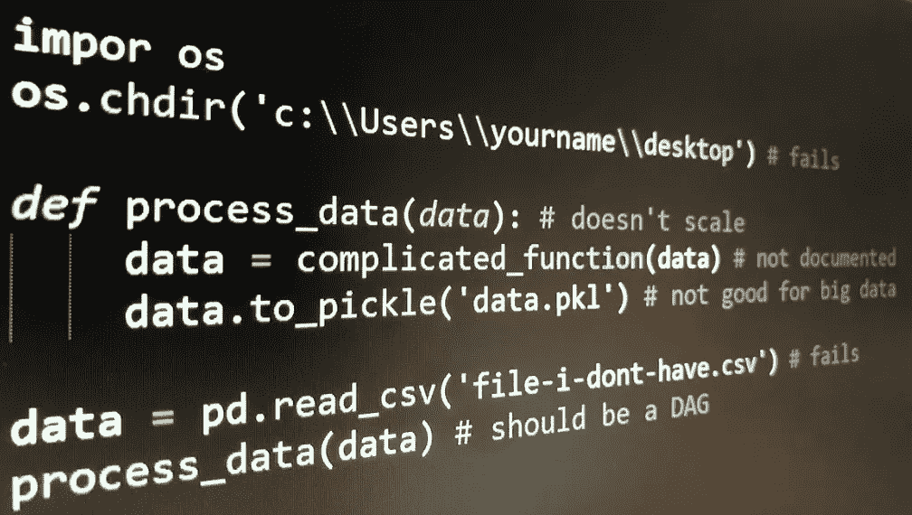

# 数据科学家犯的 10 大编码错误

> 原文：<https://towardsdatascience.com/top-10-coding-mistakes-made-by-data-scientists-bb5bc82faaee?source=collection_archive---------4----------------------->



数据科学家是“比任何软件工程师更擅长统计，比任何统计学家更擅长软件工程的人”。许多数据科学家有统计学背景，但对软件工程几乎没有经验。我是一名高级数据科学家，在 python 编码的 Stackoverflow 上排名前 1%，与许多(初级)数据科学家一起工作。以下是我经常看到的 10 个常见错误。

# 1.不要共享代码中引用的数据

数据科学需要代码和数据。因此，为了让其他人能够复制你的结果，他们需要能够访问这些数据。看起来很简单，但是很多人忘记了与他们的代码共享数据。

```
import pandas as pd
df1 = pd.read_csv('file-i-dont-have.csv') # fails
do_stuff(df)
```

解决方案:使用 [d6tpipe](https://github.com/d6t/d6tpipe) 与您的代码共享数据文件，或者上传到 S3/web/google drive 等，或者保存到一个数据库中，以便接收方可以检索文件(但不要将它们添加到 git 中，见下文)。

# 2.硬编码不可访问的路径

类似于错误 1，如果你硬编码了其他人不能访问的路径，他们就不能运行你的代码，并且不得不寻找很多地方来手动改变路径。Booo！

```
import pandas as pd
df = pd.read_csv('/path/i-dont/have/data.csv') # fails
do_stuff(df)# or 
impor os
os.chdir('c:\\Users\\yourname\\desktop\\python') # fails
```

解决方案:使用相对路径、全局路径配置变量或 [d6tpipe](https://github.com/d6t/d6tpipe) 来使你的数据易于访问。

# 3.将数据与代码混合

既然数据科学代码需要数据，为什么不把它转储到同一个目录中呢？当你这么做的时候，把图片、报告和其他垃圾也保存在那里。呀，真是一团糟！

```
├── data.csv
├── ingest.py
├── other-data.csv
├── output.png
├── report.html
└── run.py
```

解决方案:将你的目录分类，比如数据、报告、代码等等。参见 [Cookiecutter Data Science](https://drivendata.github.io/cookiecutter-data-science/#directory-structure) 或 [d6tflow 项目模板](https://github.com/d6t/d6tflow-template)并使用#1 中提到的工具来存储和共享数据。

# 4.Git 用源代码提交数据

大多数人现在控制他们代码的版本(如果你不这样做，那是另一个错误！！参见 [git](https://git-scm.com/) 。为了共享数据，将数据文件添加到版本控制中可能很有诱惑力。这对于非常小的文件来说是可以的，但是 git 并不适合数据，尤其是大文件。

```
git add data.csv
```

解决方案:使用#1 中提到的工具来存储和共享数据。如果你真的想要版本控制数据，参见 [d6tpipe](https://github.com/d6t/d6tpipe) 、 [DVC](https://dvc.org/) 和 [Git 大文件存储](https://git-lfs.github.com/)。

# 5.编写函数而不是 Dag

数据说够了，让我们来谈谈实际的代码！由于学习编码时首先要学习的是函数，因此数据科学代码通常被组织成一系列线性运行的函数。这导致了几个问题，参见[你的机器学习代码可能不好的 4 个原因](/4-reasons-why-your-machine-learning-code-is-probably-bad-c291752e4953)。

```
def process_data(data, parameter):
    data = do_stuff(data)
    data.to_pickle('data.pkl')data = pd.read_csv('data.csv')
process_data(data)
df_train = pd.read_pickle(df_train)
model = sklearn.svm.SVC()
model.fit(df_train.iloc[:,:-1], df_train['y'])
```

解决方案:与其线性链接函数，不如将数据科学代码编写为一组任务，这些任务之间存在依赖关系。使用[d6t 气流](https://github.com/d6t/d6tflow)或[气流](https://airflow.apache.org/)。

# 6.编写循环

像函数一样，for 循环是你学习编码的第一件事。容易理解，但是它们速度慢且过于冗长，通常表明您不知道矢量化的替代方法。

```
x = range(10)
avg = sum(x)/len(x); std = math.sqrt(sum((i-avg)**2 for i in x)/len(x));
zscore = [(i-avg)/std for x]
# should be: scipy.stats.zscore(x)# or
groupavg = []
for i in df['g'].unique():
	dfg = df[df[g']==i]
	groupavg.append(dfg['g'].mean())
# should be: df.groupby('g').mean()
```

解决方案: [Numpy](http://www.numpy.org/) 、 [scipy](https://www.scipy.org/) 和 [pandas](https://pandas.pydata.org/) 对大多数你认为循环可能需要的东西都有向量化函数。

# 7.不要写单元测试

随着数据、参数或用户输入的变化，您的代码可能会中断，有时您并没有注意到。这会导致糟糕的结果，如果有人根据你的结果做决定，糟糕的数据会导致糟糕的决定！

解决方案:使用`assert`语句检查数据质量。 [pandas](https://pandas.pydata.org/pandas-docs/stable/reference/general_utility_functions.html#testing-functions) 有相等测试， [d6tstack](https://github.com/d6t/d6tstack) 有数据接收检查， [d6tjoin](https://github.com/d6t/d6tjoin/blob/master/examples-prejoin.ipynb) 有数据连接检查。数据检查示例代码:

```
assert df['id'].unique().shape[0] == len(ids) # have data for all ids?
assert df.isna().sum()<0.9 # catch missing values
assert df.groupby(['g','date']).size().max() ==1 # no duplicate values/date?
assert d6tjoin.utils.PreJoin([df1,df2],['id','date']).is_all_matched() # all ids matched?
```

# 8.不要记录代码

我明白了，你急着做分析。你把事情拼凑起来，把结果交给你的客户或老板。然后一周后他们回来说“你能改变 xyz 吗”或者“你能更新这个吗”。你看着你的代码，却不记得你为什么要这么做。现在想象其他人必须运行它。

```
def some_complicated_function(data):
	data = data[data['column']!='wrong']
	data = data.groupby('date').apply(lambda x: complicated_stuff(x))
	data = data[data['value']<0.9]
	return data
```

解决方案:花额外的时间，即使是在你完成分析之后，来记录你做了什么。你会感谢你自己，别人会更感谢你！你会看起来像个专业人士！

# 9.将数据保存为 csv 或 pickle

背数据，毕竟是数据科学。就像函数和 for 循环一样，CSV 和 pickle 文件是常用的，但它们实际上并不是很好。CSV 不包含模式，所以每个人都必须再次解析数字和日期。Pickles 解决了这个问题，但是只能在 python 中工作，并且没有被压缩。这两种格式都不适合存储大型数据集。

```
def process_data(data, parameter):
    data = do_stuff(data)
    data.to_pickle('data.pkl')data = pd.read_csv('data.csv')
process_data(data)
df_train = pd.read_pickle(df_train)
```

解决方案:使用带有数据模式的 parquet 或其他二进制数据格式，最好是压缩数据的格式。 [d6tflow](https://github.com/d6t/d6tflow) 自动将任务的数据输出保存为 parquet，这样你就不用处理了。

# 10.使用 jupyter 笔记本

让我们以一个有争议的问题来结束:jupyter 笔记本和 CSV 一样普遍。很多人都在用。这并不意味着他们是好人。Jupyter 笔记本助长了上面提到的许多坏的软件工程习惯，特别是:

1.  您很想将所有文件都转储到一个目录中
2.  您编写自顶向下运行的代码，而不是 Dag
3.  你没有模块化你的代码
4.  难以调试
5.  代码和输出混合在一个文件中
6.  他们没有很好的版本控制

感觉很容易上手，但是扩展性很差。

解决方法:使用 [pycharm](https://www.jetbrains.com/pycharm/) 和/或 [spyder](https://www.spyder-ide.org/) 。