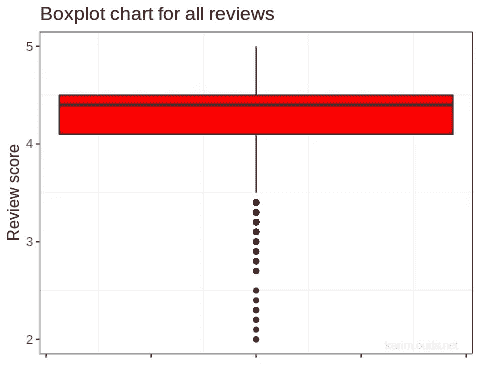
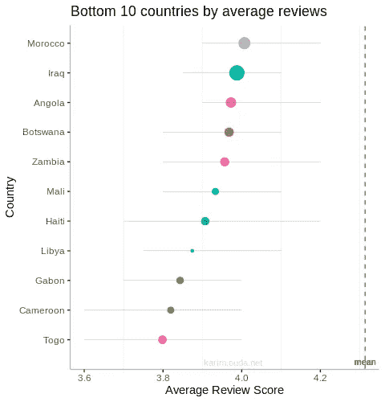
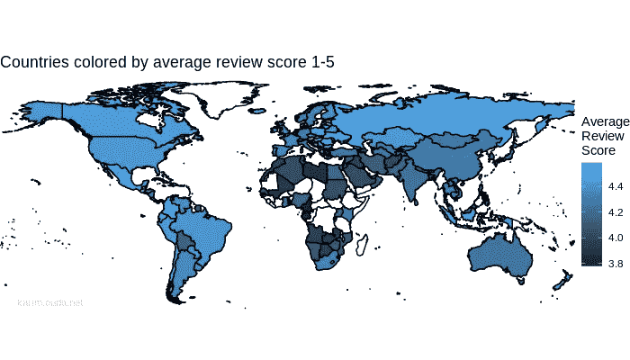
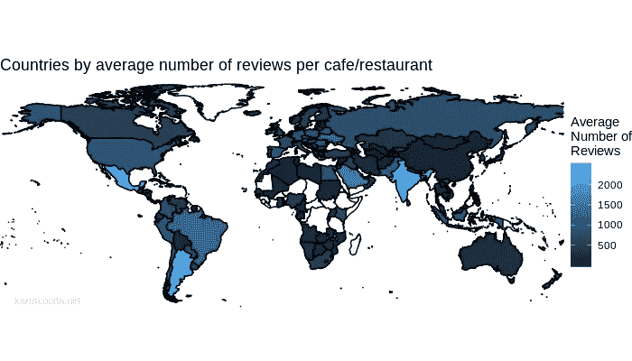
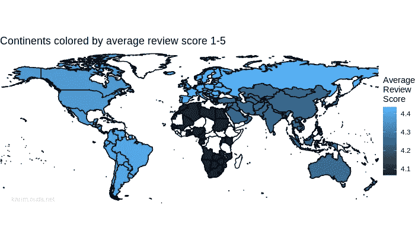
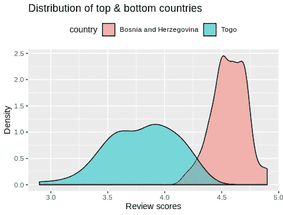
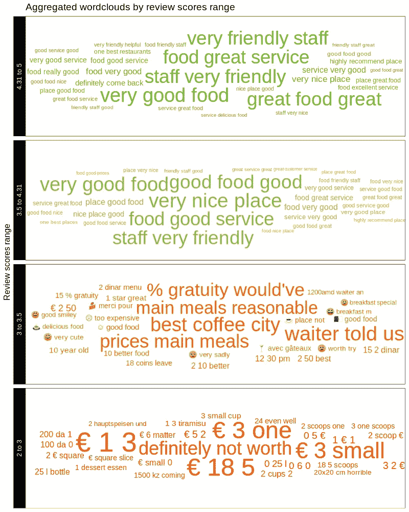
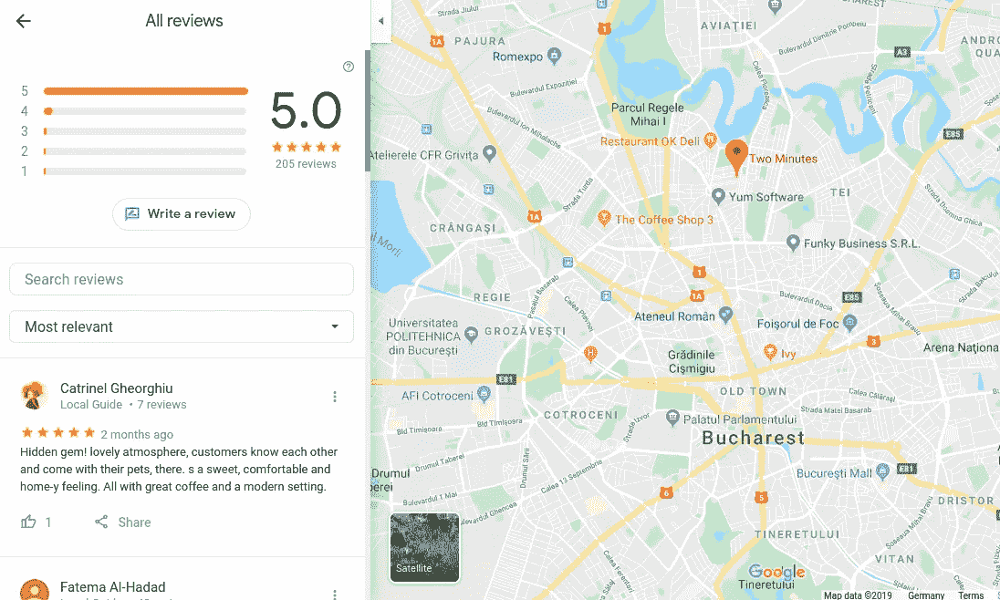
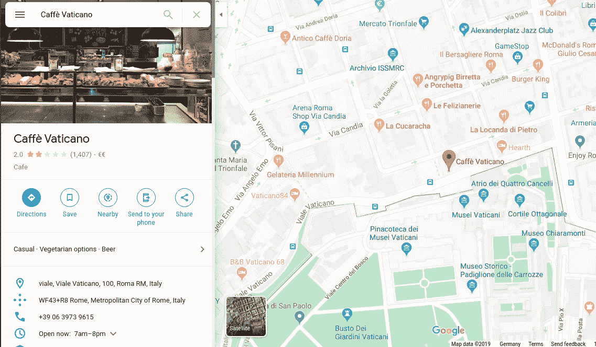

# 基于谷歌地图的十大客户友好国家

> 原文：<https://towardsdatascience.com/top-10-customer-friendly-countries-based-on-google-maps-edef2cd396e?source=collection_archive---------32----------------------->

根据谷歌地图的数据，创建一个“顾客友好国家”指数

# 一切都始于布鲁塞尔！

比利时布鲁塞尔-2018 年 8 月 11 日。我第一次访问这个城市，作为我等待已久的欧洲之旅的一部分，这是一个阳光明媚的星期六早上，我醒来，吃了早餐，然后去一家受欢迎的咖啡馆喝了第一杯咖啡，你猜怎么着…这是一个可怕的经历！

工作人员很粗鲁，不灵活，他们有一些愚蠢的规则，什么可以做，什么不可以做，并增加了等待服务的长队。像任何沮丧的顾客一样，我直接去谷歌地图给他们一个差评，却发现其他人已经这样做了。

这次经历让我目瞪口呆，我产生了内心的斗争；我是应该用这次经历来评判整个城市还是干脆无视，再给布鲁塞尔一次机会:)

我决定选择后者，这时候我有了一个想法💡在我脑海中闪现…

> **能否通过汇总谷歌地图的点评数据来判断一个国家的友好程度！？**

# 挑战

回答这样的问题是困难的、具有挑战性的和棘手的。然而，这个月我开始着手做这件事，我设法进行研究，用数据来回答这个问题，遵循以下步骤:

1.  定义一个**假设**:“如果我们对一个国家的餐馆和咖啡馆进行抽样调查并汇总评论得分，排名靠前和靠后的国家之间会有显著差异”，从而找出友好国家和不友好国家
2.  获取****数据**:从谷歌地图 API 获取每个国家的评论的统计样本——我决定只关注 ***餐馆&咖啡馆****首都城市*******
3.  ****清理**数据，例如删除评论人数少的咖啡馆**
4.  ****分析**数据并确保结果有意义，这包括 ***统计测试*****
5.  **可视化并总结结果**

***更多的技术和统计细节可以在文章*末尾的 ***方法论&统计*** *部分找到***

# **结果**

**对 153 个国家*(首都城市)的分析显示 ***排名靠前和垫底国家的综合评估得分均值之间存在明显的统计显著差距*** 。**

****由于缺乏足够的数据，91 个国家被排除在外***

**我还发现数据中所有国家的平均谷歌地图评论分数为 4.31 分，最低 2 分，最高 5 分**

****

**Boxplot chart for all review scores in all countries**

**接下来，您将找到更多关于排名靠前和靠后的国家的信息**

> **测验:现在停下来想一想……你认为你的国家会排在名单的哪个位置:顶端、底端还是中间？**

****十大国家****

**根据平均评审分数查找以下 10 个国家**

****

**Top 10 Countries (capitals) based on Aggregated Review Scores (horizontal lines shows the IQR, point size denotes the average number of reviews per restaurant or cafe — 365.7 for Bosnia, color is random**)****

****垫底 10 个国家****

**根据平均评估分数，排名最差的 10 个国家**

****

**Bottom 10 Countries (capitals) based on Aggregated Review Scores (horizontal lines shows the IQR, color is random**)****

****国家友好世界地图****

**在这里，您可以找到按每个国家的平均点评分数着色的世界地图**

****

**Countries colored by average review score (lighter is better )— white means no data**

**以下是按每家咖啡馆或餐厅的平均点评数量进行着色的国家**

****

**Countries colored by average number of reviewsper cafe or restaurant — lighter is higher**

****国家友好指数—完整列表****

**最后，所有国家和分数的完整列表…**

****

**Country Friendliness & Service Quality Index — 2019**

****“大陆”友好度地图****

**下面是世界地图，用颜色表示按“洲”汇总的平均点评分数**

****

**Continents colored by average review score (lighter is better ) — white means no data**

# ****统计显著性检验****

**除了数据分布中明显的视觉差异之外，对排名靠前和垫底国家的数据点进行了尾部 t 检验，结果证实了最初的假设，审查得分均值的差异具有统计学意义，其 **p 值**为:**0.00000000000000002****

**下面你可以看到这两个国家的评论分数分布图**

****

**Distribution (KDE) of review scores for top & bottom countries**

# **用户评论分析**

**下图显示了按评审分数汇总的评审者使用的热门短语**

****

**Aggregated word clouds (Tri-grams) by review scores range**

**我们可以在这里看到一些模式**

1.  **对于那些评价高于平均水平(4.31+)的人，你可以看到他们的热情和对“员工友好”的重视**
2.  **对于得分平均或低于平均(低于 4.31)的地方，更多关注“地方”和“食物”，热情较低(较少“非常”和“很好”)**
3.  **差评在 2-3 之间的地方主要与价格有关(这里的数据并不充分，因为只有 3 家商店在这个范围内)**
4.  **你也注意到红色区域的德语文本了吗？..任何德国人或生活在德国的人都会知道为什么:)**

****名人墙****

**在这里，我展示了一个具有出色的 5 星级评分的咖啡馆的例子**

> **我从没想过有人会得到数百人一致的 5 星评价，我很好奇你——读者——对此有何解释！**

**布加勒斯特的一家咖啡馆**

****

# **耻辱之墙**

**现在是谷歌地图的一个坏例子的时候了**

**[罗马的咖啡馆](https://www.google.com/maps/place/Caff%C3%A8+Vaticano/@41.9070626,12.4511352,17z/data=!3m1!4b1!4m5!3m4!1s0x132f606391ba07bf:0x6138dda8978805bc!8m2!3d41.9070586!4d12.4533292)获得了 **2 星的一致评级，**主要的痛点似乎是极端和透明的价格**

****

# **结论**

**在这篇文章的开始，我问了下面这个问题**

> **“我们可以通过汇总谷歌地图的评论数据来判断一个国家的**友好度吗！?"****

**现在，在研究结果出来后**，我可以自信地说是的，但有一点小小的变化** …正如我们一起看到的,(名声/耻辱墙)评论并不总是转化为友好，它可能是关于价格、清洁、速度等..因此，总体而言，评价是关于友好度和服务质量的，因此我将把这句话改为**

> **“能否通过汇总谷歌地图的点评数据来判断一个国家的**友好度&服务质量**！?"**

**这就是为什么这篇文章的标题是“基于谷歌地图的十大客户友好国家”**

****谷歌地图是座金矿****

**在我看来，谷歌地图是一个非常有价值的数据来源，可以带来各种各样的机会，例如，你可以在地图上构建应用程序，以提供基于评论文本的智能标记搜索——比如“给我找一家目前不拥挤的咖啡馆”****

*** * Google 的功能请求:)**

**也就是说，请注意从谷歌地图获取数据是昂贵的，我为这项研究支付了大约 150 欧元**

**结果有意义吗？**

**定义“意义”…就个人而言，结果并没有证实我最初的偏见，我仍然不明白为什么国家以这种方式排名，为什么巴尔干半岛的 3 个国家占据了前 5 名(以前从未出现过)**

**可能有许多因素影响结果，例如主导评论的人群(可能是游客)，该国的评级文化——比如他们倾向于给出好评或差评，该国的发达程度，该国服务业的质量，以及公民的文化和友好程度**

> **请在评论中告诉我你对这些结果的看法**

**你个人如何使用这些数据？**

1.  **你可以将你的店铺评论分数与国际平均分数 4.31 或者你所在国家的当地平均分数进行比较**
2.  **现在你知道提供优质服务、美食和友好员工的首都城市列表了:)**
3.  **你知道应该关注什么来获得高于平均水平的评价分数(1-员工友好度 2-食品质量 3-地点和价格)**

****进一步研究****

**我很想知道这些数据与其他指数如联合国人类发展指数(T1)、T2 zendex 客户服务指数(T3)有什么关联。如果您想对数据做进一步的分析，您可以在这里访问聚合结果 CSV 文件[。](https://github.com/karimouda/country-friendliness-index/blob/master/data/country-friendliness-index.csv)**

# **方法论和统计学**

**关于这项研究的一些详细的技术信息**

1.  ****21807 个数据点**已经使用[Google Maps Places API](https://developers.google.com/places/web-service/search)获取**
2.  **只获取了每个首都城市**的**餐馆**和**咖啡馆**的数据****
3.  **选择的**样本量**范围为每个城市 60-120 家咖啡馆/餐厅，以达到 95%置信区间和 10%误差范围的统计显著性。总人口(根据城市规模，假设每个城市的餐馆数量为 1，000 至 30，000 家)**
4.  **删除所有评论数量**少于 10 的咖啡馆/餐厅，以避免偏见(16%的数据)****
5.  **删除任何不符合 60 家咖啡馆/餐厅目标样本量的**国家/地区——特别是在上述清理步骤之后****
6.  **这样，从谷歌地图上获取的最初 242 个国家中，只剩下 **15727 个数据点和**153 个国家(由于数据大小和质量原因，91 个国家被排除在外)**

# **密码**

**我很乐意在下面的 Github 存储库中分享数据提取和分析代码，但是由于服务协议的条款，我不能分享获取的谷歌地图数据**

**[https://github.com/karimouda/country-friendliness-index](https://github.com/karimouda/country-friendliness-index)**

# **信用**

**我要感谢 [Hamza Ibrahim](https://www.linkedin.com/in/cpphamza/) 、 [Hany Ouda](https://www.linkedin.com/in/hanyouda/) 、 [Mostafa Nageeb](https://www.linkedin.com/in/mostafanageeb/) 花时间审阅本文并提出宝贵意见。**

# **关于我**

**我目前是柏林数据和产品领域的自由顾问。数据不仅是我的工作，也是我的热情所在，我在 2012 年创建我的分析初创公司时开始爱上数据，后来我决定通过攻读数据科学硕士学位来更深入地了解它，我还曾经在 Kaggle.com 上参加比赛，当我有时间时，我会不时地做一些像这样有趣的研究:)你可以在这里找到更多关于我的信息:[https://karim.ouda.net](https://karim.ouda.net/)**