# 数据可视化中的 10 大地图类型

> 原文：<https://towardsdatascience.com/top-10-map-types-in-data-visualization-b3a80898ea70?source=collection_archive---------2----------------------->

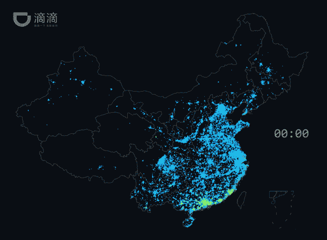

为什么大家都喜欢用不同的地图类型来可视化新闻媒体或者数据分析报告中的信息？

除了传递信息的效率高，还有一个重要原因，就是审美。再无聊的内容，只要配上酷炫的地图，都会让人眼前一亮。

地图可视化用于分析和显示地理上相关的数据，并以地图的形式呈现出来。这种数据表达更加清晰直观。我们可以直观的看到各个区域的数据分布或者比例。方便大家挖掘更深层次的信息，做出更好的决策。

地图可视化有多种类型，如行政地图、热图、统计图、轨迹图、气泡图等。地图可分为 2D 地图、3D 地图或静态地图、动态地图、交互式地图……它们通常与点、线、气泡等结合使用。在本文中，您将找到[数据可视化](http://www.finereport.com/en/data-visualization/data-visualization-2.html?utm_source=medium&utm_medium=media&utm_campaign=blog&utm_term=10)中 10 大地图类型的示例！

(注:文中所有地图类型均用 [FineReport](http://www.finereport.com/en/product?utm_source=medium&utm_medium=media&utm_campaign=blog&utm_term=10) 制作，个人[下载](http://www.finereport.com/en/download?utm_source=medium&utm_medium=media&utm_campaign=blog&utm_term=10)完全免费。)

# 1.点地图

点地图非常简单，尤其是在显示地理信息分布广泛的数据时。比如有的公司业务范围很广。如果公司要查看某个区域内各个站点(具体位置)的数据，用一般的地图实现起来会比较复杂，精度不高。然后就可以利用点图进行精准快速的定位了。

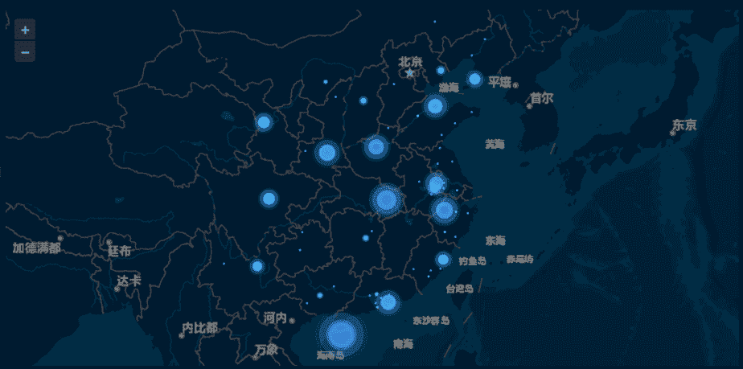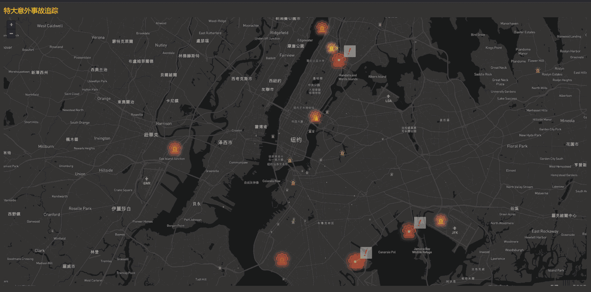

**使用场景**:点事件分布。点地图还可以实现大事件的特殊识别。和上面的事故追踪图一样，可以用图片、文字或者动态效果识别相对严重的事件。

# 2.平面图

你可能不会经常使用线图，因为它们相对来说比较难画。但是，线图有时不仅包含空间，还包含时间。对于特殊场景的分析，其应用价值特别高。

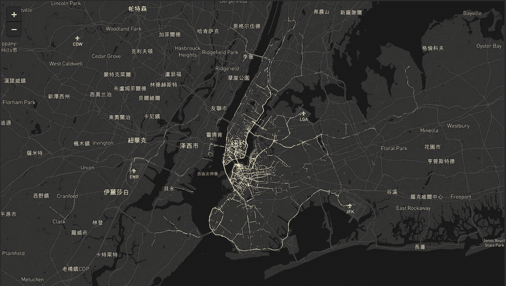

**使用场景**:骑行或驾车的路线分布，公交或地铁线路分布，比如上图中纽约市的出租车路线。

# 3.区域地图

区域地图也称为填充地图。可以按国家、省、市、区甚至一些定制地图显示。你可以通过地图上颜色的深浅或者不同的颜色来知道数据的大小。

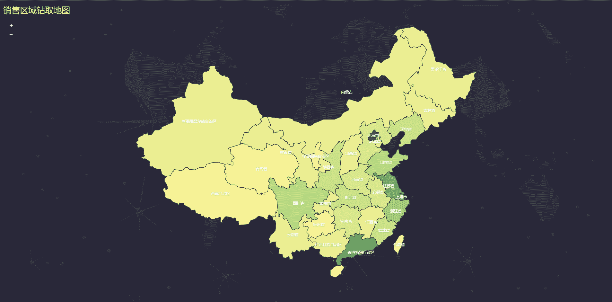

**使用场景**:某个特性在不同地区的分布。可以实现从省到市的分步钻探。它可以用不同的颜色或标签来表示不同的特征。例如，在上图中，我们可以从省到市向下钻取数据来查看销售情况。销量越大，颜色越深。

# 4.流程图作业图

流程图通常用于可视化始发地-目的地流程数据。起点和终点可以是点或曲面。始发地和目的地之间的交互数据通常用连接空间单元的几何重心的线来表示。线条的宽度或颜色表示起点和终点之间的流向值。每个空间位置可以是起点或终点。

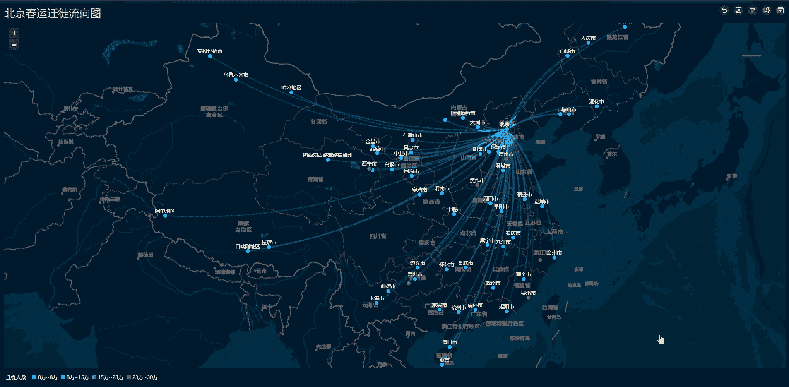

**使用场景**:区域间贸易、交通流量、人口迁移、购物消费行为、通讯信息流、航空航线等。

# 5.热图

热图用于显示地理范围内每个点的权重。它通常以特别突出的方式显示。如下图所示，是一张雾霾图。该地区的颜色越深，该地区的空气质量越差。

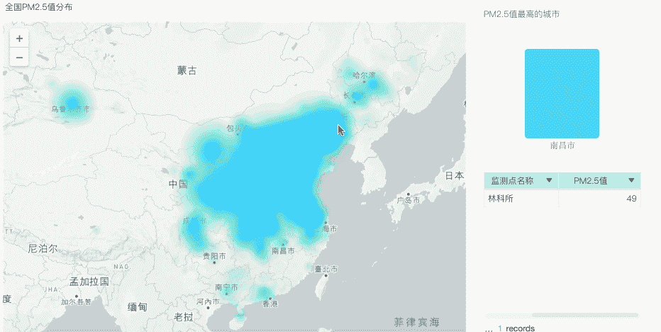

**使用场景** : PM 2.5 分布、注册日期和年龄分布、产品偏好分布等。

# 6.热点图

热点地图是热点地图和点地图的综合应用。与热图相比，其识别的准确率可以更高。而且和点图相比，它的点其实是一个圆，圆之间相互重叠，更有层次感。

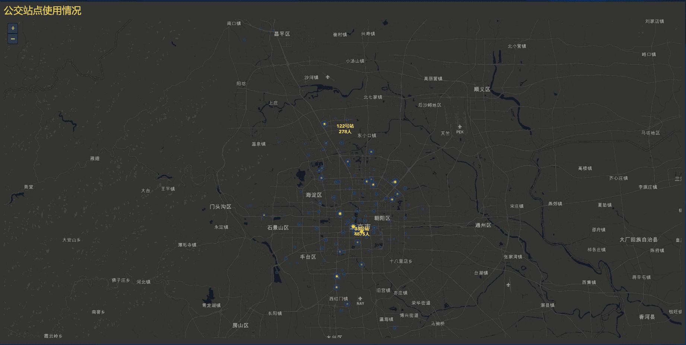

**使用场景**:显示地理范围内各复杂点的权重。比如上面的公交车站使用图，人越多点越大，颜色越深。也可以确定最大和最小人数。

# 7.时空分布图

这种地图显示了具有时间和空间信息的轨迹分布。他们可以记录每个点的时间和空间分布。

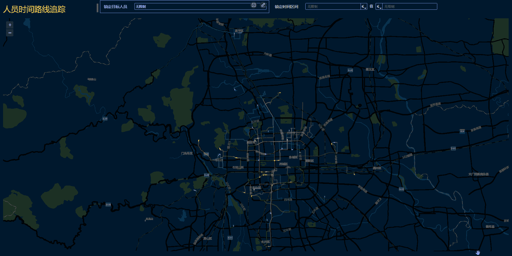

**使用场景** : GPS 地理追踪等。

# 8.数据空间分布图

我们用一个具体的例子来解释这张地图。下图是轨道交通客流空间分布图。不同的颜色标识不同的线路(更直观)，线路的粗细表示不同站点的车流量(类似于热点)。线越粗，流量越大。它还可以指示轨迹线的方向。

**使用场景**:通过这种可视化效果，运营者可以清楚地知道某一时间段的客流分布情况，从而合理安排运营(如员工数量等。).

# 9.三维矩形地图

这种类型的地图是点地图的升级版本。点的形状各不相同，包括这种三维矩形。

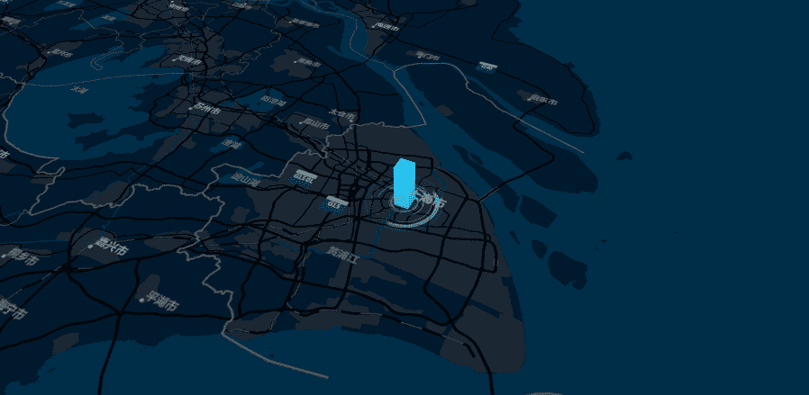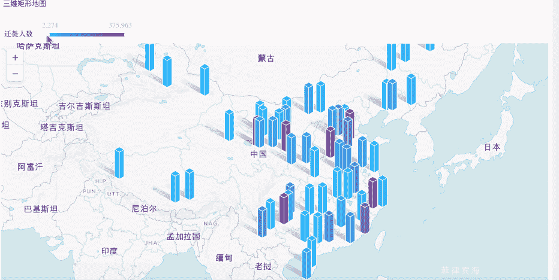

**使用场景**:点地图的所有场景。它更侧重于特定对象的地理分布，如房地产建设项目。

# 10.自定义地图

自定义地图是您自己设计的地图可视化。可以满足任何使用场景，但是需要一定的数据分析和可视化设计基础。所以我就不多说了，只给大家看两张我做的自定义地图。

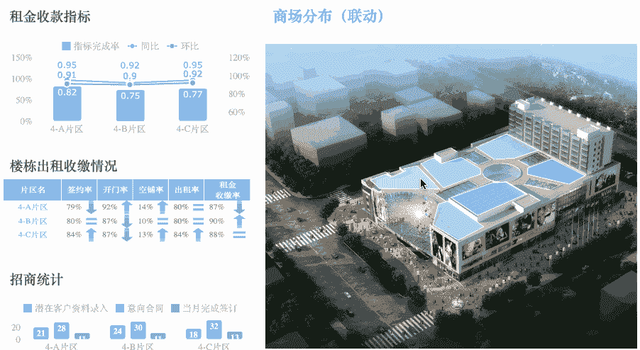

# 终于

读到这里，你可能会问你应该使用什么工具来制作地图可视化。我觉得没必要强调工具的选择。Excel，D3，甚至 PS 都可以做你想做的。你应该多想想你使用这些工具的主要目的。

如果只是想展示处理后的数据，可以选择 Excel。又或许你有各种各样的数据，但是你不懂数据建模、编程，或者数据清洗，甚至 SQL 优化，那么你就需要一个像 [FineReport](http://www.finereport.com/en/product?utm_source=medium&utm_medium=media&utm_campaign=blog&utm_term=10) 和 [Tableau](https://www.tableau.com/) 这样简单易用的数据可视化工具。我在本文中制作的地图看起来可能有点难画，但我实际上使用了 [FineReport](http://www.finereport.com/en/product?utm_source=medium&utm_medium=media&utm_campaign=blog&utm_term=10) 的内置地图模板。通过简单的拖放操作，数据可以很容易地可视化。

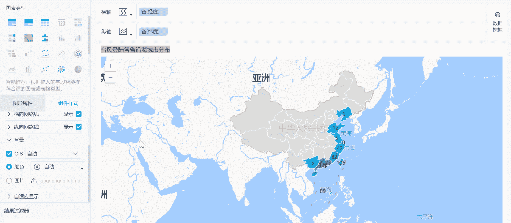

总之，上面提到的工具都有地图可视化的功能，只是有区别。你要根据自己的需求选择适合自己的可视化工具。

# 您可能也会对…感兴趣

[数据可视化中的前 16 种图表类型](/top-16-types-of-chart-in-data-visualization-196a76b54b62)

[新手如何设计酷炫的数据可视化？](/how-can-beginners-design-cool-data-visualizations-d413ee288671)

[业务仪表盘初学者指南](/a-beginners-guide-to-business-dashboards-981a8192a967)

*原载于 2019 年 8 月 1 日*[*【http://www.finereport.com】*](http://www.finereport.com/en/data-visualization/top-10-map-types-in-data-visualization.html)*。*