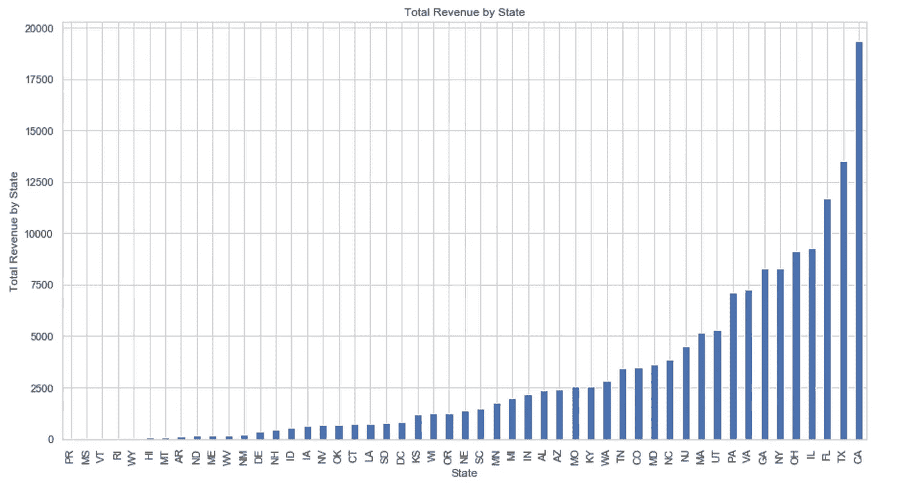

# 2019 年美国十大最成功的公司

> 原文：<https://towardsdatascience.com/top-10-most-successful-companies-in-america-2019-2d946278a1ab?source=collection_archive---------27----------------------->

Photo by [rawpixel.com](https://www.pexels.com/@rawpixel?utm_content=attributionCopyText&utm_medium=referral&utm_source=pexels) from [Pexels](https://www.pexels.com/photo/group-of-people-holding-posters-1406360/?utm_content=attributionCopyText&utm_medium=referral&utm_source=pexels)

最近我碰到了[Inc .](https://www.inc.com/)2019 年美国最成功的 5000 家公司，这些公司实际上是根据 2015 年至 2018 年的收入增长百分比进行排名的。这是数据集能告诉我们的关于哪些州、行业和城市现在是最热门的。

对于那些想看实际的 5000 强名单的人来说，这里有完整的[文章](https://www.inc.com/inc5000/2019/top-private-companies-2019-inc5000.html)和对每个公司的简要描述。

让我们从排名前 10 的公司开始，包括他们的增长和收入以及位置。

Top 10 Ranking by Growth Percent

在按行业对 5000 强名单中的公司数量进行细分后，我们意识到*硬件、IT 服务、环境服务和媒体*在数据集中几乎没有代表性，因此它们位于图表的底部；另一方面，有趣的是看到*零售*在中间，实际上属于*零售*行业的最有趣的公司之一是 **Chewy** ，这是一个宠物产品(药物、食物、零食、用品)的在线平台，它始于 2011 年，到 2018 年已经实现了 35 亿美元的收入，增长了 736%。

Countplot of Number of Companies by Industry

到目前为止，赚钱最多的行业是健康公司；他们在 3 年内(2015 年至 2018 年)的收入接近 1600 亿美元。Inc 的数据集实际上有 5012 个值，而不是 5000 个值，其中健康仅占 7%,而商业产品&服务、广告&营销和软件公司占近 27%的值。即使在医疗行业与其他价值更高的行业竞争时，它的收入仍排在第一位。

Revenue by Industry

当我们查看公司在各州的分布时，我们可以看到加利福尼亚州、德克萨斯州和佛罗里达州的公司数量最多，排名前三，而波多黎各、密西西比州、佛蒙特州、罗德岛州和怀俄明州则排名垫底。这种高公司分布增加了各州的收入/增长，这就是前 3 个州与后 5 个州之间存在巨大差异的原因。

Revenue by State

Countplot of the Top Ten Cities

有趣的是，即使加州在行业数量(709 家公司)和收入(1930 亿美元)方面处于领先地位，纽约也是领先的城市，紧随其后的是芝加哥、亚特兰大、奥斯汀、休斯顿和达拉斯。

就行业增长率而言，软件实际上排名第一；软件公司发展非常迅速，我们可以看到，在旧金山、西雅图、纽约等城市，软件和在线服务公司不仅要专注于他们的主要优先事项，而且要准备好随着增长重新评估产品和流程，这一点很重要。我们可以在这个数据集中看到它的反映。尽管软件在总收入中排名第四，但它在增长图表中排名第一。

Growth Percent by Industry

Top 10 Billion Dollar Companies with their Ranking

5000 家(实际上是 5012 家)公司名单中有 4989 家公司的收入达到数百万美元，但有 23 家公司的收入达到数十亿美元。没有一家十亿美元的公司排在前 100 名，甚至没有排在前 500 名，这显然意味着收入本身不是上榜的最重要因素，而是时间和收入。十亿美元公司的平均“成立年龄”是 27 年(1992 年)，而增长更快、排名更好的公司的“成立年龄”是 14 年(2005 年)。

与那些已经在市场上存在了相当长时间的公司相比，年轻的公司如果在短时间内赚了很多钱，就会有如此大的增长，这是有道理的，这些公司的价值逐年增加，但不是以指数方式，而是以线性方式增加。

Companies by Founded Year

**结论**:

虽然有些公司比其他公司赚得更多，但我们得出的结论是[时间+收入]是这里的重要因素；如果一个年轻的公司在短时间内赚了很多钱，那么排名就会上升。

除此之外，数据集在不同的收入、公司规模和增长方面有许多起伏，我们能够确定我们在开始这篇文章时想到的关键问题。

分析的三个主要问题是:

1.  2019 年最热门的行业是哪个(根据数据集)。
2.  哪个城市/州显示了最大的行业增长。
3.  哪种类型的公司增长最快。

*   对于第一个问题，在按州和行业分解收入后，我们可以得出结论，目前最热门的投资行业是健康行业，除了价值低于软件和广告及营销行业外，它仍然排在这两个行业的前面。
*   就州而言，加利福尼亚州是公司最多的州，其次是德克萨斯州和佛罗里达州。即使加利福尼亚是交通最繁忙的州，纽约也是公司最多的城市。
*   软件公司发展非常快，我不认为这些类型的公司会很快停止增长，因为随着时间的推移，不同类型的行业似乎需要更多的软件“需求”。