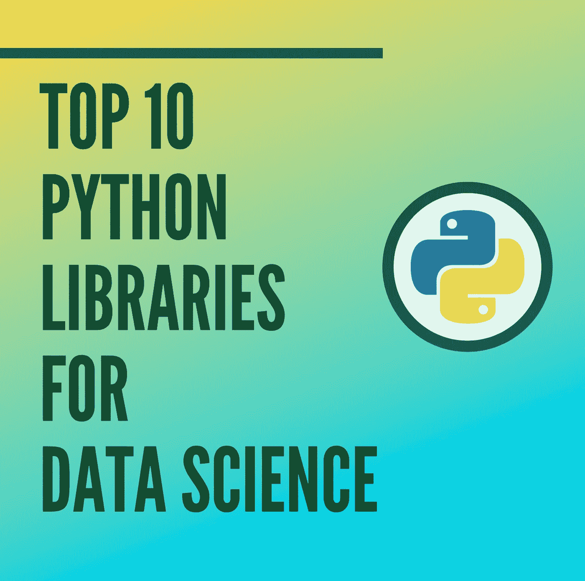

# 数据科学的 10 大 Python 库

> 原文：<https://towardsdatascience.com/top-10-python-libraries-for-data-science-cd82294ec266?source=collection_archive---------0----------------------->

一段时间以来，Python 一直吸引着数据科学家。我与数据科学领域的资源、文献、课程、培训和人员的互动越多，精通 Python 的知识就成为一种很好的资产。话虽如此，当我开始提高我的 Python 技能时，我有一个必须了解的 Python 库列表。过了一会儿…

一段时间以来，Python 一直吸引着数据科学家。😀

数据科学领域的人肯定知道可以在数据科学中使用的 Python 库，但是当在采访中被要求说出它们的名称或陈述它的功能时，我们经常笨手笨脚，或者可能不记得超过 5 个库(这发生在我身上:/)

今天，我整理了 10 个 Python 库的列表，它们有助于数据科学及其外围领域，何时使用它们，它的重要特性和优势是什么。

在本文中，我根据自己最近的经验和探索，简要概述了对数据科学家和工程师最有用的 10 个 Python 库。阅读完整的故事，了解 4 个奖金库！

# 1.熊猫

*Pandas* 是一个开源的 Python 包，为 Python 编程语言中的标注数据提供了高性能、易于使用的数据结构和数据分析工具。熊猫代表 *Python 数据分析库。谁知道呢？*

什么时候用？Pandas 是一个完美的数据争论或管理工具。它设计用于快速简单的数据操作、读取、聚合和可视化。

熊猫获取 CSV 或 TSV 文件或 SQL 数据库中的数据，并创建一个包含行和列的 Python 对象，称为数据框。数据框非常类似于统计软件中的表格，比如 Excel 或 SPSS。

## 你能用熊猫做什么？

1.  索引、操作、重命名、排序、合并数据帧
2.  更新、添加、删除数据框中的列
3.  估算丢失的文件，处理丢失的数据或变量
4.  用直方图或箱线图绘制数据

这使得 *Pandas* 成为学习数据科学 Python 的基础库。

# 2.NumPy

Python 中最基本的包之一， *NumPy* 是一个通用的数组处理包。它提供了高性能的多维数组对象和工具来处理数组。NumPy 是通用多维数据的有效容器。

NumPy 的主要对象是同构多维数组。它是由相同数据类型的元素或数字组成的表，由正整数元组索引。在 NumPy 中，尺寸称为*轴*和轴的数量称为*等级*。NumPy 的数组类叫做 *ndarray* 又名 *array。*

什么时候用？NumPy 用于处理存储相同数据类型值的数组。NumPy 有助于数组的数学运算及其矢量化。这显著增强了性能，并相应地加快了执行时间。

## 你能用 NumPy 做什么？

1.  基本数组操作:加法、乘法、切片、展平、整形、索引数组
2.  高级阵列操作:堆叠阵列、分割成部分、广播阵列
3.  使用日期时间或线性代数
4.  NumPy Python 中的基本切片和高级索引

# 3.SciPy

SciPy 库是构成 SciPy 栈的核心包之一。现在，SciPy Stack 和 SciPy 库是有区别的。SciPy 建立在 NumPy 数组对象的基础上，是包括 Matplotlib、Pandas 和 SymPy 等工具的堆栈的一部分，

SciPy 库包含高效数学例程的模块，如线性代数、插值、优化、积分和统计。SciPy 库的主要功能是建立在 NumPy 及其数组之上的。SciPy 大量使用了 NumPy。

什么时候用？SciPy 使用数组作为它的基本数据结构。它有各种模块来执行常见的科学编程任务，如线性代数、积分、微积分、常微分方程和信号处理。

# 4.Matplotlib

这无疑是我的最爱，也是一个典型的 Python 库。您可以使用 Matplotlib 可视化的数据创建故事。SciPy 堆栈中的另一个库 Matplotlib 绘制 2D 图形。

什么时候用？Matplotlib 是 Python 的绘图库，它提供了面向对象的 API，用于将绘图嵌入到应用程序中。它非常类似于嵌入在 Python 编程语言中的 MATLAB。

## 你能用 Matplotlib 做什么？

直方图，条形图，散点图，面积图到饼图，Matplotlib 可以描绘各种各样的可视化。借助 Matplotlib，只需一点努力和可视化功能，您就可以创建任何可视化效果:

1.  线形图
2.  散点图
3.  面积图
4.  条形图和直方图
5.  饼图
6.  树干图
7.  等高线图
8.  颤动图
9.  光谱图

Matplotlib 还通过 Matplotlib 简化了标签、网格、图例和其他一些格式化实体。基本上能画的都画了！

# 5.海生的

所以当你阅读 Seaborn 上的官方文档时，它被定义为基于 Matplotlib 的数据可视化库，该库为绘制有吸引力和信息丰富的统计图形提供了高级接口。简单来说，seaborn 是 Matplotlib 的扩展，具有高级特性。

那么，Matplotlib 和 Seaborn 有什么区别呢？Matplotlib 用于基本绘图；条形图、饼图、线图、散点图等等，而 seaborn 提供了各种可视化模式，具有更简单的语法。

## 你能用 Seaborn 做什么？

1.  确定多个变量之间的关系(相关性)
2.  观察聚合统计的分类变量
3.  分析单变量或双变量分布，并在不同的数据子集之间进行比较
4.  绘制因变量的线性回归模型
5.  提供高级抽象、多绘图网格

Seaborn 对于像 *corrplot* 和 *ggplot 这样的可视化库来说是一个很好的二手工具。*

# 6.Scikit 学习

Scikit Learn 是作为 Google 代码之夏项目向世界推出的，它是一个强大的 Python 机器学习库。它具有最大似然算法，如支持向量机，随机森林，k-均值聚类，谱聚类，均值漂移，交叉验证等...Scikit Learn 甚至支持 NumPy、SciPy 和相关的科学操作，Scikit Learn 是 SciPy 堆栈的一部分。

什么时候用？Scikit-learn 通过 Python 中的一致接口提供了一系列监督和非监督学习算法。像朴素贝叶斯这样的监督学习模型对 KMeans、Scikit learn 等未标记数据进行分组将是您的首选。

## 你能用 Scikit Learn 做什么？

1.  分类:垃圾邮件检测、图像识别
2.  聚类:药物反应，股票价格
3.  回归:客户细分，分组实验结果
4.  降维:可视化，提高效率
5.  模型选择:通过参数调整提高精度
6.  预处理:将输入数据准备为文本，以便用机器学习算法进行处理。

Scikit Learn 侧重于建模数据；不操纵数据。我们有 NumPy 和熊猫用于总结和操作。

# 7.张量流

回到 2017 年，我收到了一个 TensorFlow USB，作为对我在谷歌 WTM 活动上成为一名出色演讲者的感谢，哈哈。USB 装载了 TensorFlow 的官方文档。由于当时对张量流一无所知，我在谷歌上搜索了一下。

TensorFlow 是一个 AI 库，帮助开发人员使用数据流图创建具有许多层的大规模神经网络。TensorFlow 还促进了深度学习模型的建立，推动了 ML/AI 的最新发展，并允许轻松部署 ML 驱动的应用程序。

所有图书馆中最发达的网站之一是 TensorFlow。像 Google，可口可乐，Airbnb，Twitter，Intel，DeepMind 这样的巨头，大家都用 TensorFlow！

什么时候用？TensorFlow 在分类、感知、理解、发现、预测和创建数据方面非常高效。

## TensorFlow 怎么办？

1.  语音/声音识别—物联网、汽车、安全、UX/用户界面、电信
2.  情绪分析—主要用于 CRM 或 CX
3.  基于文本的应用程序—威胁检测、谷歌翻译、Gmail 智能回复
4.  人脸识别——脸书的深度人脸、照片标签、智能解锁
5.  时间序列—来自亚马逊、谷歌和网飞的推荐
6.  视频检测—游戏、安全、机场中的运动检测、实时威胁检测

# 8.克拉斯

Keras 是 TensorFlow 的高级 API，用于构建和训练深度神经网络代码。它是 Python 中的一个开源神经网络库。有了 Keras，统计建模、处理图像和文本变得更加容易，简化了深度学习的编码。

Keras 和 TensorFlow 到底有什么区别？

Keras 是一个神经网络 Python 库，而 TensorFlow 是一个用于各种机器学习任务的开源库。TensorFlow 提供高级和低级 API，而 Keras 只提供高级 API。keras*是为 Python* 打造的，这使得它比 TensorFlow 更加用户友好、模块化和可组合。

## 你能用 Keras 做什么？

1.  确定准确度百分比
2.  计算损失函数
3.  创建自定义功能层
4.  内置数据和图像处理
5.  用重复的代码块编写函数:20、50、100 层深

# 9.统计模型

当我第一次学习 R 时，进行统计测试和统计数据探索似乎是 R 中最容易的，并避免使用 Python 进行统计分析，直到我探索 Statsmodels 或 Python。

什么时候用？Statsmodels 是最终的 Python 包，它为描述性统计和统计模型的估计和推断提供了简单的计算。

## 如何处理 Statsmodels？

1.  线性回归
2.  相互关系
3.  普通最小二乘(OLS)为经济学家在你！
4.  生存分析
5.  广义线性模型和贝叶斯模型
6.  单变量和双变量分析，假设检验(基本上，R 能做什么！)

# 10.Plotly

Plotly 是一个典型的 Python 图形绘制库。用户可以导入、复制、粘贴或流式传输要分析和可视化的数据。Plotly 提供了一个沙盒 Python(你可以运行一个有能力限制的 Python ),现在我很难理解沙盒是什么，但我知道 Plotly 让它变得简单！？

什么时候用？如果您想要创建和显示图形，更新图形，悬停在文本上查看详细信息，您可以使用 Plotly。Plotly 还有一个额外的功能，就是把数据发送到云服务器。真有意思！

## 你能用 Plotly 做什么？

Plotly 图形库提供了大量可供绘制的图形:

1.  ***基本图表:*** 折线图、饼图、散点图、气泡图、圆点图、甘特图、旭日图、树状图、散点图、填充面积图
2.  ***统计和 Seaborn 风格*** :误差、方框、直方图、面和格子图、树形图、小提琴图、趋势线
3.  ***科学图表:*** 等高线、三元图、对数图、箭图、地毯图、雷达图、热图、风玫瑰图和极坐标图
4.  财务图表
5.  地图
6.  支线剧情
7.  转换
8.  Jupyter Widgets 交互

告诉过你，Plotly 是*精华*剧情库。想想可视化和 plotly 可以做到这一点！

现在是时候了，当我们探索了十大数据科学 Python 库的采访笔记指南，我们寻找我们的四个额外的库！

## 1.空间

SpaCy 是一个开源库，用于 Python 和 Cython 的高级 NLP(一种 Python 编程语言，使用 Python 代码提供类似 C 的感觉和性能，加上受 C 启发的语法)

## 2.散景

Bokeh 是一个 Python 库，我想称之为交互式数据可视化。有了 Tableau、QlikView 或 PowerBI 这样的工具，我们为什么还需要散景呢？首先，散景允许用简单的命令快速构建复杂的统计图表。它支持 HTML，笔记本或服务器输出。其次，可以将散景可视化集成到 Flask 和 Django 应用程序中，或者集成到 matplotlib、seaborn、ggplot 等其他库中编写的可视化中。

## 3.根西姆

我认为 Gensim 与我们目前所看到的有很大不同。它可以高效、轻松地从文档中自动抽取语义主题。Gensim 算法是无人监管的，这意味着不需要人工输入——只需要纯文本文档，然后就可以执行提取。

## 4.NLTK

NLTK(自然语言工具包)主要与人类语言而不是计算机语言一起工作，以应用自然语言处理(NLP)。它包含文本处理库，您可以使用这些库对数据执行标记化、解析、分类、词干分析、标记和语义推理。这听起来可能重复了这个库的功能，但是 Python 中的每个库都是为了提高效率而编写的。

这个故事到此为止。接下来…

***数据科学 10 大算法！！***

感谢您的阅读！如果您喜欢这篇文章，请点击拍手按钮，让我知道是什么库让您的数据科学之旅变得有趣。数据帐篷快乐！

# 了解你的作者

Rashi 是一名研究生，也是一名数据分析师、用户体验分析师和顾问、技术演讲者和博客作者！她渴望建立一个组织，将商界女性与资源海洋联系起来，让她们对工作和世界充满热情，无所畏惧。随时给她留言[这里](http://rashidesai2424@gmail.com/)！