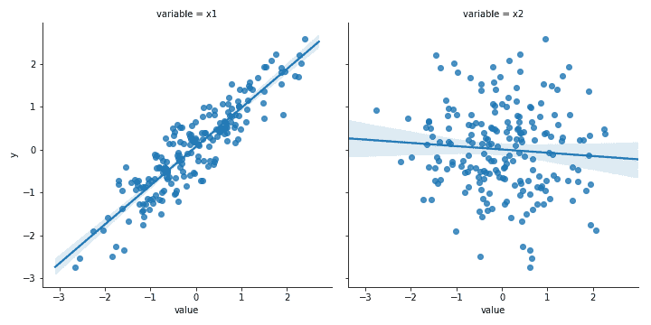
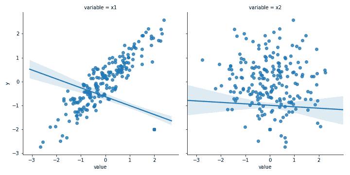

# 数据科学家犯的十大统计错误

> 原文：<https://towardsdatascience.com/top-10-statistics-mistakes-made-by-data-scientists-2d58ccf12ab1?source=collection_archive---------4----------------------->

数据科学家是“比任何软件工程师更擅长统计，比任何统计学家更擅长软件工程的人”。在[数据科学家犯的十大编码错误](/top-10-coding-mistakes-made-by-data-scientists-bb5bc82faaee)中，我们讨论了统计学家如何成为更好的编码员。在这里，我们讨论编码人员如何成为更好的统计人员。

每个例子的详细输出和代码可以在 [github](http://tiny.cc/top10-mistakes-stats-code) 和[交互式笔记本](http://tiny.cc/top10-mistakes-stats-bind)中找到。代码使用数据工作流管理库 [d6tflow](https://github.com/d6t/d6tflow) ，数据与数据集管理库 [d6tpipe](https://github.com/d6t/d6tpipe) 共享。

# 1.没有完全理解目标函数

数据科学家希望建立“最佳”模型。但是情人眼里出西施。如果您不知道目标和目标函数是什么，以及它是如何表现的，那么您就不太可能构建出“最佳”模型。fwiw 的目标可能甚至不是一个数学函数，而是改进一个商业度量。

**解决方案**:大多数 kaggle 赢家花大量时间理解目标函数，以及数据和模型如何与目标函数相关联。如果您正在优化一个业务指标，请将其映射到一个适当的数学目标函数。

**示例** : F1 分值通常用于评估分类模型。我们曾经建立了一个分类模型，它的成功取决于它正确出现的百分比。F1 分数具有误导性，因为它显示模型在大约 60%的时间里是正确的，而实际上它只有 40%的时间是正确的。

```
f1 0.571 accuracy 0.4
```

# 2.没有一个假设，为什么有些东西应该工作

通常，数据科学家希望构建“模型”。他们听说 xgboost 和 random forests 效果最好，所以让我们使用它们。他们阅读深度学习，也许这将进一步改善结果。他们在没有查看数据，也没有形成哪种模型最有可能最好地捕捉数据特征的假设的情况下，就抛出模型来解决问题。这也使得解释你的工作变得非常困难，因为你只是随机地向数据扔模型。

**解决方案**:看数据！了解其特征，并形成一个假设，即哪个模型最有可能捕捉到这些特征。

**例**:不需要运行任何模型，仅仅通过绘制这个样本数据，你就已经可以有一个强烈的观点，x1 与 y 线性相关，x2 与 y 没有太大的关系。



# 3.在解释结果之前不看数据

不查看数据的另一个问题是，您的结果可能会受到异常值或其他工件的严重影响。对于最小化平方和的模型来说尤其如此。即使没有异常值，您也可能会遇到不平衡的数据集、截断或缺失的值，以及其他各种您在课堂上没有看到的真实数据的奇怪现象。

**解决方案**:太重要了，值得重复一遍:看数据！了解数据的性质如何影响模型结果。

**例**:有异常值，x1 斜率从 0.906 变为-0.375！



# 4.没有一个简单的基线模型

现代的 ML 库几乎把它变得太简单了……只要改一行代码，就可以运行一个新的模型。另一个。另一个。误差指标在减少，调整参数——太好了——误差指标在进一步减少……有了所有的模型，你可以忘记预测数据的愚蠢方式。如果没有这个天真的基准，你就没有一个好的绝对比较来衡量你的模型有多好，它们可能都很差。

**解答**:预测一个值的最笨方法是什么？使用最近的已知值、(滚动)平均值或某个常数(如 0)建立一个“模型”。将您的模型性能与零智能预测猴子进行比较！

**例**:对于这个时间序列数据集，model1 一定比 model2 好，MSE 分别为 0.21 和 0.45。但是等等！仅取最后一个已知值，MSE 就下降到 0.003！

```
ols CV mse 0.215
rf CV mse 0.428
last out-sample mse 0.003
```

# 5.不正确的样品外测试

这可能会让你的职业生涯脱轨！你建立的模型在 R&D 看起来很棒，但在生产中表现糟糕。你所说的将创造奇迹的模式正在导致非常糟糕的业务结果，可能会使公司损失$m+。这很重要，除了最后一个错误，所有剩下的错误都集中在这上面。

**解决方案**:确保你已经在真实的样本条件下运行了你的模型，并且明白什么时候它会表现良好，什么时候表现不好。

**示例**:样本内随机森林比线性回归好得多，mse 为 0.048，而 ols mse 为 0.183，但样本外随机森林比线性回归差得多，mse 为 0.259，mse 为 0.187。随机森林训练过度，在实际生产中表现不佳！

```
in-sample
rf mse 0.04 ols mse 0.183
out-sample
rf mse 0.261 ols mse 0.187
```

# 6.不正确的样本外测试:对整个数据集应用预处理

你可能知道强大的 ML 模型会过度训练。过度训练意味着它在样本内表现很好，但在样本外表现很差。所以你需要意识到训练数据会泄露到测试数据中。如果您不小心，任何时候您进行特征工程或交叉验证时，训练数据都可能混入测试数据中，并夸大模型性能。

**解决方案**:确保你有一个真正的测试集，没有来自训练集的任何泄漏。特别要注意生产使用中可能出现的任何依赖于时间的关系。

**例子**:这种情况经常发生。在将整个数据集分为训练和测试之前，对其进行预处理，这意味着您没有真正的测试集。在将数据分成训练集和测试集之后，需要单独应用预处理，以使其成为真正的测试集。在这种情况下，两种方法之间的 MSE(混合样本外 CV mse 0.187 对真实样本外 CV mse 0.181)并没有那么大的不同，因为训练和测试之间的分布特性并没有那么大的不同，但情况可能并不总是如此。

```
mixed out-sample CV mse 0.187 true out-sample CV mse 0.181
```

# 7.不正确的样本外测试:横截面数据和面板数据

你被教导交叉验证是你所需要的。sklearn 甚至为你提供了一些便利的功能，让你觉得你已经检查了所有的选项。但是大多数交叉验证方法都是随机抽样的，因此您可能会在测试集中使用训练数据，这会提高性能。

**解决方案**:生成测试数据，使其准确地反映您在实际生产使用中进行预测的数据。特别是对于时间序列和面板数据，您可能需要生成自定义的交叉验证数据或进行前滚测试。

**例**:这里有两个不同实体(如公司)的面板数据，它们在横截面上高度相关。如果您随机分割数据，您会使用测试期间实际上没有数据进行准确预测，夸大模型性能。您认为您通过使用交叉验证避免了错误#5，并发现随机森林在交叉验证中比线性回归表现得好得多。但是运行一个前滚样本外测试来防止将来的数据泄露到测试中，它的表现又差了很多！(随机森林 MSE 从 0.047 到 0.211，高于线性回归！)

```
normal CV
ols 0.203 rf 0.051
true out-sample error
ols 0.166 rf 0.229
```

# 8.决策时不考虑哪些数据可用

当您在生产环境中运行模型时，它会得到您运行模型时可用的数据。该数据可能与您在培训中假设的数据不同。例如，数据的发布可能会有延迟，因此当您运行模型时，其他输入已经发生变化，您正在使用错误的数据进行预测，或者您的真实 y 变量不正确。

**解决方案**:做一个推出样品前向测试。如果我在生产中使用了这个模型，我的训练数据会是什么样的，即你有什么数据来进行预测？这是您用来进行真正的样品外生产测试的训练数据。此外，想想如果你按照预测行事，在决策时会产生什么结果？

# 9.轻微过度训练

你花在数据集上的时间越多，你就越有可能过度训练它。您一直在修补功能和优化模型参数。你用了交叉验证，所以一切都很好。

**解决方案**:在你完成模型构建后，试着寻找数据集的另一个“版本”,它可以作为真实样本外数据集的替代。如果你是一名经理，故意隐瞒数据，使其不被用于培训。

**示例**:将数据集 1 上训练的模型应用到数据集 2 上，结果显示 MSEs 增加了一倍多。它们还能被接受吗…？这是一个判断电话，但你的第四个结果可能会帮助你决定。

```
first dataset
rf mse 0.261 ols mse 0.187
new dataset
rf mse 0.681 ols mse 0.495
```

# 10.“需要更多数据”的谬论

与直觉相反，通常开始分析数据的最佳方式是处理数据的代表性样本。这允许您熟悉数据并构建数据管道，而无需等待数据处理和模型训练。但是数据科学家似乎不喜欢这样——数据越多越好。

**解决方案**:从一个小的代表性样本开始，看看你是否能从中获得一些有用的东西。还给最终用户，他们能用吗？是否解决了真正的痛点？如果不是，问题可能不是因为你的数据太少，而是你的方法。

有关更多详细信息，请参见 [github](http://tiny.cc/top10-mistakes-stats-code) 和[交互式笔记本](http://tiny.cc/top10-mistakes-stats-bind)中每个示例的输出和代码。