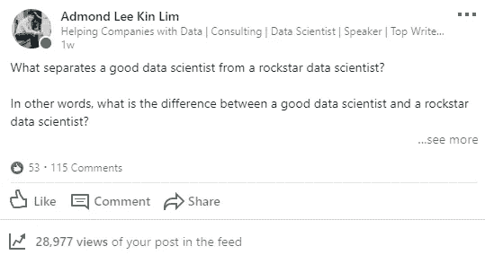

# 成为 Rockstar 数据科学家的 13 大技能

> 原文：<https://towardsdatascience.com/top-13-skills-to-become-a-rockstar-data-scientist-faf2f97e655d?source=collection_archive---------1----------------------->

## 这将你与优秀的数据科学家区分开来

一周前，我在 LinkedIn 上问了[这个问题:](https://www.linkedin.com/feed/update/urn:li:activity:6531492123240431616)

> 是什么将优秀的数据科学家与 rockstar 数据科学家区分开来？

[Question on LinkedIn](http://What separates a good data scientist from a rockstar data scientist?)

令人惊讶的是，我得到了来自不同行业的许多顶级数据科学家的巨大回应，他们都分享了他们的想法和建议-我觉得非常有趣和实用。

为了更多地了解优秀数据科学家和 rockstar 数据科学家之间的主要区别，我一直在互联网上搜索…直到我在 KDnuggets 上找到了[的这篇文章。](https://www.kdnuggets.com/2018/05/simplilearn-9-must-have-skills-data-scientist.html)

所以我收集了所有的信息，列出了成为一名 rockstar 数据科学家的技能。

实际上，一个数据科学家不可能具备下面列出的所有技能。但在我看来，这些技能是 rockstar 数据科学家不同于优秀数据科学家的地方。

在本文结束时，我希望您会发现这些技能对您作为数据科学家的职业生涯有所帮助。

我们开始吧！

# 🚀成为 Rockstar 数据科学家的 13 大技能

# 1.教育

数据科学家受过高等教育，88%的人至少拥有硕士学位，46%的人拥有博士学位，尽管有明显的例外，但通常需要非常扎实的教育背景才能培养成为数据科学家所需的知识深度。要成为一名数据科学家，你可以获得计算机科学、社会科学、物理科学和统计学的学士学位。最常见的研究领域是数学和统计学(32%)，其次是计算机科学(19%)和工程学(16%)。这些课程中的任何一个学位都将为你提供处理和分析大数据所需的技能。

完成学位课程后，你还没有完成。事实是，大多数数据科学家都有硕士学位或博士学位，他们还接受在线培训，学习一项特殊技能，如如何使用 Hadoop 或大数据查询。因此，您可以报名参加数据科学、数学、天体物理学或任何其他相关领域的硕士学位课程。您在学位课程期间学到的技能将使您能够轻松过渡到数据科学。

除了课堂学习，你可以通过开发应用程序、创建博客或探索数据分析来实践你在课堂上学到的东西，从而让你学到更多。

**在我看来，只要你能完成工作，硕士或博士是可选的。在大多数行业工作范围内，只要你能够解决业务问题，你就不需要做研究和部署尖端和新颖的机器学习模型。**

👉🏻有用的免费资源电子书:[成为专业数据科学家的 74 个秘密](https://datascientist88.blogspot.com/2019/05/74-secrets-to-become-pro-data-scientist.html)

# 2.r 编程

对这些分析工具中的至少一种有深入的了解，对于数据科学 R 通常是首选的。r 是专门为数据科学需求而设计的。你可以用 R 来解决你在数据科学中遇到的任何问题。事实上，43%的数据科学家正在使用 R 来解决统计问题。然而，R 有一个陡峭的学习曲线。

这很难学，尤其是如果你已经掌握了一门编程语言。尽管如此，互联网上有很好的资源可以让你开始学习 R，比如 Simplilearn 的 R 编程语言数据科学培训。对于有抱负的数据科学家来说，这是一个很好的资源。

# 3.Python 编码

Python 是我通常在数据科学角色中看到的最常见的编码语言，还有 Java、Perl 或 C/C++。对于数据科学家来说，Python 是一种很棒的编程语言。这就是为什么 O'Reilly 调查的 40%的受访者将 Python 作为他们的主要编程语言。

由于 Python 的多功能性，您可以将它用于数据科学过程中的几乎所有步骤。它可以接受各种格式的数据，您可以轻松地将 SQL 表导入到您的代码中。它允许你创建数据集，你可以在谷歌上找到你需要的任何类型的数据集。

通过阅读以下书籍，您可以了解更多关于 Python 的基础知识以及如何在数据科学中使用 Python:

*   [Python 数据科学手册](https://www.amazon.com/Python-Data-Science-Handbook-Essential-ebook/dp/B01N2JT3ST/ref=as_li_ss_tl?keywords=python+for+data+analysis&qid=1540663027&s=Books&sr=1-2&ref=sr_1_2&linkCode=ll1&tag=admond-20&linkId=0bb8a753123e4b54f1fa6dc463585e28)
*   [用于数据分析的 Python](https://www.amazon.com/Python-Data-Analysis-Wrangling-IPython-ebook/dp/B075X4LT6K/ref=as_li_ss_tl?keywords=python+for+data+analysis&qid=1540663027&s=Books&sr=1-1&ref=sr_1_1&linkCode=ll1&tag=admond-20&linkId=838bdee3bf4ca017f2bc905cd3680f71)
*   [学习 Python](https://www.amazon.com/Learning-Python-5th-Mark-Lutz/dp/1449355730/ref=as_li_ss_tl?ie=UTF8&linkCode=ll1&tag=admond-20&linkId=4497aa20eee542a8c0d91e0467082b61)

# 4.Hadoop 平台

尽管这并不总是必需的，但在许多情况下，这是首选。有蜂巢或者猪的经验也是一个很强的卖点。熟悉诸如亚马逊 S3 这样的云工具也是有益的。CrowdFlower 对 3490 份 LinkedIn 数据科学工作进行的一项研究将 Apache Hadoop 列为数据科学家第二重要的技能，有 49%的评级。

作为一名数据科学家，您可能会遇到数据量超过系统内存或者需要将数据发送到不同服务器的情况，这就是 Hadoop 的用武之地。您可以使用 Hadoop 将数据快速传递到系统中的各个点。这还不是全部。你可以使用 Hadoop 进行数据探索、数据过滤、数据采样和汇总。

# 5.SQL 数据库/编码

即使 NoSQL 和 Hadoop 已经成为数据科学的一个重要组成部分，仍然希望候选人能够用 SQL 编写和执行复杂的查询。SQL(结构化查询语言)是一种编程语言，可以帮助您执行添加、删除和从数据库中提取数据等操作。它还可以帮助您执行分析功能和转换数据库结构。

作为一名数据科学家，你需要精通 SQL。这是因为 SQL 是专门为帮助您访问、交流和处理数据而设计的。当你用它来查询一个数据库时，它给你洞察力。它有简明的命令，可以帮助您节省时间，减少执行困难查询所需的编程量。学习 SQL 将帮助你更好地理解关系数据库，提升你作为数据科学家的形象。

# 6.阿帕奇火花

Apache Spark 正在成为全球最受欢迎的大数据技术。它和 Hadoop 一样是一个大数据计算框架。唯一的区别是 Spark 比 Hadoop 快。这是因为 Hadoop 读写磁盘，这使得它更慢，但 Spark 将其计算缓存在内存中。

Apache Spark 是专门为数据科学设计的，有助于更快地运行复杂的算法。当你处理大量数据时，它有助于分散数据处理，从而节省时间。它还帮助数据科学家处理复杂的非结构化数据集。您可以在一台机器或一群机器上使用它。

Apache spark 使数据科学家能够防止数据科学中的数据丢失。Apache Spark 的优势在于它的速度和平台，这使得它可以轻松地执行数据科学项目。借助 Apache spark，您可以执行从数据获取到分布式计算的分析。

# 7.机器学习和人工智能

大量的数据科学家并不精通机器学习领域和技术。这包括神经网络、强化学习、对抗学习等。如果你想从其他数据科学家中脱颖而出，你需要知道机器学习技术，如监督机器学习、决策树、逻辑回归等。这些技能将帮助您解决基于主要组织成果预测的不同数据科学问题。

数据科学需要应用机器学习不同领域的技能。Kaggle 在其一项调查中显示，一小部分数据专业人员能够胜任高级机器学习技能，如有监督的机器学习、无监督的机器学习、时间序列、自然语言处理、离群点检测、计算机视觉、推荐引擎、生存分析、强化学习和对抗学习。

数据科学涉及处理大量数据集。你可能想熟悉 [**机器学习**](http://bit.ly/2N4i6za) **。**

# 8.数据可视化

商业世界经常产生大量的数据。这些数据需要转换成易于理解的格式。比起原始数据，人们更自然地理解图表和图形形式的图片。一个习语人说“一幅画胜过千言万语”。

作为一名数据科学家，你必须能够借助 ggplot、d3.js 和 Matplotlib、Tableau 等数据可视化工具实现数据的可视化。这些工具将帮助您将项目的复杂结果转换成易于理解的格式。问题是，很多人不理解序列相关或 p 值。你需要直观地向他们展示这些术语在你的结果中代表了什么。

数据可视化为组织提供了直接处理数据的机会。他们可以迅速掌握洞察力，这将有助于他们抓住新的商业机会，并在竞争中保持领先。

特别是，我写了一篇[文章](/storytelling-with-data-a-data-visualization-guide-for-business-professionals-97d50512b407)来谈论数据可视化的重要性以及如何用数据创造更好的故事。

# 9.非结构化数据

数据科学家能够处理非结构化数据至关重要。非结构化数据是不适合数据库表的未定义内容。示例包括视频、博客帖子、客户评论、社交媒体帖子、视频源、音频等。它们是堆在一起的沉重的文本。对这些类型的数据进行排序是困难的，因为它们不是流线型的。

由于其复杂性，大多数人将非结构化数据称为“黑暗分析”。处理非结构化数据有助于您理清对决策有用的见解。作为一名数据科学家，您必须能够理解和操作来自不同平台的非结构化数据。

# 10.好奇心

> “我没有特别的天赋。我只是强烈好奇。”
> 
> ——阿尔伯特·爱因斯坦

毫无疑问，你最近到处都能看到这个短语，尤其是当它与数据科学家相关时。Frank Lo 描述了它的含义，并在几个月前发布的客座博客中谈到了其他必要的“软技能”。

好奇心可以被定义为获取更多知识的欲望。作为一名数据科学家，您需要能够提出有关数据的问题，因为数据科学家花费大约 80%的时间来发现和准备数据。这是因为数据科学领域是一个发展非常迅速的领域，您必须学习更多知识才能跟上步伐。

您需要通过在线阅读内容和阅读有关数据科学趋势的相关书籍来定期更新您的知识。不要被互联网上飞来飞去的大量数据淹没，你必须知道如何理解这些数据。好奇心是作为一名数据科学家取得成功所需的技能之一。例如，最初，您可能看不到您收集的数据中有多少洞察力。好奇心将使你能够筛选数据，找到答案和更多的见解。

# 11.商业头脑

要成为一名数据科学家，你需要对你所在的行业有一个扎实的了解，并且知道你的公司正在试图解决什么样的业务问题。就数据科学而言，除了确定企业应该利用其数据的新方法之外，能够辨别哪些问题对企业来说是重要的解决方案也是至关重要的。

要做到这一点，您必须了解您所解决的问题会如何影响业务。这就是为什么[你需要了解企业是如何运作的](/5-lessons-i-have-learned-from-data-science-in-real-working-experience-3532c1b41fd7)这样你就可以把你的努力引向正确的方向。

# 12.通讯技能

寻找强大数据科学家的公司正在寻找能够清晰流利地将他们的技术发现翻译给非技术团队(如营销或销售部门)的人。数据科学家除了了解非技术同事的需求以便适当地争论数据之外，还必须通过用量化的见解武装他们来使企业能够做出决策。

除了使用公司理解的相同语言，你还需要通过使用数据故事来沟通。作为一名数据科学家，你必须知道如何围绕数据创建一个故事情节，让任何人都容易理解。例如，呈现一个数据表不如以讲故事的形式分享这些数据的见解有效。用讲故事的方式将有助于你恰当地向你的雇主传达你的发现。

交流时，注意你分析的数据中包含的结果和价值。大多数企业主不想知道你分析了什么，他们感兴趣的是它如何积极地影响他们的业务。[学会专注于通过沟通传递价值和建立持久的关系](/5-lessons-i-have-learned-from-data-science-in-real-working-experience-3532c1b41fd7)。

# 13.协力

数据科学家不能独自工作。你必须与公司高管合作制定战略，与产品经理和设计师合作创造更好的产品，与营销人员合作开展更好的转化活动，与客户端和服务器软件开发人员合作创建数据管道并改善工作流程。你将不得不与组织中的每个人合作，包括你的客户。

本质上，您将与您的团队成员合作开发用例，以便了解解决问题所需的业务目标和数据。您需要知道处理用例的正确方法、解决问题所需的数据，以及如何将结果转换并呈现为每个相关人员都可以轻松理解的内容。

# 最后的想法

[(Source)](https://unsplash.com/photos/bH7kZ0yazB0)

感谢您的阅读。

如果你被所需的技能弄得不知所措，这完全没关系(我也是！).

归根结底，这些技能并不是成为数据科学家的必备条件，但与其他典型的数据科学家相比，它们肯定会让你与众不同。

我知道你不是典型的。

一如既往，如果您有任何问题或意见，请随时在下面留下您的反馈，或者您可以随时通过 [LinkedIn](https://www.linkedin.com/in/admond1994/) 联系我。在那之前，下一篇文章再见！😄

## 关于作者

[**阿德蒙德·李**](https://www.linkedin.com/in/admond1994/) 目前是东南亚排名第一的商业银行 API 平台 [**Staq**](https://www.trystaq.com) **—** 的联合创始人/首席技术官。

想要获得免费的每周数据科学和创业见解吗？

你可以在 [LinkedIn](https://www.linkedin.com/in/admond1994/) 、 [Medium](https://medium.com/@admond1994) 、 [Twitter](https://twitter.com/admond1994) 、[脸书](https://www.facebook.com/admond1994)上和他联系。

 [## 阿德蒙德·李

### 让每个人都能接触到数据科学。Admond 正在通过先进的社交分析和机器学习，利用可操作的见解帮助公司和数字营销机构实现营销投资回报。

www.admondlee.com](https://www.admondlee.com/)