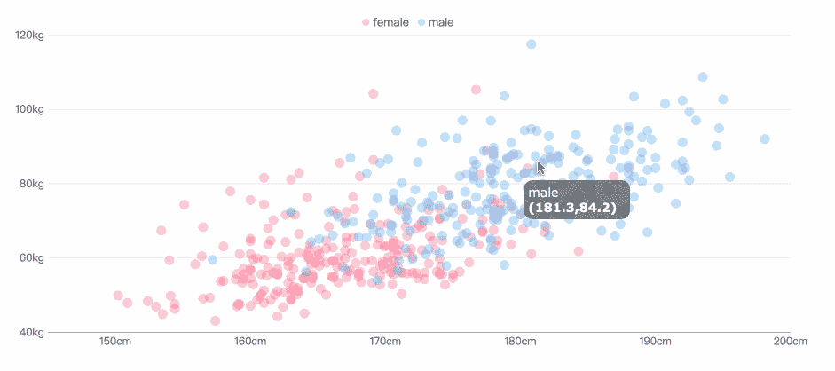
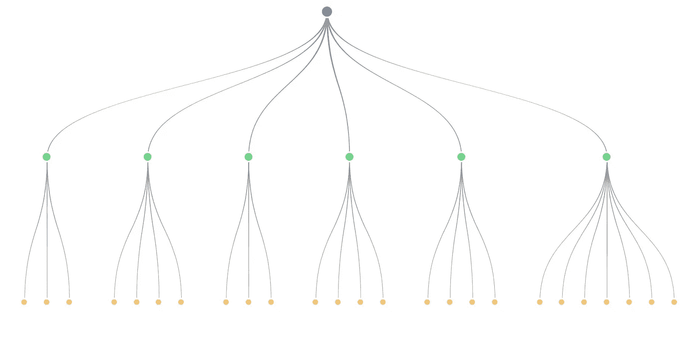

# 数据可视化中的 16 种图表类型

> 原文：<https://towardsdatascience.com/top-16-types-of-chart-in-data-visualization-196a76b54b62?source=collection_archive---------2----------------------->

## 看看下面的仪表盘，你知道有多少种图表吗？

From FineReport

在信息爆炸的时代，越来越多的数据堆积起来。然而，这些密集的数据是不集中的，可读性较差。所以我们需要[数据可视化](http://www.finereport.com/en/data-visualization/data-visualization-2.html?utm_source=medium&utm_medium=media&utm_campaign=blog&utm_term=08)来帮助数据容易被理解和接受。相比之下，可视化更直观，更有意义，使用合适的图表来可视化数据是非常重要的。

在这篇文章中，我将介绍数据可视化中的 16 种图表类型，并分析它们的应用场景，以帮助您快速选择显示数据特征的图表类型。

注:文中所有图表均取自数据可视化工具 [FineReport](http://www.finereport.com/en/product?utm_source=medium&utm_medium=media&utm_campaign=blog&utm_term=08) ，个人[下载](http://www.finereport.com/en/download?utm_source=medium&utm_medium=media&utm_campaign=blog&utm_term=08)完全免费。

# 1.柱形图

柱形图使用垂直列来显示类别之间的数字比较，列数不能太多(如果列数太多，轴的标签可能会显得不完整)。

From FineReport

柱形图利用柱的高度来反映数据的差异，人眼对高度差异比较敏感。局限性是只适用于中小规模的数据集。

From FineReport

**应用场景**:分类数据对比

# 2.条形图

条形图类似于柱形图，但条形图的数量可能相对较多。与柱形图相比，其两个坐标轴的位置发生了变化。

From FineReport

From FineReport

**应用场景**:数据比较(类别名称可以长一点，因为 Y 轴上有更多的空间)

# 3.折线图

折线图用于显示连续时间间隔或时间跨度内的数据变化。它的特点是倾向于反映事物随时间或有序类别的变化。

需要注意的是，折线图的数据记录数应大于 2，可用于大数据量的趋势对比。并且在同一个图上最好不要超过 5 条折线。

From FineReport

From FineReport

**应用场景**:数据量随时间变化的趋势，序列趋势对比

# 4.对比图

面积图是在折线图的基础上形成的。它用颜色填充折线图中折线和轴之间的区域。颜色的填充可以更好的突出趋势信息。

面积图的填充颜色要有一定的透明度。透明度可以帮助用户观察不同系列之间的重叠关系。没有透明度的区域将导致不同的系列相互覆盖。

From FineReport

From FineReport

**应用场景**:序列比率，时间趋势比率

# 5.圆形分格统计图表

饼图广泛应用于各个领域，用来表示不同分类的比例，并通过弧线来比较各种分类。

饼图不适合多个系列的数据，因为随着系列的增加，每个切片都变小，最后大小区分不明显。

From FineReport

饼状图也可以做成多层饼状图，显示不同分类数据的比例，同时也反映出层次关系。

From FineReport

**应用场景**:数列比，数列大小比较(玫瑰图)

# 6.散点图

散点图在直角坐标系中以点的形式显示两个变量。点的位置由变量的值决定。通过观察数据点的分布，我们可以推断变量之间的相关性。

做散点图需要大量数据，否则相关性不明显。

From FineReport

From FineReport

**应用场景**:关联分析、数据分发

# 7.泡泡图

气泡图是一种多元图表，是散点图的变体。除了 X 轴和 Y 轴代表的变量值之外，每个气泡的面积代表第三个值。

我们要注意的是，气泡的大小是有限的，过多的气泡会使图表难以阅读。

From FineReport

**应用场景**:分类数据对比，关联分析

# 8.测量

数据可视化中的仪表是一种物化图。刻度代表公制，指针代表尺寸，指针角度代表数值。它可以直观地表示一个指标的进度或实际情况。

该量表适用于区间对比。

From FineReport

也可以做成环型或管型，标明比例。

From FineReport

**应用场景**:时钟、比率显示

# 9.雷达图

雷达图用于比较多个量化变量，比如看哪些变量有相似的值，或者是否有极值。它们还有助于观察数据集中哪些变量的值较高或较低。雷达图适用于展示工作表现。

From FineReport

雷达图还具有堆叠柱形图样式，可用于分类和系列之间的双向比较，同时也表示比例。

From FineReport

**应用场景**:维度分析、序列比较、序列权重分析

# 10.构架图解

框架图是以树形结构的形式呈现层次结构的可视化手段，它清晰地显示了层次关系。

From FineReport

**应用场景**:层级显示、流程显示

# 11.矩形树形图

矩形树形图适用于呈现具有层次关系的数据，可以直观地反映相同级别之间的比较。与传统的树形结构图相比，矩形树形图更有效地利用了空间，并具有显示比例的功能。

矩形树形图适用于显示具有权重关系的层次结构。如果不需要体现比例，框架图可能更清晰。

From FineReport

**应用场景**:加权树数据，树数据比例

# 12.漏斗图

漏斗图显示了每个阶段的比例，直观地反映了每个模块的大小。适合比较排名。

From FineReport

同时，漏斗图也可以用来对比。我们横向排列多个漏斗图，数据对比也很清晰。

From FineReport

**应用场景**:数据排名、比率、标准值比较

# 13.单词云图表

单词云是文本数据的可视化表示。它是由词汇组成的云状彩色图形。它用于显示大量文本数据，可以快速帮助用户感知最突出的文本。

单词云图要求数据量大，数据的区分度比较大，否则效果不明显。并且它不适合于精确分析。

From FineReport

**应用场景**:关键词搜索

# 14.线条图

甘特图直观地显示了任务的时间安排、实际进度以及与要求的比较。所以管理人员可以很容易地了解一项任务(项目)的进展。

From FineReport

**应用场景**:项目进度、状态随时间的变化、项目过程

# 15.地图

地图分为三种类型:区域地图、点地图和流程地图。

## (1)区域地图

区域地图是一种使用颜色来表示地图分区上某个范围的值的分布的地图。

From FineReport

**应用场景**:数据对比和分发

## (2)点地图

点地图是一种通过在地理背景上绘制相同大小的点来表示数据地理分布的方法。

点的分布便于把握数据的整体分布，但在需要观察单个具体数据时就不适合了。

From FineReport

**应用场景**:数据分发

但是如果你用气泡代替点，那么点地图不仅可以显示分布，还可以大致比较每个区域的数据大小。

From FineReport

## (3)流程图

流图显示流出区域和流入区域之间的交互数据。通常用连接空间元素几何重心的线来表示。线条的宽度或颜色表示流量值。

流动地图有助于说明地理迁移的分布，动态流线的使用减少了视觉混乱。

From FineReport

**应用场景**:数据的流动、分布和比较

# 16.热图

热图用于指示地理区域中每个点的权重。除了地图作为背景层，你也可以使用其他图像。热图中的颜色通常是指密度。

From FineReport

**应用场景**:区域访问，热度分布，各种东西的分布

# 终于

以上是数据可视化中 16 种常用的图表类型。如果你想开始数据可视化，我建议你从学习制作这些基本图表开始，用一个像 [FineReport](http://www.finereport.com/en/product?utm_source=medium&utm_medium=media&utm_campaign=blog&utm_term=08) 这样简单易用的工具练习。

可能有人会觉得基础图表太简单原始，倾向于使用更复杂的图表。但是，图表越简单，越容易帮助人们快速理解数据。这难道不是数据可视化最重要的目的吗？所以请不要小看这些基础图表。因为用户对它们最熟悉。只要它们适用，就应该优先考虑。

# 您可能也会对…感兴趣

初学者如何设计酷的数据可视化？

[业务仪表盘初学者指南](/a-beginners-guide-to-business-dashboards-981a8192a967)

[4 数据地图在商业分析中的应用](/4-uses-of-data-maps-in-business-analysis-9f9589c3f69a)

*原载于 2019 年 7 月 22 日*[*http://www.finereport.com*](http://www.finereport.com/en/data-visualization/top-16-types-of-chart-in-data-visualization.html)*。*