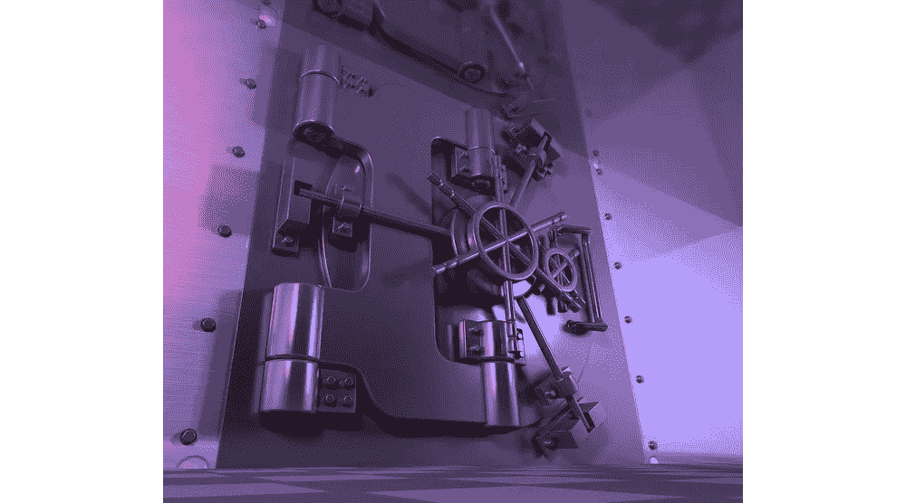
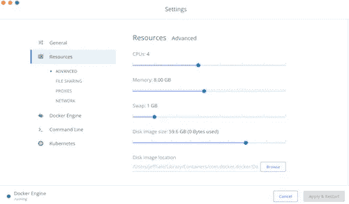
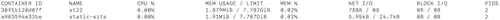

# 20 大码头安全提示

> 原文：<https://towardsdatascience.com/top-20-docker-security-tips-81c41dd06f57?source=collection_archive---------3----------------------->

## 瞄准安全！

这篇文章充满了帮助你安全使用 Docker 的技巧。如果你是 Docker 新手，我建议你先看看我以前的文章，关于 Docker [概念](/learn-enough-docker-to-be-useful-b7ba70caeb4b)，Docker [生态系统](/learn-enough-docker-to-be-useful-1c40ea269fa8)，[Docker 文件](/learn-enough-docker-to-be-useful-b0b44222eef5)，[瘦身图片](/slimming-down-your-docker-images-275f0ca9337e)，[流行命令](/learn-enough-docker-to-be-useful-b0b44222eef5)，以及 Docker 中的[数据。](/pump-up-the-volumes-data-in-docker-a21950a8cd8?source=friends_link&sk=87c74aa7fefeaacd8509e24d7c432b91)


你需要对 Docker 的安全性有多担心？看情况。Docker 内置了明智的安全特性。如果您使用的是官方 Docker 映像，并且不与其他机器通信，您就没有太多需要担心的。

然而，如果你在生产中使用非官方图像、服务文件或运行应用程序，那么情况就不同了。在这些情况下，你需要对 Docker 安全有更多的了解。



Looks safe

您的主要安全目标是防止恶意用户获取有价值的信息或造成破坏。为此，我将在几个关键领域分享 Docker 安全最佳实践。在这篇文章结束时，你会看到超过 20 个 Docker 安全提示！😃

在第一部分中，我们将重点关注三个方面:

*   **A** 门禁管理
*   **我**法师安全
*   秘密的管理

想出首字母缩写 **AIM** 来帮助你记住它们。

首先，让我们看一下限制容器的访问。

# 访问管理—限制权限

当您启动一个容器时，Docker 会创建一组名称空间。命名空间防止容器中的进程看到或影响主机中的进程，包括其他容器。名称空间是 Docker 将一个容器与另一个容器隔离开来的主要方式。

Docker 也提供私有容器网络。这可以防止容器获得对同一主机上其他容器的网络接口的特权访问。

因此，Docker 环境在某种程度上是隔离的，但对于您的用例来说，它可能还不够隔离。


Does not look safe

良好的安全性意味着遵循最低特权原则。你的容器应该有能力做它需要做的事情，但除此之外不能有更多的能力。棘手的是，一旦你开始限制哪些进程可以在一个容器中运行，这个容器可能就不能做它应该做的事情了。

有几种方法可以调整容器的权限。首先，避免以 root 身份运行(如果必须以 root 身份运行，则重新映射)。第二，用`--cap-drop`和`--cap-add`调整能力。

避免 root 和调整功能应该是大多数人限制特权所需要做的。更高级的用户可能需要调整默认的 AppArmor 和 seccomp 配置文件。我将在我即将出版的关于 Docker 的书中讨论这些问题，但是为了防止这篇文章膨胀，我将它们排除在外。🎈

## 避免以 root 用户身份运行

Docker 的默认设置是让映像中的用户以 root 身份运行。很多人没有意识到这有多危险。这意味着攻击者更容易获得敏感信息和您的内核。

作为一般的最佳实践，不要让容器以 root 用户身份运行。


Roots

“防止来自容器内部的特权提升攻击的最佳方式是将容器的应用程序配置为以无特权用户的身份运行。”——Docker[Docs](https://docs.docker.com/engine/security/userns-remap/)。

您可以在构建时指定一个不同于 root 的用户 id，如下所示:

`docker run -u 1000 my_image`

`-- user`或`-u`标志可以指定用户名或用户标识。userid 不存在也没问题。

在上面的例子中， *1000* 是一个任意的、无特权的用户标识。在 Linux 中，通常保留 0 到 499 之间的 userids。选择一个大于 500 的 userid，以避免作为默认系统用户运行。

不要从命令行设置用户，最好在您的映像中从 root 更改用户。那么人们就不必记得在构建时更改它。只需在您的映像中将用户 Dockerfile 指令放在需要 root 自带功能的 Dockerfile 指令之后。

也就是说，先安装你需要的包，然后切换用户。例如:

```
FROM alpine:latest
RUN apk update && apk add --no-cache git
USER 1000
…
```

如果您必须以 root 用户的身份在容器中运行流程，请将 root 用户重新映射到 Docker 主机上权限较低的用户。参见[对接文件](https://docs.docker.com/engine/security/userns-remap/)。

您可以通过改变功能来授予用户所需的权限。

## 能力

能力是允许的过程的捆绑。

使用`--cap-drop`和`--cap-add`通过命令行调整功能。最好的策略是用`--cap-drop all`放弃一个容器的所有特权，用`--cap-add`重新添加需要的特权。


Stop or go

您可以在运行时调整容器的功能。例如，要放弃使用`kill`来停止容器的功能，您可以像这样删除默认功能:

`docker run --cap-drop=Kill my_image`

避免给进程赋予 SYS_ADMIN 和 SETUID 特权，因为它们被赋予了很大的权力。向用户添加这种能力类似于授予 root 权限(避免这种结果就是不使用 root 的全部意义)。

不允许容器使用 1 到 1023 之间的端口号更安全，因为大多数网络服务都在这个范围内运行。未经授权的用户可以监听诸如登录和运行未经授权的服务器应用程序之类的事情。这些编号较低的端口需要以 root 用户身份运行，或者被明确授予 CAP_NET_BIND_SERVICE 功能。

要了解容器是否有特权端口访问，可以使用 *inspect* 。使用`docker container inspect my_container_name`将向您显示关于您的容器的已分配资源和安全配置文件的许多细节。

[这里是 Docker reference](https://docs.docker.com/engine/reference/run/#runtime-privilege-and-linux-capabilities) 了解更多特权。

和 Docker 中的大多数东西一样，最好在一个自动的、自我文档化的文件中配置容器。使用 Docker Compose，您可以在服务配置中指定如下功能:

`cap_drop: ALL`

或者您可以在 Kubernetes 文件中调整它们，如这里讨论的。

Linux 功能的完整列表在[这里](http://man7.org/linux/man-pages/man7/capabilities.7.html)。

如果你想对容器特权进行更细粒度的控制，可以在我即将出版的书中查看我对 AppArmor 和 seccomp 的讨论。订阅[我的电子邮件简讯](http://eepurl.com/gjfLAz)以便在有消息时得到通知。


Closed road

# 访问管理—限制资源

限制容器对内存和 CPU 等系统资源的访问是一个好主意。如果没有资源限制，容器可以用尽所有可用的内存。如果发生这种情况，Linux 主机内核将抛出内存不足异常并终止内核进程。这会导致整个系统崩溃。你可以想象攻击者如何利用这些知识来关闭应用程序。

如果在同一台机器上运行多个容器，明智的做法是限制任何一个容器可以使用的内存和 CPU。如果你的容器内存不足，那么它就会关闭。关闭你的容器会导致你的应用崩溃，这可不好玩。然而，这种隔离保护了主机不会耗尽内存，也保护了主机上的所有容器不会崩溃。这是件好事。


Wind resource

Docker Desktop CE for Mac v2.1.0 有默认的资源限制。您可以在 Docker 图标->首选项下访问它们。然后点击*资源*选项卡。您可以使用滑块来调整资源限制。



Resource settings on Mac

或者，您可以从命令行限制资源，方法是指定`--memory`标志或简称为`-m`，后跟一个数字和一个度量单位。

4m 表示 4 兆字节，是最小容器内存分配。一兆字节(MiB)略大于一兆字节(1 兆字节= 1.048576 MB)。文档目前是不正确的，但是希望在你读到这篇文章的时候，维护者已经接受了我的修改。

要查看您的容器正在使用哪些资源，请在新的终端窗口中输入命令`[docker stats](https://deploy-preview-9237--docsdocker.netlify.com/config/containers/runmetrics/)`。您将看到正在运行的容器统计数据定期刷新。



Stats

在幕后，Docker 使用 Linux 控制组(cgroups)来实现资源限制。这项技术经过了实战考验。

点击了解更多关于 Docker [资源限制的信息。](https://docs.docker.com/config/containers/resource_constraints/)

# 图像安全

从 Docker Hub 抓取图像就像邀请某人到你家一样。你可能想要故意的。


Someone’s home

## 使用值得信赖的图片

图像安全的第一条规则是只使用你信任的图像。你怎么知道哪些图片是可信的？

很有可能流行的官方图片相对安全。这样的映像包括 alpine、ubuntu、python、golang、redis、busybox 和 node。每个网站都有超过 1000 万的下载量和大量的关注。🔒

[Docker 解释](https://blog.docker.com/2019/02/docker-security-update-cve-2018-5736-and-container-security-best-practices/):

> Docker 赞助了一个专门的团队，负责审查和发布官方图片中的所有内容。该团队与上游软件维护人员、安全专家和更广泛的 Docker 社区合作，以确保这些图像的安全性。

## 减少你的攻击面

与使用官方基础映像相关，您可以使用最小基础映像。

内部代码越少，出现安全漏洞的几率就越低。较小、不太复杂的基础图像更透明。

比起你的朋友的图像依赖于她的朋友的图像依赖于另一个基础图像，在高山图像中看到发生了什么要容易得多。短的线更容易解开。


Tangled

类似的，只安装自己实际需要的包。这减少了您的攻击面，加快了您的图像下载和图像构建。

## 需要签名的图像

您可以通过使用 Docker 内容信任来确保对图像进行签名。🔏

Docker 内容信任阻止用户使用标记图像，除非它们包含签名。可信来源包括来自 Docker Hub 的官方 Docker 图像和来自用户可信来源的签名图像。


Signed

默认情况下，内容信任被禁用。要启用它，请将 DOCKER_CONTENT_TRUST 环境变量设置为 1。从命令行运行以下命令:

`export DOCKER_CONTENT_TRUST=1`

现在，当我试图从 Docker Hub 下载我自己的未签名图像时，它被阻止了。

`Error: remote trust data does not exist for docker.io/discdiver/frames: notary.docker.io does not have trust data for docker.io/discdiver/frames`

内容信任是将痞子拒之门外的一种方式。点击了解更多关于内容信任[的信息。](https://docs.docker.com/engine/security/trust/content_trust/)

Docker 通过图像内容的加密校验和来存储和访问图像。这可以防止攻击者造成图像冲突。这是一个很酷的内置安全功能。

# 管理秘密

您的访问受到限制，您的图像是安全的，现在是时候管理您的秘密了。"

管理敏感信息的规则 1:不要把它放进你的映像中。在代码库、日志和其他地方找到未加密的敏感信息并不困难。

规则 2:也不要为你的敏感信息使用环境变量。任何能把`docker inspect`或`exec`跑进集装箱的人都能找到你的秘密。任何以 root 用户身份运行的人也可以。希望我们已经配置好了，这样用户就不会以 root 身份运行，但是冗余是良好安全性的一部分。日志通常也会转储环境变量值。你不希望你的敏感信息泄露给任何人。

Docker 卷更好。它们是访问 Docker 文档中您的敏感信息的推荐方式。您可以将卷用作内存中的临时文件系统。卷消除了`docker inspect`和日志记录风险。然而，根用户仍然可以看到这个秘密，任何能够进入容器的人也可以看到。总的来说，卷是一个很好的解决方案。

比卷更好的是，使用 Docker 秘密。秘密是加密的。


Secrets

一些 Docker 文档声明你只能在 Docker Swarm 中使用秘密。尽管如此，你可以在 Docker 中使用秘密而不用 Swarm。

如果您只需要图像中的秘密，您可以使用 BuildKit。对于构建 Docker 映像，BuildKit 是比当前构建工具更好的后端。它大大减少了构建时间，并且有其他好的特性，包括构建时秘密支持。

BuildKit 相对较新——Docker Engine 18.09 是附带 BuildKit 支持的第一个版本。有三种方法可以指定 BuildKit 后端，这样现在就可以使用它的特性了。将来，它将是默认的后端。

1.  用`export DOCKER_BUILDKIT=1`将其设置为环境变量。
2.  用`DOCKER_BUILDKIT=1`启动你的`build`或`run`命令。
3.  默认情况下启用 BuildKit。用`{ "features": { "buildkit": true } }`将/*etc/docker/daemon . JSON*中的配置设置为 *true* 。然后重启 Docker。
4.  然后，您可以在构建时使用带有`--secret`标志的秘密，如下所示:

`docker build --secret my_key=my_value ,src=path/to/my_secret_file .`

其中您的文件将您的秘密指定为键值对。

这些秘密不会存储在最终图像中。它们也被排除在映像构建缓存之外。安全第一！

如果您需要在运行容器中使用您的秘密，而不仅仅是在构建图像时，请使用 Docker Compose 或 Kubernetes。

使用 Docker Compose，将 secrets 键-值对添加到服务中，并指定机密文件。帽子提示到[栈交换答案](https://serverfault.com/a/936262/535325)为 Docker 编写秘密提示，下面的例子是改编自。

带有秘密的 docker-compose.yml 示例:

```
version: "3.7"

services:

  my_service:
    image: centos:7
    entrypoint: "cat /run/secrets/my_secret"
    secrets:
      - my_secret

secrets:
  my_secret:
    file: ./my_secret_file.txt
```

然后用`docker-compose up --build my_service`照常开始作曲。

如果你用的是 Kubernetes，它支持秘密。[头盔-秘密](https://github.com/futuresimple/helm-secrets)可以让 K8s 中的秘密管理更加容易。此外，K8s 具有基于角色的访问控制(RBAC)，Docker Enterprise 也是如此。RBAC 使团队的访问机密管理更易管理，更安全。

使用机密的最佳实践是使用诸如 Vault 之类的机密管理服务。 [Vault](https://www.vaultproject.io/) 是 HashiCorp 提供的一项服务，用于管理对秘密的访问。它也限制了秘密的时间。更多关于 Vault 的 Docker 图像的信息可以在[这里](https://hub.docker.com//vault)找到。

[AWS Secrets Manager](https://aws.amazon.com/secrets-manager/) 和其他云提供商的类似产品也可以帮助您在云上管理您的秘密。


Keys

记住，管理你的秘密的关键是保密。绝对不要把它们放进你的图像或者变成环境变量。

# 更新内容

与任何代码一样，保持映像中的语言和库是最新的，以便从最新的安全修复中受益。


Hopefully your security is more up to date than this lock

如果您在映像中引用基础映像的特定版本，也要确保它是最新的。

与此相关的是，您应该保持 Docker 版本的更新，以获得 bug 修复和增强，从而允许您实现新的安全特性。

最后，让您的主机服务器软件保持最新。如果您运行的是托管服务，这应该是为您完成的。

更好的安全性意味着保持更新。

# 考虑一下 Docker 企业

如果您有一个由一群人和一堆 Docker 容器组成的组织，那么您很可能会从 Docker Enterprise 中受益。管理员可以为所有用户设置策略限制。所提供的 RBAC、监控和日志记录功能可能会使您的团队更容易进行安全管理。

有了 Enterprise，你还可以在 Docker 信任的注册表中秘密托管你自己的映像。Docker 提供内置的安全扫描，以确保您的图像中没有已知的漏洞。

Kubernetes 免费提供了部分功能，但是 Docker Enterprise 为容器和图像提供了额外的安全功能。最棒的是， [Docker Enterprise 3.0](https://blog.docker.com/2019/07/announcing-docker-enterprise-3-0-ga/) 于 2019 年 7 月发布。它包括 Docker Kubernetes 服务与“明智的安全默认值”。

# 其他提示

*   不要以`-- privileged`的身份运行容器，除非你需要在 Docker 容器中运行 Docker 这样的特殊情况——并且你知道你在做什么。
*   在你的 docker 文件中，支持 COPY 而不是 ADD。添加自动提取压缩文件，并可以从网址复制文件。COPY 不具备这些能力。尽可能避免使用 ADD，这样就不会受到远程 URL 和 Zip 文件的攻击。
*   如果您在同一服务器上运行任何其他进程，请在 Docker 容器中运行它们。
*   如果您使用 web 服务器和 API 来创建容器，请仔细检查参数，以便不会创建您不想要的新容器。
*   如果您公开一个 REST API，用 HTTPS 或 SSH 保护 API 端点。
*   考虑与[码头工人安全工作台](https://github.com/docker/docker-bench-security)进行一次检查，看看你的集装箱在多大程度上遵循了他们的安全准则。
*   仅将敏感数据存储在卷中，不要存储在容器中。
*   如果使用联网的单主机应用程序，不要使用默认的桥接网络。它存在技术缺陷，不建议用于生产。如果您发布一个端口，桥接网络上的所有容器都可以访问。
*   使用加密 HTTPS 证书进行服务。在这里可以看到 NGINX [的例子。](https://medium.com/@pentacent/nginx-and-lets-encrypt-with-docker-in-less-than-5-minutes-b4b8a60d3a71)
*   当您只需要读取卷时，以只读方式装载卷。在这里看到几种做这个[的方法。](https://github.com/OWASP/CheatSheetSeries/blob/master/cheatsheets/Docker_Security_Cheat_Sheet.md)

# 摘要

你已经看到了许多使你的码头集装箱更安全的方法。安全没有设置-它和忘记它。它需要保持警惕，以保持您的图像和容器的安全。


Keys

## 考虑安全性时，请记住目标

1.  **A** 访问管理

*   避免以 root 用户身份运行。如果必须使用根目录，请重新映射。
*   放弃所有功能，添加那些需要的功能。
*   如果您需要细粒度的权限调优，请深入研究 AppArmor。
*   限制资源。

2.**我**法师安全

*   使用官方的、流行的、最简单的基础图片。
*   不要安装你不需要的东西。
*   要求对图像签名。
*   随时更新 Docker、Docker 图像和其他与 Docker 相关的软件。

3.秘密的管理

*   使用秘密或卷。
*   考虑像 Vault 这样的秘密管理器。


Bullseye!

保持码头集装箱安全意味着以安全为目标。

不要忘记更新 Docker、你的语言和库、你的图像和你的主机软件。最后，如果你作为团队的一员运行 Docker，考虑使用 Docker Enterprise。

我希望这篇 Docker 安全文章对您有所帮助。如果你有，请在你最喜欢的论坛或社交媒体渠道上与他人分享，这样你的朋友也可以找到它！👏

你有其他 Docker 安全建议吗？如果有，请在评论中或在 [Twitter @discdiver](https://twitter.com/discdiver) 上分享。👍

如果你有兴趣在我的*难忘的 Docker* 书发布时得到通知，那就注册我的[邮件列表](https://dataawesome.com)。

[](https://dataawesome.com)

我写关于 Python、数据科学、人工智能和其他技术主题的文章。如果你对这些感兴趣的话，可以在 Medium 上看看它们。

安全快乐！😃

***来自《走向数据科学》编辑的注释:*** *虽然我们允许独立作者根据我们的* [*规则和指南*](/questions-96667b06af5) *发表文章，但我们并不认可每个作者的贡献。你不应该在没有寻求专业建议的情况下依赖一个作者的作品。详见我们的* [*读者术语*](/readers-terms-b5d780a700a4) *。*