# 最常用的 20 个 Git 命令

> 原文：<https://towardsdatascience.com/top-20-most-frequently-used-git-commands-part-1-5f8c9212509f?source=collection_archive---------12----------------------->

嘿，你是新来的吗？如果是的话，你已经迟到了，你应该昨天就知道了。但是不要担心，现在还不算太晚。

甚至我们大多数人都听说过 Git，但是仍然有许多人可能不知道如何使用它。在本指南结束时，您将知道 Git **中几个最常用的命令。**

# **Git |简介**

Git 是一个分布式版本控制系统(DVCS ),用于跟踪源代码中的变化，但是它也可以用于跟踪任何一组文件中的变化。

*   中央版本控制系统(CVCS)
*   分布式版本控制系统(DVCS)
*   Git 命令

# **版本控制系统**

版本控制系统是对文档、计算机程序、大型网站和其他信息集合的更改的管理。市场上有许多版本控制系统，但通常分为两类，即中央版本控制系统和分布式版本控制系统。

**中央版本控制系统(CVCS):**

中央版本控制系统(CVCS)是某处(可能在服务器上)的单个存储库或项目副本，开发人员将他们的更改提交到该存储库中。同时，对这个存储库所做的更改对其他开发人员也是可见的。

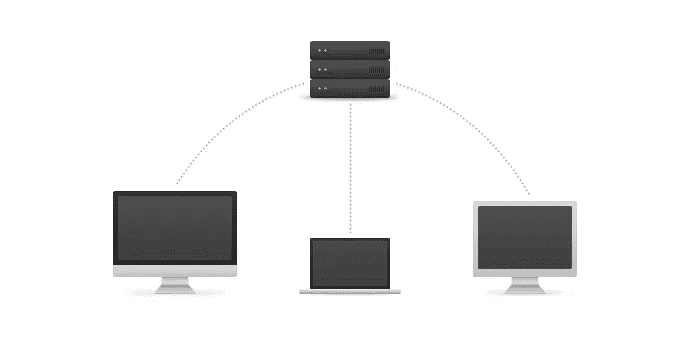

Image by [http://guides.beanstalkapp.com](http://guides.beanstalkapp.com/)

**分布式版本控制系统(DVCS):**

分布式版本控制系统(DVCS)也是一个版本控制系统，其中每个开发人员的硬盘上都有完整的代码库和完整的版本历史。在没有上传到服务器之前，任何人都看不到对此本地存储库所做的更改。

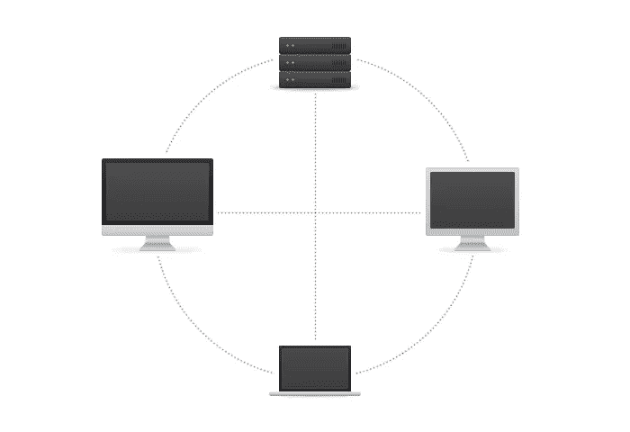

Image by [http://guides.beanstalkapp.com](http://guides.beanstalkapp.com/)

**Git 术语**

*   **存储库:**存储库是存储和管理数据的中心位置。
*   **提交:**提交是永久保存更改的操作。
*   **Staging Area:** Staging 是 git 中提交流程之前的一个步骤。也就是说，git 中的提交分两步执行:**准备**和实际**提交**。
*   **推送:****git 推送**命令用于将本地存储库内容上传到远程存储库。
*   **Pull:****git Pull**命令用于从远程存储库获取和下载内容，并立即更新本地存储库以匹配该内容。
*   **远程服务器:**远程服务器是一种不在局域网上的服务器，它为全球的用户提供数据服务。
*   **分支:**分支就像你的项目的目录，里面包含了所有的文件。Git 存储库总是创建默认的分支，称为主分支。
*   **克隆:**克隆是创造某物的复制品的过程。

我们将看到一个如何将本地存储库推送到远程服务器的实例。我会演示给你看，现在我们开始吧。

**第一步**

首先移动到您的项目所在的目录，因为我的项目位于 PycharmProjects/git_commands 中，所以现在打开您的终端并运行下面的命令到达那里。

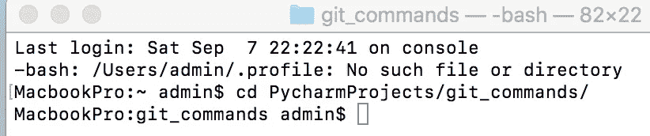

如果你想看到你的项目目录中的文件，然后输入下面的命令。

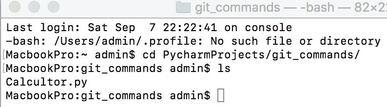

As you can see there is only single file inside my git_commands folder.

**第二步**

一旦你进入你的项目目录，现在我们将在 **Bitbucket** 上创建我们的远程存储库，你可以使用 **Github** 来代替。现在打开你的浏览器，输入 bitbucket，如果你没有 **Bitbucket** 账户，那么你必须创建一个。点击此链接 [bitbucket](https://bitbucket.org) 创建账户或登录 bitbucket。

要创建新的存储库，请单击+按钮并选择存储库

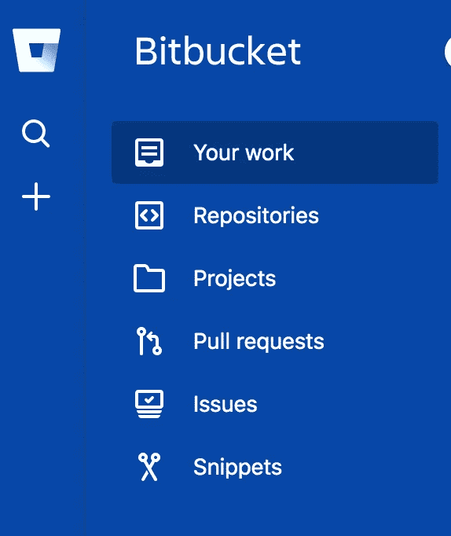

现在给你的库命名，就像我给 GitTutorial 一样，你可以给任何你想要的名字。然后点击高级设置，选择你正在使用的语言，一切保持原样，最后点击创建库。您将看到新的存储库将在您的 Bitbucket 帐户上创建。创建存储库后，您的帐户将如下所示。

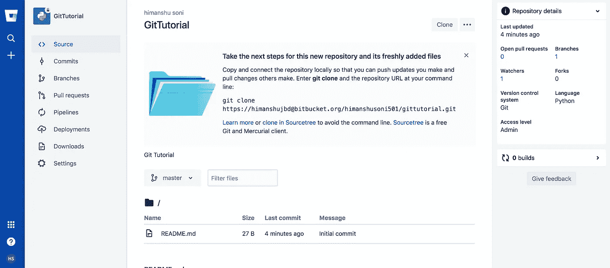

Repository created with name GitTutorial

**第三步**

**git config:** 使用 **git config** 命令设置系统的全局变量。 **git config** 命令是一个方便的功能，用于在全局或本地项目级别设置 **Git 配置**值。转到您的终端，键入下面的命令如下。

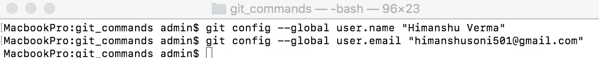

git Config

**git init:** 该命令用于初始化系统上的本地存储库

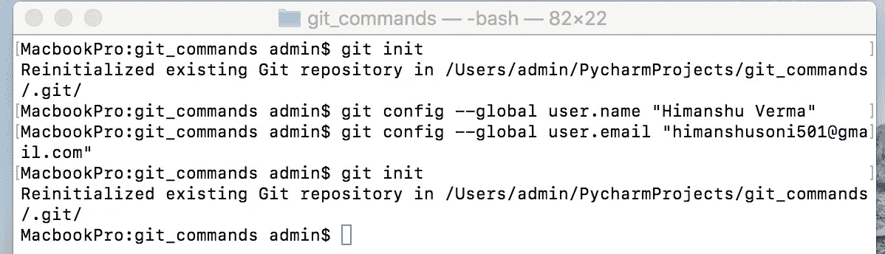

git init

**git remote:** 这个命令用于将您的本地存储库连接到远程服务器。

现在，我们将添加我们的远程存储库的连接，以便我们可以将我们的代码库推送到 Bitbucket。现在，从 Bitbucket 复制远程存储库的链接，并将其粘贴到终端。

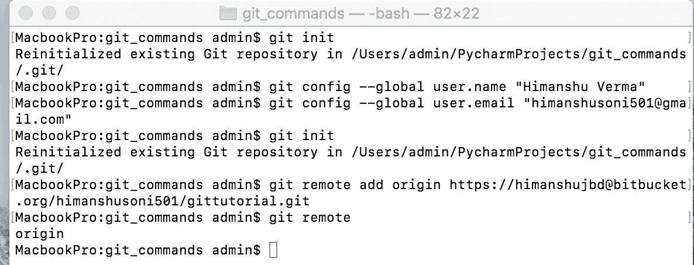

**git 状态:**该命令列出了所有必须提交的文件。如下图所示， **calculator.py** 标记为红色，表示该文件尚未提交，需要提交。

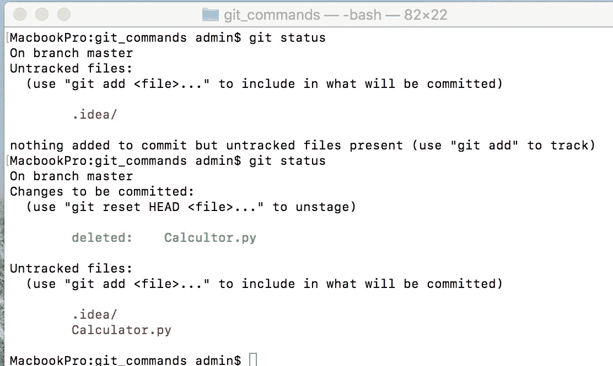

**git add:****git add**命令将工作目录中的更改添加到登台区。它告诉 **Git** 您想要在下一次提交中包含对特定文件的更新。在我的例子中, **calculator.py** 文件被添加到暂存区。如果您有多个文件要添加，那么您可以使用 **git add *** 。

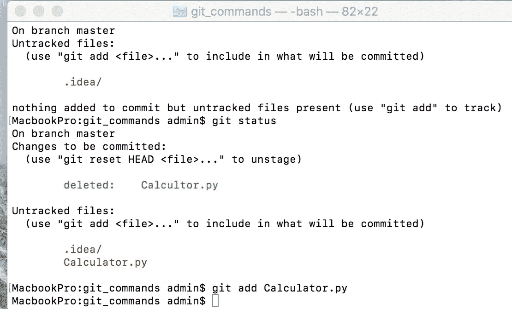

git add

**git commit:****git****commit**命令用于将您的更改保存到本地存储库。git commit-m[键入提交消息]

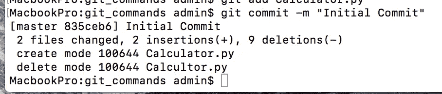

git commit

**git log:** 这个命令用来告诉我们提交记录。请参见下图，只有一次提交，这就是为什么它只显示“初始提交”消息以及提交内容的 SHA1 40 字符校验和。

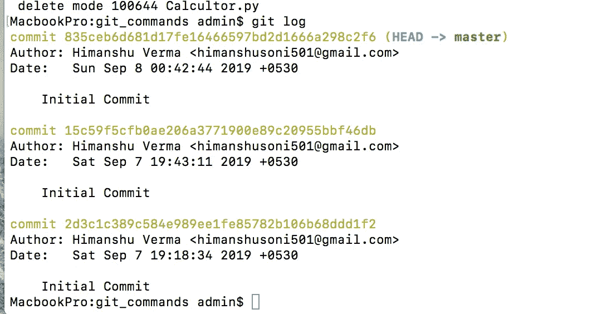

git log

如果您重新运行 git commit 命令，它会告诉我们，自从上次提交以来，我们没有对文件进行任何更改，所以没有什么要提交的。

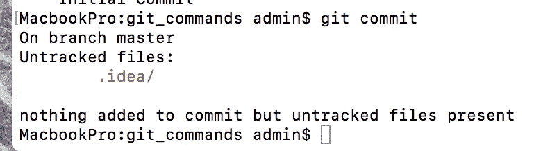

**git branch:** 如果您在终端中运行这个命令，那么它将显示所有的分支，默认情况下它只有主分支。下图中 master 前面的星号*表示您目前在 master 分支机构中。如果您想要创建新的分支，那么您可以运行 **git branch [branch name]。**在我的例子中，我创建了名为**子主**的分支。

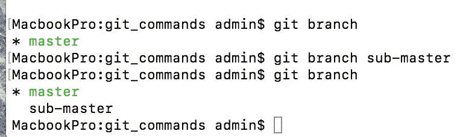

git branch

**git checkout:** 该命令用于切换分支。即使创建新分支后，你仍然在**主**分支中。如果你想在分支之间切换，你可以运行 **git checkout【分支名称】**命令。正如您在下图中看到的，我们从**主**分支切换到**子主**分支，子主前面的星号( ***** )告诉我们当前在**子主**分支中。

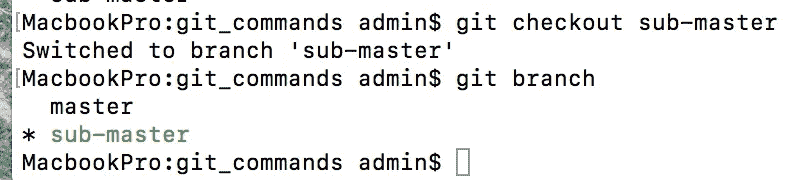

Switched from master branch to sub-master branch

**git push:****git push**命令用于将本地存储库内容上传到远程存储库。推送是将提交从本地存储库转移到远程存储库的方式。在下图中，我们的本地存储库已经被复制到远程存储库。

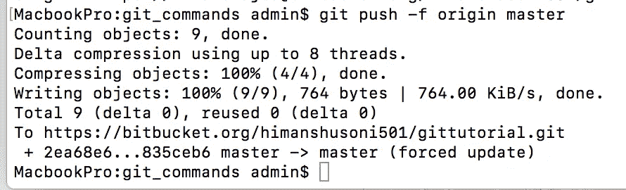

git push — f origin master

正如你在给定的图片中看到的“calculator.py”文件成功上传到 Bitbucket 存储库，它只有一个功能。现在我们将修改这个文件，并向它添加更多的函数，然后我们将看到这个文件如何在我们的远程服务器上更新。让我们开始吧。

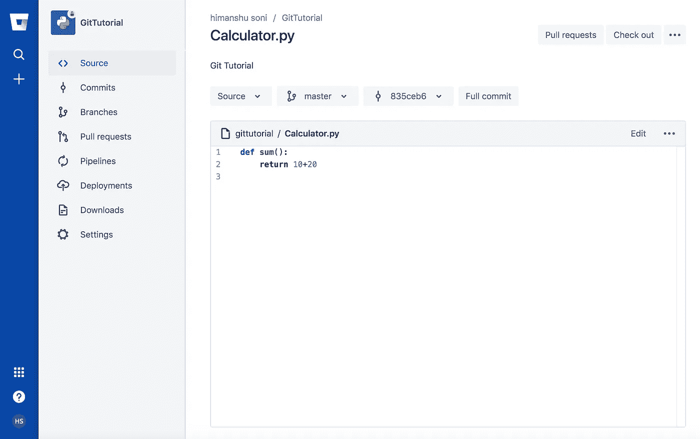

“Calculator.py” is on the remote server now

如果您现在运行 **git status** 命令，它会告诉您自上次提交以来，您对文件做了一些更改。如您所见，Calculator.py 文件是修改后的文件。

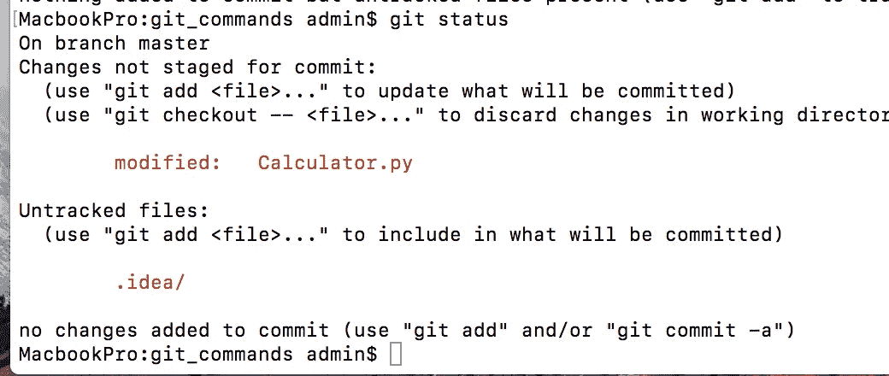

现在，我们将再次重复相同的过程，将此更改推送到我们的远程服务器。我们将把这个文件从项目目录添加到临时区域，然后提交更改，最后我们将推送它。

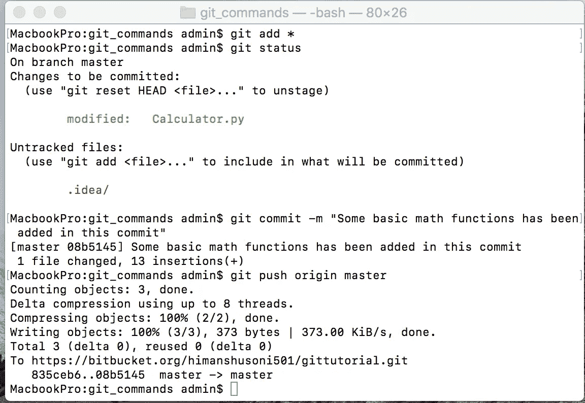

Code pushed to the server.

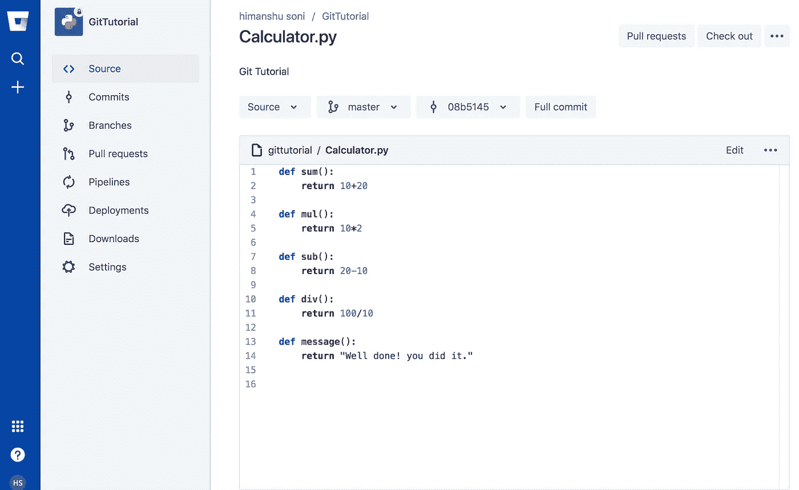

Bitbucket Repo

**git show:** 该命令显示指定提交的元数据和内容变化。

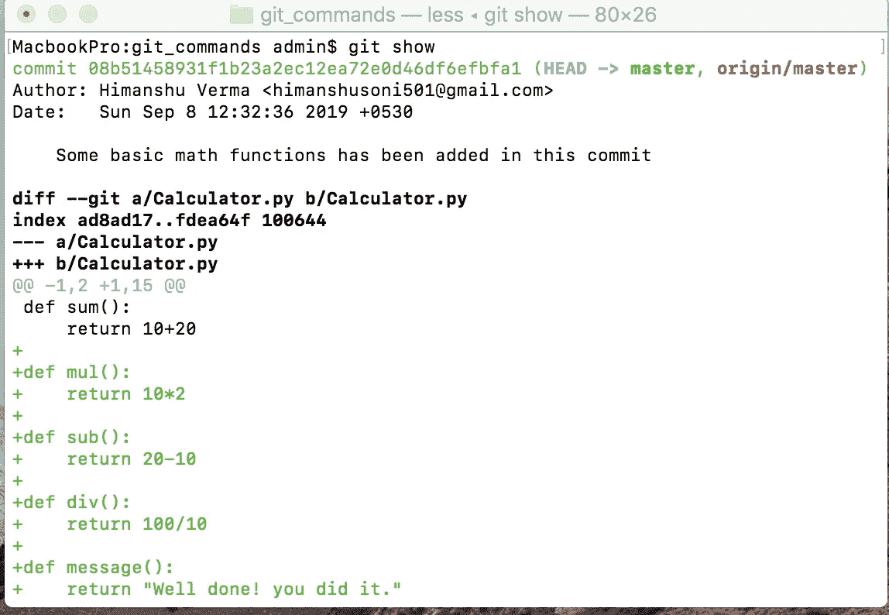

**git clone:** 该命令用于将存储库从远程服务器克隆到本地机器。

要使用这个命令，我建议您在系统上的任意位置创建新文件夹，然后运行 git clone 命令。如你所见，我在桌面上创建了一个名为 git_clone 的新文件夹。现在，从 Bitbucket 复制远程存储库 URL，并将其粘贴到终端。

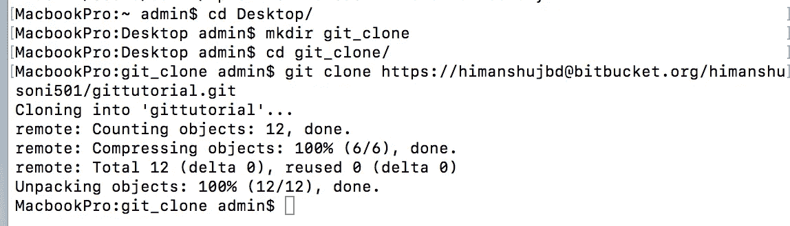

现在打开 git_clone 文件夹，您将看到项目下载到文件夹中。

**git pull:** 这个命令获取并合并远程服务器上的更改到您的工作目录中。要使用这个命令，请转到 git_commands 目录，然后运行 git pull 命令。正如你所看到的，我们的项目已经是最新的，所以没有新的获取和合并。

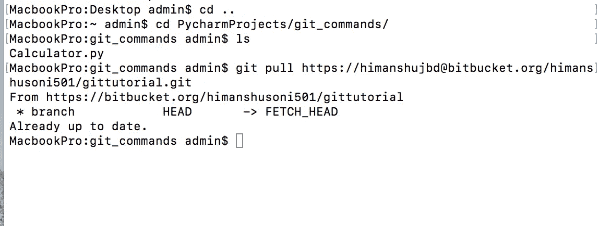

**git 复位:**该命令用于撤销对 **Git** repo 状态的本地更改。

**git diff:** 该命令显示尚未暂存的文件差异。

**git stash:** git stash 用于临时存储修改后的文件。

**git 复位:**该命令用于撤销对 **Git** repo 状态的本地更改。

这个命令从你的工作目录中删除这个文件，并且分阶段删除。

**git 标签:**该命令用于给指定的提交赋予标签。

**git merge:** 该命令将指定分支的历史合并到当前分支中。

**资源:**

*   Git 源代码

 [## git/git

### Git 源代码镜像——这是一个只发布的库，所有的拉请求都会被忽略。请跟随…

github.com](https://github.com/git/git) 

*   源代码树

 [## 用于 Mac 和 Windows 的免费 Git GUI

### 作为我们新的比特桶空间站管理员，你需要有条理。当你为你的空间站制作文件时…

www.sourcetreeapp.com](https://www.sourcetreeapp.com/) 

**总结**

*   CVCS 将其所有项目文件保存在一个地方。并且在进行项目时需要在线。
*   DVCS 工作在分布式模式，每个开发人员从远程服务器克隆项目，并在他们的本地机器上工作，所以他们不需要在线。
*   **推**、**拉**和**合并**命令允许我们上传、下载和合并我们的项目。

我希望你喜欢读这篇文章，你也可以访问我的 [**网站**](http://thehimanshuverma.com/) ，在那里我会定期发布文章。

[**订阅**](https://mailchi.mp/b08da935e5d9/himanshuverma) 我的邮件列表，直接在您的收件箱中提前获得我的文章，或者关注我自己在 Medium 上发表的文章[**The Code Monster**](https://medium.com/the-code-monster)以完善您的技术知识。

# 了解你的作者

希曼舒·维尔马毕业于印度勒克瑙的 APJ 阿卜杜勒·卡拉姆大学博士。他是 Android & IOS 开发人员、机器学习和数据科学学习者、金融顾问和博客作者。