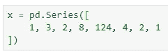
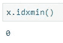
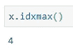
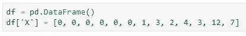
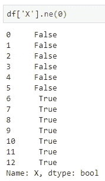
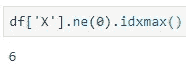
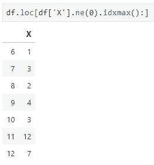
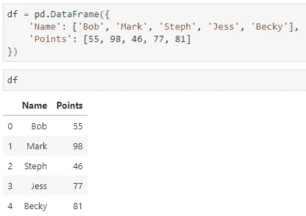
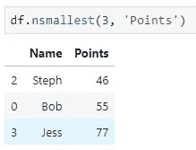
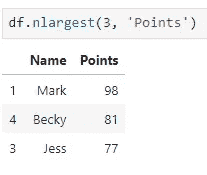

# 你不知道的熊猫的三大功能(大概)

> 原文：<https://towardsdatascience.com/top-3-pandas-functions-you-dont-know-about-probably-5ae9e1c964c8?source=collection_archive---------2----------------------->

我以前写过关于熊猫的文章，原因很明显——它是一个用于数据分析甚至数据可视化的惊人的库。前一篇文章介绍了一些您应该经常使用的函数，因为它们:

*   会让你的代码保持干净
*   不会让你重新发明轮子

Photo by [Tanner Boriack](https://unsplash.com/@tannerboriack?utm_source=medium&utm_medium=referral) on [Unsplash](https://unsplash.com?utm_source=medium&utm_medium=referral)

如果你错过了它，这里有一个链接，这样你就可以在有时间的时候保存它:

 [## 你应该更经常使用的 3 个熊猫功能

### 停止重新发明轮子。说真的。

towardsdatascience.com](/3-pandas-functions-you-should-be-using-more-often-696b41e8d7ca) 

然而，在今天的帖子中，我想把注意力转移到几个更有用的功能上，这些功能让我觉得自己在工作中完全是个白痴。你可能会问，这是为什么。嗯，我很懒，在我写代码之前我不喜欢谷歌，所以我甚至不知道这些功能的存在。

最后的结果至少可以说是令人沮丧的。我成功地实现了所需的逻辑，但代价是几个小时，一把新的白发，当然，还有许多不必要的代码。

为了避免同样的事情发生在你身上，请继续阅读。

# idxmin()和 idxmax()

是的，我知道我在过去已经报道过这些，但是它们是这篇文章的**本质**。你先不理解这几个就不会理解第二个有用的功能，那就言归正传吧。

简而言之，这些函数将**返回所需条目的 ID** ( *索引位置*)。假设我创作了以下**熊猫系列**:

并希望找到最小和最大项目的索引位置。当然，仅仅通过观察不难发现这一点，但是你绝不会(*我是说绝不会*)在你的项目上有这么少的数据点。

这意味着您需要利用 ***idxmin()*** 和 ***idxmax()*** 函数的能力，让我们看看如何实现:

请记住，这些函数将返回最小/最大值第一次出现的索引。

# ne()

这个对我来说是一个大发现。不久前，我在工作中处理一些时间序列数据，遇到了第一个 *n* 观测值为 0 的问题。

为了简单起见，想想你可能已经买了东西，但一段时间内没有消费掉。该物品在您手中，但由于您没有使用它，在给定日期的消费为 0。因为我只对你真正开始使用这该死的东西时的用法感兴趣，***【ne()***就是那个拯救了你的功能。

让我们考虑下面的场景。你有一个 **Pandas DataFrame** 对象，它的一些观察值在开始时为 0:

现在 ***ne()*** 要做的是，如果当前值不是您指定的值(*假设为 0* )，则返回 *True* ，否则返回 *False* :

这本身没多大用处。你还记得我说过你需要知道 idxmax()来理解这一点吗？ 好吧，我没有说谎，你可以从上面的代码链 ***idxmax()*** :

所以在索引位置 6，我们有第一个非零观测值。这又一次没有给你提供多少价值。好的一面是，我们可以使用该信息对**数据帧**进行子集化，以仅显示从项目第一次使用时开始的值:

当你处理时间序列数据的时候，这就派上用场了。

# nsmallest()和 nlargest()

我猜你可以从名字中推断出这两个函数是关于什么的。假设我创建了下面的 **DataFrame** 对象:

为了好玩，让我们假设这 5 个是在编写测试后观察到的分数。您有兴趣找出哪 3 名学生表现最差:

或者哪三个学生表现最好:

这两个函数是像***sort _ values()***这样的函数的绝佳替代品。

# 在你走之前

随着时间的推移，我相信我会遇到更多值得在文章中提及的节省时间的功能，所以你肯定会看到更多这样的帖子。同时，请在评论区分享你最喜欢的熊猫功能。

感谢阅读。保重。

喜欢这篇文章吗？成为 [*中等会员*](https://medium.com/@radecicdario/membership) *继续无限制学习。如果你使用下面的链接，我会收到你的一部分会员费，不需要你额外付费。*

 [## 通过我的推荐链接加入 Medium-Dario rade ci

### 作为一个媒体会员，你的会员费的一部分会给你阅读的作家，你可以完全接触到每一个故事…

medium.com](https://medium.com/@radecicdario/membership)