# 你不知道(可能)的 4 大 Numpy 函数

> 原文：<https://towardsdatascience.com/top-4-numpy-functions-you-dont-know-about-probably-28fcd5d7174f?source=collection_archive---------6----------------------->

在今天的文章中，我想讨论几个我日常用于数据分析的基本 Numpy 函数。无论如何，这不是一个全面的列表，但它足以让你开始，我相信它们会很适合你。

Photo by [Nadine Shaabana](https://unsplash.com/@nadineshaabana?utm_source=medium&utm_medium=referral) on [Unsplash](https://unsplash.com?utm_source=medium&utm_medium=referral)

我甚至不知道自己思考了多少次*“我需要实现的东西并不那么简单，不可能存在预建的函数”。我常常是错的。Pure Numpy 是如此强大，我将冒险让你不知道它所提供的一切。*

我以前写过一些很棒但不太为人所知的**熊猫**的功能，它们将为你节省大量时间，所以如果你每天都在使用熊猫，一定要看看这些功能:

 [## 你不知道的熊猫的三大功能(大概)

### 为我节省了大量时间和挫折的功能

towardsdatascience.com](/top-3-pandas-functions-you-dont-know-about-probably-5ae9e1c964c8) 

所以，事不宜迟，让我们开始吧。您需要的唯一导入是 Numpy:

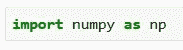

# 哪里()

***where()*** 函数将从数组中返回满足特定条件的元素。下面我们用一个例子来探讨一下。

我将声明某种等级的数组(*实际上是任意的*):

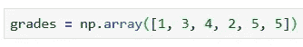

您现在可以使用 ***where()*** 来查找所有大于 3 的成绩:

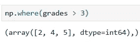

注意它如何返回**索引位置**。

派对不止于此，朋友，你可以提供两个额外的参数:

*   第一个将替换满足给定条件的值
*   第二个当然会替换那些不满足条件的

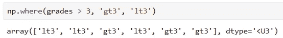

因为我想保持文章的简洁，我认为这将会给你足够的时间继续自己的探索。

# argmin()，argmax()，argsort()

好吧，这些花哨的名字是怎么回事？

这里没有什么特别的东西，但是如果你不想自己实现这个逻辑的话，这三个函数会非常适合你。

***argmin()*** 函数将返回最小值的索引。在我们之前使用的同一个数组上，它将返回最小值的索引位置:

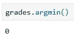

您猜对了， ***argmax()*** 会执行相反的操作—返回最大值的索引:

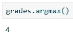

另一个漂亮的函数是 ***argsort()*** ，它将返回一个排序数组的索引。这在很多情况下都会派上用场:

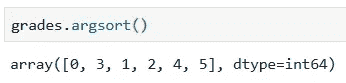

# 交叉 1d()

***intersect 1d()***函数将做的是，它将返回两个数组的交集，即两个数组中的公共项。与前面的函数不同，它不会返回索引位置，而是返回实际值。

首先，让我们声明两个有一些共同元素的数组:

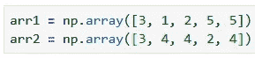

现在，您可以使用上面提到的函数来查找共有元素:

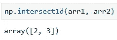

# allclose()

最后，但绝不是最不重要的，是 ***allclose()*** 函数。如果两个数组中的项在容差范围内相等，它将返回 True。它将为您提供一种检查两个数组是否相似的好方法，在某些情况下，手动实现这两个数组是很痛苦的。

首先，我将声明两个列表，并确保各个项目的差异在任何地方都不大于 0.2:

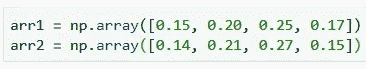

如果我现在调用公差为 0.1 的 ***allclose()*** 函数，它应该返回 False:

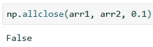

但是如果我决定将阈值改为 0.2，它应该返回 True:

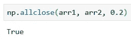

# 在你走之前

很多次，我都有(*有时仍然*)重新发明轮子的罪恶感。人们很容易认为你的问题是独一无二的，没有人想到要创造一个函数来解决它。虽然在某些情况下这可能是真的，但更多的时候，当你为过去几个小时一直手动实现的东西找到一个预制函数时，你会觉得自己像个十足的傻瓜。

确保你意识到你正在使用的图书馆的力量，它们如此受欢迎是有原因的。

感谢阅读。保重。