# 广泛用于数据可视化的五大 BI 工具

> 原文：<https://towardsdatascience.com/top-5-bi-tools-that-you-must-use-for-data-visualization-7ccc2a852bd3?source=collection_archive---------5----------------------->

**商业智能(BI)——**这个话题在商业领域已经讨论了很长时间。几乎所有类型的企业都相信好的商务智能工具的潜力，并使用它们来改善他们的业务。随着商业智能现象的兴起，先进的商业智能工具和技术被大量引入。这使得市场上为客户提供了许多潜在高效的 BI 工具。

今天，我将分享商业智能领域顶级玩家的详细信息，这意味着用于数据可视化的顶级 BI 工具。让我们从数据可视化的介绍开始讨论。

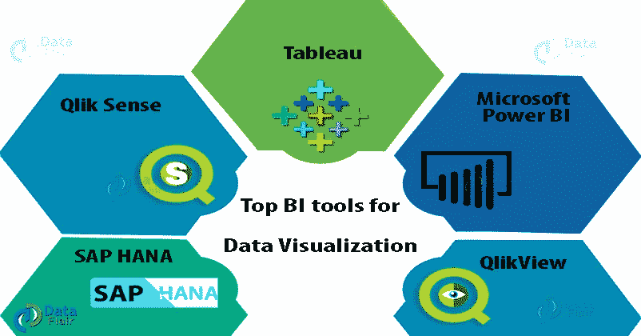

## 什么是数据可视化？

**术语商业智能是指用于收集、整合、可视化和分析原始数据的工具和技术的统称。*在当今时代，随着自由流动数据量的不断增加，高效的 BI 工具对于充分利用隐藏在原始和未处理数据中的知识至关重要。*

***数据可视化**在整个商业智能动态中扮演着至关重要的角色。简单来说，*数据可视化是给定数据集的图形化表示*。基于文本的数据以图表、图形、表格、信息图、地图等形式可视化。在可视化的帮助下，可以发现数据中的新见解和隐藏模式。*

*数据可视化的目的是检测不同数据集之间的模式、趋势和相关性，否则无法从简单(非图形)形式的数据中进行研究。它帮助用户更好地了解市场现状，评估客户需求。此外，企业可以通过新的战略和技术来发展，以增强和促进他们的业务。这正是所有数据科学软件公司专注于使其 BI 工具在数据可视化功能方面表现最佳的原因，因为它有助于揭示巨大的原始数据库中隐藏的信息。*

## *用于数据可视化的顶级 BI 工具*

*让我们从讨论 2019 年数据可视化的顶级 BI 工具开始。我们将讨论 BI 领域的主要参与者，如*微软 Power BI* 、 *Tableau* 、 *QlikView* 和 *Qlik Sense* 。这些 BI 工具被 *Gartner 的《2019 年分析和商业智能平台魔力象限》*( Gartner 发布的调查系列)列在不同的类别中。*

*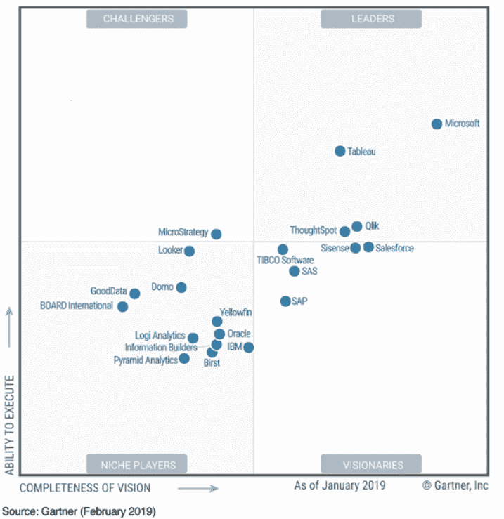*

1.  ***画面***

*Tableau 是一个新时代的数据分析和商业智能平台，为用户提供灵活性和易用性。Tableau 的核心优势被认为是其交互式仪表盘、快速响应和实时数据分析功能。它提供引人注目的图形(可视化)来形象地表示您的数据集。从根本上说，Tableau 提供了数据提取、处理、表示和与他人共享最终报告/仪表板/工作表的所有必要功能。*

*Tableau 受欢迎的主要原因****是其易于拖放的功能，可以创建可视化效果。它比其他 BI 工具更快，而且非常直观，是一款完美的自助式 BI 工具。它还提供了与大量数据和大数据源的连接，如 Oracle、Teradata、SAP HANA、MongoDB、Excel、文本文件、JSON、Google Cloud、SQL、Hadoop、Amazon Redshift 等。*****

*****连接到这些数据源不需要购买连接器许可证。此外，Tableau 是为所有类型的用户设计的，不需要任何特定的技能或知识。企业中所有类型的用户都可以轻松执行所有数据分析和可视化功能。*****

********推荐你去探索这个*** [***Tableau 教程系列***](https://data-flair.training/blogs/tableau-tutorials-home/) ***获取 Tableau********

*******画面特征*******

*   *****询问数据*****
*   *****Tableau 准备指挥*****
*   *****适用于 iOS 和 Android 的 Tableau mobile*****
*   *****连接器和连接*****
*   *****数据共享*****
*   *****安装和部署*****
*   *****设计视图和可视化*****

*****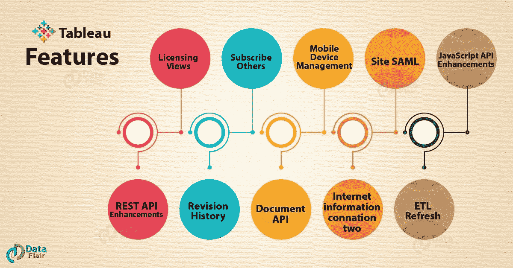*****

*****下面给出了一个[**Tableau dashboard**](https://data-flair.training/blogs/tableau-dashboard/)的一些**数据可视化示例。*******

*****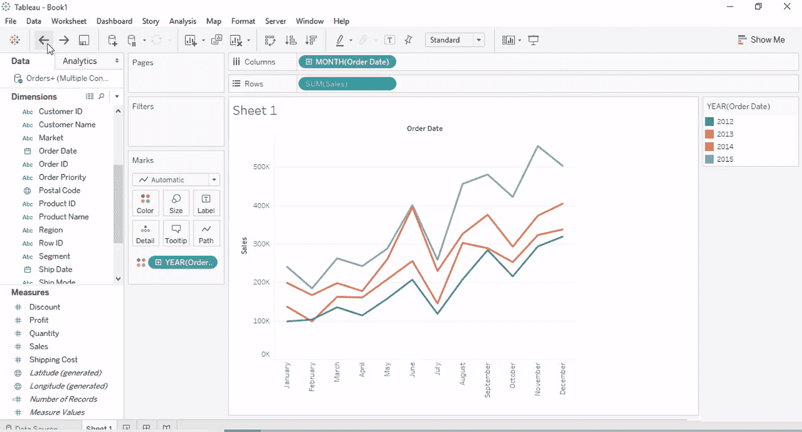**********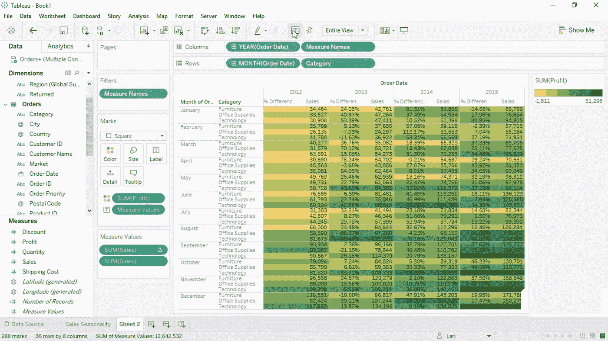*****

*******2。微软 Power BI*******

*****微软 Power BI 是一个强大的数据可视化工具，非常受欢迎。这是一个基于云的软件，有两个版本；*动力匕桌面*和*动力匕移动*。微软 Power BI 以其易于使用的数据准备和数据可视化功能而闻名。Power BI 附带了许多可视化功能，如 [***自定义可视化***](https://data-flair.training/blogs/power-bi-custom-visualization/) ，使用自然语言创建可视化，拥有 Cortana 个人助理等。*****

*****Microsoft Power BI 提供与各种数据源的连接，如 Oracle、IBM、SQL Server、Salesforce、Google analytics、Azure DevOps、Excel、文本文件、JSON、Zendesk、Mailchimp 等。除此之外，借助使用 web 服务的直接连接，与大数据源的集成也很容易。*****

*****[***在短短 4 周内学会关于力量的一切 BI***](https://data-flair.training/blogs/power-bi-tutorials-home/)*****

******看看一些示例**微软 Power BI 应用**使用不同种类的可视化。******

******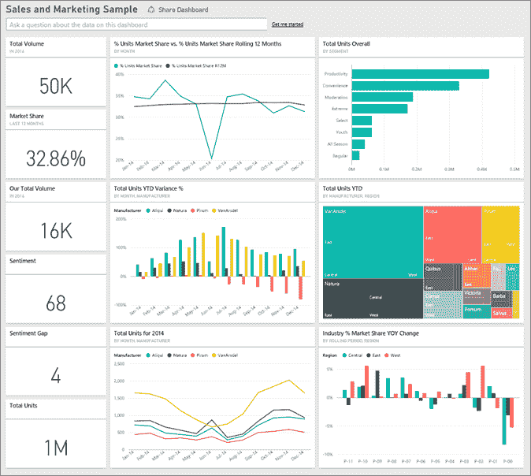************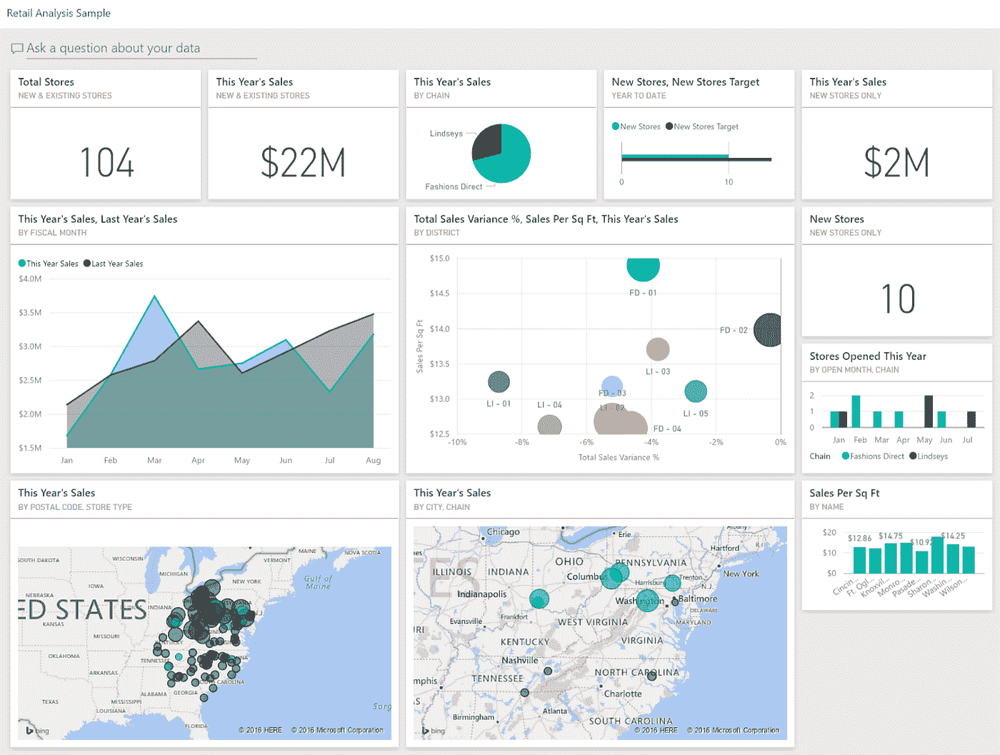******

********微软 Power BI 的特性********

*   ******访问内部和基于云的数据源******
*   ******直观和图形丰富的可视化******
*   ******对复杂情况的快速响应******
*   ******移动兼容性******
*   ******轻松洞察(仪表板、报告等。)组织内的共享******
*   ******将数据报告和仪表板发布到 web******
*   ******帮助和反馈按钮******
*   ******模式指示器******
*   ******Power BI Desktop 提供信息丰富且直观的报告******

*********你必须详细探究这些*** [***异能匕的特性***](https://data-flair.training/blogs/power-bi-features/)******

******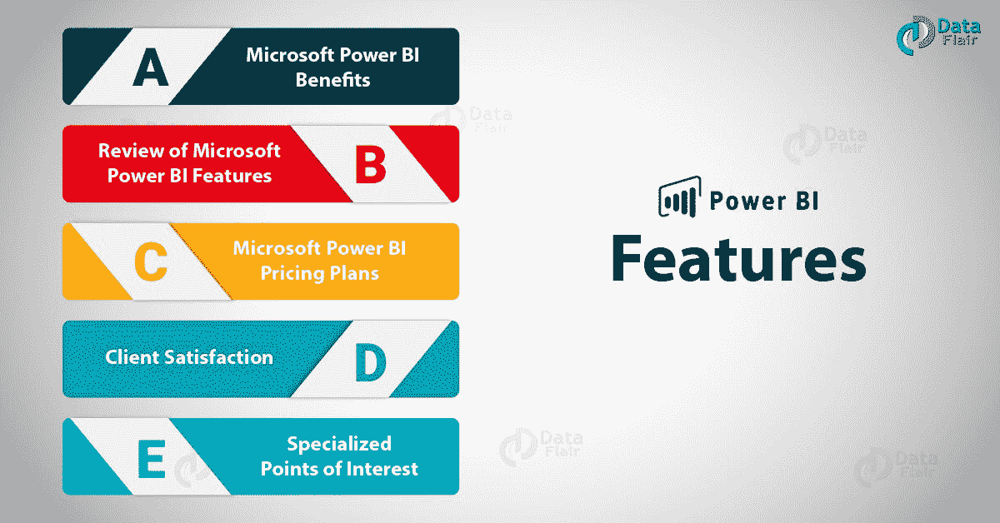******

******3. **QlikView********

******[***根据 Gartner 2019 年魔力象限报告，QlikView 是领先的 BI 工具***](https://data-flair.training/blogs/qlikview-tutorial/) 之一。QlikView 提供内存存储功能，可快速收集、整合和处理数据。报告使用可视化工具生成，数据之间的关系由 QlikView 软件自动导出。换句话说，QlikView 是一个数据发现工具，有助于创建用于数据分析的动态应用程序。******

******QlikView 主要是一种数据发现工具，因此它具有一些独特的数据可视化功能。数据发现是用户驱动的对数据集中的模式和趋势的搜索。它通过提供图形、表格、地图等视觉辅助帮助用户理解和看到这些模式。QlikView 的独特之处还在于其灵活性、内存功能和协作辅助功能。******

******看看一些使用不同可视化方式的 QlikView 应用示例。******

******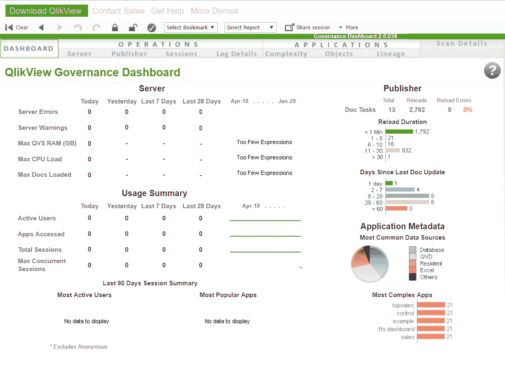************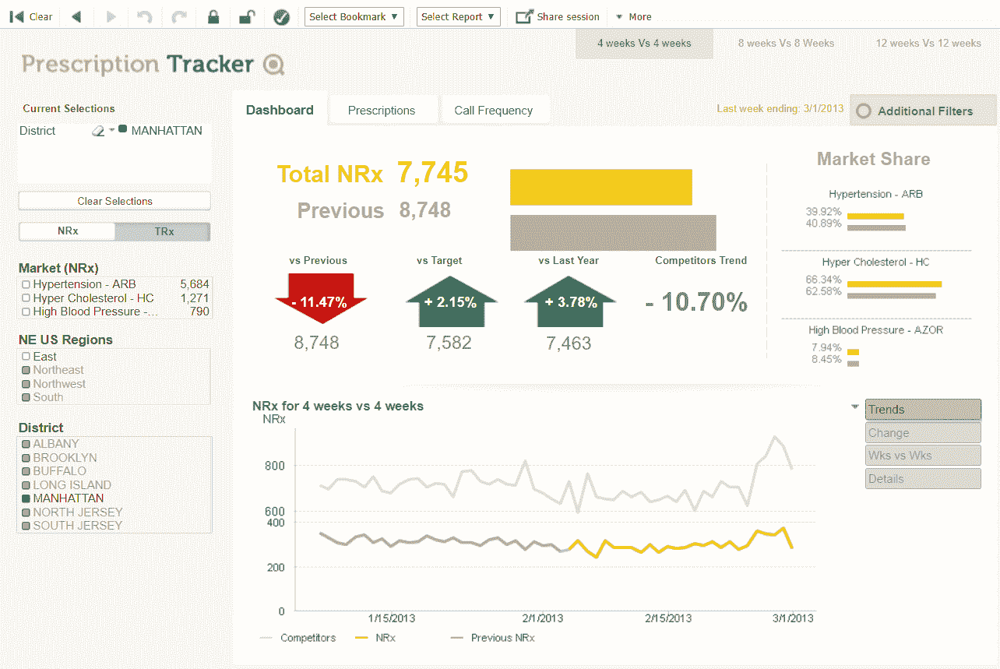******

********QlikView 的功能********

*   ******独特的数据发现和全局搜索******
*   ******交互式可视化******
*   ******合作******
*   ******对数据的绝对控制******
*   ******安全的工作环境******
*   ******灵活性和集成******
*   ******一致的报告******

********升级技能的最佳时机—** [**向专家学习 QlikView**](https://data-flair.training/blogs/qlikview-tutorials-home/)******

********4。Qlik 感应********

******Qlik Sense 也是一款流行的数据分析和可视化软件。它的核心是一个相关的 QIX 引擎。该引擎使用户能够链接和关联来自不同来源的数据来执行分析。Qlik Sense 作为一个数据分析平台，面向从非技术用户到技术用户的广大用户。******

******Qlik Sense 更侧重于数据可视化，因为它具有增强的图形。但是，在 QlikView 中，您可以通过脚本以多种技术方式操作数据。如果您使用 Qlik Sense 的动机是以尽可能好的图形来可视化和分析数据，那么您做出了正确的选择。******

******Qlik Sense 为用户提供了很大的灵活性，因为他们可以通过自助式可视化和分析执行完全独立的操作。此外，它们可以由 Qlik Sense 的认知引擎进行自动机器引导分析。Qlik Sense 使用关联模型，用户可以自由探索大量复杂的数据，并从中获得直观的见解。从 Qlik 的角度来看，集成来自多个来源的大型数据文件是可能的。客户端可以在中央集线器上共享数据应用程序和报告。除此之外，他们还可以共享安全的数据模型，导出数据故事等。来提升他们的业务。******

******看看一些使用不同类型可视化的 Qlik Sense 应用程序示例。******

******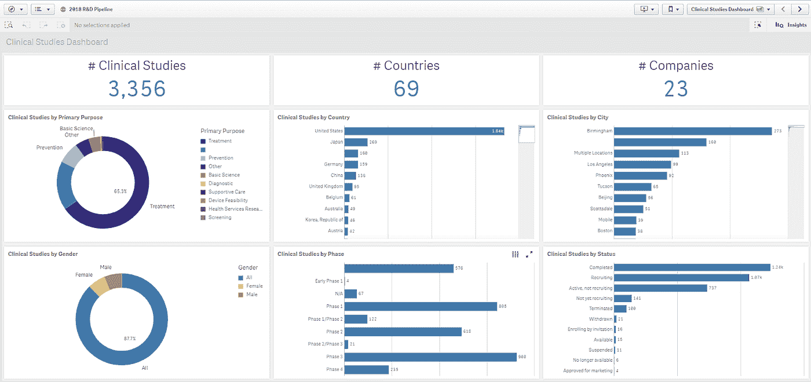************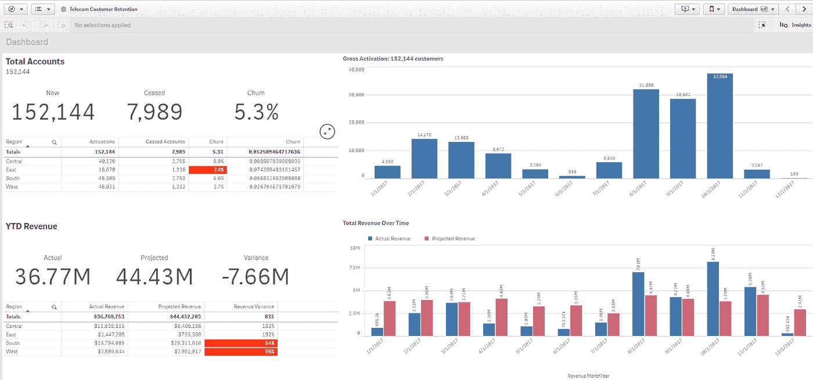******

******[**学习 Qlik Sense**](https://data-flair.training/blogs/qlik-sense-tutorials-home/) **成为商业智能大师********

********Qlik Sense 的特性********

*   ******联想模型******
*   ******智能可视化和分析******
*   ******自助创建******
*   ******集中式共享和协作******
*   ******数据叙述和报告******
*   ******应用移动性******
*   ******数据准备和整合******
*   ******QIX 引擎******
*   ******企业治理和可扩展性******

******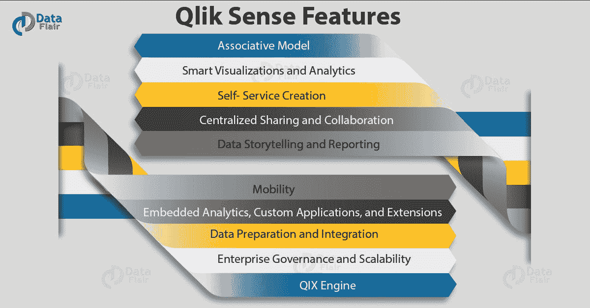******

********5。SAP Lumira********

******SAP Lumira 也在十大商务智能工具中占有一席之地。根据 *Gartner 的 2019 年分析和商业智能平台魔力象限，* SAP Lumira 被归类为具有巨大潜力的前瞻性 BI 工具。SAP Lumira 是一款自助式数据可视化和分析工具，以其易用和直观的应用程序而闻名。SAP Lumira 提供丰富的交互式可视化，如表格、图形、图表、地图、信息图等。******

******根据使用目的，SAP Lumira 有两个版本；SAP Lumira 的*发现*版和*设计师*版。在 Discovery edition 中，您可以创建自助式数据可视化，并将其直接发布到 SAP BusinessObjects BI 工具。而在 Designer edition 中，您可以使用这些自助式可视化来创建详细的分析应用程序。******

******SAP Lumira 是一个用户友好的工具，有一个主屏幕，所有数据源都可以在这里找到。输入控件，以便用户可以自由地处理应用程序。应用程序屏幕提供了使用导入的数据创建可视化和应用程序的单一平台。用户可以访问实时数据，如治理数据、宇宙数据、云数据、元数据、来自大数据源的数据等。******

******看看一些 SAP Lumira 应用程序的例子，它们使用了不同的可视化技术。******

******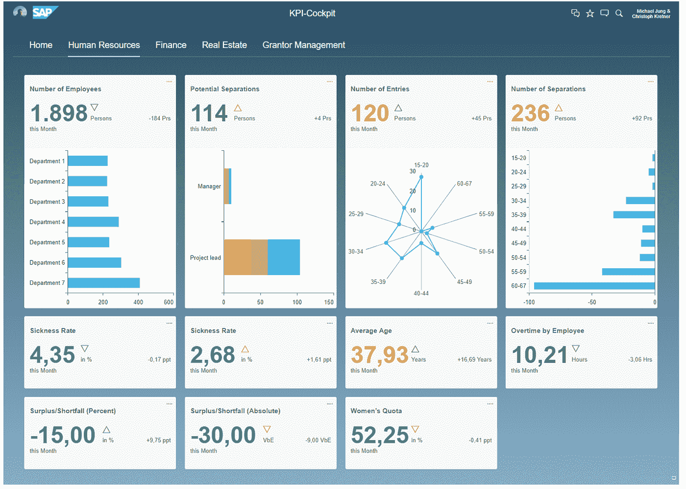************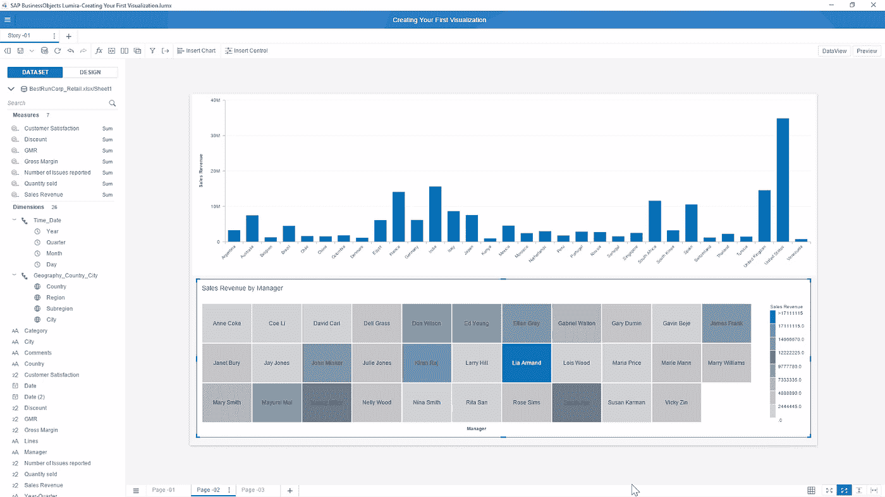************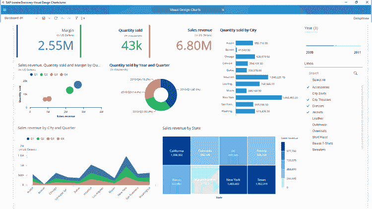******

********将 SAP Lumira 连接到 SAP HANA********

******由于 [**SAP HANA 是一种内存数据库技术**](https://data-flair.training/blogs/sap-hana-tutorial/) ，来自它的数据被带入 SAP Lumira，供用户进行数据可视化和分析。SAP Lumira 使用 JDBC 连接(即 OLAP 连接)直接连接到 SAP HANA。SAP HANA 和 SAP Lumira 之间的通信使用的语言是 SQL。******

******您可以将 SAP Lumira 连接到 SAP HANA，以使用存储在 HANA 数据库中的数据。要连接到 SAP HANA 数据库，请转到 SAP Lumira 的*文件*菜单，通过建立连接来添加新数据集。将 SAP Lumira 连接到 SAP HANA 的完整步骤在单独的教程“*连接 SAP Lumira 和 SAP HANA* ”中给出。请参考。******

******一旦您与 SAP HANA 建立了连接并从中导入数据集，您就可以在 Lumira 中创建许多可视化效果。您可以从一系列可视化图形中进行选择，如饼图、条形图、树形图、环形图、热图等。******

********SAP Lumira 的特性********

*   ******使用低级 JavaScript 编程轻松开发数据可视化应用程序。******
*   ******基于模板的数据可视化仪表板指导设计。******
*   ******通过网络和移动平台访问 Lumira 应用程序。******
*   ******嵌入式可视化和可定制的扩展。******
*   ******集成来自多个数据源的数据。******
*   ******集成 SAP BusinessObjects BI 分析工具。******
*   ******创建临时报告和仪表板******
*   ******讲故事******

******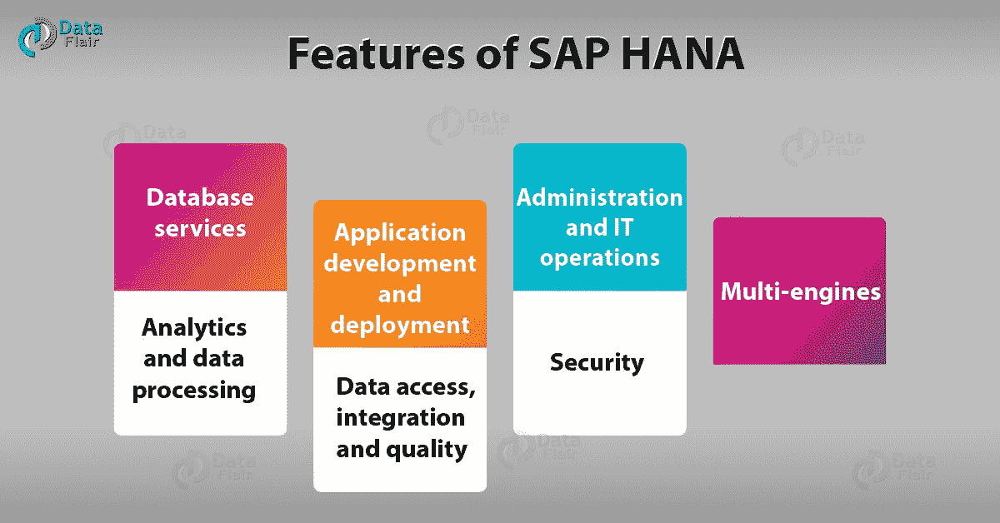******

******虽然，Power BI，Tableau，Qlik Sense，QlikView 是截至 2019 年领先的数据分析和可视化 BI 工具。******

******BI 领域还有其他工具，如 *ThoughtSpot* 、 *Sisense* 、 *Salesforce* 、 *Looker* 、 *Domo* 、 *SAP (SAP Lumira)* 等。证明了它们作为数据可视化的完美 BI 工具的潜力。在不久的将来，市场上将会出现数十种新的商务智能工具。这将为客户提供具有高级 BI 功能的广泛选项。******

******希望你喜欢阅读这篇文章。******