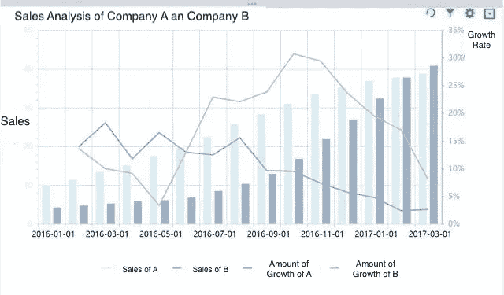
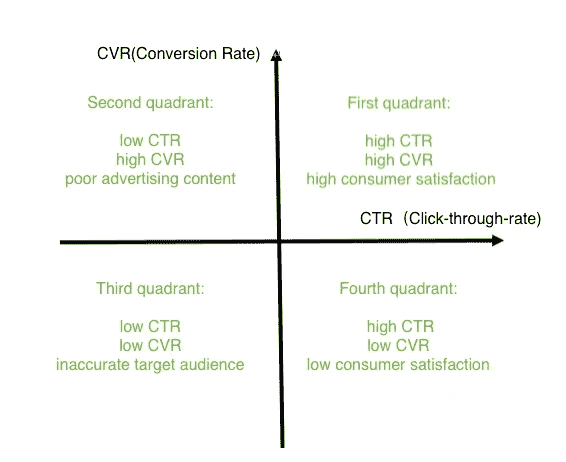
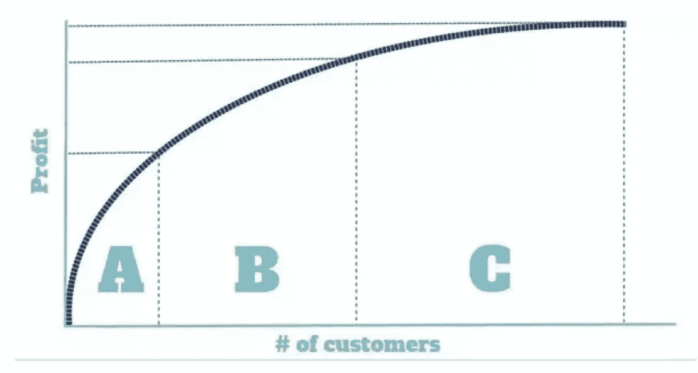
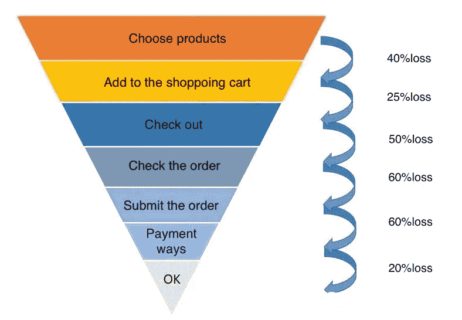
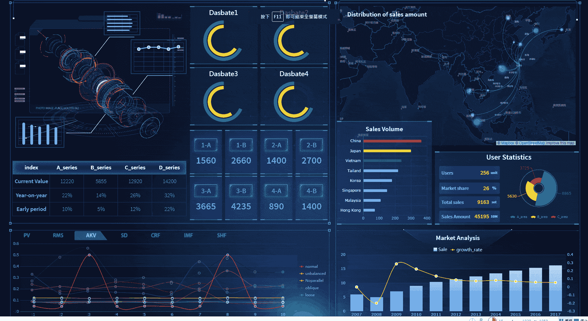
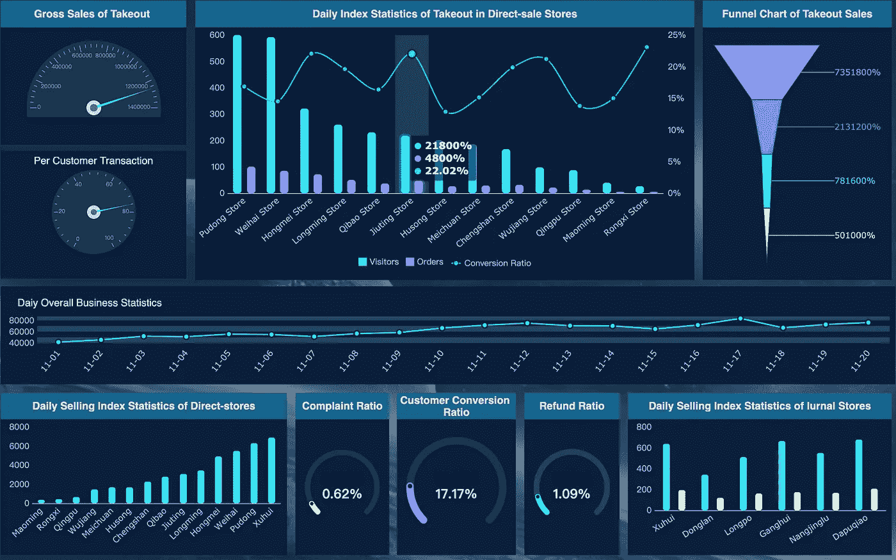
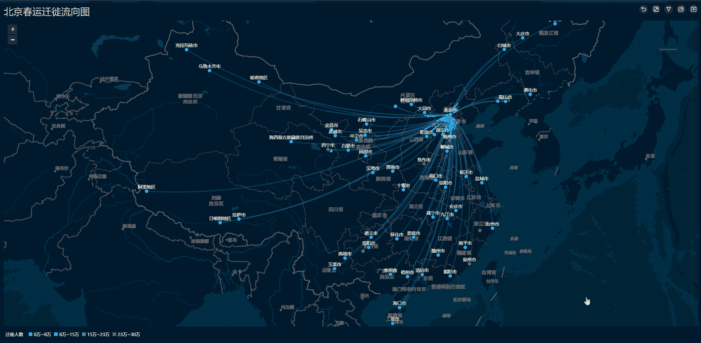

# 你需要知道的五大数据分析方法

> 原文：<https://towardsdatascience.com/top-5-data-analysis-methods-you-need-to-know-e83f95cae355?source=collection_archive---------13----------------------->

在[数据分析](http://www.finereport.com/en/data-analysis/6-key-skills-that-data-analysts-need-to-master.html?utm_source=medium&utm_medium=media&utm_campaign=blog&utm_term=Top%205%20Data%20Analysis%20Methods%20You%20Need%20to%C2%A0Know)中，数据分析思维是基于框架的指南。在分析问题的时候，我们需要很多技巧和工具。就像在中学一样，你可以用公式法、完成平方、平方根的提取或因式分解法来解二次方程。数据分析中也有一些技术，我们可以在一些常见的分析场景中使用。并且它们可以在将来构建数据分析模型时有所帮助。

在本文中，我们将分享五种常用的数据分析方法:**公式法、比较法、象限法、80/20 法则、漏斗分析法。我们经常组合使用它们。**

注意:这些方法主要偏向于思维层面，是基于业务问题对数据的探索性分析。它们不同于专业统计学中的数据处理方法。

# 1.公式法

所谓公式法，就是用公式对某一指标的影响因素进行分解。

例:用公式法分析某产品销量低的原因。

*   产品销售额=销售量*单价
*   销量=渠道 A 销量+渠道 B 销量+渠道 C 销量+ …
*   渠道销量=用户数*订单率
*   用户数量=曝光率*点击率

**第一步**:寻找产品销售的影响因素。是销量太低还是价格设定不合理？

**第二步**:找到影响销量的因素。分析每个渠道的销量。和之前的销售对比一下，找出异常的。

**第三步**:分析影响渠道销售的因素。是用户数低还是订单率低？如果订单率低，就要看渠道的广告内容是否与产品的实际受众相匹配。

**第四步**:分析影响点击的因素。是曝光度不够还是点击率太低？如果点击率低，你需要优化活动。而曝光度与渠道有关。

为此，公式法是对问题的层次分析。它将影响因素逐级分解。

# 2.比较法

比较法是对两组或多组数据进行比较，是数据分析中最常用的方法。

我们知道孤立的数据是没有意义的，我们通过比较看到差异。人们通过比较一些直接描述事物的变量，如长度、数量、高度、宽度等，得到比率、增长率、效率等指标。

比较法可以发现数据变化的规律。下图是 A 公司和 B 公司的销售对比，虽然 A 公司的销售普遍有所增长并且高于 B 公司，但是 B 公司的增速高于 A 公司，即使 B 公司后期增速下滑，最终销售也是迎头赶上。

# 3.象限法

通过划分两个或多个维度，我们用坐标来表示数值，这就是象限法。象限法是基于战略驱动的思想。我们经常在产品分析、市场分析、客户管理和商品管理中使用它。

例如，下图是广告点击的四象限分布。

如果一个广告获得高转化率( [CVR](https://en.wikipedia.org/wiki/Conversion_marketing#Conversion_rate) )和高点击率( [CTR](https://en.wikipedia.org/wiki/Click-through_rate) )，说明它的目标受众是相对精准的。

如果点击率高，CVR 低，这意味着大多数点击的人是被广告本身吸引的。低 CVR 表明广告的目标人群与产品的实际受众不匹配。

高 CVR 和低点击率表明广告的受众和产品的实际受众更加一致。问题是广告的内容需要优化，才能吸引更多人点击。

我们可以放弃低 CVR 和低点击率的广告。

用象限法分析具有相同特征的事件，可以找到问题的共同原因。在上面的广告案例中，观察第一象限的事件，可以总结出有效的推广渠道和策略。第三和第四象限可以排除一些无效的推广渠道。同时可以针对不同象限建立优化策略。

# 4.八二十分法则

80/20 法则也被称为 [**帕累托法则**](https://en.wikipedia.org/wiki/Pareto_principle) **。它是以其创始人，意大利经济学家维尔弗雷多·帕累托的名字命名的。他注意到，当时意大利 80%的财富掌握在 20%的人口手中。在数据分析中，我们可以理解为 20%的数据产生 80%的效果。我们需要挖掘这 20%的数据。**

它通常与排名相关，前 20%被视为有效数据。80/20 法则分析关键部分，适用于任何行业。找到重点，发现它们的特点，然后思考如何让剩下的 80%转化到这 20%来提高效果。

通常，它将用于产品分类，以衡量和建立 ABC 模型。比如一个零售企业有 500 个 SKU(库存单位)，那么哪些 SKU 是重要的？这就是商业运作中分清主次的问题。

通常的做法是使用产品的 SKU 作为一个维度，并使用相应的销售额作为一个基本指标来对这些销售指标进行排名，并计算每个 SKU 的累计销售额占总销售额的百分比。比如我们可以把他们分为 3 类:A 类(< 70%)，B 类(70%-90%)，C 类(90%-100%)。可以根据自己的实际情况调整百分比。

ABC 分析模型不仅可以用来划分产品和销售，还可以用来划分客户和利润。比如哪些客户为公司贡献了 80%的利润？如果这部分客户占 20%，那么在资源有限的情况下，你知道要重点维护这 20%的客户。

# 5.漏斗分析

漏斗分析是一个漏斗图，有点像倒金字塔。这是一种简化的思维方式。我们经常在分析变化和某些过程时使用它，比如新用户的开发、购物转化率等等。

上图是一个经典的营销漏斗，展示了从获取用户到最终转化为购买的全过程。漏斗模型将整个购买过程分成几个步骤。然后它用转化率来衡量每一步的表现，最后通过异常的数据指标找到有问题的那一步。这样就可以优化步骤，提高整体购买的转化率。

漏斗模型的核心概念可以分为分解和量化。比如分析电商的转化，我们要做的就是监测每个层级的用户转化，找到每个层级的可优化点。对于没有按照流程走的用户，我们专门构建他们的转化模型，缩短路径，提升用户体验。但是，单一的漏斗分析是没有用的。我们应该把它与其他方法结合起来，如与历史资料的比较。

# 数据分析工具

使用数据分析方法的好处是，它提供了一个思维框架，帮助你建立对事物和问题的观点。既然有了思维框架，我们还需要[有效的工具](/top-6-data-analytics-tools-in-2019-4df815ebf82c)来实现真正的数据分析，像 [Tableau](https://www.tableau.com/) 和 [Python](https://www.python.org/) 。这里推荐一款免费的数据分析工具 [FineReport](http://www.finereport.com/en/?utm_source=medium&utm_medium=media&utm_campaign=blog&utm_term=Top%205%20Data%20Analysis%20Methods%20You%20Need%20to%C2%A0Know) ，供大家练习。这是一个集成了数据显示(报告)和数据输入(填充)的 BI 报告&仪表板软件。成功入选《Gartner 全球市场指南》，成为中国唯一入选的厂商和产品，与微软、SAP、Oracle 等国际巨头一同上市。

[FineReport](http://www.finereport.com/en/?utm_source=medium&utm_medium=media&utm_campaign=blog&utm_term=Top%205%20Data%20Analysis%20Methods%20You%20Need%20to%C2%A0Know) 允许您通过简单的拖放操作创建复杂的报告。接下来，我将向您展示一些使用 FineReport 的数据分析场景。

## 销售分析

## 实时订单监控

## 营销分析

## 人口流动分析

如果你对 FineReport 感兴趣，可以去[官网](http://www.finereport.com/en/?utm_source=medium&utm_medium=media&utm_campaign=blog&utm_term=Top%205%20Data%20Analysis%20Methods%20You%20Need%20to%C2%A0Know)免费下载。还有针对 FineReport 初学者的帮助文档。

# 您可能也会对…感兴趣

[*数据分析师需要掌握的 6 项关键技能*](/6-key-skills-that-data-analysts-need-to-master-df1d82257b9)

[*2019 年你不能错过的 9 个数据可视化工具*](/9-data-visualization-tools-that-you-cannot-miss-in-2019-3ff23222a927)

[*制作销售仪表盘的分步指南*](/a-step-by-step-guide-to-making-sales-dashboards-34c999cfc28b)

[*新手如何设计酷炫的数据可视化？*](/how-can-beginners-design-cool-data-visualizations-d413ee288671)

*原载于 2019 年 4 月 25 日*[*【http://www.finereport.com】*](http://www.finereport.com/en/data-analysis/top-5-methods-of-thinking-in-data-analysis.html)*。*