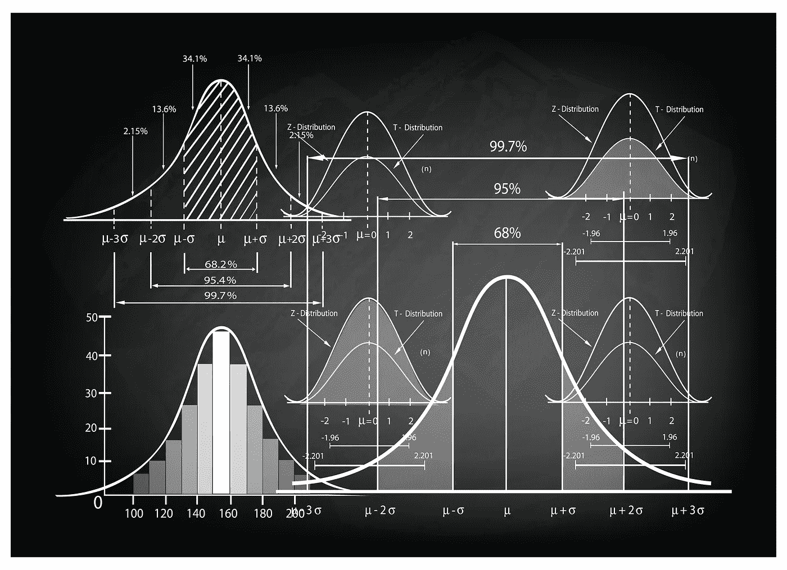
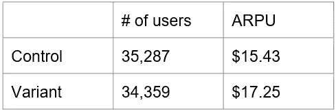
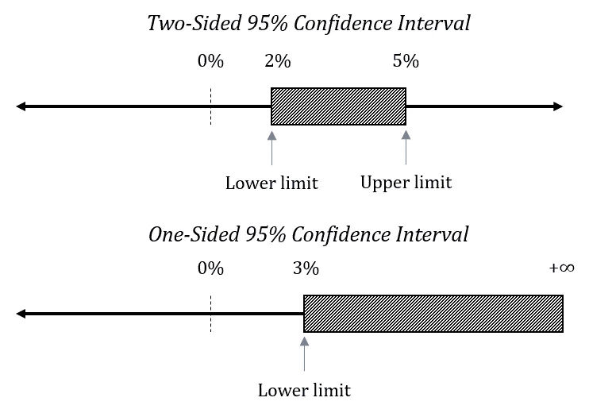
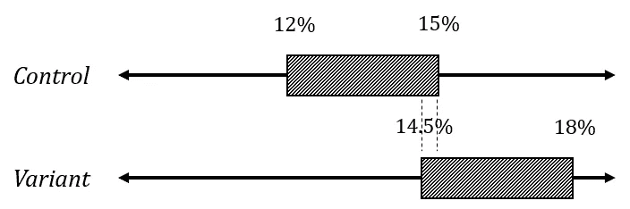
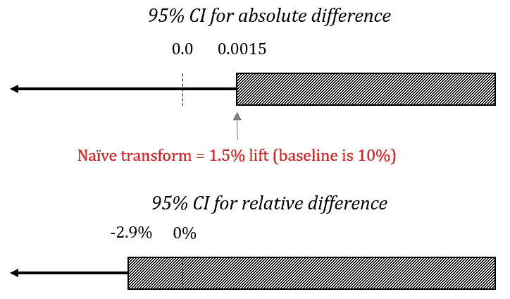

# A/B 测试中的五大统计错误

> 原文：<https://towardsdatascience.com/top-5-mistakes-with-statistics-in-a-b-testing-9b121ea1827c?source=collection_archive---------5----------------------->

A/B 测试(也称为在线控制实验)被广泛用于评估网站和移动应用程序的拟议更改的影响，并作为管理与此类更改相关的风险的工具。许多软件供应商在该领域与转换率优化人员、登录页面优化专家、增长专家、产品经理和数据分析师使用的定制测试平台竞争。

然而，尽管该领域相对成熟，但使用 A/B 测试统计数据仍存在一些普遍的错误。它们的影响从降低测试的效率从而增加成本，到使 A/B 测试的结果变得无用(或者更糟——完全误导)。我将讨论 5 个最常遇到的高影响问题，讨论为什么我认为它们很普遍，并提供一些解决它们的方法。

# 错误 1:没有测试你的 A/B 测试设置

如今，测试是发布一个成功的网站或应用程序的最小变化的先决条件，然而，通常 A/B 测试设置本身避免了这种审查。

*不应该！*

它是一个软件(准确地说，是几个相互关联的部分)，和其他软件一样容易出现问题。如果它不可靠或不按预期工作，出于某种原因，它的输出将不可信。如果 A/B 测试平台不能按照规范工作，那么 A/B 测试的核心功能——作为防止破坏业务的用户体验的最后一道防线——将会部分或完全受损。

**简而言之，问题**在于不适当的随机化、测试组之间的用户分配或跟踪会使任何 A/B 测试结果不可靠。这是因为用于评估数据的统计模型需要满足一定的假设才能工作。常见的假设是观测值的独立性、同质性和某些分布假设(如正态性)。

**危害**是用错误指定的模型进行 A/B 测试的结果将是不准确的或误导的。基于这种测试做出的决策不仅会损害业务结果，而且还会在它们周围获得一种确定性的氛围(“我们已经测试过了，这没问题”)，这样以后通过观察分析发现的任何问题都不太可能归因于测试的变化。

**这种错误盛行的原因**是几乎没有任何商业工具提供对违反统计假设的内置检测。除了谷歌、微软和亚马逊等公司使用的一些系统之外，我在实践中看到的许多定制系统都是如此。另一个原因可能是，统计工具的输出常常被认为是不容置疑的，这是因为对检验统计假设的必要性缺乏认识。

## 一些解决方案包括:

**1。)**测试发射前严格的**质量保证**流程。它可以帮助检测各种跟踪问题、可能影响结果的技术问题(例如，仅仅由于测试交付过程，变体的交付比控制慢 500 毫秒)，以及简单的中断测试体验。

**2。)**后数据，可以执行**拟合优度测试**来检查实际分配比率是否符合指定的分配比率。例如，我们可以使用 50/50 目标分配计划 A/B 测试的以下结果:

结果——变异体优于对照组，p 值:0.02——可信吗？为了找到答案，我们可以进行卡方拟合优度测试。此类测试的低 p 值表明预期分配和实际分配不匹配。这就是有人所说的*样本比例不匹配* ( [克鲁克等人 2009 (pdf)](https://exp-platform.com/Documents/2009-ExPpitfalls.pdf) ，[德米特列夫等人 2017 (pdf)](https://exp-platform.com/Documents/2017-08%20KDDMetricInterpretationPitfalls.pdf) )

这个特定测试的结果明确指出了一个问题([计算](https://www.gigacalculator.com/calculators/chi-square-calculator.php?test=goodnessoffit&data=35287+0.5%0D%0A34359+0.5)):

如此小的 p 值意味着它极不可能观察到我们实际得到的分配。这并没有告诉我们到底是什么问题。这种样本比率不匹配可能是由于不适当的随机化、分配程序的问题、跟踪问题或这些问题的组合造成的。需要进一步的调查来确定罪魁祸首，但至少我们知道存在问题，并且结果不可信。

**3。)**可执行常规 **A/A 测试**以确保标称和实际错误率(尤其是 I 型错误率)匹配。**可以对 A/A 测试数据进行正态性和其他假设的统计测试**,以确保这些假设适用于使用该特定测试设置进行的测试。前面提到的 Crook 等人题为“在网络上运行受控实验时要避免的七个陷阱”的论文中的第 8.2 点是关于 A/A 测试的很好的入门。

# 错误 2:测量错误的指标

我在我的书《在线 A/B 测试中的统计方法》中花了相当多的篇幅来解释统计和测量工具应该如何调整以适应一个人所面临的业务问题，而不是相反。

原因是，在许多情况下，我看到了相反的情况:衡量一个人拥有的数据，而不是一个人需要的数据。在这种情况下，无论采取什么措施都不足以回答提出的业务问题。然而，它经常被呈现出来，好像这正是我们所需要的。

**问题**是，所使用的指标常常无法回答正在接受测试的业务问题。转换率并不总是正确的指标。当转化的商业价值存在差异时，它当然不应该是您使用的唯一指标。

**原因**，我认为，部分是习惯，部分是易用性和方便性。大多数 A/B 测试工具支持各种比率的统计模型，因为这些模型操作简单。大多数仍然不支持或有限支持连续的度量标准，如每用户平均收入差异(ARPU)或平均订单价值(AOV)，尽管这些对于回答与电子商务相关的典型业务问题是必不可少的。像 Google Analytics 这样的报告工具也缺乏对大多数连续指标的统计计算的适当支持。

另一个原因可能是需要更大的样本量，加上[的额外开销，需要估计历史数据的标准偏差](http://blog.analytics-toolkit.com/2017/statistical-significance-non-binomial-metrics-revenue-time-site-pages-session-aov-rpu/)，以便计算所需的样本量/统计功效；对于基于二项式变量(如转换率差异)的指标，这一步要简单得多。

危害用一个简单的电子商务例子就很容易说明。如果测试变体的业务目标是增加商店的收入，这通常会转化为每个用户平均收入的增加。在其他条件相同的情况下，如果商店的人均收入增加，收入就会增加。

每个用户的平均收入由两部分组成，即转换率和平均订单价值(ARPU = CR x AOV)。仅测量转换率而忽略平均订单价值很容易导致实施一种变体，这种变体虽然提高了转换率，但实际上损害了业务，因为较低的 AOV 最终会降低 ARPU。由于度量标准选择不当，测试结果可能会与预期效果完全相反。

**上例的解决方案**是基于 ARPU 的测试。这是一个简单的解决方法，但是在实践中可能不那么容易，因为这可能需要将软件供应商转换为那些基于 ARPU*的支持报告和统计计算的供应商。

如上所述，当从 CR 切换到 ARPU 时，预期的测试持续时间将不可避免地增加，这是因为 ARPU 相对于 CR 的方差增加，CR 是其组成部分之一。然而，这通常是让你的商业问题得到正确回答的合理代价。

**作为一名软件供应商，我理解为什么整个行业在提供对持续指标的适当支持方面行动缓慢——产品对最终用户来说变得更加复杂，存储持续数据更加昂贵，而且需求还不太大。然而，在 www.analytics-toolkit.com***的一些基本统计计算器中提供对这些指标的支持已被证明是有用的，我们正在努力将其扩展到我们的高级统计工具中。我鼓励其他人以我们为榜样。**

# *错误 3:使用双尾检验*

*如果你没有听说过双尾检验和单尾检验，或者双边假设和单边假设，你并不孤单。除非你已经深入研究了统计数据，否则你可能根本不会面对这个问题，因为大多数时候所使用的测试类型并不是立即可见的，可能只会在技术参考或手册中提到。在定制平台中，这可能更不明显。*

*篇幅不允许我在这里深入讨论单尾检验和双尾检验的问题，但是如果你想更深入地研究——我已经揭穿了围绕这个问题的一些常见的神话，并在这里简要地陈述了单尾检验的情况，在我的[书](https://www.abtestingstats.com/)和 OneSided 项目的一系列[文章中有更详细的描述。](https://www.onesided.org/)*

*如果你不想陷入细节，理解这一切都是关于**将手头的业务问题与被测试的统计假设**对齐就足够了。通常，我们希望控制实施劣质解决方案的风险，或者有时控制实施不比我们现有的更好的东西的风险。*

*因此，我们在在线 A/B 测试中面临的大多数业务问题都是“我们希望得到某种保证，体验 B 比用 X 度量的 A 更好”。这些恰当地转化为一个**单**侧假设，从而成为一个**单**尾检验。我们很少，如果有的话，问这样的问题“我们想要一些保证 B 不等于 A，无论如何”，这确实需要一个**双**尾检验。更难得的是，与前一个答案相比，我们愿意付出代价来获得与前一个答案同样精确的结果。*

***因此,**的问题是，双尾检验的统计模型与手头的业务问题不一致。*

***其流行的原因**是许多统计工具专门或默认执行双尾计算。如果我们深入到问题的当前状态的原因，讨论将变得非常深入，但结果是，许多最终用户仍然幸福地没有意识到这个问题。*

***使用双尾检验的危害**是由于报告的不确定性测量(p 值、置信水平等。)**明显高估**实际不确定性——通常约 100%；如果工具报告的误差概率为 0.1%或 10%，实际上是 0.05%或 5%。这再次发生，由于提出的问题和测试的统计假设之间的不一致。*

*此外，与具有相同参数而非不同假设的单尾测试相比，双尾测试需要大 20%到 60%的样本量(更多用户，因此 A/B 测试持续时间更长)。*

***这里的解决方案**看你的具体情况。如果你的统计工具已经默认为单尾计算，那么就继续使用它们。如果它们同时支持双尾和单尾计算，则切换到单尾(单侧)选项。如果它们只支持双尾计算，还是有解决方案的——只要感兴趣的参数的误差分布是对称的，你需要做的就是不确定性估计的一半。*

*因此，如果它是一个 p 值，并且报告的双侧 p 值为 0.1，只需除以 2 即可得到 0.05 的单侧 p 值。如果是以置信水平报告的，比如说 90%，那么简单地将 100%-90%除以 2，并将其加到报告的水平上。所以 90%两面就变成了 90% + (100%-90%)/2 = 90% + 5% = 95%。如果误差分布是不对称的，那么我假设您已经在使用足够先进的工具来根据请求计算单尾值。*

*如果您不确定使用哪种计算方法，请阅读技术手册或参考资料，或者联系供应商的支持人员。如果是定制的解决方案，请查阅其手册或与其开发人员合作，以确定采用哪种类型的计算。*

# *错误 4:高估了 A/B/n 测试的样本量*

*A/B/n 检验——对照一个以上的检验变量对控制进行检验的检验——是另一个经常出错的领域，无论是在计算统计估计值方面，还是在估计实现特定显著性和最小感兴趣效应的目标功效所需的样本量方面。在这里我将重点讨论后一个问题。*

***问题**在于，通常每个测试组的样本量是为简单的 A/B 测试计算的，然后乘以测试变量的数量加 1，得到 A/B/n 测试的样本量。*

*考虑这种情况:A/B/n 测试有 4 个变量与对照(A/B/C/D/E)。一个简单的计算是从估计 A/B 测试每组需要 24，903 个用户开始。因此，对于 A/B/C/D/E 测试，用户总数就是 5 x 24，903 = 124，515。*

*然而，在现实中，使用这些参数进行 A/B/C/D/E 测试只需要 95，880 个用户(总数)，或者说**比天真计算**少 23%。*

***发生这种情况的原因**是大多数免费的样本大小计算器，也许还有一些付费的，只支持一个变量相对于一个控制变量的计算。更糟糕的是——有些人声称支持 A/B/n 测试的计算，但实际上只是执行上面显示的简单计算。因此，这很容易成为这个错误的牺牲品。*

*危害是相当明显的——由于样本量计算中的高估，测试计划的时间比需要的时间长得多。业务损失是由于错过了早期实现 winners 的机会，以及由于用劣质变体运行测试的时间超过了必要的时间而错过了销售。*

***解决方案**是使用适当的样本量计算。使用 [Dunnet's test](https://en.wikipedia.org/wiki/Dunnett%27s_test) 的样本量计算会产生最佳测试，因为它们考虑了 A 与 B、A 与 C、A 与 D 等比较的相关性。基于 Holm-Bonferroni 方法的计算是可以接受的，尽管它们会导致略微次优的测试。*

*Analytics-Toolkit.com 的[样本量计算器提供为在线 A/B 测试量身定制的付费解决方案(可免费试用)。](https://www.analytics-toolkit.com/statistical-calculators/)[这个样本量计算器](https://www.gigacalculator.com/calculators/power-sample-size-calculator.php)是完全免费的，也使用了邓尼特的，但是学习操作界面可能更具挑战性。如果你更喜欢使用 R，那么检查一下 [DunnettTests 包](https://cran.r-project.org/web/packages/DunnettTests/index.html)。*

# *错误 5:不正确地使用置信区间*

*在评估和交流在线 A/B 测试的结果时，我看到了许多使用置信区间的错误，但有三个特别突出。*

***第一个**与上面讨论的问题有关——单尾和双尾测试。除了这里它转化为使用单边和双边区间的问题。*

*我认为，大多数时候，人们感兴趣的是查看**值，低于这些值的参数值可以在某种置信水平 XX%** 下被排除。这也是通常解释区间的方式——比如，在观察下面从 2%到 5%的双侧 95%置信区间时，可以说低于 2%的值可以排除 95%的置信度。*

**

*但是，这是**不正确的**！事实上，在这个特定的例子中，我们可以以 95%的置信度排除低于 3%的值。这是通过计算正确的单边区间实现的，范围从 3%到正无穷大。如果我们要无限多次构建这个区间，95%的时间其下限将低于我们试图估计的参数的真实值(例如转换率的差异)。*

*因此，如果您希望限制两侧的值，请使用双边区间，但是当您声称某个特定方向上的区间外的值可以以给定的置信度排除时，您需要构建一个单边区间，而不是双边区间。如果您的软件不支持单侧区间，出于某种原因，只需构造一个具有两倍不确定性的区间，例如 90%双侧置信区间的下限正好是 95%单侧置信区间的下限(对于具有对称误差分布的参数)。*

*关于置信区间的第二个错误**我在 A/B 测试(包括主要供应商的测试)中看到了很多，就是每个测试组的区间估计的报告和使用，而实际上感兴趣的参数是组均值/比例之间的差异。***

*人们经常会看到类似左图的东西或一个“爱好者”*

**

*分布图达到相同的效果(分布图可以在同一 x 轴上，也可以重叠，这是一回事)。从这样的陈述中得出的逻辑是，由于变异体的区间和对照的区间之间存在一些重叠，我们不能得出变异体在期望的置信水平下优于对照的结论。*

*这种逻辑是完全不正确的，因为在上面的例子中，比例相对差异的置信区间通常不包括零，这意味着在指定的置信水平下，差异可以被接受为非零。这样使用区间肯定会导致高估 A/B 测试结果的不确定性。*

*我看到几乎普遍犯的第三个错误是将为绝对差异计算的置信区间界限天真地转换为相对差异的界限。例如，转换率从 0.0015 到正无穷大的绝对差异的 95% CI 计算如下:*

**

*以 10%的基线转换率，下限将被转换为 1.5%，并且声称可以以 95%的置信度排除小于 1.5%的差异。*

*通过计算比例相对差异的正确置信区间，可以证明这是不正确的([科哈维等人，2009 年，第 154-155 页(pdf)](http://www.robotics.stanford.edu/~ronnyk/2009controlledExperimentsOnTheWebSurvey.pdf) )。在这个例子中，它的跨度从-2.9%到正无穷大，这意味着在 95%的置信水平下不能排除-2.9%以上的差异。在这种特殊情况下，构建适当的区间也会逆转测试的结果:在 95%的置信水平下，变体不再被认为优于对照。*

*如果您有兴趣更详细地讨论绝对差异区间和相对差异区间之间的差异，以及可以预期的误差程度，所有这些都附有大量的模拟结果，请查看这篇关于百分比变化置信区间的[文章](http://blog.analytics-toolkit.com/2018/confidence-intervals-p-values-percent-change-relative-difference/)。*

*我希望你会发现这个相当详细的概述和在线 A/B 测试中使用统计方法的 5 个最常见错误的解决方案是有用和实用的。这些是我作为顾问和工具供应商在日常实践中看到的代价高昂的错误。我真的认为我们应该看到更少的这种情况，特别是考虑到它们中的大多数是多么容易避免。*