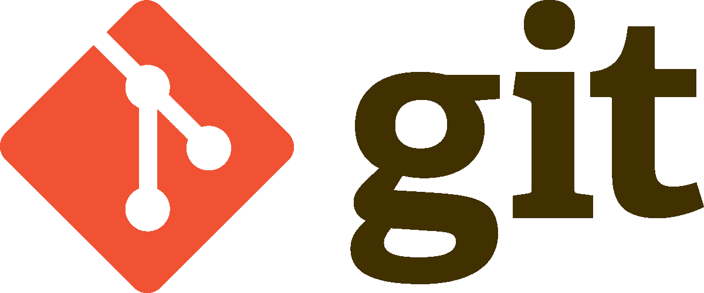
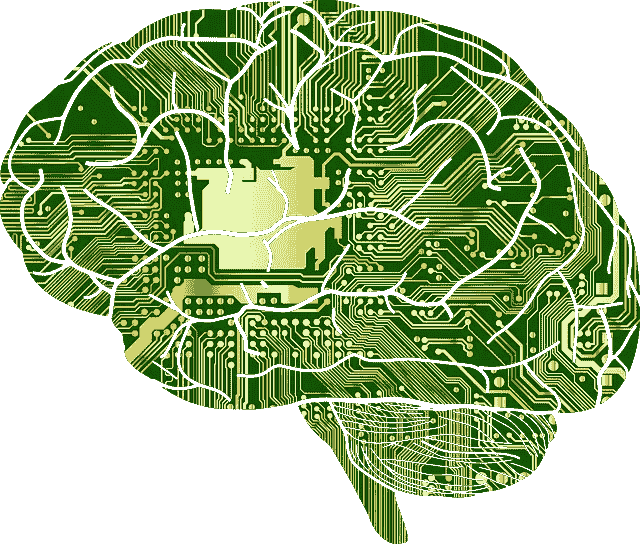

# 2020 年必备的五大数据科学技能

> 原文：<https://towardsdatascience.com/top-5-must-have-data-science-skills-for-2020-a5a53226b168?source=collection_archive---------7----------------------->

## *“R、Python、SQL 和机器学习”*长期以来一直是一个数据科学家的标准工作描述。但随着该领域的发展，这已不足以在就业市场上保持竞争力。

Update your skills for the 2020 data job market!

数据科学是一个竞争激烈的领域，人们正在快速积累越来越多的技能和经验。这催生了机器学习工程师的蓬勃发展的工作描述，因此我对 2020 年的建议是，所有数据科学家都需要成为开发人员。

为了保持竞争力，请确保为新工具带来的新工作方式做好准备。

> 为了保持竞争力，请确保为新的工作方式和随之而来的工具做好准备。

## 1.敏捷

敏捷是一种组织工作的方法，已经被开发团队广泛使用。数据科学的角色越来越多地由最初的技能组合是纯软件开发的人担任，这导致了机器学习工程师的角色。

Post-its and Agile seem to go hand-in-hand

越来越多的数据科学家/机器学习工程师被作为开发人员来管理:在现有的代码库中不断改进机器学习元素。

对于这种类型的角色，数据科学家必须知道基于 Scrum 方法的敏捷工作方式。它为不同的人定义了几种角色，这种角色定义确保了持续改进和顺利实施。

## 2.开源代码库

Git 和 Github 是开发者在管理不同版本软件时很有帮助的软件。它们跟踪对代码库所做的所有更改，此外，当多个开发人员同时对同一个项目进行更改时，它们增加了协作的便利性。

GitHub is the way to go

随着数据科学家的角色变得越来越侧重于开发，能够处理这些开发工具变得非常关键。Git 正成为一项严肃的工作要求，习惯使用 Git 的最佳实践需要时间。当你独自一人或者当你的同事是新同事时，开始使用 Git 是很容易的，但是当你加入一个有 Git 专家的团队，而你还是一个新手时，你可能会比你想象的更加困难。

Git is the real skill to know for GitHub

## 3.工业化

在数据科学领域，我们思考项目的方式也在发生变化。数据科学家仍然是用机器学习回答商业问题的人，一如既往。但是数据科学项目越来越多地被开发用于生产系统，例如作为大型软件中的微服务。

AWS is the biggest Cloud Vendor

与此同时，高级类型的模型越来越需要 CPU 和 RAM 来执行，尤其是在使用神经网络和深度学习时。

就数据科学家的工作描述而言，越来越重要的是，不仅要考虑模型的准确性，还要考虑项目的执行时间或其他工业化方面。

Google also has a cloud service, just like Microsoft (Azure)

## 4.云和大数据

虽然机器学习的产业化正在成为数据科学家的一个更严重的制约因素，但它也成为了数据工程师和整个 it 的一个严重制约因素。

A famous comic (source: [https://www.cyberciti.biz/humour/dad-what-are-clouds-made-of-in-it/](https://www.cyberciti.biz/humour/dad-what-are-clouds-made-of-in-it/) )

如果数据科学家可以致力于减少模型所需的时间，IT 人员可以通过转向更快的计算服务来做出贡献，这些服务通常通过以下一种或两种方式获得:

*   云:将计算资源转移到外部供应商，如 AWS、微软 Azure 或谷歌云，可以非常容易地建立一个非常快速的机器学习环境，可以远程访问。这要求数据科学家对云的功能有一个基本的了解，例如:在远程使用服务器而不是自己的计算机，或者在 Linux 而不是 Windows / Mac 上工作。

PySpark is writing Python for parallel (Big Data) systems

*   大数据:更快的 IT 的第二个方面是使用 Hadoop 和 Spark，这些工具允许同时在许多计算机(工作节点)上并行化任务。这要求作为数据科学家使用不同的方法来实现模型，因为您的代码必须允许并行执行。

## 5.自然语言处理、神经网络和深度学习

最近，数据科学家仍然认为 NLP 和图像识别仅仅是数据科学的专门化，并不是所有人都必须掌握。

You will need to understand Deep Learning: Machine Learning based on the idea of the human brain

但是图像分类和 NLP 的使用案例越来越频繁，甚至在“常规”业务中也是如此。目前，对这种模型没有起码的基本知识已经变得不可接受。

即使您在工作中没有直接应用这些模型，动手项目也很容易找到，并且可以让您理解图像和文本项目所需的步骤。

祝你在提高技能的同时好运，不要犹豫，继续关注更多！