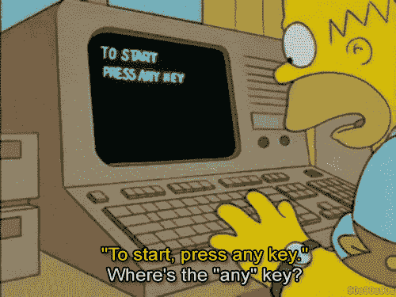

# 成为更好的软件工程师的 5 大技巧

> 原文：<https://towardsdatascience.com/top-5-tips-to-become-a-better-software-engineer-86ca3056a0e8?source=collection_archive---------17----------------------->

## 从好奇的新手到经验丰富的寻求答案的瑞典人，这个快速指南是为你准备的。

A video version of this article, if you’re more of a visual learner :)

成为软件工程师的艺术是一个在连续迭代中不断完善的过程。这篇文章是为那些刚刚起步的人，那些好奇的人，或者那些决定提高技能的人准备的，大胆地投入到令人惊讶的软件世界中去吧！

Learning how to code is a continual process, you never stop. It’s an upward spiral. Emphasis on the spiral.

你不会仅仅学习 12 周、6 个月或 2-4 年，然后就“完成”了。你在不断成长。从我 7 岁开始，我就一直致力于在机器中模拟人脑。当然，我一个人做不到。我们需要建立一支由志同道合的混合技术专家组成的队伍，他们积极寻求理解人脑和机器如何计算信息。在这个更大的计划中的一小步是指导我的伙伴们，建设者们，修补者们和梦想家们成为更好的软件工程师。

这里是我的五大技巧，可以帮助你成为一名更好的软件工程师。

## **学习如何使用数据结构和算法**

不仅要知道它们是什么，还要知道如何使用它们，为什么使用它们，以及一种方法相对于另一种方法的利弊。比如链表和数组有什么区别？二分搜索法的优点是什么，你什么时候使用它？你知道如何识别现实世界中的问题何时可以映射为动态规划问题吗，比如著名的 0-1 背包问题，或者最长公共子序列？

## **了解计算机网络基础知识**

Photo by [Denys Nevozhai](https://unsplash.com/@dnevozhai?utm_source=medium&utm_medium=referral) on [Unsplash](https://unsplash.com?utm_source=medium&utm_medium=referral)

令我非常惊讶的是，很多人不知道他们的代码是如何与外部世界相连的。一些你应该问自己的问题…

*   你写的软件是如何与外界连接的？
*   你知道 WiFI 和局域网是怎么工作的吗？
*   UDP 和 TCP 有什么区别？
*   当您将信息从一台设备传输到另一台设备时，开放系统互连中的 7 层如何处理数据？
*   劳动力如何在路由器和主机等组件之间分配？
*   或者说，不同并发协议之间的分工是怎样的，那些并发协议是什么？

## **了解 Linux 或 UNIX 的基础知识**

到目前为止，UNIX 已经存在了 30 多年，了解如何在命令行中使用 Linux 或 UNIX 将有助于您变得更加高效。

*   你知道它是什么插座吗？
*   杀死一个进程？
*   什么是线程？
*   你能正则表达式吗？

## **学习数据库的基础知识**

虽然我们不指望您是数据库专家，但是您应该知道如何编写简单的 SQL 查询来访问数据集中的数据。你将编写以某种方式操纵数据的软件，所以你至少应该明白如何导入数据。

## **有一个成长的心态**

你应该知道，什么是“时尚”的字母汤总是在变化。你应该随时准备学习新的语言，当你学得更多的时候，你会意识到语言之间的共同点通常比不同点多。

例如，Clojure 和 Haskell 实现非常适合函数式编程。相比之下，面向对象编程(OOP)范例在 Python、Java 和 Ruby 中得到广泛应用。

然而，在 1990 年，FORTRAN、COBOL 和 C++是“流行”语言的主导者。

所以每当你认为“我永远学不会那个”的时候，停止它。立即停止这种想法。

你不“只是一个 webapp 的家伙”或“只是一个后端的家伙。”你会有你的专长，你最喜欢的领域。然而，就像我的老朋友达尔文曾经说过的有机体和适者生存，

> 永远不是最强大的生物赢得了进化的游戏。总是那些适应性最强，对变化最敏感的人。

所以，你也需要相信你可以学到任何东西，你可以不断成长。

好了，朋友们，这是我认为对一个软件工程师来说最重要的五个建议。当然，我也在沿着这个不断向上的螺旋前进。有时我会从头开始重建我的知识。其他时候，我可以立即行动，因为我以前见过类似的问题或模式。有时，我也会碰壁，不得不回到我最初的原则。

在你看来，你认为最重要的软件工程师技能是什么？请在下面的评论中留下你的想法。