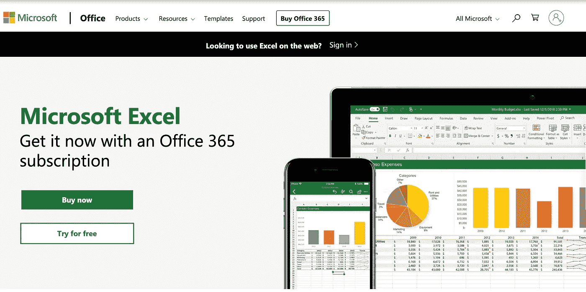
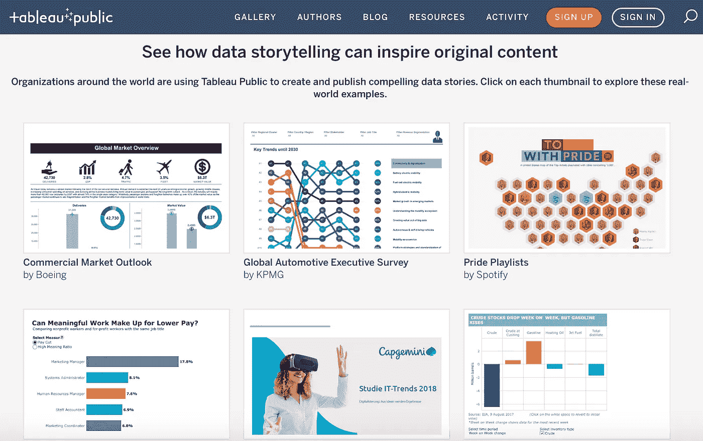
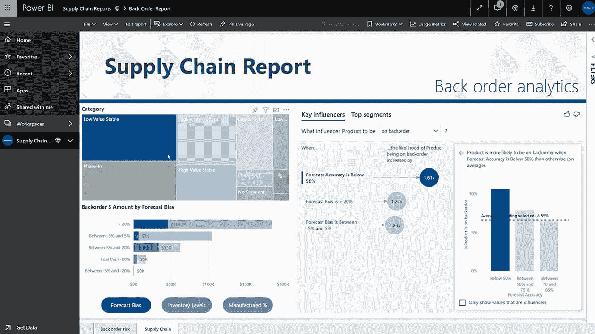
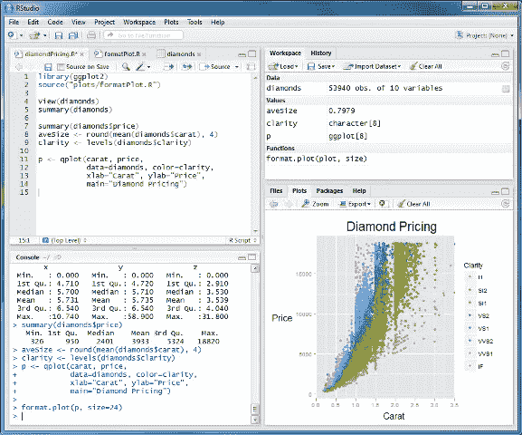
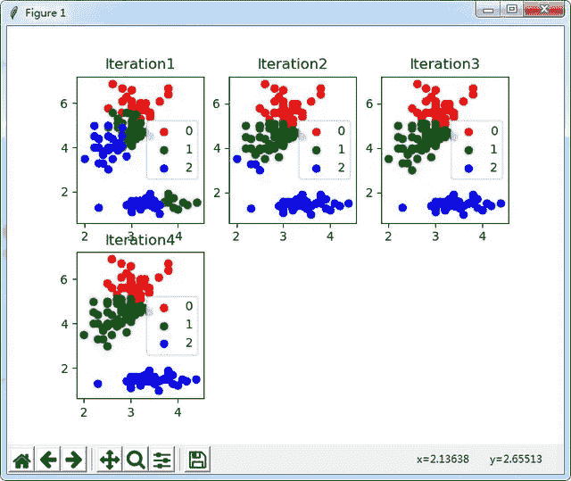

# 2021 年 6 大数据分析工具

> 原文：<https://towardsdatascience.com/top-6-data-analytics-tools-in-2019-4df815ebf82c?source=collection_archive---------2----------------------->

谈到数据分析工具，我们总是有疑问。这么多数据分析工具有什么区别？哪个更好？我应该学习哪一个？

虽然这是一个老生常谈的话题，但是真的很重要，我也一直在努力追寻这个终极问题的答案。如果你去网上搜索这方面的相关信息，很难看到公正的观点。因为评测某个数据分析工具的评测者可能是从不同的角度，带着一些个人的感受。

今天，让我们抛开这些个人感受。而我也在尽量客观的和大家谈谈我个人对市面上数据分析工具的看法，供大家参考。

我一共选择了三种类型的 6 个工具。接下来让我逐一介绍。

# 1.擅长

具有各种强大的功能，如表单创建、数据透视表、VBA 等。，Excel 的系统庞大到没有任何分析工具可以超越，保证了人们可以根据自己的需求来分析数据。

但是，有些人可能认为自己对计算机编程语言非常精通，不屑于使用 Excel 作为工具，因为 Excel 无法处理大数据。但是你想想，我们日常生活中使用的数据是否超出了大数据的极限？在我看来，Excel 是一个多面手。它最适合小数据，通过插件它可以处理数百万的数据。

综上所述，基于 Excel 强大的功能和用户规模，我的看法是它是一个不可或缺的工具。想学数据分析， [Excel](https://products.office.com/en-us/excel) 绝对是首选。

# 2.商务智能工具

商业智能是为数据分析而生的，而且是在非常高的起点上诞生的。目标是缩短从业务数据到业务决策的时间，用数据影响决策。

Excel 的产品目标不是这样的。Excel 可以做很多事情。你可以用 Excel 画一个课程表，做一个调查问卷，或者当计算器用，甚至可以用来绘图。如果你掌握了 VBA，你也可以做一个小游戏。但这些并不是真正的数据分析功能。

IMGUR, [MICHELLEASAURR](http://imgur.com/user/michelleasaurr)

但是 BI 工具是专门做数据分析的。

以 Power BI、FineReport、Tableau 等常见 BI 工具为例。你会发现它们是按照数据分析流程设计的。首先是数据处理、数据清理，然后是数据建模，最后是[数据可视化](http://www.finereport.com/en/about-finereport/how-can-beginners-design-cool-data-visualizations.html?utm_source=medium&utm_medium=media&utm_campaign=blog&utm_term=Top%206%20Data%20Analytics%20Tools%20in%C2%A02019)，它使用图表演示来识别问题并影响决策。

这些是数据分析的必经之路，在这个过程中也有一些员工的痛点。

例如，清理数据的重复性和低附加值工作可以通过 BI 工具来简化。

如果数据量很大，传统工具 Excel 无法完成数据透视表。

如果我们用 Excel 做图形显示，编辑图表，包括颜色和字体设置，都要花很多时间。

这些痛点正是 BI 工具可以为我们带来改变和价值的地方。

现在我们来对比一下市面上比较流行的三款 BI 工具:Power BI、FineReport、Tableau。

## 1) [Tableau](https://www.tableau.com/)

Tableau 的核心本质其实就是 Excel 的数据透视表和数据透视图。可以说，Tableau 敏锐地察觉到了 Excel 的这一特性。它较早进入 BI 市场，并将这一核心价值发扬光大。

从发展历史和目前市场反馈来看，Tableau 更擅长可视化。我不认为这是因为它的图表有多酷，而是它的设计、颜色和用户界面给我们一种简单清新的感觉。

这确实像 Tableau 自己宣传的，投入大量学术精力研究人们喜欢什么样的图表，如何在操作和视觉上给用户极致的体验。正如 Tableau 所宣传的那样，他们的团队投入了大量的学术精力来研究人们喜欢什么样的图表，以及如何在操作和视觉上给用户带来极致的体验。

此外，Tableau 还增加了数据清洗功能和更多智能分析功能。这也是 Tableau 可以预见的产品开发优势。

## 2) [异能匕](https://powerbi.microsoft.com/en-us/)

Power BI 的优势在于商业模式和数据分析能力。

Power BI 之前是 Excel 的插件，发展并不理想。所以它走出了 Excel，发展成了 BI 工具。Power BI 作为后来者，每个月都有迭代更新，追赶速度非常快。

Power BI 目前有三种许可方式:Power BI 免费版、Power BI 专业版和 Power BI 高级版。就像 Tableau 一样，其免费版的功能也不全。但是个人用也差不多够了。而 Power BI 的数据分析是强大的。它的 PowerPivot 和 DAX 语言允许我以类似于在 Excel 中编写公式的方式实现复杂的高级分析。

## 3) [FineReport](http://www.finereport.com/en/?utm_source=medium&utm_medium=media&utm_campaign=blog&utm_term=Top%206%20Data%20Analytics%20Tools%20in%C2%A02019)

FineReport 的独特之处在于，它的自助式数据分析非常适合商业用户。通过简单的拖放操作，您可以使用 FineReport 设计各种风格的报表，轻松构建数据决策分析系统。

From [FineReport](http://www.finereport.com/en/?utm_source=medium&utm_medium=media&utm_campaign=blog&utm_term=Top%206%20Data%20Analytics%20Tools%20in%C2%A02019)

FineReport 可以直接连接各种数据库，自定义各种样式制作周报、月报、年报，方便快捷。其格式类似于 Excel 的界面。包括报表创建、报表权限分配、报表管理、数据录入等功能。

此外，FineReport 的可视化功能也非常突出，提供了多种[仪表盘模板](http://www.finereport.com/en/data-visualization/a-beginners-guide-to-business-dashboards.html?utm_source=medium&utm_medium=media&utm_campaign=blog&utm_term=Top%206%20Data%20Analytics%20Tools%20in%C2%A02019)和多个自主开发的可视化插件库。

价格方面，个人版 FineReport 完全免费，所有功能开放。

# 3.R & Python

[R](https://www.r-project.org/) 和 [Python](https://www.python.org/) 是我要说的第三类工具。虽然像 Excel 和 BI 工具这样的软件已经尽最大努力设计来考虑数据分析的大多数应用场景，但它们本质上是定制的。如果软件没有设计一个功能，或者为一个功能开发一个按钮，你很可能无法用它们来完成你的工作。

编程语言对此有所不同。它非常强大和灵活。你可以写代码做任何你想做的事情。比如 R 和 Python 就是数据科学家不可或缺的工具。从专业角度来说，它们绝对比 Excel 和 BI 工具强大。

那么有哪些是 R 和 Python 可以实现，而 Excel 和 BI 工具很难实现的应用场景呢？

## 1)专业统计分析

R 语言方面，最擅长统计分析，比如正态分布，用算法对聚类进行分类，回归分析。这种分析就像用数据做实验。它可以帮助我们回答以下问题。

From [Google](https://procrackbox.com/r-studio-crack-registration-key/)

比如数据的分布是正态分布，三角分布还是其他类型的分布？离散的情况是怎样的？是否在我们想要达到的统计可控范围内？不同参数对结果的影响有多大？而且还有假设模拟分析。如果某个参数发生变化，会带来多大的影响？

## 2)个体预测分析

例如，我们想要预测消费者的行为。他会在我们店里呆多久？他会花多少钱？我们可以查到他的个人信用状况，根据他的网上消费记录，做出贷款额度。或者我们可以根据他在网页上的浏览历史推送不同的项目。这也涉及到目前流行的机器学习和人工智能的概念。

# 结论

以上对比说明了几款软件的区别。我想总结的是，真实的就是合理的。Excel、BI 工具或编程语言有重叠的功能，但也是互补的工具。每种方法的价值取决于正在开发的应用程序的种类和当前的情况。

在你选择一个数据分析工具之前，你必须先了解你自己的工作:你是否会使用我刚才提到的应用场景。或者考虑一下你的职业方向:是走向数据科学还是商业分析。

# 您可能也会对…感兴趣

[8 个最佳报告工具&改善您业务的软件](https://medium.com/p/bc06d11279ee?source=post_stats_page-------------------------------------)

[2021 年最受欢迎的 5 款商业智能工具](https://medium.com/p/4e060b98039a?source=post_stats_page-------------------------------------)

[*9 个你不能错过的数据可视化工具 20*](/9-data-visualization-tools-that-you-cannot-miss-in-2019-3ff23222a927) *21*

[*数据可视化中前 16 种图表类型*](/top-16-types-of-chart-in-data-visualization-196a76b54b62)

[*数据可视化中排名前 10 的地图类型*](/top-10-map-types-in-data-visualization-b3a80898ea70)

[*制作销售仪表盘的逐步指南*](/a-step-by-step-guide-to-making-sales-dashboards-34c999cfc28b)