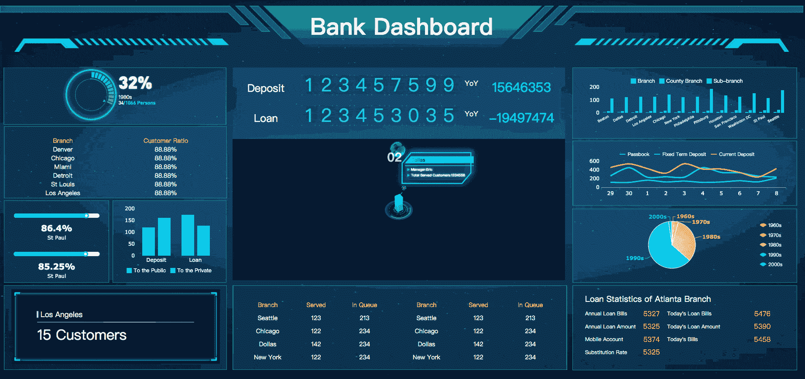

# KPI 仪表板的前 7 种图表类型

> 原文：<https://towardsdatascience.com/top-7-chart-types-for-kpi-dashboards-287fb84a8874?source=collection_archive---------16----------------------->

KPI 已经成为各种商业组织的重要考核体系和方法，并贯穿于各种商业活动中。如何使用合适的可视化图表呈现实际结果和关键指标，实现实时监控，也一直是商业分析，乃至各种商业智能系统关注的焦点。

在今天的文章中，我总结了 KPI 仪表盘常用的 7 种图表类型，希望对你有用。

(注:本文所有图表和仪表盘均采用数据可视化工具 [FineReport](http://www.finereport.com/en/?utm_source=medium&utm_medium=media&utm_campaign=blog&utm_term=Top%207%20Chart%20Types%20for%20KPI%20Dashboards) 制作，个人[下载](http://www.finereport.com/en/download-2?utm_source=medium&utm_medium=media&utm_campaign=blog&utm_term=Top%207%20Chart%20Types%20for%20KPI%20Dashboards)完全免费。)

# **1。数字文本**

显示 KPI 最简单的方法是直接以文本形式列出数字。好处是非常直观。而且特别适合显示销售总额、营业额、财务分析利润总额、毛利率等核心指标。

From FineReport

这种图表类型的用法简单明了。但不建议列出多个数据，因为比较困难，数据之间缺乏关联性。此外，不同的颜色可以用作数字文本风格的区分。

# 2.单词云图表

词云图是一种直观显示数据频率的形式。它能在视觉上突出出现频率高的“关键词”，形成“关键词云层”，从而过滤掉大量的文本信息，让浏览者一目了然地抓住重点。

比如你汇报工作的时候，可以用几个突出的词来表达一年工作中最突出的点，形成“2019 关键词云”。

From FineReport

# 3.仪表板

仪表板可用于指标值的进度分析，以显示计划和实际结果之间的比较。为了同时显示，您可以使用多个仪表板。

除了刻度盘之外，还有一个百分比仪表盘，类似于甜甜圈图。这种图表类型的优点是可以清楚的看到数据的范围和大小，但是无法观察趋势变化是最大的缺点。

From FineReport

# 4.散点图

散点图用于显示不同数据点之间的关系，并比较不同时间段的趋势。效果如下图。

# 5.多系列折线图

多系列折线图用于查看同一区域内指标的趋势，可以直观的看到趋势对比。具有 KPI 的折线图可以同时显示多个数据系列，并自动计算差异率。

# 6.组合图表

组合图是多个图表的组合，如折线图、柱形图、饼图等。

让我们看一个折线图和堆积柱形图组合的例子。

在下面的组合图中，订单数量和再订购数量被累加，并与库存数量进行比较。如果累计总订单数量大于库存数量，则表明需要补货。

# 7.动态图表

最后，我将重点介绍 KPI 仪表板中常用的动态图表。上面说的 KPI 图表都是基本图表。其实要做一个清晰酷炫的 KPI 仪表盘，必须使用更高级的动态图表，让你的关键指标更加突出，更加醒目。

现在，我们来看看 [FineReport](http://www.finereport.com/en/?utm_source=medium&utm_medium=media&utm_campaign=blog&utm_term=Top%207%20Chart%20Types%20for%20KPI%20Dashboards) 的几张动态图。

## 目录齿轮

## 定时齿轮

## 动态指示卡

**发光仪表盘**

## GIS 点地图

说到这里，您可能想看看这些图表在 KPI 仪表板中的实际应用。所以我在 [FineReport](http://www.finereport.com/en/?utm_source=medium&utm_medium=media&utm_campaign=blog&utm_term=Top%207%20Chart%20Types%20for%20KPI%20Dashboards) Demo 里找了几个仪表盘模板给你参考。

## **项目管理仪表板**

## 投资管理系统

## 银行仪表板

## 公路监控仪表板

对了，如果想了解更多的图表类型，可以看看这篇文章: [*数据可视化中的 16 大图表类型*](/top-16-types-of-chart-in-data-visualization-196a76b54b62) 。

# 您可能也会对…感兴趣

[*2019 年 6 大数据分析工具*](/top-6-data-analytics-tools-in-2019-4df815ebf82c)

[*初学者财务报表分析指南*](/guide-to-financial-statement-analysis-for-beginners-835d551b8e29)

[*2019 年你不能错过的 9 款数据可视化工具*](/9-data-visualization-tools-that-you-cannot-miss-in-2019-3ff23222a927)

[*数据可视化十大地图类型*](/top-10-map-types-in-data-visualization-b3a80898ea70)