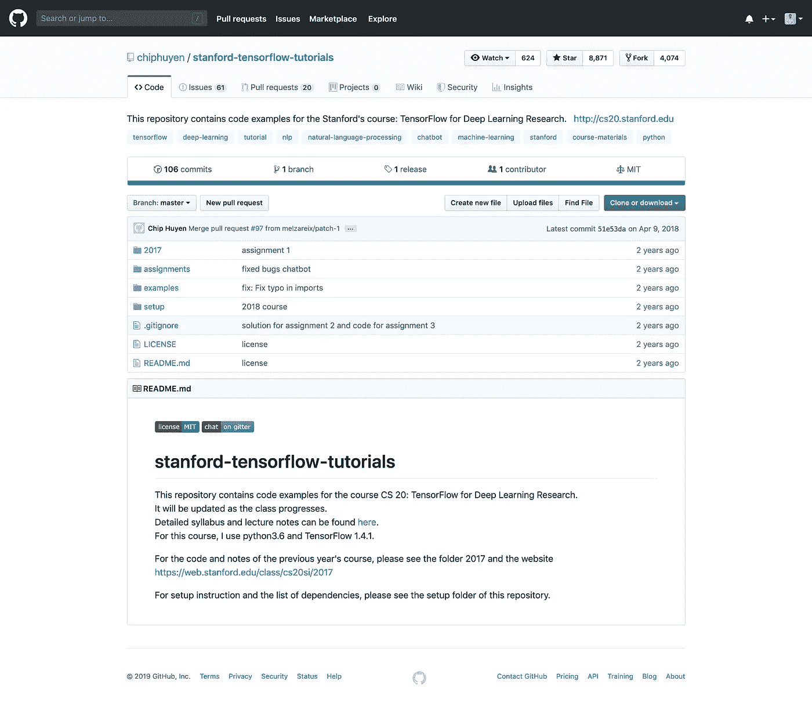
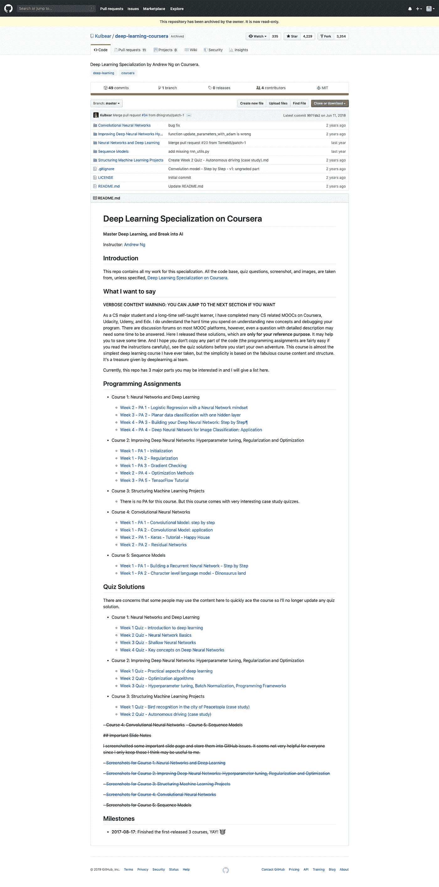
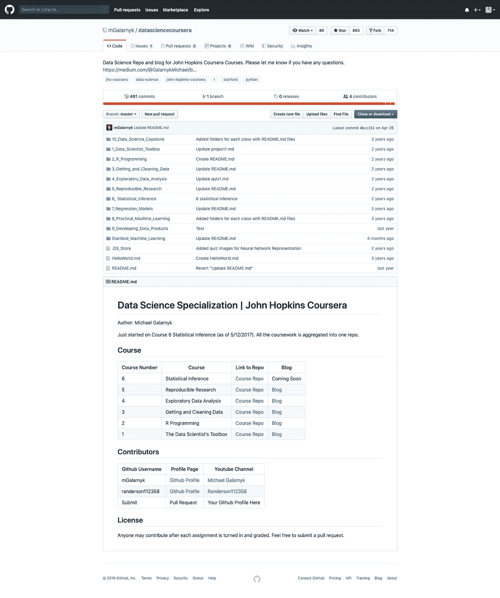
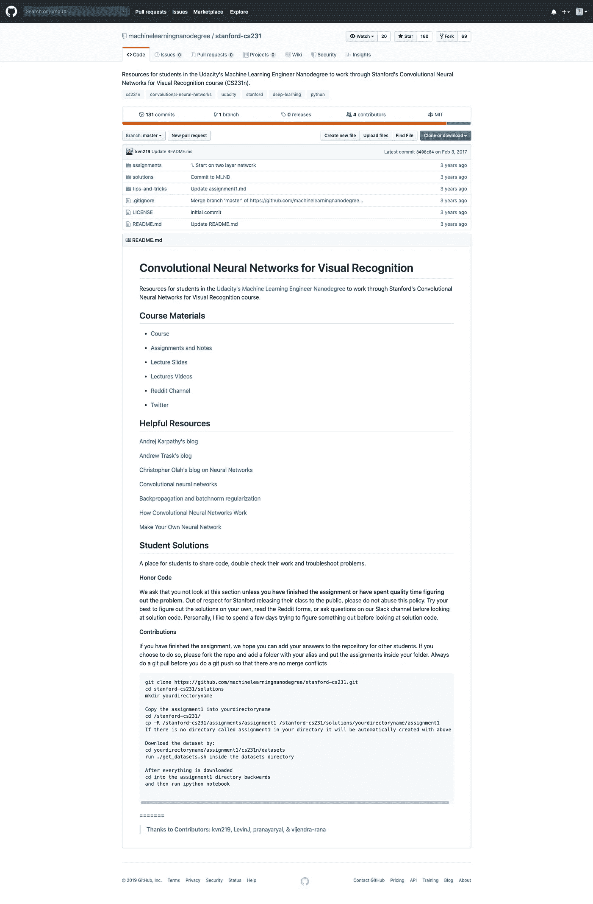

# GitHub 上的 7 大数据科学课程

> 原文：<https://towardsdatascience.com/top-7-data-science-course-repositories-on-github-11a47e4b8dc2?source=collection_archive---------8----------------------->

Photo by [Carlos Muza](https://unsplash.com/@kmuza?utm_source=medium&utm_medium=referral) on [Unsplash](https://unsplash.com?utm_source=medium&utm_medium=referral)

GitHub 是广为人知的最著名的版本控制库之一。在里面，你可以找到几乎无数的多种编程语言的公共项目。它让您可以轻松地与团队成员和全球的开发人员协作。你们可以一起从这些项目中学习，也可以为这些项目做出贡献。

GitHub 的一个伟大之处在于，你也可以把它作为搜索引擎来寻找你可以从中受益的伟大项目和资源。

许多教师或技术讲师使用它来发布他们的课程，包括课程笔记、作业、幻灯片和其他可供学生使用的材料。

他们公开并免费发布，这样每个人都可以访问，包括那些没有正式参加这些课程，但有兴趣学习并从中受益的人。

以下是在 GitHub 上发布资料的 8 门最受欢迎的数据科学课程的列表。排名分别基于每个存储库的分叉数量。

# 1.斯坦福 TensorFlow 教程(4072 个分叉)

这个[库](https://github.com/chiphuyen/stanford-tensorflow-tutorials)与斯坦福的 CS 20 课程相关联:[深度学习研究的 TensforFlow】课程。课程网站上有详细的教学大纲、幻灯片和课堂讲稿。讲师用的是 python 3.6 和 TensorFlow 1.4.1。](https://web.stanford.edu/class/cs20si/)

以下是对课程的描述:

> TensorFlow 是谷歌研究人员开发的一个强大的机器学习开源软件库。它有许多预构建的功能来简化构建不同神经网络的任务。TensorFlow 允许在不同的计算机之间分配计算，以及在一台机器内分配多个 CPU 和 GPU。TensorFlow 提供了一个 Python API，以及一个文档较少的 C++ API。在本课程中，我们将使用 Python。
> 
> 本课程将涵盖深度学习研究中 Tensorflow 库的基础知识和当代用途。我们旨在帮助学生理解 TensorFlow 的图形计算模型，探索它必须提供的功能，并学习如何构建和构造最适合深度学习项目的模型。通过本课程，学生将使用 TensorFlow 建立不同复杂性的模型，从简单的线性/逻辑回归到卷积神经网络和递归神经网络，以解决诸如单词嵌入、翻译、光学字符识别、强化学习等任务。学生还将学习构建模型和管理研究实验的最佳实践。

# 2.Coursera 上的深度学习专业化(3，352 个分叉)

这是一个由一名学生创建的[知识库](https://github.com/Kulbear/deep-learning-coursera)，他发布了 Coursera 深度学习专业的编程作业和解决方案。

它不是一个装满课程或学习资源的存储库。不过可以用来稍微好一点理解深度学习相关的一些概念。将您的解决方案与该存储库中提供的解决方案进行比较也很有用。

以下是你可以找到编程作业和提问的课程列表:

*   **课程 1:神经网络和深度学习**
*   **课程 2:改进深度神经网络:超参数调整、正则化和优化**
*   **课程 3:构建机器学习项目**
*   **课程 4:卷积神经网络**
*   **课程 5:序列模型**

# 3.实用 RL:野外强化学习课程(3368 叉)

以下[课程](https://github.com/yandexdataschool/Practical_RL)有英语和俄语的在线版本，但在高等经济学院教授俄语。

已经进行了 9 周，存储库还包含额外的材料，可供现场参加课程或只想在线学习的学生使用。

这是一门侧重于实用机器学习的课程，涵盖如下主题:

*   **简介**。我们周围的问题。决策过程。随机最优化，交叉熵方法。参数空间搜索与动作空间搜索。
*   **基于价值的方法**。打折奖励 MDP。基于价值的方法。价值迭代。政策迭代。打折奖励失败。
*   **无模型强化学习**。q-学习。萨莎。策略外算法与策略内算法。n 步算法。TD(λ)。
*   **深度学习回顾。**深度学习 101。它附带了一个研讨会，介绍 pytorch/tensorflow，使用 convnets 进行简单的影像分类
*   **近似(深)RL。**无限/连续状态空间。价值函数近似。收敛条件。多重代理诡计；经验重放，目标网络，双/决斗/自举 DQN 等。
*   **探索**。语境强盗。汤普森抽样，UCB，贝叶斯 UCB。探索基于模型的 RL，MCTS。探索的“深度”启发法。
*   **政策梯度方法。**基于政策的动机、政策梯度、对数导数技巧、强化/交叉熵方法、方差缩减(基线)、优势行动者-批评家(包括 GAE)
*   **序列模型的强化学习**。顺序数据的问题。循环神经网络。时光倒流。消失&爆炸渐变。格鲁·LSTM，《渐变裁剪》
*   **部分观察到 MDP。** POMDP 简介。POMDP 学习(有记忆的代理)。POMDP 规划(POMCP 等)
*   **先进的基于政策的方法。**信任区域策略优化。NPO/PPO。确定性政策梯度。DDPG
*   **基于模型的强化学习& Co.** 基于模型的强化学习，一般规划，模仿学习和逆向强化学习
*   **逆 RL 和模仿学习。这门课没有教的所有东西**

# 4.深度学习与 Tensorflow 的创造性应用(1341 个分叉)

这门[课程](https://github.com/pkmital/CADL)有 [Kadenze 学院利用 TensorFlow](https://www.kadenze.com/courses/creative-applications-of-deep-learning-with-tensorflow/info) 课程创造性应用深度学习的作业和讲稿。

本课程包括以下几个部分:

*   会议 1:张量流简介
*   会议 3:无监督和有监督的学习
*   会议 4:视觉化和幻觉化的表现
*   会议 5:生成模型

该存储库还包含大量关于安装和开始使用所需工具的文档。

# 5.数据科学 Coursera (714 分叉)

这个[存储库](https://github.com/mGalarnyk/datasciencecoursera)是由一位名叫 Michael Galarnyk 的数据科学硕士学生准备的。他创建了这个存储库来记录他在约翰霍普金斯大学 Coursera 数据科学课程中的经历，作为他在加州大学圣地亚哥分校项目的补充。

这个 GitHub 库包含每周的相应目录，以及每个课程的博客帖子。

以下课程与相应的回购和博客相关联:

*   统计推断[科目回购](https://github.com/mGalarnyk/datasciencecoursera/tree/master/6_%20Statistical_Inference)
*   可复制的研究[课程回购](https://github.com/mGalarnyk/datasciencecoursera/tree/master/5_Reproducible_Research)博客
*   探索性数据分析[课程回购](https://github.com/mGalarnyk/datasciencecoursera/tree/master/4_Exploratory_Data_Analysis)博客[博客](https://medium.com/@GalarnykMichael/exploratory-data-analysis-jhu-coursera-course-4-4a908e0d30d8#.g10ri88vo)
*   获取和清理数据[课程回购](https://github.com/mGalarnyk/datasciencecoursera/tree/master/3_Getting_and_Cleaning_Data) [博客](https://medium.com/@GalarnykMichael/getting-and-cleaning-data-jhu-coursera-course-3-c3635747858b#.y93kqfa0u)
*   r 编程[课程回购](https://github.com/mGalarnyk/datasciencecoursera/tree/master/2_R_Programming) [博客](https://medium.com/@GalarnykMichael/in-progress-review-course-2-r-programming-jhu-coursera-ad27086d8438#.bzzr29fvo)
*   数据科学家的工具箱[课程报告](https://github.com/mGalarnyk/datasciencecoursera/tree/master/4_Exploratory_Data_Analysis) [博客](https://medium.com/@GalarnykMichael/review-course-1-the-data-scientists-toolbox-jhu-coursera-4d7459458821#.5jpg133ln)

# 6.Udacity 的机器学习工程师 Nanodegree 斯坦福用于视觉识别的卷积神经网络(69 叉)

已经有许多 GitHub 仓库与 Udacity 的机器学习工程师 Nanodegree 相关，这个[带有一个有用的自述文件。](https://github.com/machinelearningnanodegree/stanford-cs231)

它有关于如何使用内容的信息，与课堂材料相关的超链接，以及对学生有用的附加链接，如 Andrej Karpathy 的博客，Andrew Trask 的博客等。

当学生完成作业后，他们会被邀请在知识库中分享他们的解决方案，以便其他人可以查看并从中受益。

# 7.Hadoop 和 MapReduce 介绍(47 个分支)

这个[存储库](https://github.com/P7h/IntroToHadoopAndMR__Udacity_Course)与 Udacity 的 Hadoop 和 MapReduce 入门课程相关。

它包含源代码和问题集，以及演示设置方法的有用的自述文件、输入和输出数据文件的文档以及课程的问题集，并提供 Python 和 Java 的解决方案。

这只是根据叉子的数量列出的一些最受欢迎的课程。有许多其他的存储库可以作为有用的资源来学习和受益。

快乐学习！

感谢您抽出时间阅读。

**请关注我的** [**推特**](https://www.twitter.com/fatosmorina/)