# 现在要学习的 7 种现代编程语言

> 原文：<https://towardsdatascience.com/top-7-modern-programming-language-to-learn-now-156863bd1eec?source=collection_archive---------0----------------------->

## 权威指南

## Rust、Go、Kotlin、TypeScript、Swift、Dart、Julia 如何促进您的职业发展并提高您的软件开发技能

Photo by [h heyerlein](https://unsplash.com/@heyerlein?utm_source=unsplash&utm_medium=referral&utm_content=creditCopyText) on [Unsplash](https://unsplash.com/s/photos/future?utm_source=unsplash&utm_medium=referral&utm_content=creditCopyText)

如果我们把现代人类文明想象成一辆汽车，那么软件开发行业就像汽车的发动机，编程语言就像发动机的燃料。**应该学习哪种编程语言？**

学习一门新的编程语言是对**时间、精力和智力的巨大投资。但是学习一门新的编程语言可以提高你的软件开发技能，并给你的职业生涯带来提升，正如我在另一篇博客中所写的:**

 [## 2020 年学习新编程语言的 5 个理由

### 学习一门新的编程语言来提升你的职业和技能

medium.com](https://medium.com/@md.kamaruzzaman/5-reasons-to-learn-a-new-programming-language-in-2020-bfc9a4b9a763) 

通常情况下，选择一种在职业生涯中给你助力的编程语言。还有，学一门人气上升的语言。这意味着你应该学习成熟的和非常流行的编程语言。在这里，我列出了 2020 年要学习的 10 种主流编程语言:

 [## 2020 年最受欢迎的 10 种编程语言

### 针对求职者和新开发人员的顶级编程语言的深入分析和排名

medium.com](https://medium.com/@md.kamaruzzaman/top-10-in-demand-programming-languages-to-learn-in-2020-4462eb7d8d3e) 

我非常尊重主流编程语言。但是在这里，我会给你**一个现代编程语言的列表，它可以提高你的生产力，促进你的职业发展，让你成为一个更好的开发者**。此外，我将涉及广泛的领域:系统编程、应用程序开发、web 开发、科学计算。

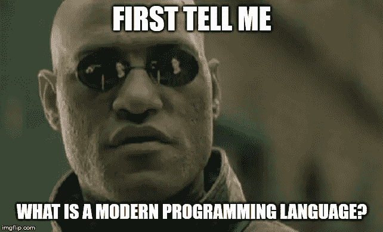

术语“**现代编程语言**”有歧义。许多人认为像 Python、JavaScript 这样的语言是现代编程语言。同时，他们认为 Java 是一种古老的编程语言。现实中，它们都在同一时间前后出现: **1995** 。

主流编程语言大多是在上个世纪开发的，主要是**70 年代(如 C)、80 年代(如 C++)、90 年代(如 Java、Python、JavaScript)** 。这些语言并不是为了利用现代软件开发生态系统而设计的:**多核 CPU、GPU、快速网络、移动设备、容器和云**。尽管他们中的许多人在他们的语言中有类似并发性的改进特性，并且进行了自我调整，但是他们也提供了向后兼容性，并且不能抛弃旧的、过时的特性。

Python 在 Python 2 和 Python 3 之间做得很好(或者很差，取决于上下文)。那些语言**通常提供 10 种方法来做同样的事情，并且不关心开发人员的人机工程学**。根据 StackOverflow 开发者调查，大多数主流老编程语言都在“**最可怕的语言**类别中名列前茅:

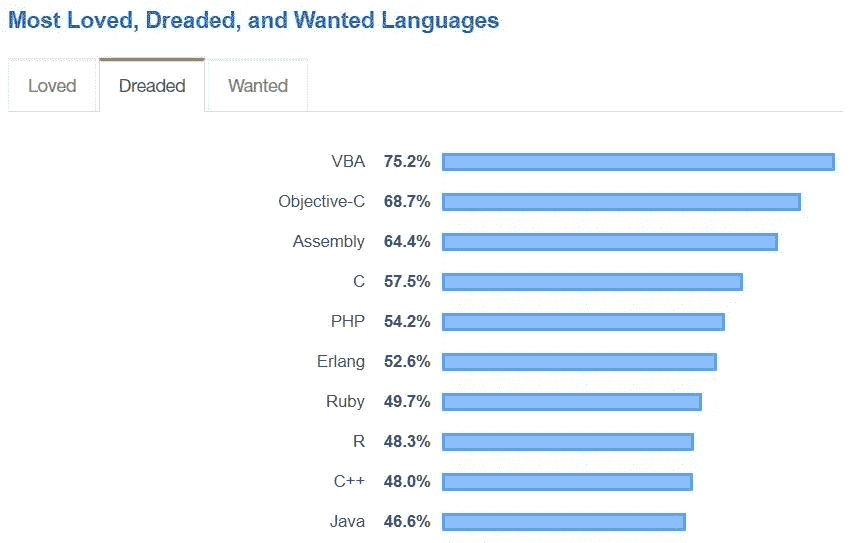

Source: [Stackoverflow](https://insights.stackoverflow.com/survey/2019#most-loved-dreaded-and-wanted)

我认为新旧编程语言的明确界限是在 2007 年 6 月 29 日**，**第一代 iPhone 发布的时候。在那之后，景观发生了变化。在这个列表中，我将考虑 2007 年后的编程语言。

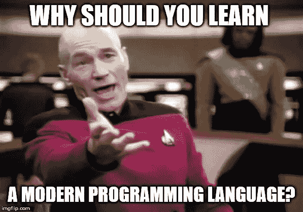

首先，**开发现代编程语言是为了充分利用现代计算机硬件(多核 CPU、GPU、TPU)** 、**移动设备、大数据集、快速联网、容器和云**。此外，大多数现代编程语言提供了更高的开发人员工效学，如下所示:

*   简洁明了的代码(较少的样板代码)
*   对并发的内置支持
*   空指针安全
*   类型推理
*   更简单的功能集
*   降低认知负荷
*   融合了所有编程范例的最佳特性

第二，列表中的许多编程语言具有颠覆性，并将永远改变软件行业。其中一些已经是主流编程语言，而另一些正准备取得突破。至少把这些语言作为第二编程语言来学习是明智的。

在之前的一篇博文《关于 2020 年软件发展趋势的 20 个预测》中，我已经预测了 2020 年许多现代语言的突破:

 [## 关于 2020 年软件发展趋势的 20 个预测

### 云、容器、编程、数据库、深度学习、软件架构、Web、App、批处理、流、数据湖…

towardsdatascience.com](/20-predictions-about-software-development-trends-in-2020-afb8b110d9a0) 

# 锈

Source: [Thoughtram](https://thoughtram.io/rust-and-nickel/#/11)

系统编程语言领域被类似 C、C++的准金属语言所主导。尽管它们对程序和硬件有完全的控制权，但它们缺乏内存安全性。即使它们支持并发，使用 C/C++编写并发程序也是一个挑战，因为没有并发安全性。其他流行的编程语言是解释型语言，如 Java、Python、PHP。它们提供了安全性，但需要庞大的运行时或虚拟机。像 Java 这样的语言由于运行时间长，不适合系统编程。

有很多尝试将 C/C++的强大功能和 Haskell、Java 的安全性结合起来。看起来 Rust 是第一个成功的产品级编程语言。

Graydon Hoare 最初开发 Rust 是作为一个附带项目。他受到了研究编程语言**气旋**的启发。Rust 是开源的，Mozilla 与许多其他公司和社区一起领导着语言开发。Rust 于 2015 年首次发布，并很快吸引了社区的目光。在之前的一篇文章中，我深入研究了 Rust，并论证了在大数据领域使用 Rust 优于 C++、Java 的原因:

 [## 回归金属:2019 年开发大数据框架的 3 大编程语言

### C++，Rust，用 Java 做数据密集型框架

towardsdatascience.com](/back-to-the-metal-top-3-programming-language-to-develop-big-data-frameworks-in-2019-69a44a36a842) 

**主要特点:**

*   通过**所有权和借用**的概念提供内存安全和并发安全。
*   **内存安全和并发性**安全的编译时保证，即如果一个程序代码被编译，那么它既是内存安全的，也是无数据竞争的。这是 Rust 最吸引人的特性。
*   它还提供了 ML，Haskell 的表现力。凭借不可变的数据结构和函数式编程特性，Rust 提供了函数式并发和数据并发。
*   生锈的速度快得惊人。根据 [**基准测试游戏**](https://benchmarksgame-team.pages.debian.net/benchmarksgame/fastest/rust-gpp.html) ，惯用 Rust 的性能优于惯用 C++。
*   由于没有运行时，Rust 提供了对现代硬件(TPU、GPU、多核 CPU)的完全控制。
*   Rust 有 **LLVM** 支持。因此，Rust 提供了与 **WebAssembly** 的一流互操作性，并允许极快的 Web 代码。

**人气:**

自 2015 年首次亮相以来，Rust 深受开发者的欢迎，并在 StackOverflow 开发者调查中连续四年**(2016、2017、2018、2019)** 被评为最受喜爱的语言:

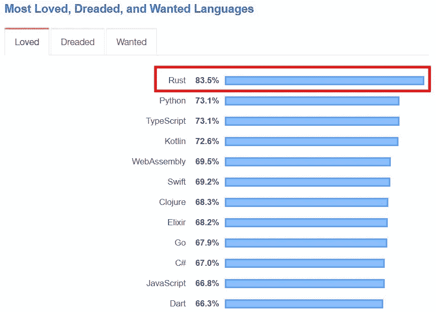

Source: [Stackoverflow](https://insights.stackoverflow.com/survey/2019#most-loved-dreaded-and-wanted)

根据 GitHub Octoverse 的说法，Rust 是仅次于 Dart 的第二大发展最快的语言:

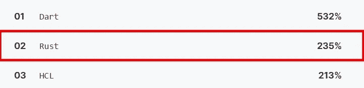

Source: [Octoverse](https://octoverse.github.com/)

此外，编程语言流行网站 PyPl 将 Rust 排在第 18 位，并且呈上升趋势:

Source: [PyPl](http://pypl.github.io/PYPL.html)

比较它所提供的功能，难怪像微软、亚马逊、谷歌这样的大型科技公司最终宣布投资 Rust 作为长期系统编程语言。

在过去的 5 年里，Rust 每年都在增加牵引力，正如 Google trends 所显示的:

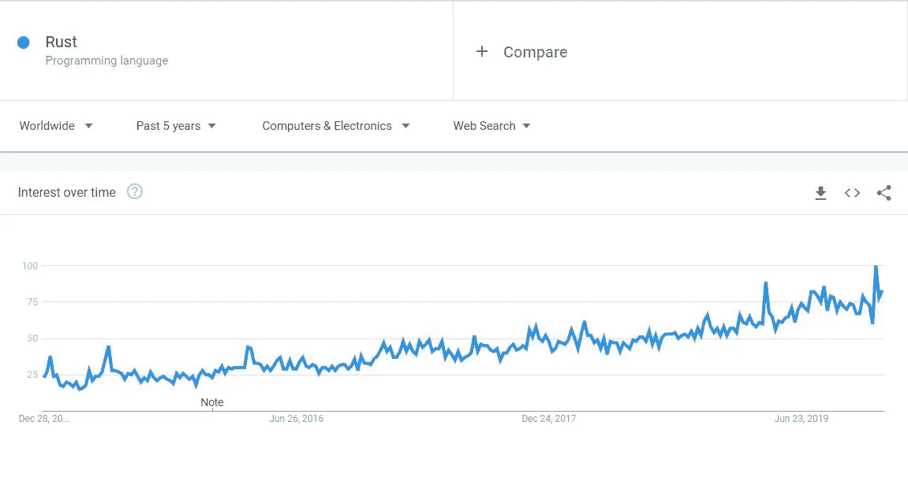

Source: Google Trends

**主要使用案例:**

*   系统程序设计
*   无服务器计算
*   商业应用

**主要竞争对手语言:**

*   C
*   C++
*   去
*   迅速发生的

# 去

Source: Wikimedia

谷歌是最大的网络规模公司之一。本世纪初，Google 曾面临过两个缩放问题:**开发缩放和应用缩放**。开发规模意味着他们不能通过投入更多的开发人员来增加更多的特性。应用程序伸缩性意味着他们不容易开发一个可以伸缩到“Google”规模的机器集群的应用程序。大约在 2007 年，谷歌开始创造一种新的“**实用的**编程语言，可以解决这两个缩放问题。在 **Rob Pike** (UTF-8)和 **Ken Thompson** (UNIX 操作系统)，他们有两个世界上最有才华的软件工程师来创造一种新的语言。

2012 年，谷歌发布了第一个官方版本的 **Go** 编程语言。Go 是一种系统编程语言，但不同于 Rust。它还有一个运行时和垃圾收集器(几兆字节)。但是与 Java 或 Python 不同，这个运行时打包了生成的代码。最终，Go 生成一个单独的本机二进制代码，可以在机器上运行，而不需要额外的依赖或运行时。

**主要特性:**

*   Go 拥有一流的并发支持。它没有通过线程和锁提供“**共享内存**”的并发性，因为编程要困难得多。相反，它提供了一个基于 CSP 的消息传递并发性(基于东尼·霍尔的论文)。Go 使用“ **Goroutine** ”(轻量级绿色线程)和“**通道**”进行消息传递。
*   围棋最大的杀手锏就是简单。它是最简单的系统编程语言。一个新的软件开发人员可以像 Python 一样在几天内编写出高效的代码。一些最大的云原生项目( **Kubernetes，Docker** )是用 Go 编写的。
*   Go 还具有嵌入式垃圾收集器，这意味着开发人员不需要像 C/C++那样担心内存管理。
*   谷歌在围棋上投入了大量资金。因此，Go 拥有大量的工具支持。对于新的围棋开发者来说，有一个庞大的工具生态系统。
*   通常，开发人员花 20%的时间编写新代码，80%的时间维护现有代码。由于其简单性，Go 在语言维护领域表现出色。如今，围棋在商业应用中被大量使用。

**人气:**

自从 Go first 出现以来，软件开发社区已经欣然接受了它。在 **2009** (刚出道不久)和 **2018** ，Go 已经由 [**TIOBE 指数**](https://www.tiobe.com/tiobe-index/) 进入**编程语言名人堂**榜单。难怪 Go 的成功为 Rust 这样的新一代编程语言铺平了道路。

Go 已经是主流编程语言了。最近，Go 团队宣布了对“ **Go 2** ”的工作，只是为了让语言更加扎实:

在几乎所有比较网站的流行编程语言中，Go 排名都很高，已经超过了很多现有的语言。以下是 2019 年 12 月的 **TIOBE 指数**评级，Go 排名第 15 位:

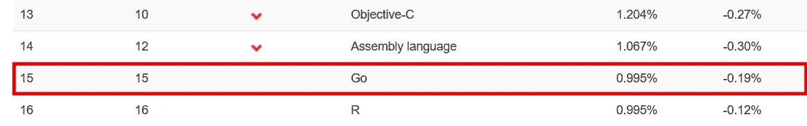

Source: TIOBE

根据 Stackoverflow 的调查，Go 是十大最受欢迎的编程语言之一:

Source: [Stackoverflow](https://insights.stackoverflow.com/survey/2019#most-loved-dreaded-and-wanted)

根据 GitHub Octoverse 的调查，Go 也是十大发展最快的语言之一:

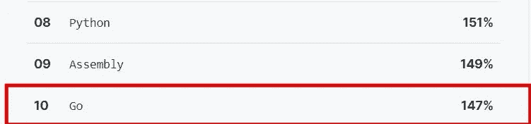

Source: [Octoverse](https://octoverse.github.com/)

Google trends 还显示，在过去五年中，围棋的发展势头越来越猛:

Source: Google Trends

**主要使用案例:**

*   系统程序设计
*   无服务器计算
*   商业应用
*   云原生开发

**主要竞争对手语言:**

*   C
*   C++
*   锈
*   计算机编程语言
*   Java 语言(一种计算机语言，尤用于创建网站)

# 科特林

Java 是无可争议的企业软件开发之王。最近，Java 成了众矢之的:它冗长，需要大量样板代码，容易出现意外的复杂性。但是关于 **Java 虚拟机(JVM)** 的争论很少。JVM 是软件工程的杰作，它提供了一个久经沙场的运行时，通过了时间的考验。在之前的一篇文章中，我已经详细讨论了 JVM 的优势:

 [## 控制数据密集型(大数据+快速数据)框架的编程语言。

### 大数据框架概述

towardsdatascience.com](/programming-language-that-rules-the-data-intensive-big-data-fast-data-frameworks-6cd7d5f754b0) 

多年来，像 **Scala** 这样的 JVM 语言试图回答 Java 的缺点，想要成为更好的 Java，但是失败了。最后，在 Kotlin 中，对更好的 Java 的探索似乎结束了。Jet Brains(流行的 IDE IntelliJ 背后的公司)开发了 Kotlin，它运行在 JVM 上，解决了 Java 的缺点，并提供了许多现代功能。最棒的是，与 Scala 不同， **Kotlin 比 Java 简单得多，并在 JVM 中提供了类似 Go 或 Python 的开发效率。**

谷歌已经宣布 Kotlin 是开发 Android 的一流语言，并提高了 Kotlin 在社区中的接受度。同样热门的 **Java 企业框架 Spring** 从 2017 年开始在 Spring 生态系统中支持 Kotlin。我用过 Kotlin 的反作用力弹簧，体验非常棒。

**主要特点:**

*   Kotlin 的 USP 是它的语言设计。我总是将 Kotlin 视为 JVM 上的 Go/Python，因为它的代码干净、简洁。因此，科特林的生产力很高。
*   像许多其他现代语言一样，Kotlin 提供了空指针安全、类型推断等特性。
*   由于 Kotlin 也运行在 JVM 中，所以可以使用现有的庞大的 Java 库生态系统。
*   Kotlin 是开发 Android App 的一流语言，早已超越 Java 成为开发 Android App 的头号编程语言。
*   Kotlin 由 JetBrains 和开源软件支持。因此，Kotlin 拥有出色的工具支持。
*   有两个有趣的项目: **Kotlin Native** (将 Kotlin 编译成本机代码)和 **kotlin.js** (Kotlin 转 JavaScript)。如果他们成功了，那么 Kotlin 可以在 JVM 之外使用。
*   Kotlin 还提供了一种简单的方法来编写 DSL(领域特定语言)

**人气:**

自 2015 年首次发布以来，Kotlin 的人气正在飙升。根据堆栈溢出，Kotlin 是 2019 年第四大最受欢迎的编程语言:

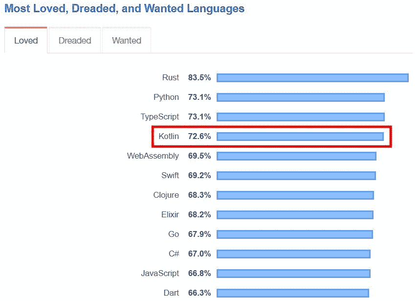

Source: [Stackoverflow](https://insights.stackoverflow.com/survey/2019#most-loved-dreaded-and-wanted)

Kotlin 也是发展最快的编程语言之一，排名第四:

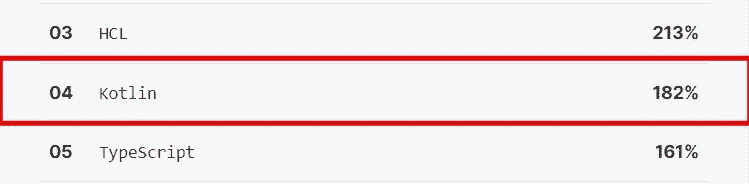

Source: Github Octoverse

流行编程语言排名网站 PyPl 将 Kotlin 列为第 12 大最流行编程语言，并呈现出**高上升趋势**:

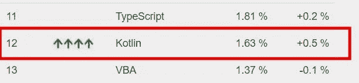

Source: [Pypl](http://pypl.github.io/PYPL.html)

自从谷歌宣布 Kotlin 是开发 Android 应用的一流语言以来，Kotlin 在趋势方面经历了巨大的积极推动，如下所示:

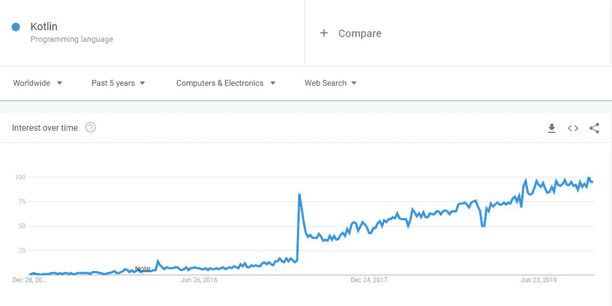

Source: Google Trends

**主要使用案例:**

*   企业应用
*   Android 应用程序开发

**主要竞争对手语言:**

*   Java 语言(一种计算机语言，尤用于创建网站)
*   斯卡拉
*   计算机编程语言
*   去

# 以打字打的文件

JavaScript 是一种优秀的语言，但 2015 年以前的 JavaScript 有许多缺点。甚至著名的软件工程师**道格拉斯·克洛克福特**也写了一本书**“JavaScript:好的部分”**并暗示 JavaScript 有**不好的部分和丑陋的部分**。没有模块化和“回调地狱”，开发人员不喜欢维护特别大的 JavaScript 项目。

谷歌甚至开发了一个将 Java 代码转换成 JavaScript 代码的平台( **GWT** )。许多公司或个人试图开发更好的 JavaScript，例如 **CoffeeScript、Flow、ClojureScript** 。但是微软的 TypeScript 可以说是中了大奖。由著名的**安德斯·海尔斯伯格(Delphi、Turbo Pascal、C#)领导的一组微软工程师**创建了 TypeScript，作为 JavaScript 的静态类型化、模块化超集。

TypeScript 在编译期间被转换为 JavaScript。它于 2014 年首次发布，迅速吸引了社区的关注。Google 当时也计划开发一个静态类型的 JavaScript 超集。谷歌对 TypeScript 印象深刻，他们没有开发新的语言，而是与微软合作改进 TypeScript。

Google 已经使用 TypeScript 作为其 SPA 框架的主要编程语言 **Angular2+** 。此外，流行的 SPA 框架 **React** 提供了对 TypeScript 的支持。另一个流行的 JavaScript 框架 Vue.js 已经宣布他们将使用 TypeScript 开发新的 **Vue.js** 3:

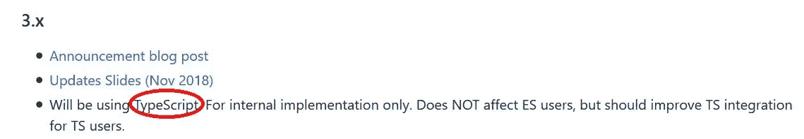

Source: [Vue.js Roadmap](https://github.com/vuejs/roadmap)

此外，node.js 创建者 **Ryan Dahl** 已经决定使用 TypeScript 来开发一个安全的 **Node.js** 替代方案 **Deno** 。

**主要特性:**

*   就像列表中的 Go 或 Kotlin 一样，TypeScript 的主要特征是语言设计。凭借其简洁明了的代码，**它是最优雅的编程语言之一**。就开发者生产力而言，在 JVM 或 Go/Python 上与 Kotlin 不相上下。TypeScript 无疑是最高效的 JavaScript 超集。
*   TypeScript 是 JavaScript 的强类型超集。它特别适合大型项目，被恰当地称为“可扩展的 JavaScript”。
*   “三巨头”单页面应用程序框架( **Angular，React，Vue.js** )为 TypeScript 提供了出色的支持。在 Angular 中，TypeScript 是首选的编程语言。在 React 和 Vue.js 中，TypeScript 越来越受欢迎。
*   两个最大的科技巨头:微软和谷歌(T21)正在合作开发由活跃的开源社区支持的 TypeScript。因此，对 TypeScript 的工具支持是最好的之一。
*   由于 TypeScript 是 JavaScript 的超集，它可以在 JavaScript 运行的地方运行:**无处不在**。TypeScript 可以在**浏览器、服务器、移动设备、物联网设备和云**上运行。

**人气:**

开发人员喜欢 TypeScript 优雅的语言设计。在 Stackoverflow 开发者调查中，它在最受欢迎的语言类别中与 Python 并列第二:

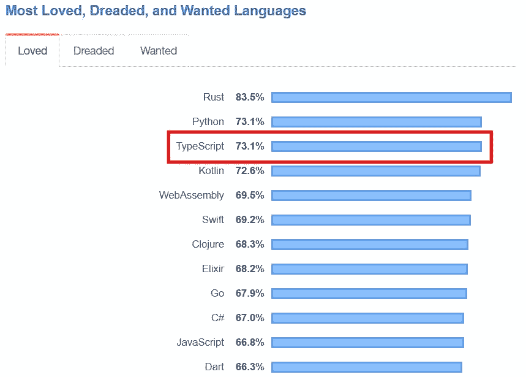

Source: [Stackoverflow](https://insights.stackoverflow.com/survey/2019#most-loved-dreaded-and-wanted)

TypeScript 是发展最快的 Web 编程语言之一，根据 GitHub Octoverse 排名第五:

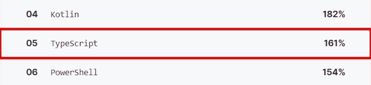

Source: [Octoverse](https://octoverse.github.com/)

根据 GitHub 的贡献，TypeScript 也进入了前 10 名(排名第 7):

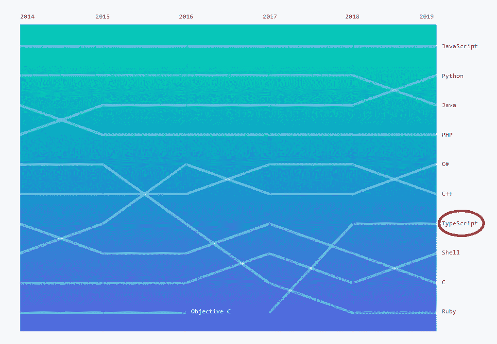

Source: [Octoverse](https://octoverse.github.com/)

TypeScript 在过去的一年里吸引了越来越多的眼球，这从 Google Trends 中可以看出:

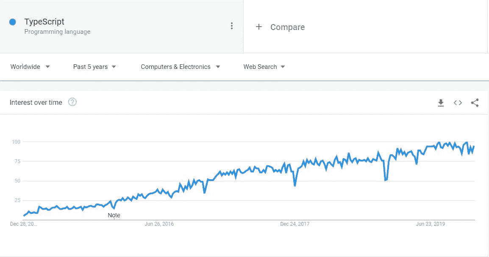

Source: Google Trends

**主要使用案例:**

*   Web UI 开发
*   服务器端开发

**主要竞争对手语言:**

*   Java Script 语言
*   镖

# 迅速发生的

史蒂夫·乔布斯(Steve Jobs)拒绝在 iOS 系统中支持 **Java** (和 JVM ),因为他引用了一句著名的话:Java 不再是主流编程语言。我们现在知道史蒂夫·乔布斯对 Java 的评估是错误的，但 iOS 仍然不支持 Java。相反，苹果选择了 **Objective-C** 作为 iOS 的一流编程语言。Objective-C 是一种很难掌握的语言。此外，它不支持现代编程语言所要求的高开发效率。

在苹果，**克里斯·拉特纳**和其他人开发了 **Swift** 作为一种多范式、通用的编译编程语言，提供了 Objective-C 的替代方案。Swift 的第一个稳定版本于 2014 年发布。Swift 还支持 **LLVM** 编译器工具链(同样由**克里斯·拉特纳**开发)。Swift 与 Objective-C 代码库具有出色的互操作性，并且已经成为 iOS 应用程序开发的主要编程语言。

**主要特点:**

*   Swift 的杀手锏之一是它的语言设计。凭借更简单、简洁和清晰的语法，它为 Objective-C 提供了一个更高效的替代方案。
*   Swift 还提供了现代程序语言的特性:空安全。此外，它还提供了避免“**末日金字塔**”的句法糖。
*   作为编译语言，Swift 和 C++一样快。
*   Swift 支持 LLVM 编译器工具链。所以，我们可以在服务器端编程甚至浏览器编程(使用 WebAssembly)中使用 Swift。
*   Swift 提供**自动引用计数(ARC)** 支持，从而限制内存管理不当。

**人气:**

开发人员喜欢 Swift 编程语言，就像许多其他现代语言一样。根据 StackOverflow 的调查，Swift 在最受欢迎的编程语言中排名第六:

在 TIOBE 的编程语言排名中，Swift 在 2019 年已经移动到了数字 10 的排名。考虑到这种语言是多么年轻(5 年)，这是一个了不起的成就:

Source: TIOBE Index

Google 趋势还显示 Swift 的受欢迎程度急剧上升，随后在最近几个饱和期趋势略有下降:

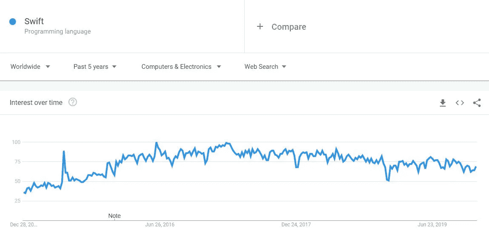

Source: Google Trends

**主要使用案例:**

*   iOS 应用程序开发
*   系统程序设计
*   客户端开发(通过 WebAssembly)

**主要竞争对手语言:**

*   目标-C
*   锈
*   去

# 镖

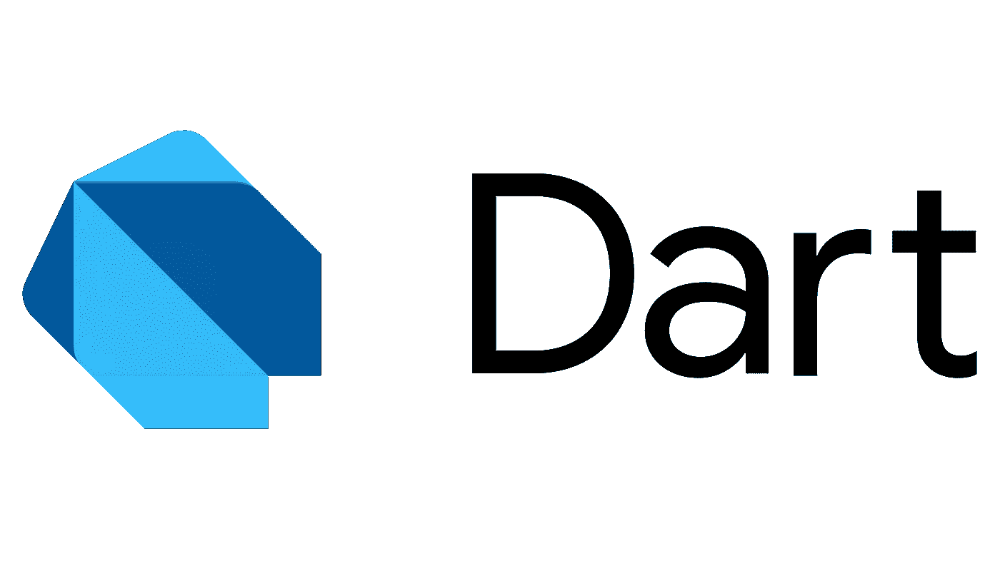

**Dart** 是 Google 做的这个列表中的第二种编程语言。谷歌是 Web 和 Android 领域的关键参与者，谷歌在 Web 和应用程序开发领域开发自己的编程语言也就不足为奇了。在丹麦著名软件工程师 **Lars Bak(他领导了 Chrome 的 V8 JavaScript 引擎的开发)**的带领下，谷歌已经在 2013 年发布了 Dart。

Dart 是一种通用编程语言，支持强类型和面向对象编程。Dart 还可以转换为 JavaScript，可以在 JavaScript 运行的地方运行，这意味着几乎可以在任何地方运行(例如 Web、移动设备、服务器)。

**主要特点:**

*   像其他 Google 语言 Go 一样，Dart 也非常注重开发人员的生产力。Dart 非常高效，并且因为其干净、简单、简洁的语法而受到开发人员的喜爱。
*   Dart 还提供强类型和面向对象编程。Dart 也是这个列表中的第二种语言，它符合“**可伸缩 JavaScript** 标签。
*   Dart 是少数支持 **JIT 编译(运行时编译)和**AOT 编译(创建时编译)的语言之一。因此，Dart 可以以 JavaScript 运行时(V8 引擎)为目标，并且 Dart 可以被编译为快速本机代码(AOT 编译)
*   **跨平台原生应用开发平台 Flutter** 选择 Dart 作为开发 iOS 和 Android 应用的编程语言。从那以后，Dart 变得更加流行。
*   和其他 Google 编程语言 Go 一样，Dart 也有优秀的工具支持和庞大的 Flutter 生态系统。 **Flutter** 越来越受欢迎只会增加 Dart 的采用。

**人气:**

根据 Github Octoverse 的数据，Dart 是 2019 年增长最快的编程语言**，其受欢迎程度在去年翻了五倍**:

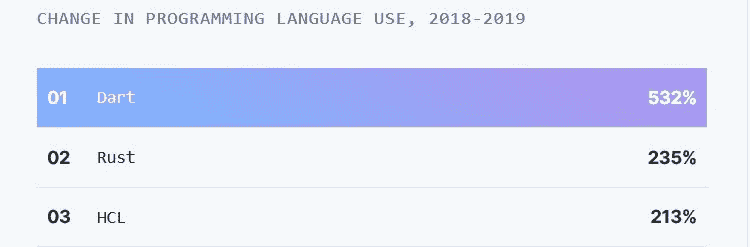

根据 TIOBE 指数，Dart 排名第 23 位，仅用了 4 年时间就已经超过了许多现有的和现代的编程语言:

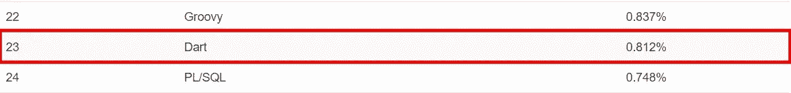

Source: TIOBE index

它也是最受欢迎的编程语言之一，在 StackOverflow 开发者调查中排名第 12 位:

Source: StackOverflow

与 Flutter 一样，Dart 在过去两年中也经历了巨大的牵引力，这一点从 Google Trends 中可以清楚地看出:

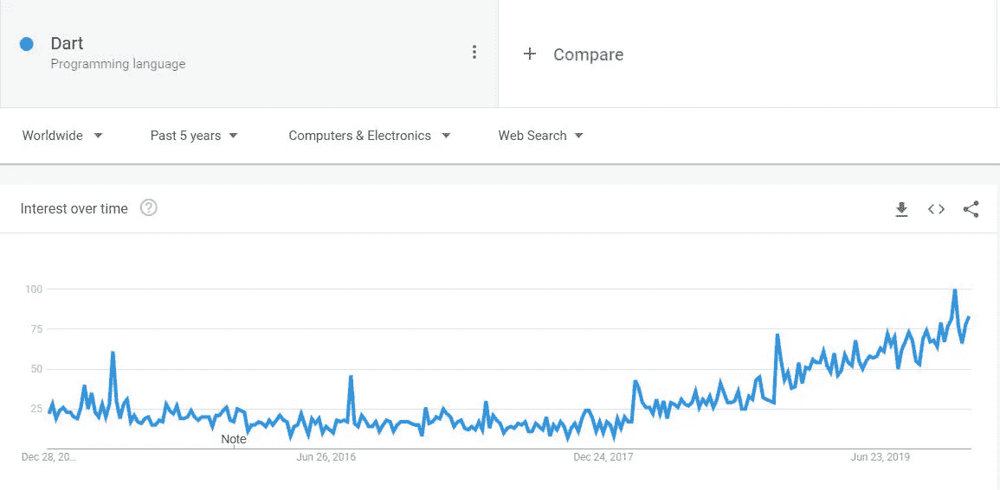

Source: Google Trends

**主要使用案例:**

*   应用程序开发
*   UI 开发

**主要竞争对手语言:**

*   Java Script 语言
*   以打字打的文件

# 朱莉娅

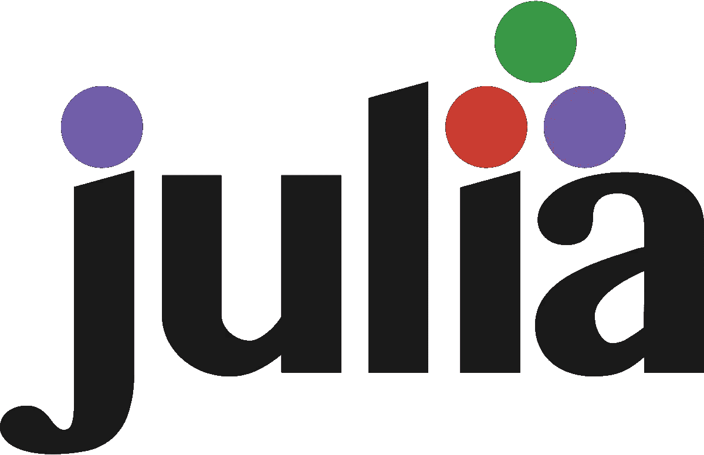

列表中的大多数编程语言都是由大公司开发的，除了 Julia。在**技术计算**中，通常使用像 **Python、Matlab** 这样的动态语言。这些语言提供了易于使用的语法，但不适合大规模的技术计算。他们使用 C/C++库来完成 CPU 密集型任务，这就产生了著名的**双语**问题，因为他们需要**胶水代码**来绑定两种语言。当代码在两种语言之间翻译时，总会有一些性能损失。

为了解决这个问题，麻省理工学院的一组研究人员计划从头开始创建一种新的语言，它利用现代硬件的优势，并结合了其他语言的最佳部分。他们在麻省理工学院创新实验室工作，有以下宣言:

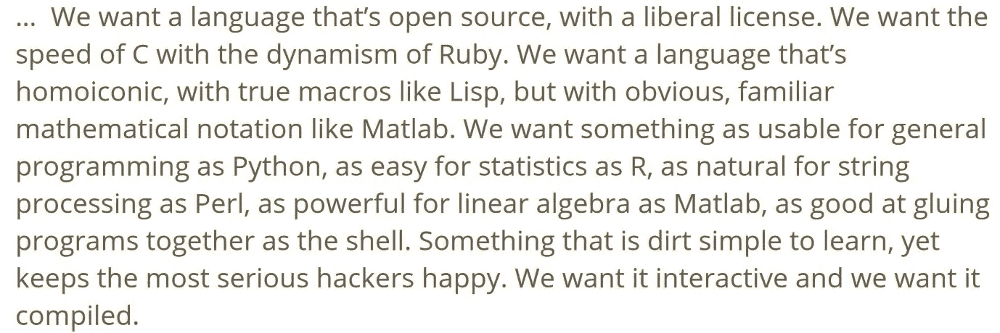

Source: [Julia Presentation](https://genome.sph.umich.edu/w/images/3/3e/Julia_presentation.pdf)

Julia 是一种动态的高级编程语言，为并发、并行和分布式计算提供一流的支持。Julia 的第一个稳定版本于 2018 年**发布，并很快受到社区和行业的关注。Julia 可以用于科学计算、人工智能和许多其他领域，并且**可以最终解决“双语”**问题。**

**功能:**

*   像 Rust 一样，Julia 的主要特点是语言的设计。它试图在不牺牲性能的情况下，结合现有编程语言在高性能和科学计算方面的一些最佳特性。到目前为止，它做得很好。
*   Julia 是一种动态编程语言，具有可选类型。因此，Julia 很容易学习编程语言，而且生产率很高。
*   它在其核心使用了**多分派**编程范例。
*   它内置了对**并发、并行和分布式计算**的支持。
*   它还为 I/O 密集型任务提供了**异步 I/O** 。
*   它快得惊人，可以用在需要数百万线程的科学计算中。

**人气:**

Julia 主要在很多领域与 Python 竞争。由于 Python 是最流行的编程语言之一，Julia 将成为主流还需要几年时间。

朱莉娅相对较新(只有一岁)，但在 TIOBE 指数中仍排在第 43 位:

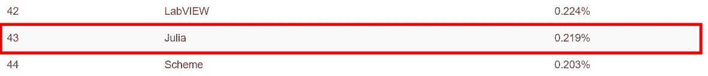

Source: TIOBE

谷歌趋势也显示了多年来对朱莉娅的稳定兴趣。

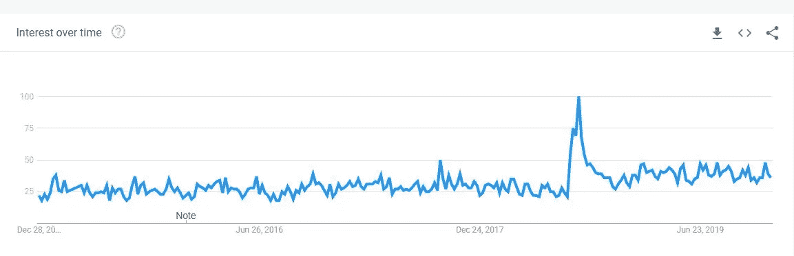

但是考虑到功能集和支持 Julia 的公司数量，如 **NSF、DARPA、NASA、Intel、**，Julia 取得突破只是时间问题，而不是如果:

**主要使用案例:**

*   科学计算
*   高性能计算
*   数据科学
*   形象化

**主要竞争对手语言:**

*   计算机编程语言
*   矩阵实验室

如果你觉得这很有帮助，请分享到你最喜欢的论坛上( **Twitter，LinkedIn，脸书**)。

如果你对编程语言感兴趣，也可以看看我下面的文章:

 [## 关于 2021 年软件发展趋势的 21 个预测

### 云、边缘、容器、量子、区块链、AI、深度学习、批处理、流媒体、数据库、编程、软件……

towardsdatascience.com](/21-predictions-about-the-software-development-trends-in-2021-600bfa048be)  [## 2020 年最受欢迎的 10 种编程语言

### 针对求职者和新开发人员的顶级编程语言的深入分析和排名

medium.com](https://medium.com/@md.kamaruzzaman/top-10-in-demand-programming-languages-to-learn-in-2020-4462eb7d8d3e)  [## 2020 年前端开发的五大热门 JavaScript 框架

### 为前端开发人员、求职者和其他人提供的顶级 JavaScript 框架的深入分析和排名

medium.com](https://medium.com/javascript-in-plain-english/top-5-in-demand-javascript-frameworks-for-front-end-development-in-2020-a59c4340d082)