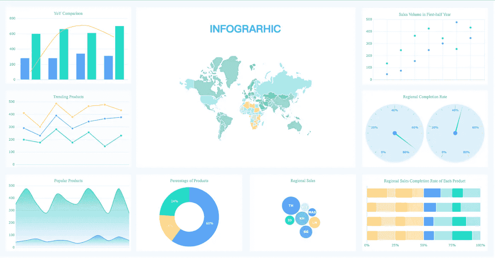
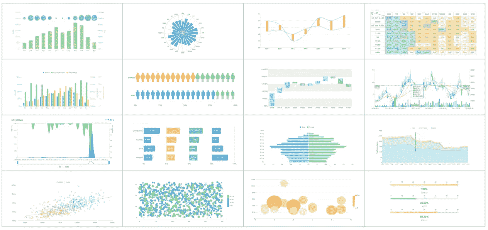
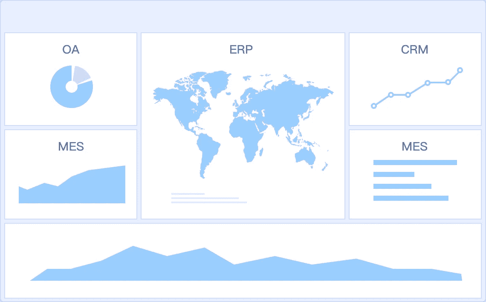

# 2019 年数据可视化软件的 7 大趋势

> 原文：<https://towardsdatascience.com/top-7-trends-in-data-visualization-software-for-2019-c4b13e783844?source=collection_archive---------19----------------------->

数据提取和数据管理是公司在当今世界面临的两大挑战。业务流程中从数据到信息的转换有助于实现业务目标。它的组织和分类是业务流程中的主要障碍。数据可视化软件就是为了克服这些障碍而诞生的。

Data visualization from [FineReport](https://www.finereport.com/en/?utm_source=medium&utm_medium=media&utm_campaign=blog&utm_term=Top%207%20Trends%20in%20Data%20Visualization%20Software%20for%C2%A02019)

数据来自不同的来源，并且是在不同的时间或时期收集的。一个[信息代理](https://www.cleverism.com/how-to-become-an-information-broker/?fbclid=IwAR0mA9LuxsLZx10n-F2SlTuq_GTS9bFXvpRrzLh5zB7JZKJFOkqEjEb2R3g)通过提供他们的数据需求来帮助企业。从不同时间段收集的[数据的累积问题是对组织的数据管理技能的考验。目前，该软件提供数据管理辅助业务。](https://www.finereport.com/en/features/data-integration?utm_source=medium&utm_medium=media&utm_campaign=blog&utm_term=Top%207%20Trends%20in%20Data%20Visualization%20Software%20for%C2%A02019)

# 1.什么是数据可视化软件？

用于处理大量数据的软件也提供数据可视化功能。[数据可视化](https://www.finereport.com/en/features/data-visualization?utm_source=medium&utm_medium=media&utm_campaign=blog&utm_term=Top%207%20Trends%20in%20Data%20Visualization%20Software%20for%C2%A02019)是分组数据的图形化表示，有助于用户制定有效及时的决策。顶级数据可视化实践由标准化的过程、数据可视化的清晰分组、数据分析和数据呈现组成。在未来，预期的顶级数据可视化实践将是将在分析过程中使用的数据的故事化。

数据可视化软件有助于增加组织内部和外部收集的数据的价值。它帮助企业收集相关数据、制定策略和改进业务流程。该软件还通过创建每日、每周、每月、每年销售额的图形表示，帮助销售部门监控销售信息。这也可以为决策者生成报告。

据 [Cision 美通社](https://www.prnewswire.com/news-releases/global-data-visualization-market-report-2019-300890327.html)报道，数据可视化市场的 CARG 预计将超过 9%。预测期为 2019 年至 2024 年。

公司必须了解其在数据管理和数据可视化方面的具体需求。这有助于企业确定满足其独特需求的最佳数据可视化工具。

拥有大量数据的企业需要强大的数据可视化软件。大数据可视化工具提供多种功能，为组织提供数百种优势和有效帮助。

公司必须拥有有竞争力的项目管理开发人员和系统，以实现有效的数据可视化。对于开发人员来说，最好的在线项目管理软件应该能够帮助开发人员满足竞争和更新的技术需求。它应该能够帮助解决开发人员的问题，如延迟、糟糕的结果和超预算。

因此，了解[什么是云服务器](http://www.smallbusinessbrief.com/technology-software/what-are-cloud-servers-and-how-exactly-do-they-work/?fbclid=IwAR2mPhwP3muVEGDR4a3D4IfK-aqQ2l6644swXzv3klVdeAdofQ21jK1hvTs)以及它们对数据可视化的影响是很重要的。云服务器是基于计算机的服务器，采用云计算技术。它提供了高科技的硬件和软件集成的可能性，以有效地协助其用户的日常运作。

# 2.数据可视化软件的重要特性

互联网上提供了多个[数据可视化工具](/9-data-visualization-tools-that-you-cannot-miss-in-2019-3ff23222a927)示例。这些工具的价格、功能、特性和设计各不相同。

以下是数据可视化软件拥有的重要功能。

## **2.1 各种图形设计**

数据可视化软件是一个有用的营销工具，配备了额外的和更新的图形模板和设计。这不仅将为数据提供有效的分类和安排，而且还将支持其用户的创造性。

数据可视化软件中可用的常见图形有饼图、条形图和折线图。对于软件来说，在图形上具有标记功能也是可取的。

## **2.2 准确的趋势跟踪**

数据可视化软件应该具备准确跟踪趋势的能力。该功能有助于跟踪企业所属行业的最新趋势。

## **2.3 强安全性**

通过收集、整理和分类从数据处理中获得的信息的完整性对于准确的分析和决策非常重要。

数据保护对于保护机密和来之不易的数据非常重要。如果软件中没有足够的安全措施，丢失数据的风险就会增加。丢失的数据会导致额外的现金流出。

## **2.4 简单界面**

用户更喜欢用户友好的软件，以缩短学习曲线。应该很容易操作和学习。在选择数据可视化软件时，应考虑软件主要操作员的知识和技能。

还应该有易于理解的手册，提供正确使用设备的基本提示。该手册还将允许公司立即[将软件](https://www.finereport.com/en/features/deploy-and-integration?utm_source=medium&utm_medium=media&utm_campaign=blog&utm_term=Top%207%20Trends%20in%20Data%20Visualization%20Software%20for%C2%A02019)集成到其系统中。

# 3.数据可视化软件的最新趋势

由于企业与计算机的相互依赖，数据的复杂性已经成为在业务流程中集成数据可视化软件的主要原因。数据可视化软件是无数创作者开发的。软件的设计取决于市场的最新趋势。

以下是数据可视化软件的最新趋势。

## **3.1 响应和交互分析**

敏捷响应用户命令的软件正在成为当前市场上大多数数据可视化软件的重要特征。这包括在创建仪表板和图形插图时实现拖放式用户界面。

Drag-and-drop operation of [FineReport](https://www.finereport.com/en/?utm_source=medium&utm_medium=media&utm_campaign=blog&utm_term=Top%207%20Trends%20in%20Data%20Visualization%20Software%20for%C2%A02019)

交互式[仪表盘](https://www.finereport.com/en/features/tv-dashboard?utm_source=medium&utm_medium=media&utm_campaign=blog&utm_term=Top%207%20Trends%20in%20Data%20Visualization%20Software%20for%C2%A02019)支持软件网络内的主动通信。交互式仪表板有助于企业与员工、业务伙伴和公司客户有效沟通。

## **3.2 深入分析原始数据，以便及时决策**

数据可视化软件的这一趋势被各种规模的企业比作希望根据快速的原始数据分析做出及时决策。一个能够使用 SQL 来整理非结构化数据的软件展示了一个强大的智能平台。

通用数据建模语言的使用带来了令人印象深刻的可视化效果和流畅的数据整合活动。即时报告生成也是该软件的一个众所周知的功能。

## **3.3 将数据整合到一个平台，以便对数据进行强大的分析**

数据可视化软件的这种趋势允许安全地共享来自一个组织的所有不同部门的全部数据。这也支持完整的注释和实时数据更新。

它还通过实施更吸引人的图形工具和设计来提供有效的数据分析。通过快速创建展示业务流程和工作描述的可视化工具，组织的团队成员将更有效地开展日常工作。

## **3.4 有用工具的可用性**

许多公司购买的软件拥有各种工具，如 KPI 小部件、数据透视表和表格视图组件。这些是[报告生成](https://www.finereport.com/en/reporting-tools/report-generation.html?utm_source=medium&utm_medium=media&utm_campaign=blog&utm_term=Top%207%20Trends%20in%20Data%20Visualization%20Software%20for%C2%A02019)中的有用工具。

这种类型的软件通过实现准确、完整和及时的报告创建和决策制定来支持团队协作。这也允许在公司的网站、博客和应用程序中插入任何报告或仪表板。

## **3.5 可通过台式电脑和移动设备访问**

它可以将桌面计算机上的数据链接、绘制图表并共享到移动设备上。仪表板可以与团队成员共享，并通过台式计算机、笔记本电脑和/或移动设备(如智能手机和平板电脑)进行分析。

## **3.6 社交协作**

仪表板为正在使用软件的团队成员提供了更有效的协作工作的实时数据。它还拥有多功能小部件、迷你图和趋势指示器，以帮助团队理解数据可视化。

数据可视化软件的用户到用户消息传递功能支持软件用户之间的有效通信。这种社交分享功能是团队成员之间成功传递信息的一个有益因素。

## **3.7 设置默认值并自定义数据连接器和模板**

用于对公司收集的数据进行分类和排列的图形可视化设计也为大多数软件购买者树立了一种趋势。一些软件的定制功能允许用户根据他们的需要操作数据连接器和图形模板。

# 4.数据可视化软件:变化是迅速的

单个数据可视化软件拥有多种功能组合。数据可视化软件的最新趋势集中在图形设计和模板可用性、交互功能、快速数据转换、数据分析辅助、有用工具的可用性、设备可访问性(如桌面和移动设备软件兼容性)、团队通信支持和定制功能。这些是全球数据可视化工具市场的最新趋势。随着技术进步日新月异，它每年都在发生变化。

> 在文章的最后，我列举了一些数据可视化的学习资料，希望对你有所帮助！

> ***数据可视化采集:***
> 
> [2019 年你不能错过的 9 款数据可视化工具](/9-data-visualization-tools-that-you-cannot-miss-in-2019-3ff23222a927)
> 
> 初学者如何设计酷的数据可视化？
> 
> [什么是大屏幕数据可视化，如何实现？](/what-is-data-visualization-for-large-screen-and-how-to-implement-it-1d79cf07783)
> 
> [4 个参数查询功能，让您的数据可视化互动](/4-parameter-query-functions-to-make-your-data-visualization-interactive-bbd84dd6bafb)
> 
> ***仪表盘教程:***
> 
> [制作销售仪表板的分步指南](/a-step-by-step-guide-to-making-sales-dashboards-34c999cfc28b)
> 
> [新手如何打造一个很棒的仪表盘？](/how-can-beginners-create-a-great-dashboard-cf48c0f68cd5)
> 
> [商业仪表盘初学者指南](/a-beginners-guide-to-business-dashboards-981a8192a967)
> 
> [KPI 仪表盘完整指南](/a-complete-guide-to-kpi-dashboard-1cf22484a6eb)
> 
> ***数据可视化中的图表类型:***
> 
> [数据可视化中的前 16 种图表类型](/top-16-types-of-chart-in-data-visualization-196a76b54b62)
> 
> [数据可视化中的十大地图类型](/top-10-map-types-in-data-visualization-b3a80898ea70)
> 
> [4 数据地图在商业分析中的应用](/4-uses-of-data-maps-in-business-analysis-9f9589c3f69a)
> 
> [动态图表:让你的数据动起来](/dynamic-charts-make-your-data-move-19e540a06bd3)
> 
> [不写代码如何创建热图？](/how-to-create-a-heat-map-without-writing-code-e1d7b10cf33f)
> 
> [KPI 仪表板的前 7 种图表类型](/top-7-chart-types-for-kpi-dashboards-287fb84a8874)
> 
> [我用 Excel 做了一个动态飓风地图！](/i-made-a-dynamic-hurricane-map-with-excel-d3673135fdab)