# 除 Kaggle 之外的顶级竞争数据科学平台

> 原文：<https://towardsdatascience.com/top-competitive-data-science-platforms-other-than-kaggle-2995e9dad93c?source=collection_archive---------3----------------------->

Photo by [George Becker](https://www.pexels.com/@eye4dtail?utm_content=attributionCopyText&utm_medium=referral&utm_source=pexels) from [Pexels](https://www.pexels.com/photo/kick-chess-piece-standing-131616/?utm_content=attributionCopyText&utm_medium=referral&utm_source=pexels)

> 学习任何东西的最好方法是实践。

在你完成了数百门 MOOCs 课程、阅读了数千本书籍和笔记、听了一百万人慷慨激昂地讲述他们在数据科学领域的经历之后，你会做些什么？你开始应用这些概念。应用机器学习概念的唯一方法就是把手弄脏。要么在你感兴趣的领域找一些现实世界的问题，要么参加黑客马拉松和机器学习比赛。

竞争数据科学不仅仅是应用算法。算法本质上是一种工具，任何人都可以通过编写几行代码来使用它。参加这些比赛的主要收获是它们提供了一个很好的学习机会。当然，现实生活中的问题不一定与竞赛中提供的问题相同；尽管如此，这些平台使你能够将你的知识应用到流程中，并观察你与他人相比的表现。

# 参加数据科学竞赛的优势

参加这些比赛你会有很多收获，实际上也不会有什么损失。它有有形和无形的好处，如:

*   很好的学习机会。
*   接触最先进的方法和数据集。
*   与志同道合的人建立关系网。在团队中工作甚至更好，因为它有助于从不同的角度思考问题。
*   向世界展示你的才华和被录用的机会
*   参与并看看自己在排行榜上的表现也很有趣。
*   这个奖是奖金，但不应该是唯一的标准。

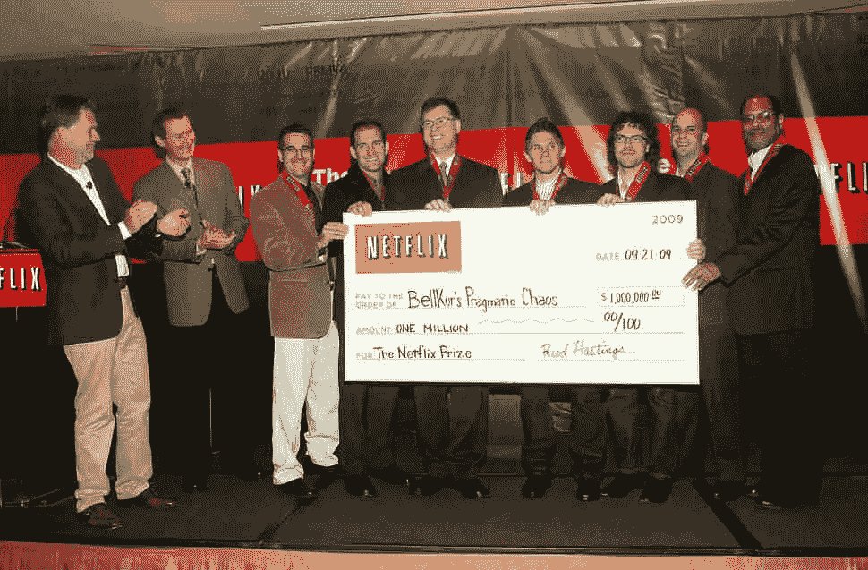

[On September 18, 2009, BellKor Pragmatic Chaos officially won the NetFlix competition by a tiebreaker.](https://www.thrillist.com/entertainment/nation/the-netflix-prize)

[**Kaggle**](https://www.kaggle.com/) 是[数据科学大赛](https://www.kaggle.com/competitions)的知名平台。这是一个拥有 100 多万注册用户的在线社区，包括新手和专家。不过，除了 Kaggle，还有其他数据挖掘竞赛平台值得了解和探索。以下是其中一些的简要概述。

# 驱动数据

[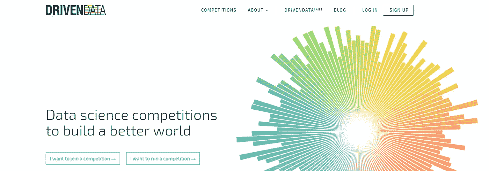](https://www.drivendata.org/)

[**DrivenData**](https://www.drivendata.org/) 举办数据科学竞赛以建设更美好的世界，为解决世界上最具挑战性的问题的组织带来尖端的预测模型。Driven data 在国际发展、卫生、教育、研究和保护以及公共服务等领域举办数据科学竞赛。你可以[参加比赛](https://www.drivendata.org/competitions/)或者[主持自己的比赛](https://www.drivendata.org/partners/)。

该网站有一个部分专门介绍[样本项目](http://Top Competitive Data Science Platforms other than Kaggle)，以案例研究的形式提供一些关于他们成功项目的信息。驱动数据中列出的数据集与非营利组织有关，从野生动物保护到公共卫生。因此，如果你想把你的技能应用到现实世界的问题中，这就是你的平台。

# CrowdANALYTIX

[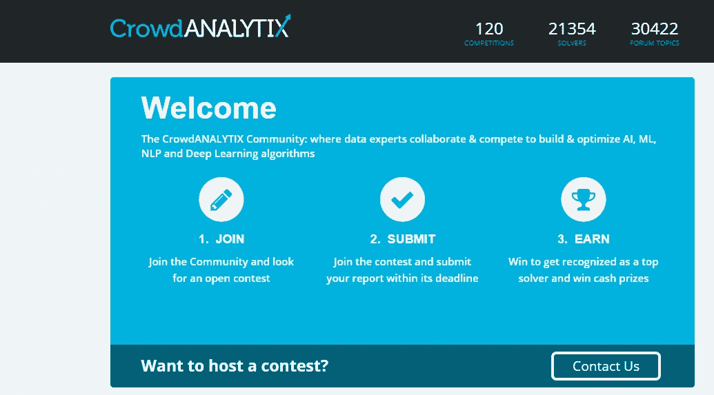](https://www.crowdanalytix.com/community)

[**CrowdANALYTIX**](https://www.crowdanalytix.com/community) 是一个将商业挑战和问题转化为竞争的众包分析平台。CrowdANALYTIX 社区合作&竞争构建&优化 AI、ML、NLP 和深度学习算法。该平台还拥有一个[社区博客](https://www.crowdanalytix.com/jq/communityBlog/listBlog.html),里面有很好的资源，包括采访和参考资料。

# 无辜的

[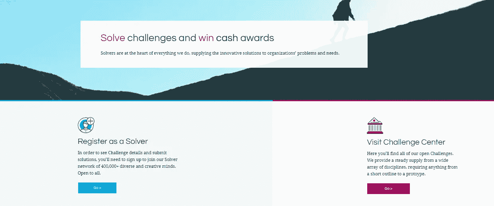](https://www.innocentive.com/our-solvers/)

[**InnoCentive**](https://www.innocentive.com/our-solvers/) 主要关注与生命科学有关的问题，但也有其他令人兴奋的比赛。在这里，Solvers 致力于解决一些世界上最紧迫的问题，从在家庭层面促进清洁水的获取到旨在吸引&杀死携带疟疾的蚊子的被动式太阳能设备。挑战是真正的问题，需要持续的专注、批判性思维、研究、创造力和知识综合。开发解决方案是令人难以置信的回报，也是无与伦比的精神锻炼。

# TunedIT

[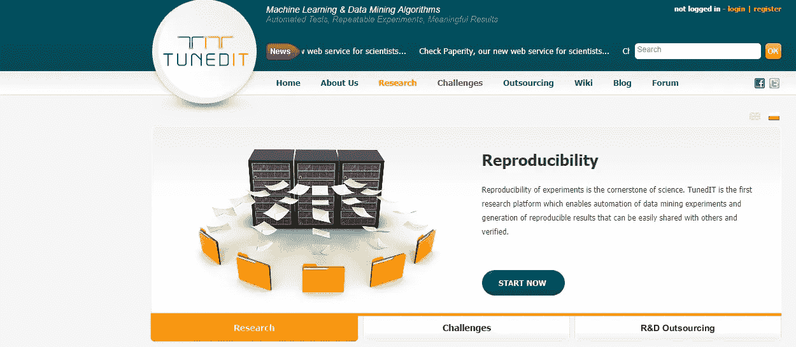](http://tunedit.org/)

[**TunedIT**](http://tunedit.org/challenges) 始于华沙大学进行的科学博士项目。目标是帮助数据挖掘科学家进行可重复的实验，并快速评估数据驱动的算法。研究部分后来补充了用于举办数据竞赛的 [TunedIT Challenges](http://tunedit.org/challenges) 平台——用于教育、科学和商业目的。

# Codalab

[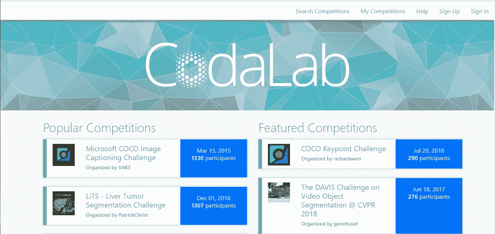](https://competitions.codalab.org/)

[**Codalab**](https://competitions.codalab.org/) 是一个开源的基于网络的平台，使研究人员、开发人员和数据科学家能够合作推进使用机器学习和高级计算的研究领域。CodaLab 通过其在线社区帮助解决了许多面向数据的研究中的常见问题，在那里人们可以分享[工作表](https://worksheets.codalab.org/)并参与竞争。您可以参加现有的比赛，也可以举办新的比赛。

# 津迪

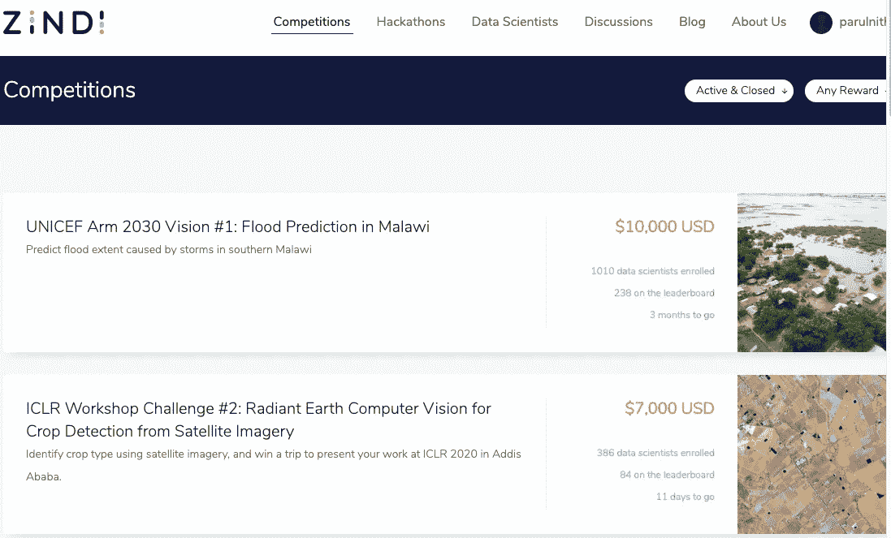

[Zindi](https://zindi.africa/about) 是非洲首个数据科学竞赛平台。Zindi 拥有一个完整的数据科学生态系统，由科学家、工程师、学者、公司、非政府组织、政府和机构组成，致力于解决非洲最紧迫的问题。

# 数据源。人工智能

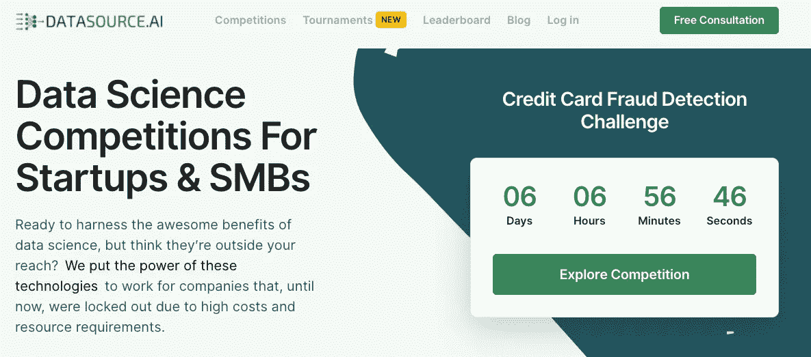

[https://www.datasource.ai/](https://www.datasource.ai/)

[DataSource.ai](https://www.datasource.ai/en) 是 SMB&创业公司的数据科学竞赛。他们试图解决数据科学竞赛领域的一个基本问题。众所周知，大多数数据科学竞赛平台都是针对大公司的。这主要是因为举办这类比赛的平台收取高额费用。这不利于数以百万计的中小企业和初创企业，它们可以从中受益匪浅。

Datasource.ai 的使命是使数据科学民主化。因此，他们让数据科学竞赛变得更加实惠。用他们自己的话说:

> 我们的目标是释放数据科学和人工智能活动的浪潮，使全球各种规模和预算的企业受益匪浅。

# Bitgrit

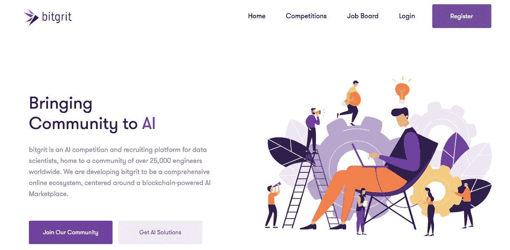

[https://bitgrit.net/competition](https://bitgrit.net/competition/)

[Bitgrit](https://bitgrit.net/competition/) 是今年推出的数据科学竞赛领域的新人。该平台由日本初创公司 [**Bitgrit Inc** 牵头。](https://bitgrit.net/)已经在全球积累了超过 25，000 名数据科学家。

自成立以来，Bitgrit 已经举办了几次人工智能比赛，包括一次预测外汇汇率的**和另一次为一个配置匹配移动应用程序优化算法的**。他们还有一个 [**工作委员会**](https://bitgrit.net/jobs/) 专注于为各种全球客户提供数据科学工作机会。****

# ****分析 Vidhya****

****[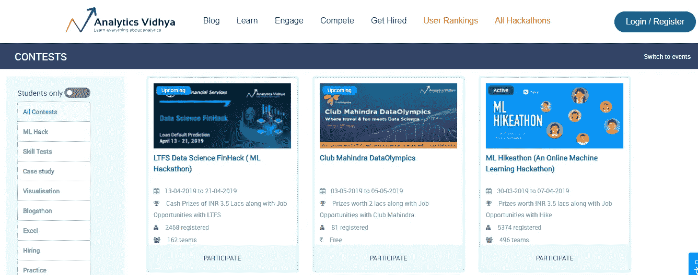](https://datahack.analyticsvidhya.com/?utm_source=main-logo)****

****[**分析 Vidhya**](https://datahack.analyticsvidhya.com/?utm_source=main-logo) 为分析和数据科学专业人士提供了一个基于社区的知识门户。除了为数据科学学习提供大量资源外，它还举办黑客马拉松，这是以竞赛形式发布的现实生活中的行业问题。你可以参加挑战，也可以赞助黑客马拉松。大多数在 Analytics Vidhya 上组织黑客马拉松的公司也向最高分者提供工作机会。****

# ****克劳代****

*****2020 年 3 月 17 日更新:*****

*****克劳代，即已自关机(见*[【https://www.crowdai.org/blogs/7】](https://www.crowdai.org/blogs/7)*)。从那以后，他们的创始人之一创建了另一个类似名字的网站，举办比赛:*[*https://www.aicrowd.com*](https://www.aicrowd.com/)*/。感谢*[*Harald Carlens*](https://www.linkedin.com/in/harald-carlens-b04b5b22/)*提供此信息。*****

****[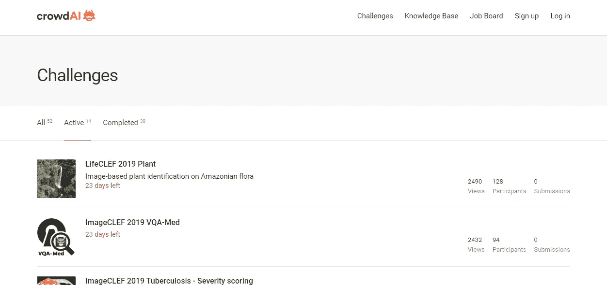](https://www.crowdai.org/challenges?challenge_filter=active)****

****数据科学挑战赛平台 [crowdAI](https://www.crowdai.org/challenges) 每年都会举办多个开放式数据科学挑战赛。这些挑战涵盖图像分类问题、文本识别、强化学习、对抗性攻击、图像分割、资源分配优化以及跨多个领域的许多其他领域。他们因 2017 年名为[“学习运行](https://www.crowdai.org/challenges/nips-2017-learning-to-run)”的挑战获得了亚马逊和英伟达超过 10 万美元的奖励。****

# ****数字****

****[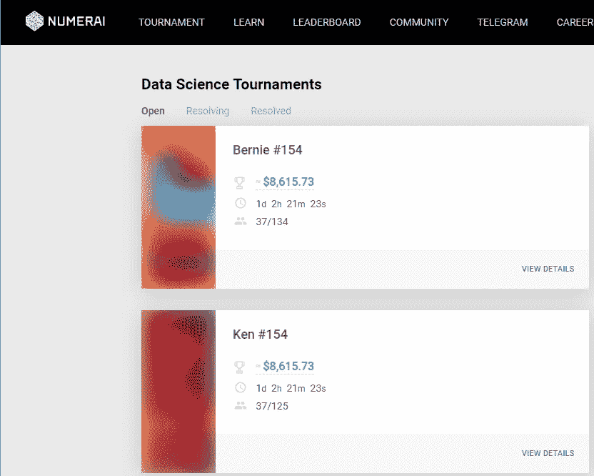](https://numer.ai/rounds)****

****[**numeri**](https://numer.ai/rounds)是一个由数据科学家网络建立的[AI](https://en.wikipedia.org/wiki/Artificial_intelligence)-运行、众包[对冲基金](https://en.wikipedia.org/wiki/Hedge_fund)。它每周举办一次数据科学竞赛，为真正的对冲基金提供动力。Numerai 每周向参与者提供加密数据，然后参与者提交他们的预测。Numerai 然后从所有提交的材料中创建一个元模型，并进行投资。****

****数据科学家提交他们的预测，以换取在以太坊区块链上获得一些******密码**令牌的潜力。********

# ****天池****

****[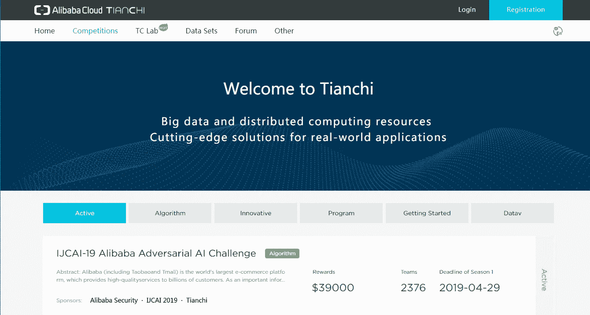](https://tianchi.aliyun.com/competition/gameList/activeList)****

****[**天池**](https://tianchi.aliyun.com/competition/gameList/activeList) **我**是阿里云旗下的一个数据竞赛平台，在很多方面和 Kaggle 很像。在这个社区中，成千上万的数据科学家与全球的企业和政府合作和联系，以解决跨行业最具挑战性的业务问题。****

# ****数据科学挑战****

****[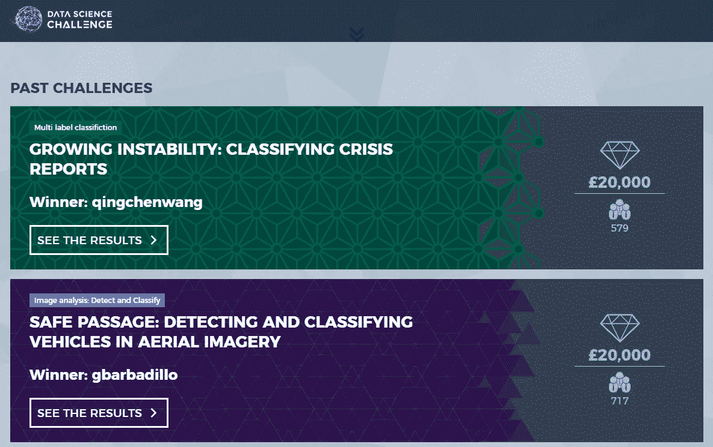](https://www.datasciencechallenge.org/)****

****这些[数据科学挑战](https://www.datasciencechallenge.org/)由**国防科学技术实验室** (Dstl)和其他几个**英国政府**部门主办，包括 [**政府科学办公室**](https://www.gov.uk/government/organisations/government-office-for-science) 、 [**SIS**](https://www.sis.gov.uk/) **、**和 **MI5** **。**这些挑战旨在鼓励数据科学领域最聪明的头脑帮助解决现实世界的问题。该平台提供的两个挑战目前已经结束，但它们很快会出现新的问题，这些问题将挑战您找到现实世界问题的非正统答案。****

****除此之外，还有一些比赛只是每年举行一次。****

## ****KDD 杯****

****[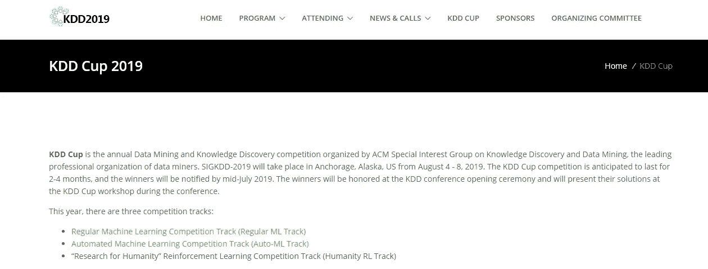](https://www.kdd.org/kdd2019/kdd-cup)****

****[**KDD 杯**](https://www.kdd.org/kdd2019/kdd-cup) 是由数据挖掘者领先的专业组织 ACM 知识发现和数据挖掘特别兴趣小组举办的年度数据挖掘和知识发现比赛。****

## ****维兹杜姆人工智能竞赛(VDAIC)****

****[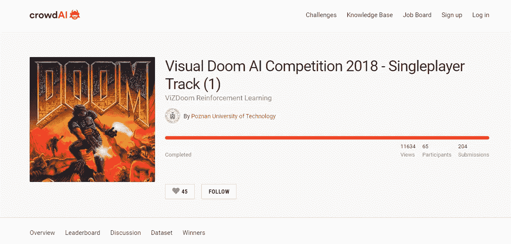](https://www.crowdai.org/challenges/visual-doom-ai-competition-2018-singleplayer-track-1/leaderboards)****

****[ViZDoom](https://www.crowdai.org/challenges/visual-doom-ai-competition-2018-singleplayer-track-1/leaderboards) 是一个基于 **Doom** 的 **AI** 研究平台，用于从原始**视觉**信息中进行强化学习。视觉末日 AI 竞赛**参与者应该提交一个玩末日游戏的控制器(C++、Python 或 Java)。******

# ****机器学习竞赛****

****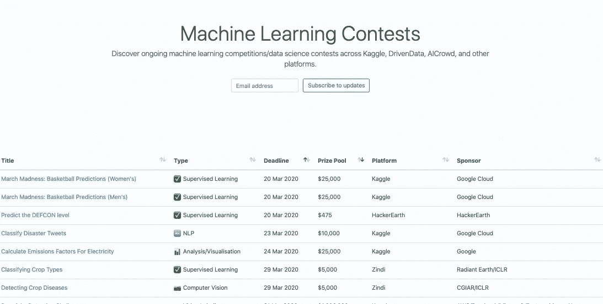****

****[**机器学习竞赛**](https://mlcontests.com/) 是一个数据科学竞赛聚合网站。它列出了 Kaggle、DrivenData、AICrowd 和其他公司正在进行的机器学习竞赛/数据科学竞赛。都是开源的，社区维护的。****

# ****结论****

****虽然这个列表会随着时间的推移而改变，但我相信你仍然会找到最相关和最有趣的竞争。如果你想到其他我没有提到的数据科学竞赛平台，请放在下面的评论区。****