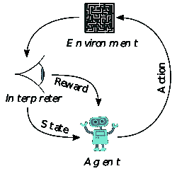
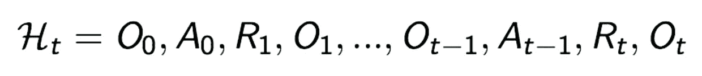
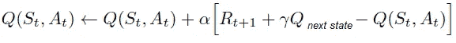
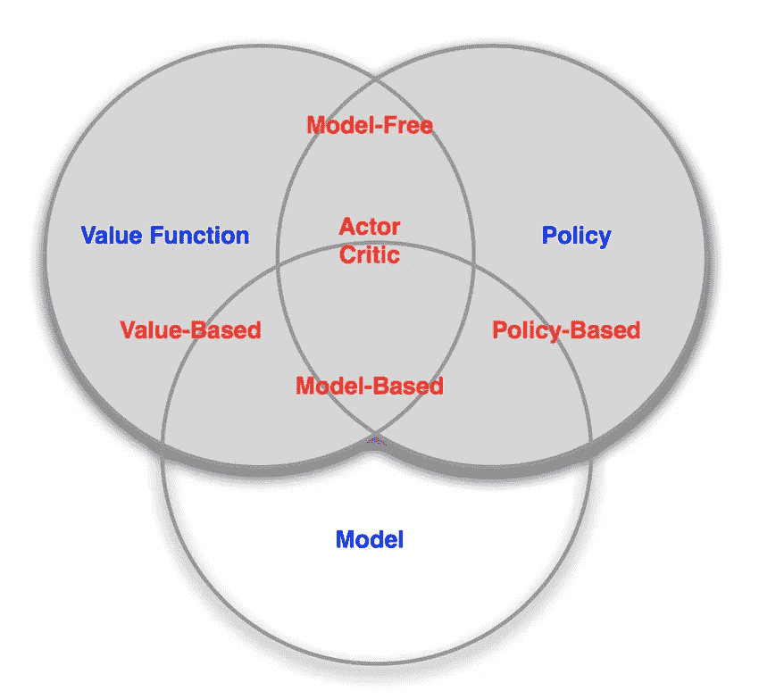
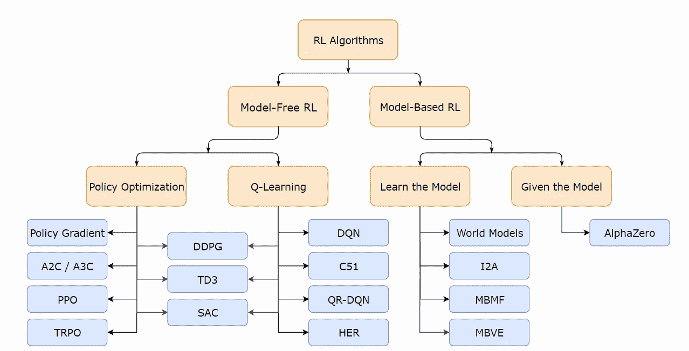

# 强化学习的俯视图

> 原文：<https://towardsdatascience.com/top-down-view-at-reinforcement-learning-f4a8b35ebf9a?source=collection_archive---------16----------------------->

## 将强化学习的不同部分和分支缝合在一起

Photo by [Josh Power](https://unsplash.com/@joshwp?utm_source=medium&utm_medium=referral) on [Unsplash](https://unsplash.com?utm_source=medium&utm_medium=referral)

**更新**:学习和练习强化学习的最好方式是去 http://rl-lab.com

当你是强化学习的新手时，你无疑会被一些奇怪的术语轰炸，比如基于模型的、无模型的、策略上的、策略外的等等…

很快你会发现跟踪这些似乎无处不在、术语之间没有明显联系的术语令人疲惫不堪。

这篇文章将尝试把所有这些术语放在一个角度，这样初学者就不会感到不知所措。

声明:本文假设你已经知道什么是强化学习和一些现有的算法。它没有介绍或解释任何特定的算法，但它会试图**将不同的分支**放在一起，这样你就可以得到一个全面的大画面，以及这些分支是如何适应的。

## 强化学习

正如已经建立的强化学习是一个框架，让代理人从经验中学习决策。它由一个与环境交互的代理组成，在环境中它采取行动并收集奖励。代理人的目标是收集最大的回报。

为此，我们需要建立以下定义。

## 状态

状态是描述某一时刻或某一时间步的情况的元素或特征的集合。状态的例子可以是机器人的位置、方向、周围的风景、风速、温度等等

## 环境安全

环境状态是描述某一时刻或某一时间步的环境的状态。环境的状态可能包含太多的细节，这些细节可能是不可能的，也没有兴趣包含在任何计算中。例如，机器人运动中的原子状态问题就不值得考虑。

## 代理状态

代理状态是代理感知到的状态。代理可能无法检测环境的完整状态，例如，带有固定摄像机的机器人无法看到 360°视图。在扑克游戏中，代理人只知道对手的公共牌。一般来说，代理状态不同于环境状态，但在最简单的情况下，它们是相同的，例如在一些棋盘游戏中。

在完全可观察的环境中，代理看到完整的环境状态，因此以这种方式观察是环境状态。
这个智能体被称为处于马尔可夫决策过程(MDP)。

部分可观察的环境，代理获得部分信息。这被称为部分可观察 MDP (POMDP)，env 仍然可以是 MDP，但是代理不知道它。

## 历史

历史是一系列的观察、行动和回报。

## 马尔可夫决策过程

马尔可夫决策过程(Markov Decision Process)(MDP)是一种在各种情况下对决策进行建模的数学框架。
一个过程是马尔可夫的如果下一个状态只依赖于当前状态，任何过去的状态都是无关紧要的。

## 状态/动作值函数

[状态和动作值函数](https://medium.com/@zsalloum/q-vs-v-in-reinforcement-learning-the-easy-way-9350e1523031)，是给某个状态 ***s*** 或对状态*执行的动作*赋值的函数。这个想法是评估处于某个状态和/或执行某个动作相对于其他状态或动作的重要性。简而言之，它们告诉我们处于那种状态有多有价值，采取那种行动有多好。想象一盘国际象棋，白方有机会将死。处于这样的位置是一种非常有价值的状态，在这个位置上所有可能的行动中，进行将死是最好的行动。
在状态数量有限的问题中，很容易计算出状态和动作的确切值。然而，当状态的数量变得非常大时，为了节省时间和资源，近似的需要将更加迫切。对于这类问题，使用函数近似法。**

## **政策**

**策略 ***𝜋(s)*** 是将状态映射到动作的功能。这就像在某种情况下，你问自己“我现在应该做什么？”。政策告诉你该采取什么行动。策略可以是确定性的，即相同的状态导致相同的动作，也可以是随机性的，即相同的状态根据某种概率分布导致不同的动作。在文章“[开发者强化学习策略](/revisiting-policy-in-reinforcement-learning-for-developers-43cd2b713182)”中可以找到对策略的简单介绍**

## **模型**

**一个模型预测环境下一步会做什么。例如，转移概率预测下一个状态，奖励函数预测下一个奖励。一个模型不会自动给我们一个好的政策，我们仍然需要计划。**

## **学习和规划**

**RL 中的两个基本问题:**

*   **学习:环境最初是未知的，代理通过与环境的交互来学习。**
*   **规划:给定一个模型，模型中的 agent 规划(无外部交互)。我们所说的计划是指推理、思考和探索。**

## **预测和控制**

**预测是在给定政策的情况下对未来的评估，而控制是通过找到最佳政策来优化未来，使累积回报最大化。**

## **探索与开发**

**探索就是寻找更多关于环境的信息。利用是指利用获得的信息来获得最大的回报。重要的是要知道[有多少东西要探索](/exploration-in-reinforcement-learning-e59ec7eeaa75)有多少东西要开发。**

## **基于模型/无模型**

**[基于模型的强化学习](/model-based-reinforcement-learning-cb9e41ff1f0d)是关于环境动态的知识，例如状态之间的转移概率，以及奖励。这在棋盘游戏中是众所周知的，但在现实生活中却很难做到。**

**模型可以被给定或被学习，然后它可以服从计划，或以不需要采取实际行动的方式被学习。规划阶段使用专门的算法，如 [AlphaZero](https://en.wikipedia.org/wiki/AlphaZero) 中使用的[蒙特卡罗树搜索](/monte-carlo-tree-search-in-reinforcement-learning-b97d3e743d0f)。
不言而喻，模型必须足够精确才能代表真实的问题，否则基于不精确的模型来规划行动将会浪费时间和资源，导致在真实环境中表现不佳。**

**[动态规划](https://medium.com/@zsalloum/dynamic-programming-in-reinforcement-learning-the-easy-way-359c7791d0ac)是基于模型的算法之一。**

**另一方面，无模型算法不依赖于模型来学习，它们通过直接经验来学习，这意味着它们在真实环境中采取行动。在这些算法中，我们可以找到[蒙特卡罗](https://medium.com/@zsalloum/monte-carlo-in-reinforcement-learning-the-easy-way-564c53010511)和[时间差异(TD)](/td-in-reinforcement-learning-the-easy-way-f92ecfa9f3ce) 。**

## **开策略/关策略**

**在 [TD 学习](/td-in-reinforcement-learning-the-easy-way-f92ecfa9f3ce)中，我们计算状态 s 下的动作值 Q(s，a)，同时考虑下一个状态 Q(s’，a’)下的动作值。**

****

**下一个状态的 q 受开/关策略方法的影响。**

**在策略上包括基于某个策略计算 Q(s，a)值*，意味着 Q(s，a)需要值 q(s’，a’)。为了得到 Q(s '，a ')的值，我们需要动作 ***a'*** ，这是使用带来动作*的相同策略***【𝜋】***得到的。当移动到状态***' s '***时，我们仍然遵循先前已经确定的动作 ***a'*** 。在策略上使用的算法称为 SARSA。****

**相反，关闭策略通过在*使用所有可用动作的最大 Q(s’)来计算 Q(s，a)。这意味着我们不必根据策略*选择特定动作***a’***我们只需选择具有最高值的 q(s’，a’)，然后当移动到状态***s’***时，我们不必遵循带来最大 q 值的动作 ***。*** 使用这种技术的算法叫做 Q-Learning。****

## **分类代理**

**根据智能体算法用于学习和决策的组件类型，智能体可以以不同的方式进行分类:**

**[基于值的](/math-behind-reinforcement-learning-the-easy-way-1b7ed0c030f4)**

*   **没有策略(它是隐式的)**
*   **价值函数**

**[基于策略](/policy-based-reinforcement-learning-the-easy-way-8de9a3356083)**

*   **政策**
*   **无价值函数**

**[演员评论家](/introduction-to-actor-critic-7642bdb2b3d2)**

*   **政策**
*   **价值函数**

**与上述类别正交，上述每种类型的代理可以是:**

**无模型**

*   **政策/价值功能**
*   **没有模型**

**基于模型:**

*   **可选策略/价值函数**
*   **模型**

**下图总结了强化学习中常用的代理类别**

****

**这张图片展示了一些 RL 算法及其类别:**

****

**[https://spinningup.openai.com/en/latest/spinningup/rl_intro2.html#a-taxonomy-of-rl-algorithms](https://spinningup.openai.com/en/latest/spinningup/rl_intro2.html#a-taxonomy-of-rl-algorithms)**