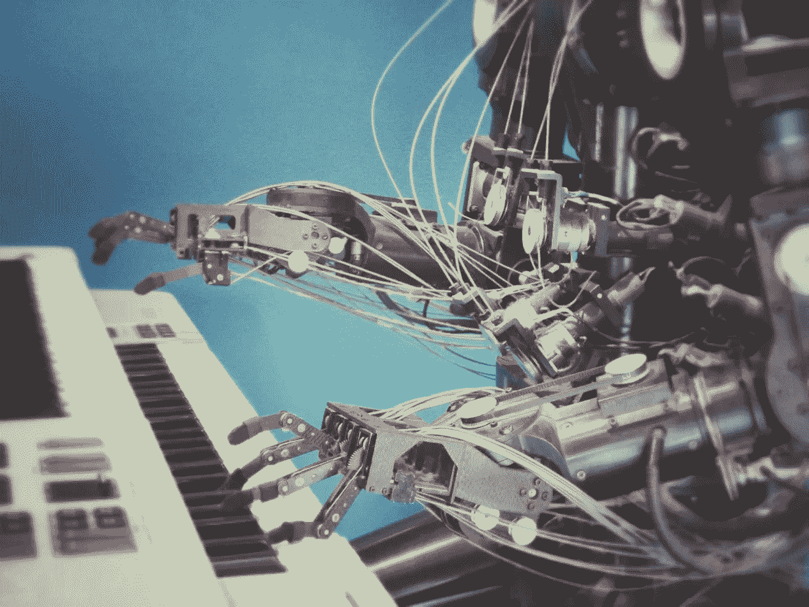
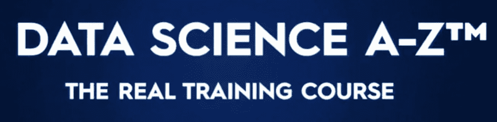
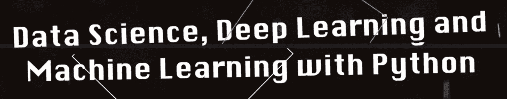
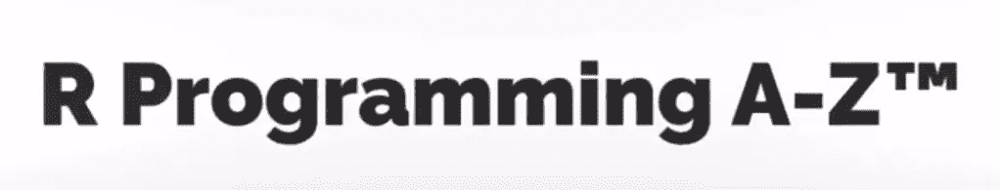
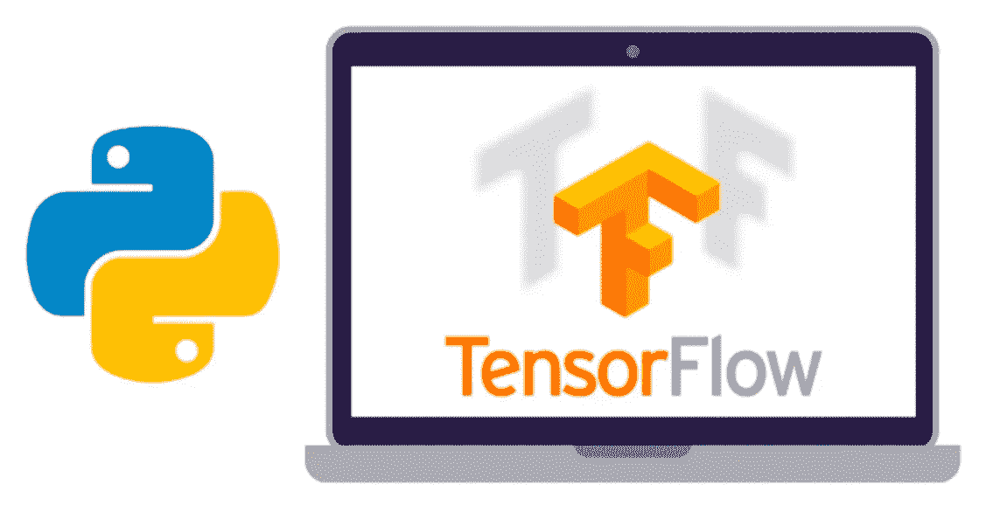
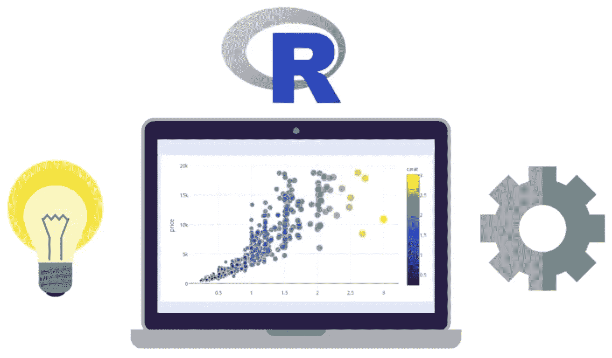

# Udemy 上面向初学者的五大机器学习课程

> 原文：<https://towardsdatascience.com/top-five-machine-learning-courses-for-beginners-on-udemy-1fddf983831c?source=collection_archive---------18----------------------->

现在每个人都想做机器学习。机器学习、数据科学、人工智能、深度学习、神经网络——这些已经成为当今科技领域最常用的词汇。我并不是说这特别糟糕，但是对于那些并不真正知道这一切意味着什么，但却想进入激烈竞争的人来说，这确实很可怕。

从软件开发人员的角度来看，这些只是不同类型的软件或应用程序，但是涉及到更多的数学知识。我知道我过于简化了数据科学，但是对于没有数学或统计学背景的人来说，一开始理解术语是非常困难的。我去过那里，老实说，我还在那里。我仍然不完全明白我在做什么。我想我在工作中学习。

但是今天，我想帮助一些新手进入数据科学的世界，看看你可以在 Udemy 上在线学习的一些很棒的课程。现在，我想坦率地承认，我个人最初也参加了一些这样的课程，它们帮助我理解了每件事的意义以及如何开始。对于开发人员来说，最困难或最可怕的部分可能是不知道如何开始这段旅程。我开始考虑重温你在学校学的数学，或者上一些统计课，诸如此类的事情。但我后来理解并意识到，我可以在家里通过上网学习所有这些。

你找到的大多数数据科学教程或课程都希望你有某种编程经验。如果你已经知道 Python 或 R 之类的编程语言，那就太棒了，但是如果没有，至少任何面向对象编程语言的知识就足够了。如果你是一个真正的编程初学者，我强烈建议在涉足数据科学或机器学习之前，先看一些 Python 编程课程。而且我说这些课程是针对初学者的，并不是指绝对的开发或编程初学者，而是数据科学初学者。

因此，我在这里列出的这些课程将帮助你开始进入数据科学的旅程，在此过程中，你可以找出你需要填补的所有空白。所以让我们开始吧。

# 数据科学 A-Z:包括现实生活中的数据科学练习

这可以被认为是一门关于数据科学的综合课程。在本课程中，您将学习从 SQL 查询到 Tableau 中的数据挖掘以及一些基本的机器学习算法。如果你想进入数据科学领域，这可能是一个很好的起点。这个课程是由 SuperDataScience 的 awesome 团队创建的。我是这些人的粉丝，因为我的第一个机器学习课程就是这些家伙创造的。他们很好地解释了一切，给了你一些可靠的例子，而且总的来说，让你明白了这一点。

因为这是“数据科学 A-Z”，所以您不仅可以了解机器学习算法，还可以了解数据科学中其他不太为人所知的部分，例如准备好数据以进行处理，使用 SQL，甚至 Tableau。你会对数据科学有一个全方位的了解。当然，本课程只会向您介绍所有这些工具和技术的基础知识，但这正是您现阶段所需要的。一旦掌握了基本知识，您就可以继续探索更多内容，或者决定专攻数据科学的某个特定领域。目前，这门课程有 21 小时的视频内容，售价 18.99 美元。如果你感兴趣，可以在 Udemy 网站上查看。

# 用 Python 实现机器学习、数据科学和深度学习

这门课，顾名思义，讲的都是机器学习和深度学习。你会被介绍给 Tensorflow 和 Keras。您还将学习一些分类算法和一个名为 MatPlotLib 的 Python 图表绘制库。如果图像分类和情感分析让你感兴趣，你可以考虑把这门课加入你的清单。

你需要确保你有一点点编程知识。如果你懂 Python 编程，那真的很好，因为这门课的大部分内容(也包括这个列表中的大部分其他课程)都是基于 Python 的。所以如果你不知道 Python，确保你先学会它。在 Udemy、 [Coursera](https://www.coursera.org/search?query=python&indices%5Bprod_all_products_term_optimization%5D%5BrefinementList%5D%5BproductDifficultyLevel%5D%5B0%5D=Beginner&indices%5Bprod_all_products_term_optimization%5D%5BrefinementList%5D%5BentityTypeDescription%5D%5B0%5D=Courses&indices%5Bprod_all_products_term_optimization%5D%5Bpage%5D=1&indices%5Bprod_all_products_term_optimization%5D%5Bconfigure%5D%5BclickAnalytics%5D=true&indices%5Bprod_all_products_term_optimization%5D%5Bconfigure%5D%5BhitsPerPage%5D=10&configure%5BclickAnalytics%5D=true) 上也有很多这方面的课程，你也可以在 YouTube 上找到很多[的免费教程。不管怎样，如果你感兴趣，这门课有 14 个小时的视频，售价 18.99 美元。你可以在 Udemy](https://www.youtube.com/results?search_query=python+programming) [查看这里](https://www.udemy.com/course/data-science-and-machine-learning-with-python-hands-on/)。

# R Programming A-Z:R For Data Science With Real exercise！

这是 SuperDataScience 团队的又一个牛逼课程。你可以把这门课程看作是 R 编程语言的介绍，但它是为数据科学量身定制的。此外，这不仅仅是对 R 编程语言的介绍。它有适当的语言教程，如果你正计划未来几年的 R 职业生涯，或者只是想深入研究 R，你会非常感激。

在本课程中，你将接触到财务和统计问题，以及如何用 R 编程语言解决这些问题的课程。这将会很有趣，因为 R 不像其他编程语言。尤其是如果你在学完 Python 的其他课程后又学了这门课，你会看到一些非常酷的不同之处。我说酷的区别是因为有些事情用 r 做起来超级简单。

无论如何，如果你对此感兴趣，那么请点击 Udemy 上的查看完整的课程。该课程现在正以 18.99 美元出售，你可以点播 10.5 小时的视频内容。

# 使用 Python 进行深度学习的 TensorFlow 完全指南

嗯，名字说明了一切。这是使用 Python 入门 TensorFlow 的一体化课程。如果你不知道，TensorFlow 是谷歌维护的神经网络。您将学习如何为 TensorFlow 编写 Python 代码。但是在开始编码部分之前，将向您介绍什么是神经网络。一旦你理解了它们是什么以及它们是如何工作的，你就可以开始教程的编码部分了。这个结构，在我看来，相当不错。因为在使用它们之前理解它们是如何工作的是合乎逻辑的。

在本课程中，您将学习如何使用各种算法，如时间序列分析、分类、回归、卷积等等。所以是的，这很有趣。这门课程目前在我的待办事项清单上。我很快就会开始讨论这个问题。如果你有兴趣，你可以在 Udemy 上的这里报名参加[的课程。这也以 18.99 美元出售，你可以获得 14 小时的点播视频教程。](https://www.udemy.com/course/complete-guide-to-tensorflow-for-deep-learning-with-python/)

# 数据科学和机器学习训练营

这是另一门介绍 R 编程语言的课程，但重点是数据科学和机器学习。在本课程中，您将学到许多关于 R 的知识，从在本地机器上安装编程语言的简单步骤开始，一直到读取 R 中不同类型的文件和创建数据框。还会有一些关于可视化、数据操作和机器学习算法的教程。如果您是第一次开发 R，或者正在考虑开始使用 R，这可能是很好的第一步。有兴趣的话来这里看一下[。它提供了长达 18.5 小时的视频内容，目前售价为 18.99 美元。](http://udemy.com/course/data-science-and-machine-learning-bootcamp-with-r/)

这是我在 Udemy 上发现的几门关于数据科学和机器学习的非常有趣的课程。这些绝不是最好的课程或必须要学的课程。我只是觉得他们提供的东西很有趣。如果你想让我用 Coursera 或 YouTube(免费课程)来整理这样一个列表，请在评论中告诉我，我会马上着手处理。这也许会促使我在 YouTube 上完成另一门课程。

> 在[推特](https://twitter.com/contactsunny)上关注我，了解更多[数据科学](https://blog.contactsunny.com/tag/data-science)、[机器学习](https://blog.contactsunny.com/tag/machine-learning)，以及通用[技术更新](https://blog.contactsunny.com/category/tech)。此外，你可以[关注我的个人博客](https://blog.contactsunny.com/),因为我在 Medium 之前发布了许多我的教程、操作方法帖子和机器学习的优点。

如果你喜欢我在 Medium 或我的个人博客上的帖子，并希望我继续做这项工作，请考虑在 Patreon 上支持我。