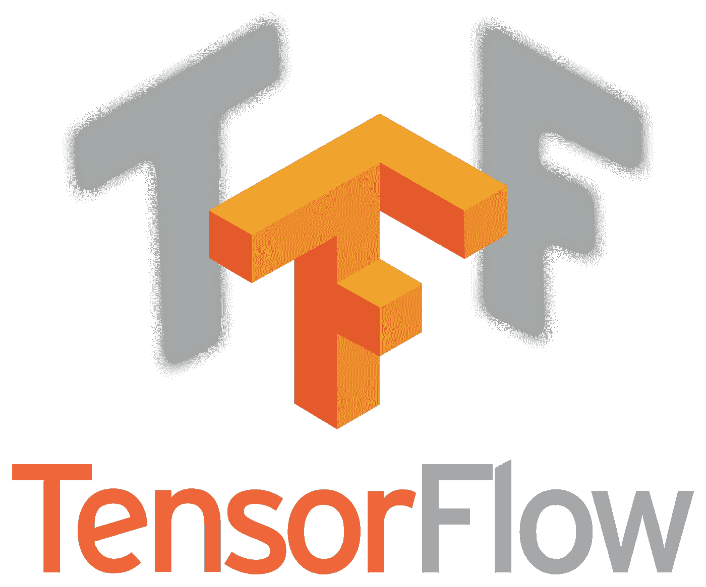
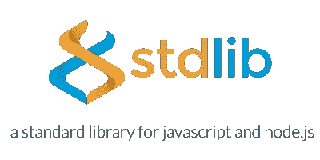
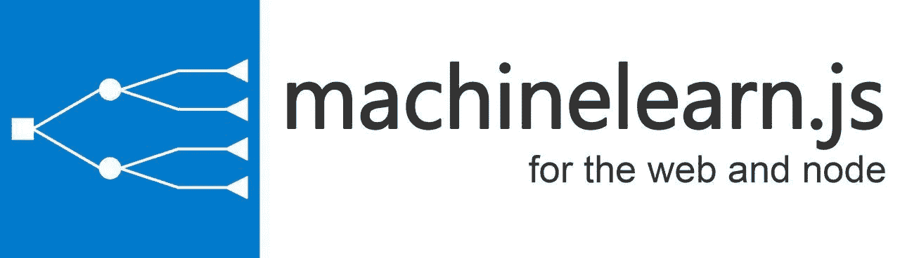
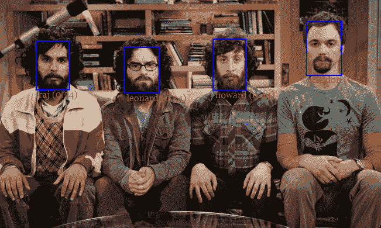

# 2019 年顶级 Javascript 机器学习库

> 原文：<https://towardsdatascience.com/top-javascript-machine-learning-libraries-in-2019-cb63b95bdd10?source=collection_archive---------9----------------------->

## machinelearn.js 社区精心挑选的最佳库列表

Out of many Machine Learning libraries, only a few have survived

从企业到个人项目，Javascript 无处不在，并通过 Typescript 和 ReasonML 等超集语言得到增强。尽管在 Github 中，Python 是第三种最受欢迎的机器学习编程语言，但大多数数据科学家和公司更喜欢 Python 作为他们的首选语言。Javascript 机器学习在 2018 年出现了飞跃式的增长，尽管许多著名的项目仍未得到维护，但包括 Brain.js 和 Tensorflow.js 在内的许多关键参与者在 2018 年全年一直在发展，直到 2019 年的现在。

以下是 2019 年最佳 Javascript/Typescript 机器学习库的列表，符合以下标准

*   维护并拥有一个活跃的社区
*   生产就绪
*   流行

*免责声明:虽然标题说的是最好的“机器学习 Javascript 库”，但我已经包括了不是严格意义上的 ML 但有紧密关系的库。*

# 1.Tensorflow.js

2019 年的 Tensorflow.js 由于其全面的线性代数核心和深度学习层，已经成为所有机器学习 Javascript 项目的面包和黄油。在支持的 API 数量上，它已经迅速赶上了它的 Python 姐妹，在这一点上，几乎机器学习中的任何问题都可以用它来解决。

除了在 Node.js 环境中提供深度学习和机器学习，Tensorflow.js 还可以直接在浏览器中使用，同时利用 WebGL 进行加速。同时支持浏览器和 Node.js 环境的 Tensorflow.js 模型已经被包括 [brain.js](https://github.com/BrainJS) 和 [machinelearn.js](https://www.machinelearnjs.com/) 在内的很多开源库采用。

Sentdex’s tutorial on Tensorflow.js

# 2.Brain.js

Brain.js 的目标是将机器学习和深度学习的复杂性降低到孩子可以理解的程度，它无疑是最容易的深度学习库，包括 Python 生态系统中的深度学习库。

作为最活跃的 Javascript 深度学习库之一，他们最近推出了一个有趣的新互动教程:

[https://scrimba.com/g/gneuralnetworks](https://scrimba.com/g/gneuralnetworks)

此外，我向任何深度学习的新手推荐 Brain.js，因为你可以在网上找到一系列针对 Brain.js 和深度学习本身的绝对初学者的精彩教程。

查看 Youtube 上点击率最高的 Brain.js 教程之一:

Brain.js tutorial targetting the absolute beginners

另外，一定要看看他们的 [Github 库](https://github.com/BrainJS/brain.js)和[网站](https://brain.js.org/)。

# 3.标准库-js

绘图和样本数据集是任何机器学习工作流的基本组件。绘图提供了对数据集的更深入了解，并帮助机器学习工程师决定下一步行动，以解决手头的问题。此外，该库配备了大量不同类型的[样本数据集](https://github.com/stdlib-js/stdlib/tree/develop/lib/node_modules/%40stdlib/datasets)，包括二元分类、回归和图像数据集套件。

该库可以成为任何机器学习项目的好伙伴，因为它提供了如上所述的一些基本的机器学习操作，并且有很好的文档。

查看他们的 [Github 库](https://github.com/stdlib-js/stdlib)和[网站](https://stdlib.io/)以获取更多信息！

# 4.machinelearn.js

[Machinelearn.js](https://github.com/machinelearnjs/machinelearnjs) 是一个新手，来完成 ScikitLearn 在 Javascript 机器学习的 Python 领域中的角色。它为监督和非监督问题提供了简单明了的关键任务模型和实用程序。专注于 Javascript 和 Typescript 开发人员的简单性和一体化通用机器学习，它提供了聚类、分解、集成、打包、线性模型、特征提取等等。

它将久经考验的库 Tensorflow.js 用于其核心数学，使用 C++原生接口、CUDA 和 WebGL 实现加速。与它的同行 mljs 不同，machinelearn.js 是用 Typescript 编写的，它为已经在使用该语言的用户提供了类型定义。

查看他们的 [Github 库](https://www.machinelearnjs.com/)和[网站](https://www.machinelearnjs.com/)。

# 5.数学. js

这是一个满足 Javascript 中所有数学需求的库，具有广泛的线性代数 API，包括矩阵运算和核心数学。它是相当轻量级的，因为它不依赖于其他加速技术，如 WebAssembly 或 WebGL。

math.js 拥有大量来自社区的贡献者，是由包括 Jos de Jong 在内的核心开发人员管理的最有活力的开源社区之一。

在 Javascript 机器学习领域，Math.js 足以完成 Numpy 的角色，因为它提供了解决机器学习问题所需的所有基本实用程序。

今天就来看看他们的[网站](https://github.com/machinelearnjs/machinelearnjs)和 [Github 库](https://github.com/josdejong/mathjs)。

# 6.face-api.js

Source: [https://itnext.io/face-api-js-javascript-api-for-face-recognition-in-the-browser-with-tensorflow-js-bcc2a6c4cf07](https://itnext.io/face-api-js-javascript-api-for-face-recognition-in-the-browser-with-tensorflow-js-bcc2a6c4cf07)

js 包括在各种数据集上预先训练的著名人脸检测和识别模型的实现。它提供了一个现成的 API，可以直接插入任何 Node.js 和浏览器环境。

该库实现了 SSD [MobileNet V1](https://arxiv.org/abs/1704.04861) ，微小人脸检测器和 [MTCNN](https://kpzhang93.github.io/MTCNN_face_detection_alignment/paper/spl.pdf) 用于检测架构，以及类似于 ResNet-34 的架构用于人脸识别。使用 Tensorflow.js 是轻量级的，这个库可以毫无问题地在移动和 web 浏览器上使用。

查看 [Github 资源库](https://github.com/justadudewhohacks/face-api.js)和[作者的博客文章](https://itnext.io/face-api-js-javascript-api-for-face-recognition-in-the-browser-with-tensorflow-js-bcc2a6c4cf07)。

# 7.R-js

R-js logo

如果您正在寻找一个像 R 中那样的核心数学实用工具，社区的一个成员已经将 R 的重要组件移植到了 Typescript 中。

BLAS 等线性代数规范被 Numpy 和 R 等机器学习应用程序的核心广泛采用，R-js 项目将整个 BLAS 重新编写为 Typescript，为未来的项目实现更强大的数学基础框架(如 Python 的 Numpy 和 SciPy)奠定了基础。

看看他们的 [Github 组织](https://github.com/R-js)。

# 8.自然的

如果你正在寻找像 Javascript 中的 [NLTK](https://www.nltk.org/) 或 [spaCy](https://spacy.io/) 这样的 NLP 工具，natural 是目前维护得最好、最活跃的 NLP 配套库。

它提供了机器学习 NLP 工作流所需的基本 API，包括预处理实用程序，包括标记化器和词干分析器，以及搜索实用程序，如 [tf-idf](https://github.com/NaturalNode/natural#tf-idf) 。

它有一个内置的情感分析，使用一个简单的算法和一些数据结构，包括尝试，短路径树和长路径树。

查看他们的 [Github 库](https://github.com/NaturalNode/natural)。