# 用于增强推荐系统的 Top-K 偏离策略校正

> 原文：<https://towardsdatascience.com/top-k-off-policy-correction-for-a-reinforce-recommender-system-e34381dceef8?source=collection_archive---------11----------------------->


Make your newsfeed propaganda free again with recnn! Photo by [freestocks.org](https://unsplash.com/@freestocks?utm_source=unsplash&utm_medium=referral&utm_content=creditCopyText) on [Unsplash](https://unsplash.com/collections/1118917/hand-held-devices-%F0%9F%93%B1?utm_source=unsplash&utm_medium=referral&utm_content=creditCopyText)

在我的强化推荐库中，OffKTopPolicy 现在可供您开箱即用，没有任何先决条件！

[](https://github.com/awarebayes/RecNN) [## awarebayes/RecNN

### 这是我的学校项目。它侧重于个性化新闻推荐的强化学习。主要的…

github.com](https://github.com/awarebayes/RecNN) 

该代码还可在 Colab 中在线使用 TensorBoard 可视化功能:

[](https://colab.research.google.com/drive/1bCAJG_lGQg9dBGp2InvVygworHcqETlC) [## 谷歌联合实验室

看链接短信 colab.research.google.com](https://colab.research.google.com/drive/1bCAJG_lGQg9dBGp2InvVygworHcqETlC) 

原始论文“用于增强推荐系统的 Top-K 偏离策略校正”,作者陈等人；

 [## 用于增强推荐系统的 Top-K 偏离策略校正

### 工业推荐系统处理非常大的活动空间——数百万的推荐项目…

arxiv.org](https://arxiv.org/abs/1812.02353) 

在我们开始之前说几句话:我是 rec nn——围绕 PyTorch 构建的增强推荐工具包的创建者。我用的数据集是 ML20M。奖励在[-5，5]，状态是连续的，动作空间是离散的。

> 此外， ***我不是谷歌的员工*** ，不像论文作者，我不能有关于推荐的在线反馈。 ***我用影评人来分配报酬。在现实世界中，这将通过交互式用户反馈来完成，但在这里，我使用一个神经网络(critic)来模拟它。***

# 理解强化

需要理解的一件重要事情是:本文描述了具有离散动作的连续状态空间；

对于每个用户，我们考虑一系列用户与系统的历史交互，记录推荐者采取的行动，即推荐的视频，以及用户反馈，如点击和观看时间。给定这样的序列，我们预测要采取的下一个动作，即要推荐的视频，使得例如由点击或观看时间指示的用户满意度度量提高。

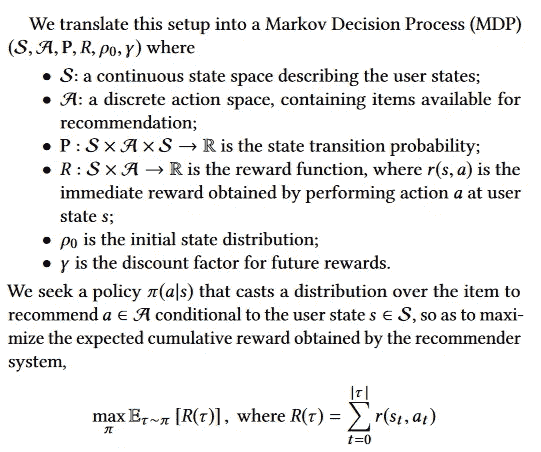

试着理解这个题目，我发现我不知道算法是什么。几乎每个人都熟悉 Q-Learning:我们有一个值函数映射(状态)->值。q 学习实际上无处不在，无数的教程已经涵盖了它。请注意，这里的值是通过时间差异获得的累积奖励。强化类似于 Q 学习。基本上，您需要理解价值和策略迭代之间的区别:

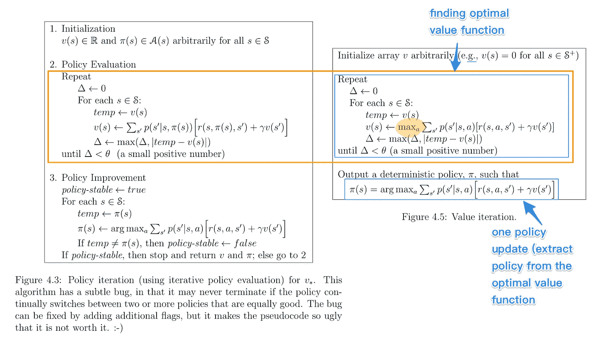

1.  **策略迭代**包括:**策略评估** + **策略改进**，两者反复迭代直到策略收敛。
2.  **值迭代**包括:**寻找最优值函数** +一个**策略抽取**。这两者没有重复，因为一旦价值函数是最优的，那么由此得出的策略也应该是最优的(即收敛的)。
3.  **寻找最优值函数**也可以看作是策略改进(由于 max)和截断策略评估(在不考虑收敛性的情况下，仅一次扫描所有状态后重新分配 v_)的组合。
4.  用于**策略评估**和**寻找最优值函数**的算法非常相似，除了最大值运算(如突出显示的)
5.  类似地，**策略改进的关键步骤**和**策略提取**是相同的，除了前者涉及稳定性检查。

注意:这不是我的解释，我是从这里抄来的:

[](https://stackoverflow.com/questions/37370015/what-is-the-difference-between-value-iteration-and-policy-iteration) [## 价值迭代和政策迭代有什么区别？

### 感谢贡献一个堆栈溢出的答案！请务必回答问题。提供细节，并且爱泼斯坦没有自杀

stackoverflow.com](https://stackoverflow.com/questions/37370015/what-is-the-difference-between-value-iteration-and-policy-iteration) 

# 现在让我们把这个翻译成 python:

下图使用 PyTorch 的增强实现。[链接到 Github 上的文件](https://github.com/pytorch/examples/blob/master/reinforcement_learning/reinforce.py)。

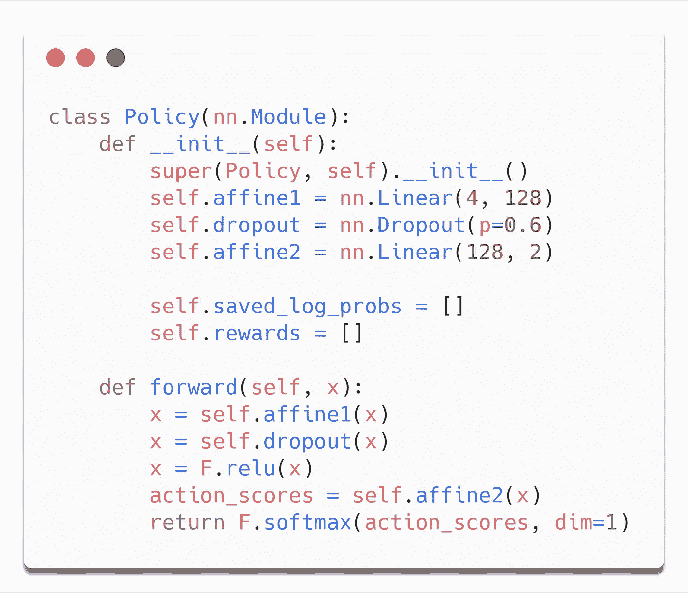

code is from official pytorch examples

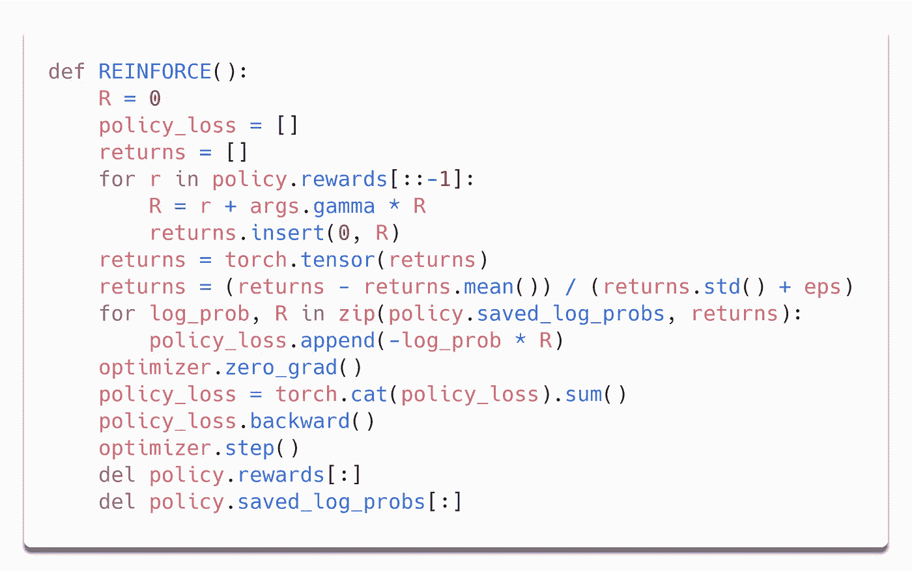

code is from official pytorch examples

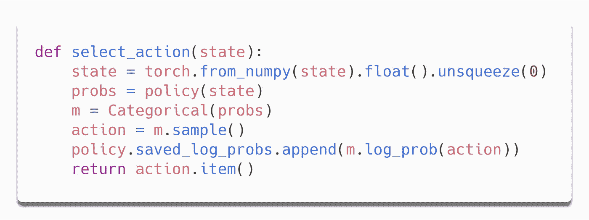

code is from official pytorch examples

# 使用 recnn 的实现

本周，我发布了增强实现，以便与我的库一起使用。让我们来看看使用 recnn 增强需要什么:

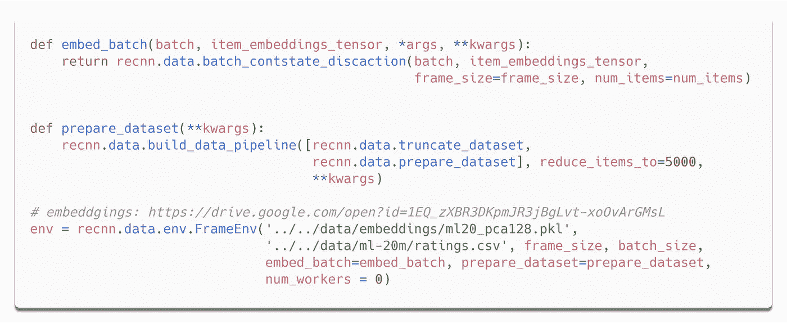

**prepare_dataset** 是一个责任链模式，将您的数据转换为可用状态。注意:这种用法是完全可选的，如果您不想弄乱对 recnn 内部工作方式的理解，可以事先按照您喜欢的方式转换您的数据。

**embed_batch** 将嵌入应用于单个批次。正如你所记得的，状态是连续嵌入的，而动作空间是离散的。幸运的是，有一个现成的版本可供您使用: **batch_contstate_discaction。**

因为我没有很强大的 PC (1080ti 农民)，所以无法使用大的行动空间。因此，我将动作删减为 5000 部最常见的电影。

> ***我不是谷歌的员工*** ，与论文作者不同，我不能获得关于推荐的在线反馈。我用评论家来分配奖励。在现实世界中，这将通过交互式用户反馈来完成，但在这里，我使用一个神经网络(critic)来模拟它。

现在，让我们定义网络和算法本身。

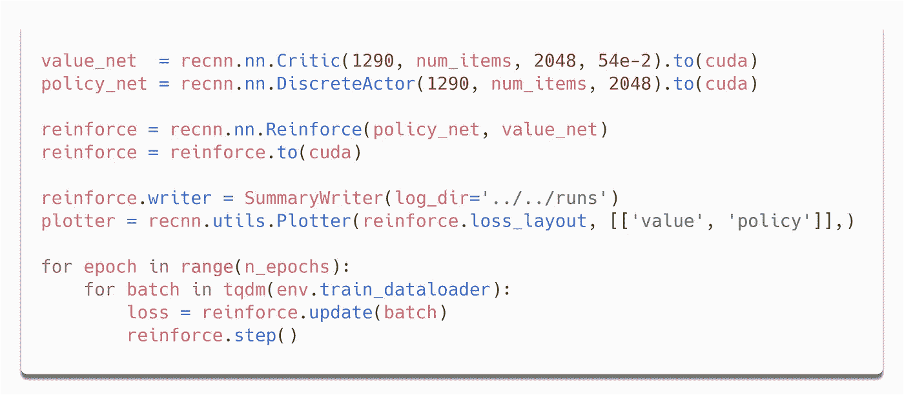

经过 1000 步后，我们得到:

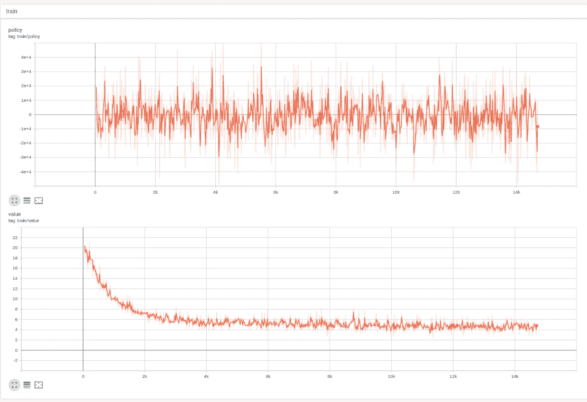

Note: the policy loss is pretty large!

# 回到论文:关闭政策修正

问题如下:我们有多种其他政策。让我们把 DDPG 和 TD3 训练有素的演员从我的图书馆。鉴于这些政策，我们希望以一种非政策的方式学习一种新的、不带偏见的政策。正如作者所说:

> 偏离策略候选生成:我们应用偏离策略校正来从记录的反馈中学习，这些反馈是从先前模型策略的集合中收集的。我们结合了行为策略的学习神经模型来纠正数据偏差。

不要将其与迁移学习混淆:

> 由于等式(2)中的梯度要求从更新的策略ωθ中采样轨迹，而我们收集的轨迹来自历史策略β的组合，因此简单的策略梯度估计器不再是无偏的。**我们用重要性权重解决分布不匹配问题**

因此，简单地说，不符合政策的纠正是重要性加权，因为先前的建议是有偏见的，并且基于现有的模型。

现在让我们考虑一下公式:

β —是历史的，也称为行为策略(以前的模型)

ωθ—是一个更新的策略(新模型)

仔细研究论文中列出的数学难题，作者得出了这个奇特的公式:

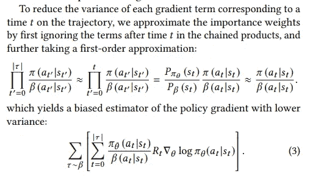

Proposed Reinforce with OffPolicyCorrection

也就是说，动作 **A** 概率，给定状态 **S** 在时间步长 **T** 上具有更新策略/历史策略的重要性。他们的结论是，不需要整个情节的乘积，一阶近似已经足够好了。更多关于近似值的。

> P.S .一级近似:f(x+h)≈f(x)+f′(x)×h。

等式[3]表明，这种关系(Pi/Beta)仅用作重要性加权项。如果您查看原始的增强更新，这些函数的唯一不同之处是前面提到的重要性权重:

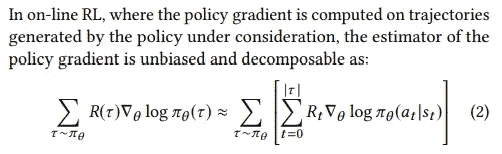

Original Reinforce

# 参数化策略πθ(网络架构)

**下一节只是作者使用的模型的简单描述。这与政策外修正没有多大关系。**

如果你一直关注我的作品，你就会知道我主要是在做连续动作空间的东西，比如 DDPG 或者 TD3。本文主要研究离散动作空间。离散行动空间的特点是它会迅速变大。为了解决这种增长的问题，作者使用了默认情况下 TensorFlow 附带的 **Sampled Softmax，**。遗憾的是，PyTorch 没有这样的选项。因此，我将利用**噪声对比估计、**代替作者使用的**采样 Softmax** ，这是一种类似的方法，具有 Pytorch 库:[stones jtu](https://github.com/Stonesjtu)/[py torch-NCE](https://github.com/Stonesjtu/Pytorch-NCE)**。**

无论如何，让我们来看看网络架构:

作者使用简单的递归状态表示法，这里没什么特别的:

> 我们在每个时间 t 的用户状态上对我们的信念建模，这使用一个 n 维向量捕获了两个不断发展的用户兴趣。沿着轨迹在每个时间 t 采取的动作使用 m 维向量 u 嵌入。我们使用递归神经网络对状态转移 P: S×A×S 进行建模。

对于新状态 S，它们执行 softmax

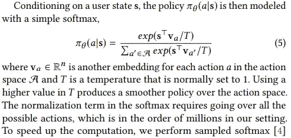

其中 v_a ∈ R n 是动作空间 A 中每个动作的另一个嵌入，T 是通常设置为 1 的温度。关键的一点是，他们使用的是**的另一种**嵌入，而不是一种用于状态表示的嵌入。一件很酷的事情是，我们将通过 torch.nn.Embedding 学习这些嵌入

不要看在β_θ`处从 RELU 向左的可怕箭头，上面有区块渐变。我们暂时忽略它。因此，就目前而言，总的来说，网络架构看起来像是:

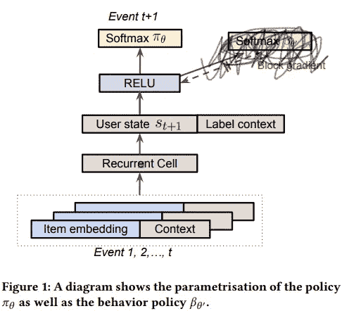

# 评估行为策略β

现在回到那个可怕的箭头，在β_θ处从 RELU 向左倾斜:

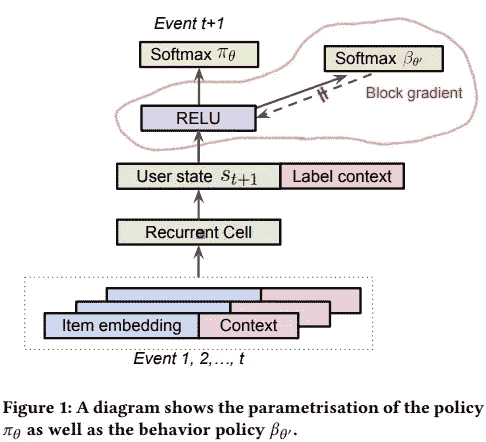

> 理想情况下，对于我们收到的每一个关于所选操作的记录反馈，我们也希望记录行为策略选择该操作的概率。然而，在我们的情况下，直接记录行为策略是不可行的，因为(1)在我们的系统中有多个代理，其中许多是我们无法控制的，以及(2)一些代理具有确定性策略，并且将β设置为 0 或 1 不是利用这些记录的反馈的最有效方式。

他们说他们在谷歌有很多行为政策可以学习。但是在纠正部分，他们只有一个用于重要性加权的行为策略β。

> 相反，我们采用[39]中首次介绍的方法，并使用记录的动作估计行为策略β，在我们的情况下，行为策略β是系统中多个代理的策略的混合。给定一组记录的反馈 D = {(si，ai)，i = 1，，N}，斯特雷尔等人[39]通过在整个语料库中聚合动作频率来估计与用户状态无关的ˇβ(a)。相比之下，我们采用上下文相关的神经估计器。

[39]中提到的论文可以追溯到 2010 年，所以他们决定使用深度学习的幻想。据我所知，他们从这些其他历史模型中获取输出，并使用简单的深度学习模型来预测历史政策β。也是这样做的，它使用了公共状态表示模块，一个具有 ReLU 的 RNN 单元。但是梯度通道被阻塞，因此状态表示只从更新的策略π_θ中学习。对于 PyTorch 来说:block gradient = tensor.detach()

# 现在让我们看看目前为止我们得到了什么

另外，第一个(zeroest)笔记本有一个最少使用 recnn 的基本实现。这里详细解释了一切，这样你就不用去查源代码了。

不管怎样，下面是如何在 recnn 内部实现偏离策略的纠正:

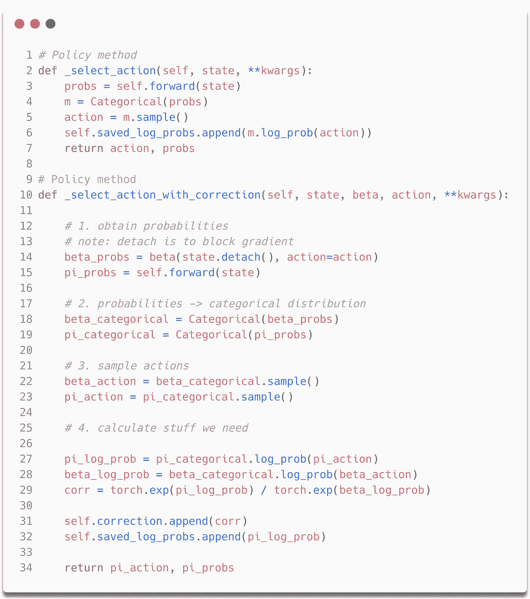

difference between select action and select action with correction

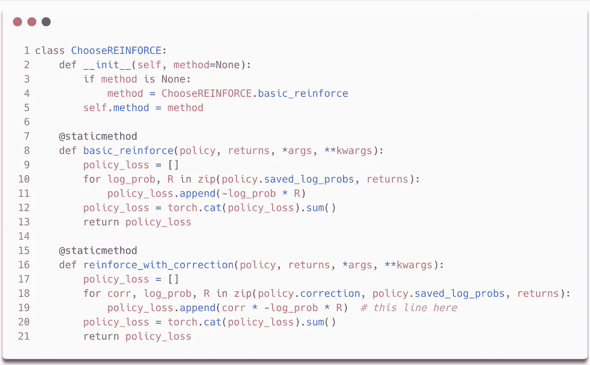

difference between reinforce and reinforce with correction

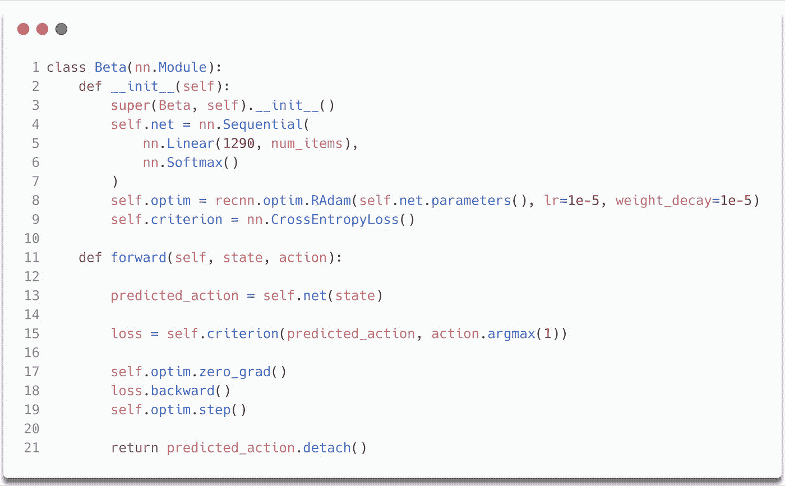

Beta class. Notice: it learns to resemble historical policy by calculating cross-entropy with action

你可能已经注意到，我没有包括次级项目嵌入、噪声对比估计和作者描述的其他东西。但是这些对于算法背后的思想来说并不重要。你可以使用简单的 PyTorch softmax 而不用花哨的 log 均匀采样，代码会保持不变。

# 使用 recnn 进行政策外修正

代码保持不变:我们从定义网络和算法开始。


还记得 nn 中的**_ select _ action _ with _ correction**方法。**离散策略**类所需动作？它在这里被传递。我知道，这是糟糕的代码，我还没有想出更好的方法来这样做。测试版更新也通过了操作。别忘了在参数中选择**加强修正**，毕竟那才是主要目的！

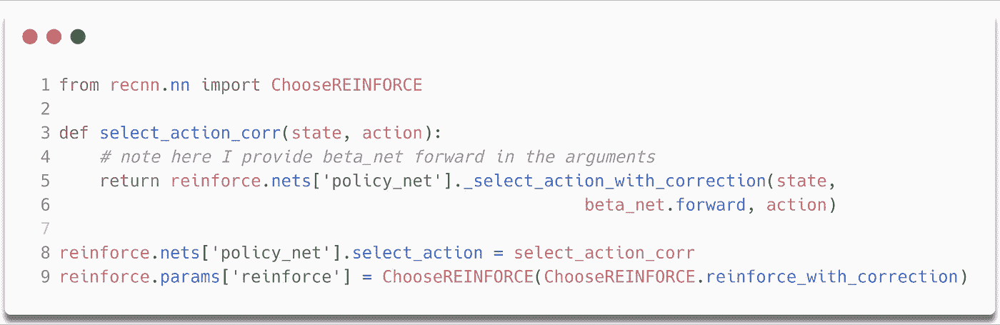

如果你看看损失，他们没有太大的变化。或者他们有吗？如果你看一下之前的损失图，损失是以千计的数量级来衡量的。

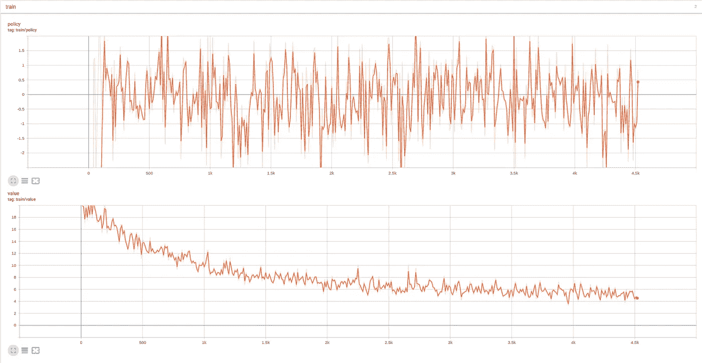

Make sure to check ‘ignore outliers’

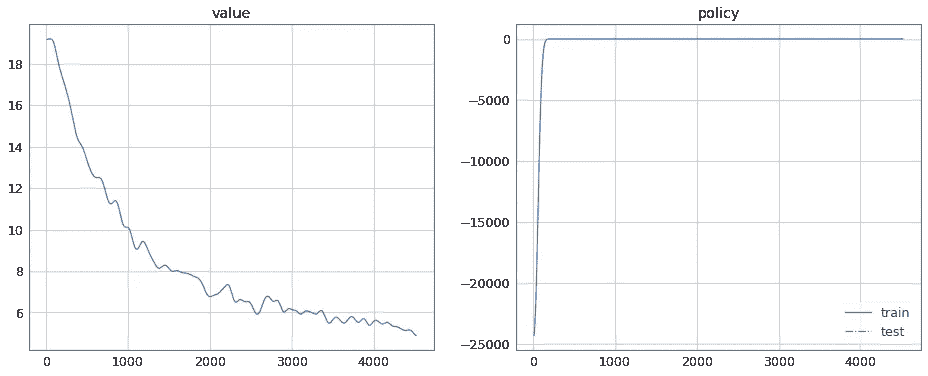

Correction in action: w/o outliers ignored. Start’s pretty rough, but then corrected

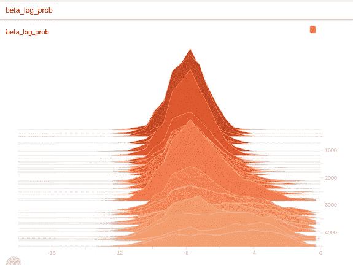

beta_log_prob

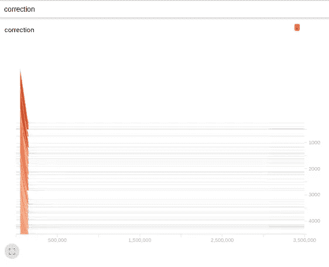

correction can get pretty large

# Top K 偏离策略修正

这对于单个推荐来说是可以的。但请记住，我们面对的是一系列这样的问题。作者介绍如下:

1.  π_θ —我们的政策
2.  **A** —是从π_θ采样的一组动作
3.  π_θ—是一种新策略，它不是单一的操作，而是产生一组 K 建议。不过，跑题了:有个很酷的东西叫 **gumbel_softmax。使用它会很酷，而不是重新采样。 [Gumbel 最大技巧解释](https://timvieira.github.io/blog/post/2014/07/31/gumbel-max-trick/)、[无替换采样序列的 Gumbel-Top-k 技巧](https://arxiv.org/abs/1903.06059)(合著者中的 Max Welling)**

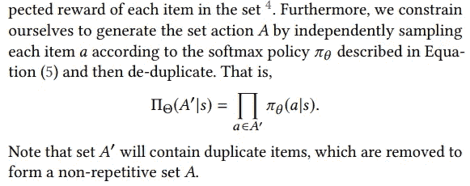

4.π_θ上的奖励设置和更多信息

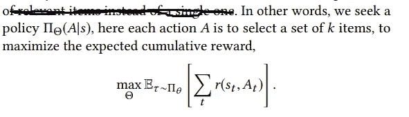

5.α_θ(a | s)= 1(1πθ(a|s))^k 是项目 a 出现在最终非重复集合 a 中的概率，这里 k = | a′| > | a | = k . p . s . k 是有重复项的大小抽样集合。k 是同一个集合的大小，但是去掉了重复的部分。作为具有替换和去重复的采样的结果，最终集合 A 的大小 k 可以变化。

这些变量中的大多数都是为了帮助理解背后的数学原理而引入的。例如，从未使用过π_θ。然后公式简化成一个非常简单的表达式，但是我现在想让你明白一些事情。

Top K 与从集合中选择一个项目的概率有关。随着重复，你的分布将是二项式的。这是二项分布的第页的[统计数据。的确，看看上面的α_θ。不像什么吗？](https://www.statisticshowto.datasciencecentral.com/probability-and-statistics/binomial-theorem/binomial-distribution-formula/)

## 考虑到这一点，我们得出:

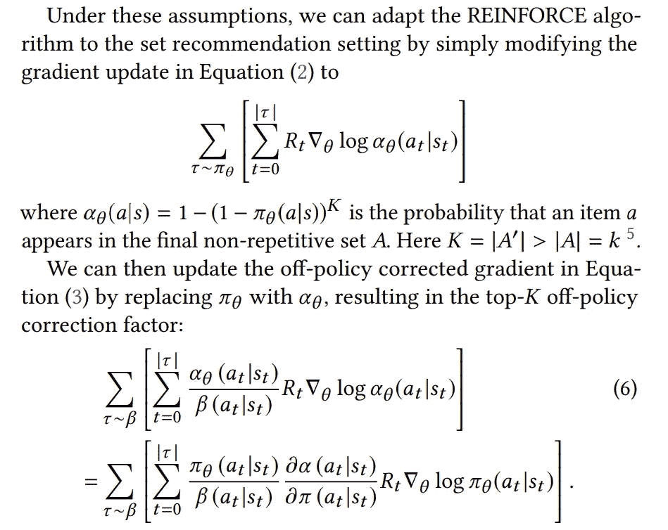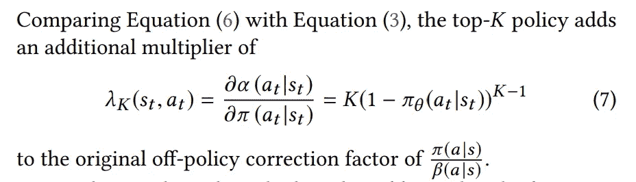

附注:没有解释他们是如何想出这个公式的，但正如我所说，它与二项式分布和#重复选择 TopK 项的方法有关。动手组合学。就是这样！最后，我们得出了一个非常简单的公式，可以轻松地添加到我们现有的模块和更新函数中:

```
lambda_k = K*(1 - pi_prob)**(K-1)
```

# 用代码实现

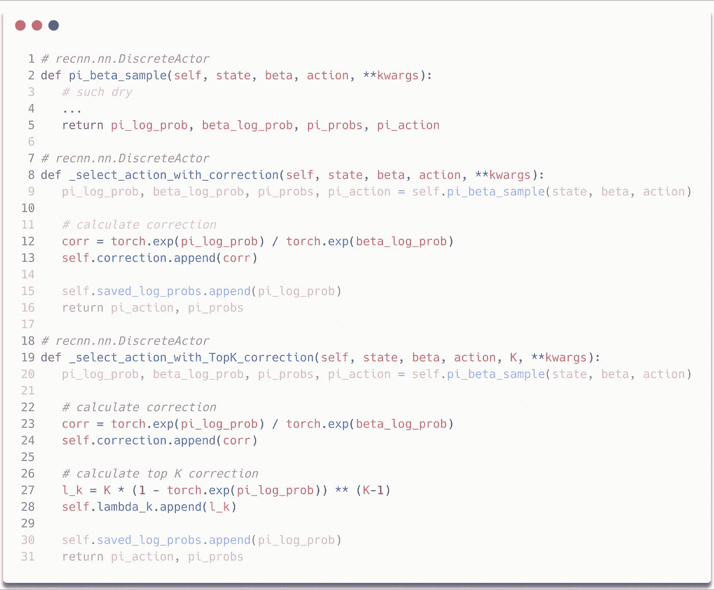

difference between top k and not top k

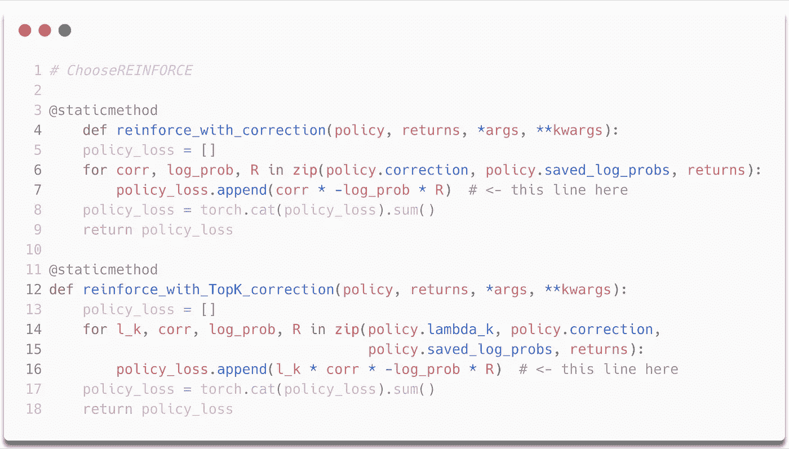

difference between top k and not top k

链接到[笔记本](https://github.com/awarebayes/RecNN/blob/master/examples/2.%20REINFORCE%20TopK%20Off%20Policy%20Correction/3.%20TopK%20Reinforce%20Off%20Policy%20Correction.ipynb)。除了**->**增强 _with_TopK_correction、**和**_ select _ action _ with _ correction**->**_ select _ action _ with _ TopK _ correction 之外，什么都没变。****

**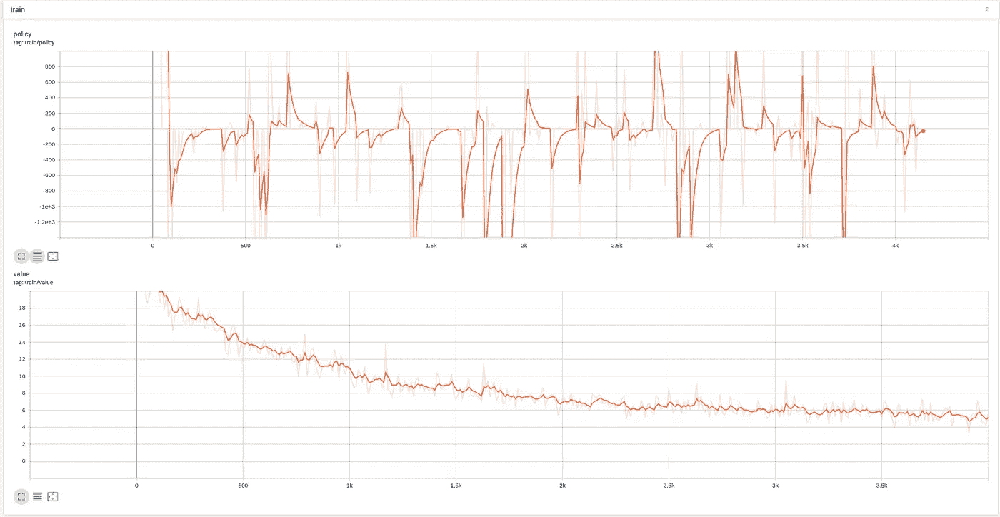**

**losses be looking unusual**

**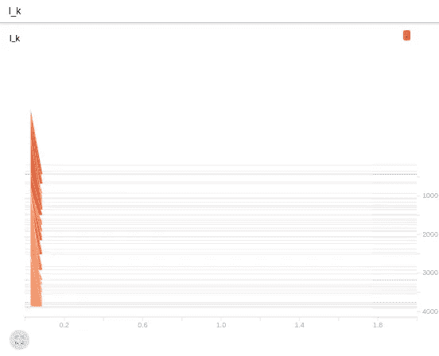**

**Lambda_K stays pretty small, unlike correction**

**图形中的其他内容看起来与非 TopK 版本完全相同，为什么会不同呢？数据集和网络没有改变。现在，让我们来看看保单损失的确切原因:**

*   **因为ωθ(a | s)→0，λK (s，a) → K。与标准非政策校正相比，top-K 非政策校正将政策更新增加了 K 倍**
*   **当ωθ(a | s)→1，λK (s，a) → 0。这个乘数将策略更新清零。**
*   **随着 K 的增加，当ωθ(a | s)达到合理范围时，该乘数会更快地将梯度降至零。**

**总之，当所需项目在 softmax 策略πθ ( |s)中具有小的激活值时，top-K 校正比标准校正更积极地提高其可能性。一旦策略ρθ(| s)开始在 softmax 中具有特定项目的所需激活值(以确保它将有可能出现在 top-K 中)，校正然后使梯度为 0，从而不学习它，以便其他 K-1 个项目可以出现在推荐中。**

# **结果比较**

> **所有的结果都可以在顶部链接的 Google Colab 笔记本上看到并在线互动。**

**注:要查看修正后的损失，请单击左侧 Runs 部分的圆形单选按钮，而不是方形复选框。**

**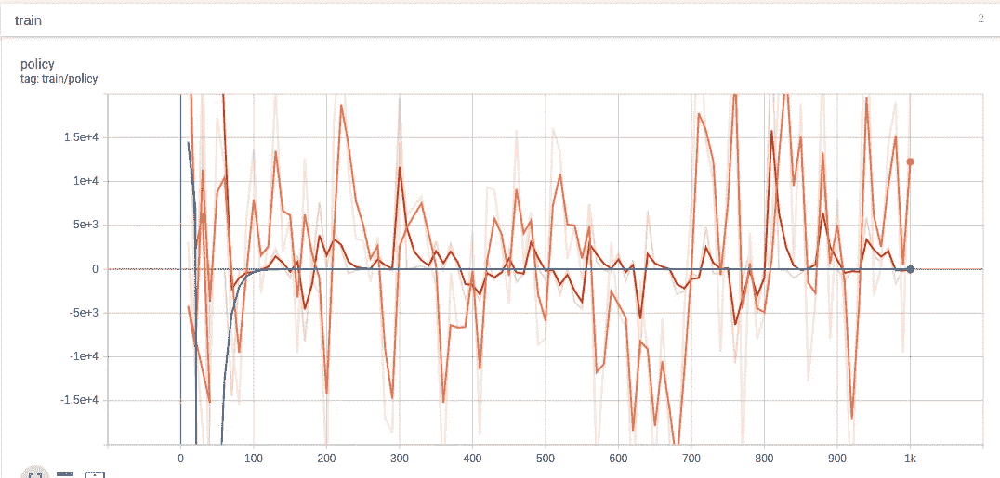**

**Policy: orange — NoCorrection, blue — Correction, red — TopK Correction**

**修正本身只是让损失变小。TopK 使亏损类似于原始亏损 w/o 修正，但这次更集中于零，没有明确的趋势。**

**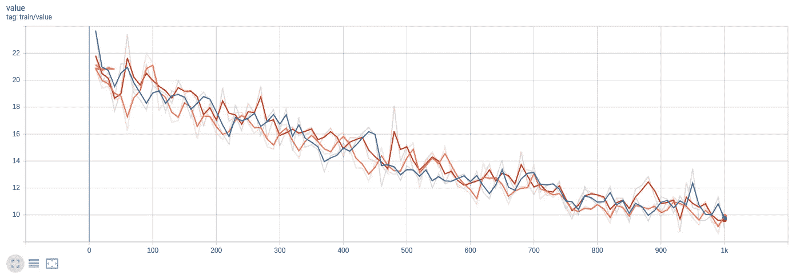**

**Value Loss: nothing unusual**

# **我没做的事:**

**作者还提到了方差减少技术。就我而言，我有合理的损失，所以我认为我不需要它们。但是如果需要的话，实现这些应该不是问题。**

1.  **重量上限:校正=最小值(校正，1e4)**
2.  **专业提示:看看张量板上的修正分布，算出一个重量上限的大数字**
3.  **重要性抽样的政策梯度:我发现了这个回购[github.com/kimhc6028/policy-gradient-importance-sampling](https://github.com/kimhc6028/policy-gradient-importance-sampling)**
4.  **TRPO:有很多实现。选择你喜欢的。也许 PPO 会是更好的选择。**

# **好了**

**暂时不要走开。有几种方法可以帮助 RecNN:**

1.  **一定要在 GitHub 上**拍**和**给一颗星**:https://github.com/awarebayes/RecNN**
2.  **用于您的项目/研究**
3.  **recnn 目前缺乏一些特性:顺序环境和不容易配置的用户嵌入。有实验性的顺序支持，但还不稳定。也许可以考虑捐款**

**recnn 的 StreamLit 演示即将到来！您可以通过给库标一颗星来加快速度:**

**[](https://github.com/awarebayes/RecNN) [## awarebayes/RecNN

### 这是我的学校项目。它侧重于个性化新闻推荐的强化学习。主要的…

github.com](https://github.com/awarebayes/RecNN) 

> recnn 还将进行许可变更。**如果没有加密和联合学习**，您将无法使用 recnn 进行生产推荐。用户嵌入也应该存储在他们的设备上。我相信言论自由和第一修正案，所以建议应该只在一个联邦(分布式)的方式。下一篇文章是关于联邦学习和 recnn 的 PySyft([github.com/OpenMined/PySyft](https://github.com/OpenMined/PySyft))集成！**