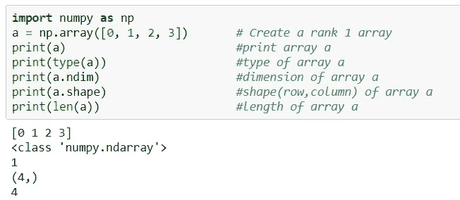
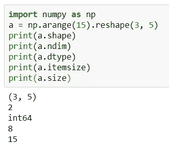
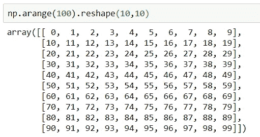
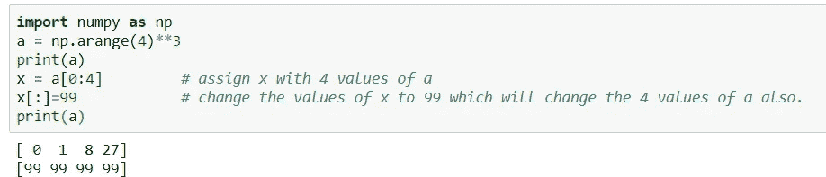
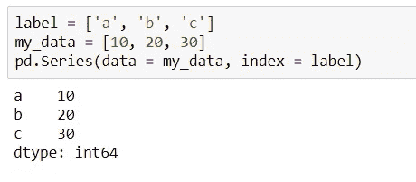
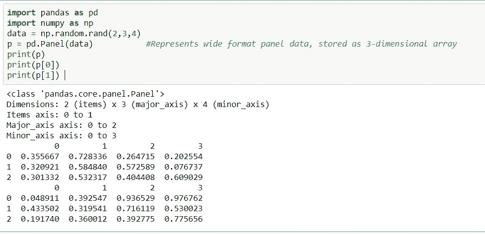
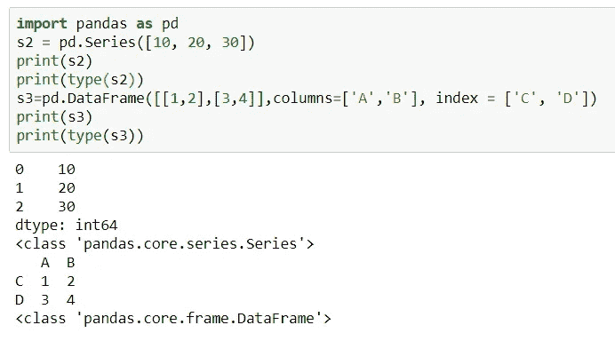
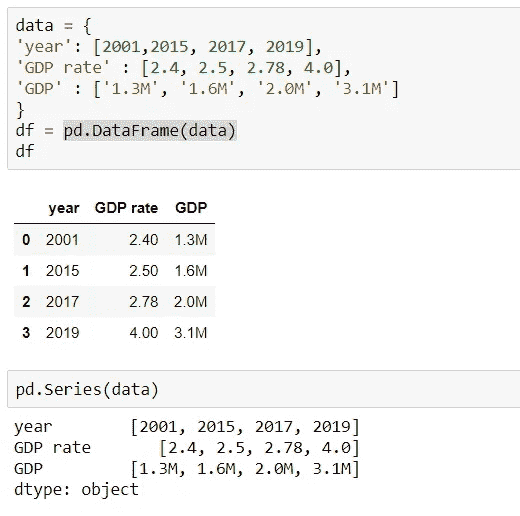

# 顶级 Python 库:Numpy 和 Pandas

> 原文：<https://towardsdatascience.com/top-python-libraries-numpy-pandas-8299b567d955?source=collection_archive---------3----------------------->

在本教程中，我将尝试对 Python 中最重要的两个库 **Numpy** 和 **Pandas** 做一个简单的描述。不再拖延，让我们先通过**号**号。

## Numpy

`[numpy](https://www.numpy.org)`是 Python 中科学计算的核心库。它提供了一个高性能的多维数组对象和工具来处理这些数组。Numpy 是一个强大的 N 维数组对象，是 Python 的线性代数。Numpy 数组本质上有两种风格:*向量*和*矩阵*。*向量*是严格的一维数组，而*矩阵*是二维的，但*矩阵*只能有一行/一列。

要在您的系统中安装`numpy`库并进一步了解 python 基础知识，您可以点击以下链接:

[](/machine-learning-and-data-analysis-inha-university-part-1-be288b619fb5) [## 机器学习和数据分析—仁荷大学(第一部分)

### 第 1 章:基本 python 和安装

towardsdatascience.com](/machine-learning-and-data-analysis-inha-university-part-1-be288b619fb5) 

现在要在程序中使用`numpy`,我们需要导入模块。为了方便起见，一般将`numpy`包定义为`np`的缩写。但是您可以使用任何想要的东西来导入它。

```
import numpy **as** np
np**.**array([1, 2, 3])         *# Create a rank 1 array* np.arange(15)               # generate an 1-d array from 0 to 14
np.arange(15).reshape(3, 5) # generate array and change dimensions
```

现在要了解更多关于`numpy`包及其功能，你可以直接关注官方网站[https://numpy.org/](https://numpy.org/)。这里我们将讨论`numpy`库的一些重要命令和功能。



在上图中，我们可以看到`numpy`首先被导入，然后定义了一个 *1-d* `numpy`数组`a`。然后，我们可以使用提到的命令检查数组的类型、维度、形状和长度。以下是创建阵列的一些重要命令:

```
***np.linespace(0,3,4)***  #create 4 equally spaced points 0-3 range inclusively
***np.linespace(0,3,4, endpoint=False)*** # remove endpoint and other equally spaced values.
***np.random.randint(1,100,6)***  #create array of 6 random values in 0-100 range.
***np.random.randint(1,100,6).reshape(3,2)*** #reshape the array according to row and column vectors.
***np.random.rand(4)***    #create an array of uniform distribution (0,1)
***np.eye(3)***            #create a 3*3 identity matrix
***np.zeros(3)***          #create array([0,0,0])
***np.zeros((5,5))* **     #create a 5*5 2-d array of zeros
**np.random.randn(2,2)** #return standard normal distribution vcenter around zreo.
***np.empty((2,3))* **     # uninitialized
***np.arange(0, 2, 0.3)*** # from 0 to a number less than 2 with 0.3 intervals
***np.ones((2,3,4), dtype=np.int16)***       # all element are 1
***np.array([[1,2],[3,4]], dtype=complex)*** # complex array
***np.array([(1.5,2,3),(4,5,6)])***          # two-dimensional array
***np.array([2,3,4])***                      # one-dimensional array
```

***n 数组*对象**的重要属性

`ndarray.shape`:数组的维度。这是一个整数元组，表示每个维度中数组的大小。对于具有 *n* 行和 *m* 列的矩阵，形状将为`(n,m)`。

`ndarray.ndim`:数组的轴数(维度)。

`ndarray.dtype`:如果想知道数组的数据类型，可以查询 *dtype* 的属性。描述数组中元素类型的对象。可以使用标准 Python 类型创建或指定 *dtype* 。
另外， *numpy* 提供了自己的类型。 *numpy.int32* 、 *numpy.int16* 和 *numpy.float64* 就是一些例子。



Attributes of **ndarray** object

`ndarray.itemsize`:数组中每个元素的字节大小。例如，float64 类型的元素数组的*项大小为* 8 (=64/8)，而 *complex32* 类型的元素数组的项大小为 4 (=32/8)。相当于*ndarray . dtype . itemsize .*

`ndarray.size`:数组元素的总数。这等于形状元素的乘积。

**打印数组:**打印数组时，`numpy`以类似于嵌套列表的方式显示数组，但使用以下布局:最后一个轴从左到右打印，倒数第二个轴从上到下打印，其余的也从上到下打印，每个切片与下一个切片之间用空行隔开。



**ndarray 的基本操作:**

```
***A = np.array([[1,1],[0,1]])
B = np.array([[2,0],[3,4]])***
***A+B***              #addition of two array
***np.add(A,B)***      #addition of two array
***A * B***            # elementwise product
***A @ B* **         # matrix product
***A.dot(B)***         # another matrix product
***B.T* **             #Transpose of B array
***A.flatten()***      #form 1-d array
***B < 3* **          #Boolean of Matrix B. True for elements less than 3
***A.sum()***          # sum of all elements of A
***A.sum(axis=0)***    # sum of each column
**A.sum(axis=1)**    # sum of each row
***A.cumsum(axis=1)*** # cumulative sum along each row
***A.min()***          # min value of all elements
***A.max()***          # max value of all elements
***np.exp(B)* **      # exponential
***np.sqrt(B)***       # squre root
***A.argmin()***       #position of min value of elements 
***A.argmax()***       #position of max value of elements
***A[1,1]*  **         #member of a array in (1,1) position
```

**在** ***numpy* :** 中的索引、切片和迭代

```
***a = np.arange(4)**3*** # create array a
***a[2]***                 # member of a array in 2nd position
***a[::-1]***              # reversed a
***a[0:4,1]* **            # each row in the second column of b
***a[1,...]***             # same as a[1,:,:] or a[1]
***a[a>5]***               # a with values greater than 5
***x = a[0:4]* **          # assign x with 4 values of a
***x[:]=99***              # change the values of x to 99 which will change the 4 values of a also.
```

如果一个数组的任何位置被分配给另一个数组，并且它被广播到一个新的值，那么原来的数组也改变了。这是因为 *numpy* 不想为同一个数组使用更多的内存。如下图所示， *a* 的值随着数组 *a* 的一部分 *x* 的值的改变而改变。



当我们在数组中使用比较运算符时，它会返回一个布尔数组。然后使用布尔数组，我们可以有条件地从原始数组中选择元素。

## 熊猫

`pandas`是一个构建在 *numpy* 之上的开源库，为 Python 编程语言提供高性能、易于使用的数据结构和数据分析工具。它允许快速分析和数据清理和准备。它在性能和生产力方面表现出色。它可以处理来自各种来源的数据。`pandas`适用于许多不同类型的数据:表格数据、时间序列数据、带有行和列标签的任意矩阵数据，以及任何其他形式的观察/统计数据集。要在你的系统中安装 pandas，你可以使用这个命令`pip install pandas`或`conda install pandas`。

```
***import numpy as np* **        #importing numpy
***import pandas as pd***        #importing pandas
***arr=np.array([1,3,5,7,9])***   #create arr array
***s2=pd.Series(arr)***           #create pandas series s2
***print(s2)***                   #print s2
***print(type(s2))***             #print type of s2
```

***输出:***

```
0    1
1    3
2    5
3    7
4    9
dtype: int64
<class 'pandas.core.series.Series'>
```

为了在`pandas`中制作系列，我们需要使用`pd.Series(data, index)`格式，其中`data`是输入数据，`index`是数据的选择索引。为了充分理解它，我们可以遵循下面的例子。



熊猫系列在*列表*和 *numpy* 数组以及*字典*中的工作方式相同。 ***面板*** ，三维数据结构，有三个轴，
*轴 0* ( *项*)*轴 1* ( *长 _ 轴*)*轴 2* ( *短 _ 轴*)。*0 轴*对应一个二维数据帧。对应数据框的行，*轴 2* 对应数据框的列。下面的例子使用 *numpy* 生成一个三维随机数，然后将其应用于
`pandas.Panel()`。输出显示创建了一个*大小为 2* ( *项目* ) x *3* ( *长轴* ) x *4* ( *短轴*)的面板对象。如果您从面板对象 *p* 中查找`p[0]`，您可以看到 DataFrame，0 轴的第一个元素被显示。



***熊猫数据帧*** 创建一个带有标签轴(行和列)的表格数据结构。数据帧的默认格式是`pd.Dataframe(data, index, column)`。您需要提到数据、索引和列值来生成数据帧。数据至少应该是*二维的*，*索引*将行名和*列的*值作为列名。



Example of **pandas Series** & **DataFrame**

下面我提到了熊猫图书馆中使用的一些基本命令及其用法:

```
***s4=pd.DataFrame(np.random.randn(20,7), columns=['A','B','C','D','E','F','G'])***
***s4[(5<s4.index) & (s4.index<10)]***  # s4 with values that satisfy both conditions 
***s4.head()* **                # First five rows of s4
***s4.tail()***                 # Last five rows of s4
***s4.describe()* **            # statistical information of data
***s4['B']* **                  # data of the 'B' column
***s4[['B','E']]* **            # data of the 'B' and 'E' column
***s4[0:3]***                   # data of the 1~3 rows
***s4.iloc[0:3]***              # data of the 1~3 rows
***s4.loc[[2,3],['A','B']]***   # value of row 2,3 column 'A' ,'B'
***s4[2 < s4]***                # s4 with values matching conditions
***s4.mean()* **                # means of each column
***s4.mean(1)***                # mean of each row
***s4.drop('A')***              # delete row 'A'
***s4.drop('D',axis=1)***       # delete 'D' column
***s4.drop('D',axis=1, inplace=True)*** # delete 'D' column permanently
***s4['H']=np.random.rand(20,1)*** # add a new column of same length.
```

字典可用于创建熊猫系列和数据框架。字典可以用作数据来创建表格数据，但是*值*应该比 **多一个**用于*每个键*和所有 ***值*** 应该具有 ***相同的长度*** ，而在 pandas 系列中不同的值长度是可以的。



Pandas **Series** and **Dataframe** through Dictionary

要重置框架的索引并在列中添加前一个索引，我们需要遵循下面的命令。重置指数将是数值。

```
***df.reset_index(inplace=True)
df.set_index('Name')*** #index will be 'Name' column but not permanent. 
***df.set_index('Name', inplace=True)***#permanent new index 'Name' column
```

大多数数据帧在不同的列中有几个 **Nan** 值。有时我们需要去掉**南**项或者用别的东西代替它们。我们可以通过以下方式删除或替换熊猫数据帧中的 **Nan** 值:

```
***df.dropna()*** # remove the rows that have Nan value ***df.dropna(inplace=True)*** # remove the Nan value rows parmenently***df.dropna(axis=1)*** # remove columns that has Nan value ***df.dropna(axis=1, inplace=True)*** *#* remove the Nan valued columns parmanently. ***df.fillna(value='Arman')*** # fill Nan values with 'Arman'.
***df.fillna(value='Arman', inplace=True)*** #fill values parmanently.
***df.fillna(value=df.mean(), inplace=True)*** #fill Nan value with each column mean value.
***df['A'].fillna(value=df['A'].mean())*** #fill Nan value of column 'A' with its mean.
```

在我的下一篇教程中，我将尝试总结一下 Matplotlib 和 seaborn，这两个最常用的可视化库。我会尽快为这个教程添加一个回购。感谢您的时间和任何类型的建议或批评是非常可观的。你可以关注我的简介，看看几个教程。

[](https://medium.com/@armanruet) [## Md Arman Hossen —中型

### 阅读媒体上的 Md Arman Hossen 的文章。韩国仁荷大学 ICE 硕士。数据科学| ML |大数据|…

medium.com](https://medium.com/@armanruet) 

# 参考链接:

1.  **Numpy:**[https://numpy.org/](https://numpy.org/)
2.  **斯坦福 cs 231**:[http://cs231n.github.io/python-numpy-tutorial/](http://cs231n.github.io/python-numpy-tutorial/)
3.  **Numpy 基础 cheet sheet:**[https://S3 . amazonaws . com/assets . data camp . com/blog _ assets/Numpy _ Python _ Cheat _ sheet . pdf](https://s3.amazonaws.com/assets.datacamp.com/blog_assets/Numpy_Python_Cheat_Sheet.pdf)
4.  **熊猫:**[https://pandas.pydata.org/](https://pandas.pydata.org/)
5.  **熊猫 cheet sheet:**[https://pandas.pydata.org/Pandas_Cheat_Sheet.pdf](https://pandas.pydata.org/Pandas_Cheat_Sheet.pdf)
    [https://assets . data camp . com/blog _ assets/pandasphidonfordatascience . pdf](https://assets.datacamp.com/blog_assets/PandasPythonForDataScience.pdf)