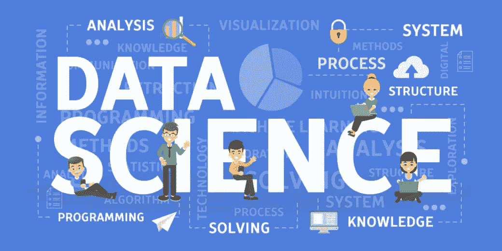
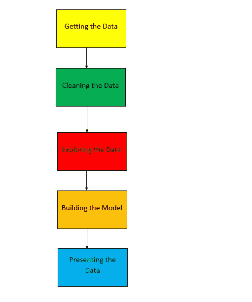

# 数据科学中使用的顶级 Python 库

> 原文：<https://towardsdatascience.com/top-python-libraries-used-in-data-science-a58e90f1b4ba?source=collection_archive---------1----------------------->

让我们来了解一下数据科学中可以使用的最重要、最有用的 python 库有哪些。



Credits: [DataQuest](https://www.dataquest.io/blog/what-is-data-science/)

众所周知，数据科学是研究数据的过程。是的，你所要做的就是研究数据，并从数据中获得新的见解。这里不需要关注从零开始应用或学习新的算法，你需要知道的只是学习如何处理数据和解决问题。你需要知道的一件关键事情是使用适当的库来解决数据科学问题。这篇文章是关于提供数据科学中使用的重要库的上下文。在深入讨论这个主题之前，我想先介绍一下解决数据科学问题的 5 个基本步骤。现在我已经坐下来从头开始设计这些步骤，所以没有正确或错误的答案，正确的答案取决于你如何处理数据。你可以在我的 [GitHub 库](https://github.com/Tanu-N-Prabhu/Python)上找到更多关于数据科学、python 的教程和代码，如下所示:

[](https://github.com/Tanu-N-Prabhu/Python) [## 塔努-北帕布/Python

### Python 下载:(https://www.python.org/downloads/)py charm 下载…

github.com](https://github.com/Tanu-N-Prabhu/Python) 

# 数据科学涉及的五个重要步骤如下所示:

1.  **获取数据。**
2.  **清理数据**
3.  **探索数据**
4.  **构建数据**
5.  **呈现数据**

现在，这些步骤是根据我的经验设计的，不要陷入这是万能答案的假设，但是当你坐下来思考问题时，那么这些步骤就会有很多意义。



## 1.获取数据

这是解决数据科学问题的最重要的步骤之一，因为你必须想到一个问题，然后最终想到解决它。获取数据的最佳方式之一是从互联网上抓取数据或从 Kaggle 下载数据集。现在就看你如何以及从哪里获取数据了。我发现 Kaggle 是获取数据的最佳途径之一。下面的链接会带你到 Kaggle 的官方网站，我需要你们花一些时间来使用 Kaggle。

 [## 数据集| Kaggle

### 下载数千个项目的开放数据集+在一个平台上共享项目。探索热门话题，如政府…

www.kaggle.com](https://www.kaggle.com/datasets) 

或者，你可以从网站上搜集数据，要搜集数据，你需要特定的方法和工具。下面是我的文章，我展示了如何从网站上收集数据。

[](/web-scraping-using-python-libraries-fe3037152ed1) [## 使用 Python 库的 Web 抓取。

### 让我们使用 Python 从 web 中抓取数据。

towardsdatascience.com](/web-scraping-using-python-libraries-fe3037152ed1) 

**一些最重要的用于从互联网上获取或抓取数据的库如下所示:**

1.  美味的汤
2.  要求
3.  熊猫

**Beautiful Soup:** 它是一个 python 库，用于从 HTML 或 XML 文件中提取或获取数据。下面是美汤库的官方文档，推荐你去看看链接。

[](https://www.crummy.com/software/BeautifulSoup/bs4/doc/) [## 美丽的汤文档-美丽的汤 4.4.0 文档

### Beautiful Soup 是一个 Python 库，用于从 HTML 和 XML 文件中提取数据。它与您最喜欢的解析器一起工作…

www.crummy.com](https://www.crummy.com/software/BeautifulSoup/bs4/doc/) 

要手动安装 Beautiful Soup，只需键入下面的命令，这里我已经告诉你如何手动安装所有的库，并确保首先安装 python，但我建议你们使用 [Google Colab](https://colab.research.google.com/notebooks/welcome.ipynb) 来键入和练习代码，因为在 Google Colab 中，你不需要安装任何库，你只需告诉“import library _ name ”, Colab 就会自动为你导入库。

```
pip install beautifulsoup4
```

要使用 Beautiful Soup，需要如下图导入:

```
from bs4 import BeautifulSoupSoup = BeautifulSoup(page_name.text, ‘html.parser’) 
```

**请求:**python 中的请求库用于以一种简单且更友好的方式发送 HTTP 请求。请求库中有很多方法，其中最常用的方法是 request.get()，它返回 URL 传递的状态，无论是成功还是失败。下面是 requests 库的文档，我建议您浏览文档以了解更多细节。

[](https://realpython.com/python-requests/) [## Python 的请求库(指南)-真正的 Python

### 在这篇关于 Python“请求”库的教程中，您将看到请求必须提供的一些最有用的特性…

realpython.com](https://realpython.com/python-requests/) 

要手动安装请求，请键入以下命令:

```
pip install requests
```

要导入请求库，您需要使用:

```
import requestspaga_name = requests.get('url_name')
```

**Pandas** : Pandas 是一种高性能、易用便捷的数据结构，是 python 编程语言的分析工具。熊猫为我们提供了一个数据框架，以清晰简洁的方式存储数据。下面是熊猫图书馆的官方文档。

 [## pandas:强大的 Python 数据分析工具包- pandas 0.25.1 文档

### 是一个开源的、BSD 许可的库，提供高性能、易于使用的数据结构和数据分析工具…

pandas.pydata.org](https://pandas.pydata.org/pandas-docs/stable/) 

要手动安装 pandas，只需输入代码:

```
pip install pandas 
```

要导入 pandas 库，您只需:

```
import pandas as pd
```

## 2.清理数据

清理数据包括移除重复行、移除异常值、查找缺失值或空值、将对象值转换为空值，以及使用图形绘制它们，这些是在清理数据期间必须执行的一些步骤。要了解更多关于清洁过程的信息，请阅读我的文章，如下所示:

[](/data-cleaning-with-python-using-pandas-library-c6f4a68ea8eb) [## 使用 Pandas 库用 Python 进行数据清洗。

### 根据这篇文章，数据清理和组织占了总重量的 57%。

towardsdatascience.com](/data-cleaning-with-python-using-pandas-library-c6f4a68ea8eb) 

**数据清理过程中涉及的一些主要库如下所示:**

1.  熊猫
2.  NumPy

**Pandas:** 是的，在数据科学中，我们到处都在使用 pandas library，同样，我不必给出关于 Pandas library 的详细信息，您可以参考上一节中的上下文。

**NumPy:** NumPy 是一个 python 库，也称为数字 python，可以执行科学计算。你们都必须知道 python 从来不提供数组数据结构，只有在 numpy 库的帮助下，才能创建数组并对数组执行操作。要阅读 numpy 库的官方文档，请访问下面的网站:

[](https://numpy.org/devdocs/) [## NumPy v1.18.dev0 手册

### 欢迎光临！这是 NumPy 1.18.0.dev0+68bd6e3 的文档，最后更新于 2019 年 9 月 27 日。部分…

numpy.org](https://numpy.org/devdocs/) 

同样，要下载 numpy，只需在命令行上运行以下命令(确保首先安装了 python):

```
python -m pip install --user numpy scipy matplotlib ipython jupyter pandas sympy nose
```

要在 python 中导入 numpy，您只需:

```
import numpy as np
```

## 3.探索数据

探索性数据分析(EDA)是通过将信息指标的基本属性有规律地绘制出来来理解信息指标。换句话说，你是在以一种更深入、更简洁(清晰)的方式探索数据。通过 EDA 的程序，我们可以要求对我们的信息收集的有意义的问题公告或定义进行特征化。要了解更多关于 EDA 过程的信息，请阅读下面我的文章:

[](/exploratory-data-analysis-in-python-c9a77dfa39ce) [## Python 中的探索性数据分析。

### 让我们了解如何在 python 中探索数据。

towardsdatascience.com](/exploratory-data-analysis-in-python-c9a77dfa39ce) 

**执行 EDA 时使用的一些主要库如下所示:**

1.  熊猫
2.  海生的
3.  Matplotlib.pyplot

**pandas:** 正如我所说，Pandas 库非常重要，我们在整个数据科学中使用这个库，有关 Pandas 库的更多详细信息，请浏览上面的第一部分。

**Seaborn:** Seaborn 是一个 python 数据可视化库，它为绘制带有统计信息的图形提供了一个高级接口。要安装最新版本的 seaborn，请使用:

```
pip install seaborn
```

我建议您浏览 seaborn 的官方文档，如下所示:

[](https://seaborn.pydata.org/examples/index.html#example-gallery) [## 示例库- seaborn 0.9.0 文档

### 编辑描述

seaborn.pydata.org](https://seaborn.pydata.org/examples/index.html#example-gallery) 

在 seaborn 的帮助下，可以绘制各种图，如条形图、散点图、热图等。要进口 seaborn，您只需:

```
import seaborn as sns
```

**Matplotlib . py plot:**Matplotlib 是一个 2D 绘图 python 库，使用它我们可以跨各种环境用 python 绘制各种图。它是 seaborn 的替代品，seaborn 基于 matplotlib。要安装 matplotlib，您只需:

```
python -m pip install -U matplotlib
```

要阅读 matplotlib 的官方文档，请浏览下面的链接:

 [## 用户指南- Matplotlib 3.1.1 文档

### 编辑描述

matplotlib.org](https://matplotlib.org/users/index.html) 

要导入 matplotlib.pyplot 库，请使用以下代码:

```
import matplotlib.pyplot as plt
```

## 4.构建模型

这是数据科学中最重要的步骤之一，这一步明显比其余步骤更难，因为在这一步中，您将基于您的问题陈述和数据构建一个机器学习模型。现在，问题陈述非常重要，因为它引导你定义一个问题，并思考不同的解决方案。互联网上许多可用的数据集都是基于一个问题，所以在这里你解决问题的技能非常重要。此外，没有一种算法最适合您的解决方案，您必须考虑您的数据是属于回归、分类、聚类还是降维，所有算法都有不同的类别。要了解更多关于构建模型的信息，请阅读下面我的文章:

[](https://medium.com/analytics-vidhya/building-a-machine-learning-model-to-predict-the-price-of-the-car-bc51783ba2f3) [## 建立机器学习模型来预测汽车的价格。

### 在本教程中，我们将学习如何使用 python 建立一个机器学习模型来预测…

medium.com](https://medium.com/analytics-vidhya/building-a-machine-learning-model-to-predict-the-price-of-the-car-bc51783ba2f3) 

大多数时候，选择最佳算法是一项非常令人困惑的任务，因此我使用了[sci kit learn algorithms cheat sheet](https://scikit-learn.org/stable/tutorial/machine_learning_map/index.html)来帮助您找到最适合的算法。下面是 Scikit learn 的备忘单。


Credits: [scikit learn](https://scikit-learn.org/stable/tutorial/machine_learning_map/index.html)

**用于构建模型的重要库是显而易见的:**

1.  SciKit 学习

**SciKit learn:** 这是一个易于使用的 Python 库，用于构建机器学习模型。它构建在 NumPy、SciPy 和 matplotlib 之上。以下是 scikit 学习库的官方文档。

[](https://scikit-learn.org/stable/) [## sci kit-学习

### 编辑描述

scikit-learn.org](https://scikit-learn.org/stable/) 

为了导入 scikit learn，您只需:

```
import sklearn
```

要手动安装，请使用以下命令:

```
pip install -U scikit-learn
```

## 5.展示数据

这是他们大多数人最不想做的任务之一。这是因为没有人愿意公开谈论他们在数据上的发现。有一种呈现数据的方式。这是至关重要的，因为在一天结束的时候，你应该有能力向人们解释你的发现，让它变得非常小，因为人们对你的算法不感兴趣，他们只对结果感兴趣。因此，为了演示您的发现，您需要安装 Jupyter 笔记本，如下所示:

[](https://jupyter.org/install.html) [## Jupyter 项目

### JupyterLab 可以使用 conda 或 pip 安装。有关更详细的说明，请参阅安装指南。如果你…

jupyter.org](https://jupyter.org/install.html) 

另外，还要安装一个命令来帮助您的笔记本启用演示选项:

```
pip install RISE
```

关于如何让你的笔记本成为一个完全令人惊叹的演示文稿的更多指导可以在下面的文章中找到[这里](http://www.blog.pythonlibrary.org/2018/09/25/creating-presentations-with-jupyter-notebook/)。确保你遵循教程的每一行。此外，您还可以观看 YouTube 视频，了解如何在 Jupyter 笔记本上进行演示:

Credits: [LiveLessons](https://www.youtube.com/watch?v=utNl9f3gqYQ&t=154s)

现在我们已经到了文章的结尾，您现在知道了如何、何时以及在哪里在数据科学中使用 python 库。对于这篇文章，我已经尽力从头开始解释所有的事情。如果你们有任何疑问，请在下面随意评论。关于数据科学编码的更多信息，请访问我的 [GitHub](https://github.com/Tanu-N-Prabhu/Python) 库。谢谢你们阅读我的文章，我希望你们喜欢，如果没有让我知道需要改进的地方，我会改正的。不管怎样，再见，祝你愉快。