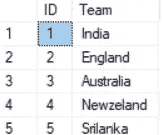
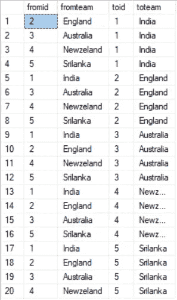
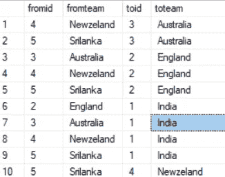

# 数据工作者的热门 SQL 查询

> 原文：<https://towardsdatascience.com/top-sql-queries-for-interview-b563cfec66d0?source=collection_archive---------21----------------------->

## 您需要知道的棘手和最常见的 SQL 查询

SQL(结构化查询语言)是关系数据库管理系统(RDBMS)中管理数据的主要语言。简单地说，SQL 是您与数据库交互的语言。

image by [Steve Halama](https://unsplash.com/@steve3p_0)

在本文中，我将带您了解在访谈中最常见的 *SQL 查询。*

# 1.第 n 高工资

从员工表中获取第三高的薪金。

3rd Highest Salary

**Dense_Rank():** 返回结果集分区中每一行的排名，结果值之间没有间隔。

*您可以使用子查询来获得相同的结果。*

# 2.查找重复记录

使用唯一标识符在表中查找重复记录。这里我使用 Firstname 作为标识符，但是您可以根据表信息使用任何其他标识符。

Duplicate records

# 3.不使用循环打印从 1 到 100 的数字

Numbers from 1 to 100

# 4.生成累计

给定产品和订单细节，我们必须生成每个产品的运行总数。(例如:第 3 行的累计将是前 3 行的总和)

a.编写一个子查询，通过对产品名称进行分组来生成每种产品的总量。

b.从上面的查询中计算运行总数。

Running total

# 5.查询以生成唯一的组合

考虑一个场景，你有 5 支球队，我们必须计划球队之间的联赛，这样所有的球队对都应该是唯一的。我将使用临时表和内部连接来实现这个结果。

a.创建具有唯一团队的临时表

> 下面是上述查询的结果集！！

Teams

b.用上面的结果生成所有可能的组合。

> 下面是上述查询的结果。

All combinations

在这里，我们可以看到所有可能的组合以及重复的组合，如(印度，澳大利亚；澳大利亚、印度)

c.让我们只生成唯一的组合

我们可以看到，如果 **fromid** 和 **toid** 匹配，则代表相同的组合。有两种可能的组合，要么来自 Id 的**将大于来自 id**的**要么来自 id**的**将大于来自 id** 的**。让我们只取其中一个组合。**

Query to get unique combinations

Final result

***希望你喜欢！！！如果您有任何疑问，请评论！！***

分享如果你遇到了任何棘手/复杂的问题，我会试着解决它们，并在这里添加。