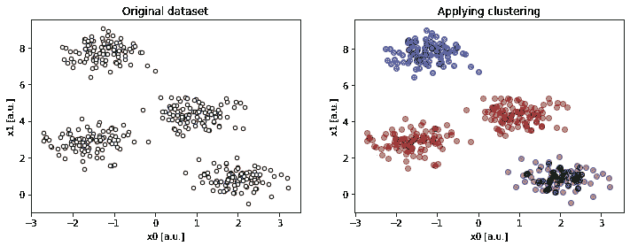
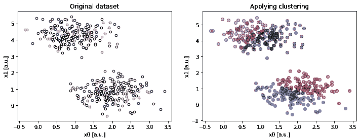
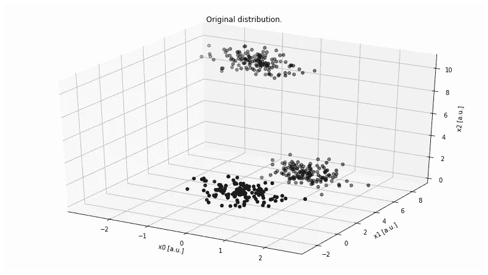
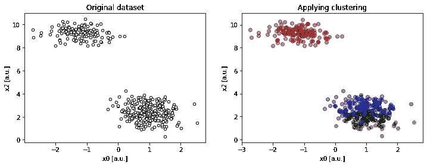
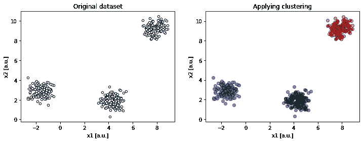
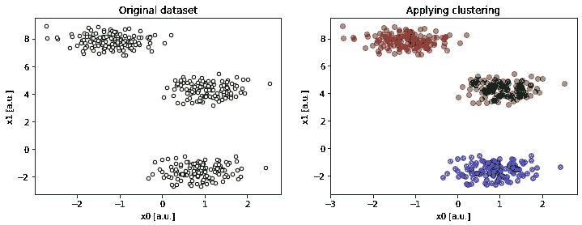
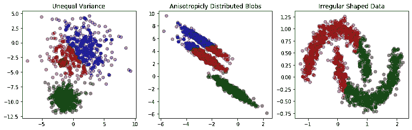

# 数据分析期间 K 均值聚类的三大错误

> 原文：<https://towardsdatascience.com/top-three-mistakes-with-k-means-clustering-during-data-analysis-b984fda0a0d6?source=collection_archive---------29----------------------->

# 介绍

在本帖中，我们将看看 KMC 算法表现不佳或可能产生不直观结果的一些情况。具体来说，我们将查看以下场景:

1.  我们对(真实)星团数量的猜测是错误的。
2.  特征空间是高度多维的。
3.  这些簇以奇怪或不规则的形状出现。

所有这些情况都会导致 K-Means 出现问题，所以让我们来看看。

# 错误的集群数量

为了简单起见，让我们定义一个助手函数`compare`，它将为我们创建并解决聚类问题，然后比较结果。

```
from sklearn import datasets
from sklearn.cluster import KMeans
from sklearn.datasets import make_blobs, make_circles, make_moons
from mpl_toolkits.mplot3d import Axes3D

import numpy as np
import pandas as pd
import itertools

def compare(N_features, C_centers, K_clusters, dims=[0, 1],*args):
    data, targets = make_blobs(
      n_samples=n_samples if 'n_samples' in args else 400,
      n_features=N_features,
      centers=C_centers,
      cluster_std=cluster_std if 'cluster_std' in args else 0.5,
      shuffle=True,
      random_state=random_state if 'random_state' in args else 0)

    FEATS = ['x' + str(x) for x in range(N_features)]
    X = pd.DataFrame(data, columns=FEATS)
    X['cluster'] = \
		KMeans(n_clusters=K_clusters, random_state=0).fit_predict(X)

    fig, axs = plt.subplots(1, 2, figsize=(12, 4))
    axs[0].scatter(data[:, dims[0]], data[:, dims[1]],
        c='white', marker='o', edgecolor='black', s=20)
    axs[0].set_xlabel('x{} [a.u.]'.format(dims[0]))
    axs[0].set_ylabel('x{} [a.u.]'.format(dims[1]))
    axs[0].set_title('Original dataset')
    axs[1].set_xlabel('x{} [a.u.]'.format(dims[0]))
    axs[1].set_ylabel('x{} [a.u.]'.format(dims[1]))
    axs[1].set_title('Applying clustering')

    colors = itertools.cycle(['r', 'g', 'b', 'm', 'c', 'y'])
    for k in range(K_clusters):
        x = X[X['cluster'] == k][FEATS].to_numpy()
        axs[1].scatter(
		x[:, dims[0]], 
		x[:, dims[1]], 
		color=next(colors),
		edgecolor='k', 
		alpha=0.5
	)
    plt.show()
```

# 集群太少



Figure 1a. Example of a 2-dimensional dataset with 4 centres, requesting 3 clusters (`compare(2, 4, 3)`).

尽管数据中有不同的聚类，但我们低估了它们的数量。因此，一些不相交的数据组被迫放入一个更大的群集中。

# 太多集群



Figure 1b. Example of a 2-dimensional dataset with 2 centres, requesting 4 clusters (`compare(2, 2, 4)`).

与最后一种情况相反，试图将数据包装到太多的集群中会在真实的数据集群中产生人为的边界。

# 高维数据

在我们开始发现问题之前，数据集不需要有那么高的维数。尽管可视化和对高维数据的分析已经很有挑战性了(现在开始诅咒…)，但是 KMC 经常被用来洞察数据，它并不能帮助你理解数据的模糊性。

为了解释这一点，让我们生成一个具有明显不同聚类的三维数据集。

```
fig = plt.figure(figsize=(14, 8))
ax = fig.add_subplot(111, projection='3d')

data, targets = make_blobs(
    n_samples=400,
    n_features=3,
    centers=3,
    cluster_std=0.5,
    shuffle=True,
    random_state=0)

ax.scatter(data[:, 0], data[:, 1], 
    zs=data[:, 2], zdir='z', s=25, c='black', depthshade=True)
ax.set_xlabel('x0 [a.u.]')
ax.set_ylabel('x1 [a.u.]')
ax.set_zlabel('x2 [a.u.]')
ax.set_title('Original distribution.')
plt.grid()
plt.show()
```



Figure 2\. Example of a 3-dimensional dataset with 3 centers.

尽管有无限多种方法可以将这个 3D 数据集投影到 2D 上，但是有三个主要的正交子空间:

查看`x2 : x0`投影，数据集看起来好像只有两个集群。右下角的“超星系团”实际上是两个不同的群组，即使我们猜对了*K**(K = 3)*，这看起来也是一个明显的错误，尽管这些星系团非常局限。



Figure 3a. Projection on `x0 : x2` shows spurious result (`compare(2, 2, 4, dims=[0, 2])`).

可以肯定的是，我们必须从不同的角度来看剩下的预测，才能真正理解这个问题。



Figure 3b. Projection on `x1 : x2` resolves the ambiguity (`compare(2, 2, 4, dims=[1, 2])`).



Figure 3c. Projection on `x0 : x1` resolves the ambiguity (`compare(2, 2, 4, dims=[0, 1])`).

这更有道理！

另一方面，我们有不可思议的优势。首先，有了三维，我们能够绘制整个数据集。其次，数据集中存在的聚类非常独特，因此很容易识别。最后，有了三维数据集，我们只需要面对三个标准的 2D 投影。

在 *N，N > 3* 特征的情况下，我们将**不能绘制整个数据集**，并且 2D 投影的数量将与 *N* 成二次比例:

更不用说数据集可能会有形状奇怪或者非本地化的聚类，这是我们的下一个挑战。

# 不规则数据集

到目前为止，我们提到了“我们这边”的问题。我们查看了一个非常“表现良好”的数据集，并讨论了分析方面的问题。但是，如果数据集不适合我们的解决方案，或者我们的**解决方案不适合问题，该怎么办？**正是这种情况，数据分布以奇怪或不规则的形状出现。

仅仅看到这张图，我们可能会误以为数据中只有两个聚类。然而，当绘制剩余的投影时，我们很快发现这是不正确的。

```
fig, axs = plt.subplots(1, 3, figsize=(14, 4))

# unequal variance
X, y = make_blobs(n_samples=1400,
    cluster_std=[1.0, 2.5, 0.2],
    random_state=2)
y_pred = KMeans(n_clusters=3, random_state=2).fit_predict(X)
colors = [['r', 'g', 'b'][c] for c in y_pred]

axs[0].scatter(X[:, 0], X[:, 1], 
	color=colors, edgecolor='k', alpha=0.5)
axs[0].set_title("Unequal Variance")

# anisotropically distributed data
X, y = make_blobs(n_samples=1400, random_state=156)
transformation = [
	[0.60834549, -0.63667341],
	[-0.40887718, 0.85253229]
]
X = np.dot(X, transformation)
y_pred = KMeans(n_clusters=3, random_state=0).fit_predict(X)
colors = [['r', 'g', 'b'][c] for c in y_pred]

axs[1].scatter(X[:, 0], X[:, 1], 
	color=colors, edgecolor='k', alpha=0.5)
axs[1].set_title("Anisotropicly Distributed Blobs")

# irregular shaped data
X, y = make_moons(n_samples=1400, shuffle=True, 
	noise=0.1, random_state=120)
y_pred = KMeans(n_clusters=2, random_state=0).fit_predict(X)
colors = [['r', 'g', 'b'][c] for c in y_pred]

axs[2].scatter(X[:, 0], X[:, 1], 
	color=colors, edgecolor='k', alpha=0.5)
axs[2].set_title("Irregular Shaped Data")

plt.show()
```



Figure 4\. Misleading clustering results are shown on irregular datasets.

左图显示了其分布(虽然是高斯分布)不具有相等标准偏差的数据。中间的图表显示了*各向异性*数据，即沿着特定轴拉长的数据。最后，右图显示了完全非高斯的数据，尽管这些数据被组织成清晰的簇。

在这两种情况下，不规则性使得 KMC 算法表现不佳。由于算法平等地对待每一个数据点，并且完全独立于其他点，算法**未能发现一个聚类**内任何可能的连续性或局部变化。它所做的只是采用相同的指标，并将其应用于每一点。因此，KMC 算法可能会在数据中产生奇怪的或违反直觉的聚类，即使我们正确地猜测了 *K* 并且特征 *N* 不是很多。

# 结论

在这篇文章中，我们讨论了 K-Means 聚类算法给我们错误答案的三个主要原因。

*   首先，由于需要先验地确定聚类数 *K* ，因此我们很有可能会错误地猜测它。
*   其次，从分析的角度来看，高维空间中的聚类变得很麻烦，在这种情况下，KMC 将为我们提供可能具有误导性的见解。
*   最后，对于任何形状不规则的数据，KMC 很可能会人为地进行不符合常识的聚类。

知道了这三个谬误，KMC 仍然是一个有用的工具，尤其是在检查数据或构造标签的时候。

# 还会有更多…

我计划把文章带到下一个层次，并提供简短的视频教程。

如果您想了解关于视频和未来文章的更新，**订阅我的** [**简讯**](https://landing.mailerlite.com/webforms/landing/j5y2q1) **。你也可以通过填写[表格](https://forms.gle/bNpf9aqZJGLgaU589)让我知道你的期望。回头见！**

*最初发表于*[*【https://zerowithdot.com】*](https://zerowithdot.com/mistakes-with-k-means-clustering/)*。*