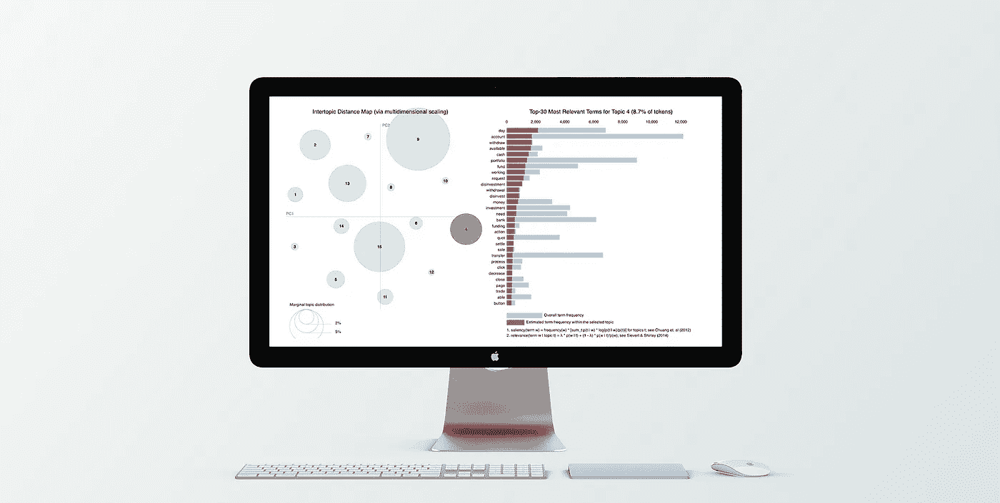
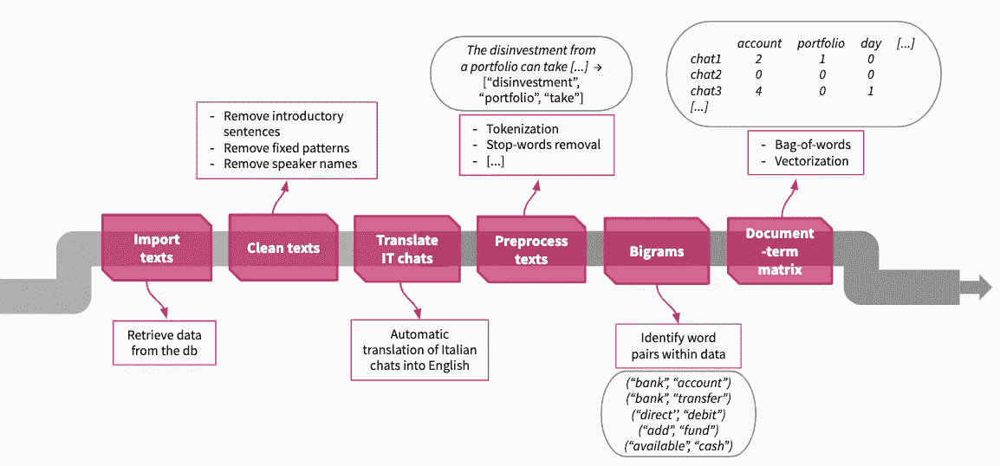
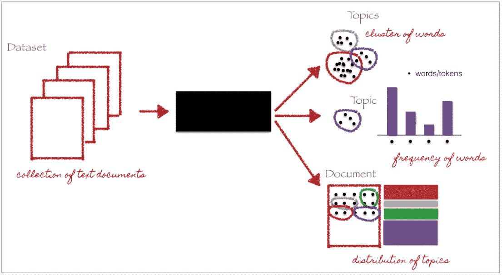

# 在线聊天的话题抽取和分类

> 原文：<https://towardsdatascience.com/topic-extraction-and-classification-of-online-chats-e2bb2f11314a?source=collection_archive---------17----------------------->

## 一个用推断主题分类未标记文本数据的框架

当我们想要分类未标记的数据，即我们没有想要分类的信息的数据时，无监督和有监督的机器学习方法的组合可以是一个很好的解决方案。这篇博客文章介绍了一种可能的解决方案

*   首先，通过使用**无监督主题建模**自动识别文本数据语料库中的主题，
*   然后，应用**监督分类算法**，通过使用前一步骤的结果作为目标标签，将主题标签分配给每个文本文档。

这个项目使用了一家金融科技公司的客户关系管理团队的数据，特别是他们在英国和意大利的客户的在线聊天记录。

# 方法学

Flow overview

## 1.收集在线聊天文本

Data preprocessing pipeline

第一步是检索文本数据，并将其转换成我们想要使用的模型的兼容形式。在这种情况下，通常的 [NLP](/nlp-for-beginners-cleaning-preprocessing-text-data-ae8e306bef0f) 数据准备技术已被应用，此外还有针对该数据集特定性质的其他特别转换:

*   删除每次聊天中重复的文字部分；
*   应用**自动翻译**以使整个语料库用一种语言编写，在本例中是英语。另一种选择是保持文本的原始语言，然后为每种语言应用独立的预处理管道和机器学习模型；
*   使用**符号化**、词汇化、停用词和数字去除对文本进行预处理；
*   将 **n-grams** 添加到数据集，以指导主题模型。这里的假设是，被视为单个实体或标记的单词的短序列通常包含识别句子主题的有用信息。在这种情况下，只有二元模型才是有意义的——事实上，它们极大地提高了主题模型的性能；
*   使用计数矢量化将数据转换为数字**术语-文档矩阵**，将聊天文档作为行，将单个标记作为列，将相应的频率作为值(给定聊天中所选标记的频率)。这种所谓的单词包(BoW)方法没有考虑单词顺序，单词顺序在主题识别中不应该起关键作用。

## **2。摘录主题**

此时，数据集处于[潜在狄利克雷分配(LDA)模型](http://www.jmlr.org/papers/volume3/blei03a/blei03a.pdf)的正确形状，该模型是本研究中已经实现的概率主题模型。文档术语矩阵实际上是模型需要的输入类型，以便推断以下方面的概率分布:

*   文档中的一组潜在(即未知)主题；
*   语料库词汇表(数据集中使用的所有单词的集合)中的单词，通过查看包含该单词的文档中的主题以及语料库中该特定单词的其他主题分配。

Credits: [Christine Doig](http://chdoig.github.io/pygotham-topic-modeling/#/)

LDA 以高维向量的形式输出 *K* 个主题(其中 *K* 作为参数提供给模型)，其中每个分量代表词汇表中特定单词的权重。通过查看具有最高权重的术语，可以手动为 *K* 主题命名，从而提高输出的可解释性。

Manually given topic names on the left; top 10 words for the corresponding topics on the right.

LDA 还为数据集中的每个文档提供了一个主题分布，作为一个稀疏向量(少数组件具有高权重，所有其他组件具有 0 权重)，从而更容易解释高维主题向量并提取每个文本的相关主题。

LDA output visualised with the [pyLDAvis](https://pyldavis.readthedocs.io/en/latest/) library. The model has been trained on about 10k chats, containing both English and Italian chats (translated into English). *K*=15 is the number of topics which has performed best among the tested values, according to the perplexity score. In the chart above, each circle on the left-hand side represents a topic with the size proportional to its frequency in the corpus; the right-hand side shows the overall relevance of the given token across the corpus. In the interactive visualisation, the bars on the right update after hovering over a topic circle to show the relevance of the tokens in the selected topic (red bars) as opposed to the relevance of the same tokens in the whole corpus (grey bars).

## 3.为聊天分配主题标签

因此，LDA 模型为每个接受训练的文档提供主题权重。现在，向监督方法的过渡变得简单明了:选择权重最高的向量分量，并将相应的主题用作给定聊天文档的目标标签。为了增加标签分配的置信度，在随后的步骤中，仅保留主导主题权重高于 0.5 的文本(也测试了其他阈值，但是 0.5 是允许同时在数据集中保持合理比例的在线聊天以及分配的良好置信度的值)。

## 4.分类新聊天

在建立了与监督机器学习算法兼容的设置之后，多项式逻辑回归模型已经被训练和测试，以将新聊天分类到相应的主题标签。在所使用的 4 重交叉验证技术的所有迭代中，在精确度和召回率方面的分类结果已经超过 0.96(在 15 个主题类别中的平均值)。

显然有许多方面可以调整和改进(例如，处理主题类别的不平衡，提高自动翻译的准确性，尝试对每种语言使用不同的流程，而不是对所有翻译的文本使用单一的流程，等等。)，但有明确的证据表明，这种方法可以从非结构化文本的语料库中识别出有意义和有趣的话题信息，并提供一种算法，将话题准确地分配给以前看不见的在线聊天文本。

# 那又怎样？

这一应用于类似于本文所述的业务环境的分析显示了一个简单框架的有效性，公司可以在内部实施该框架，以了解其客户的查询、投诉或问题的类型。这也可以是一个起点，了解客户对特定产品、服务或缺陷的情绪或感觉，而不明确要求他们提供反馈。这是一种快速有效的方式来收集关于顾问和客户之间互动的见解，特别是如果有关于对话的元数据(如日期、持续时间)和其他类型的信息(如客户注册日期、在线活动、以前的投诉等)作为补充的话。).