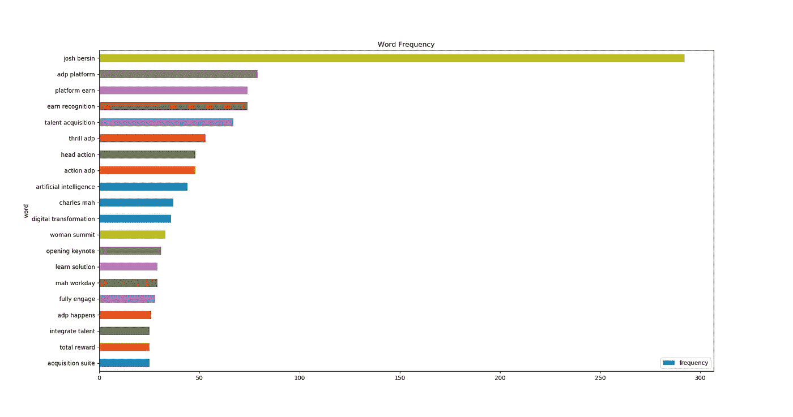
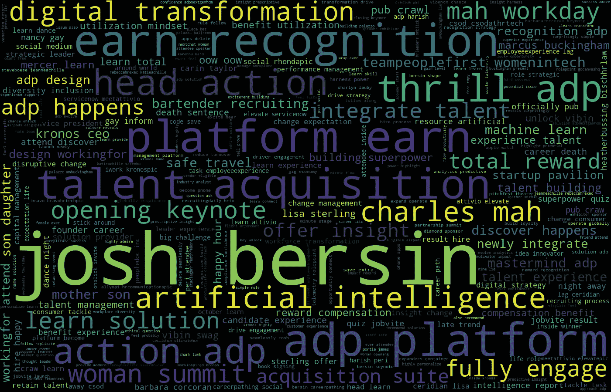
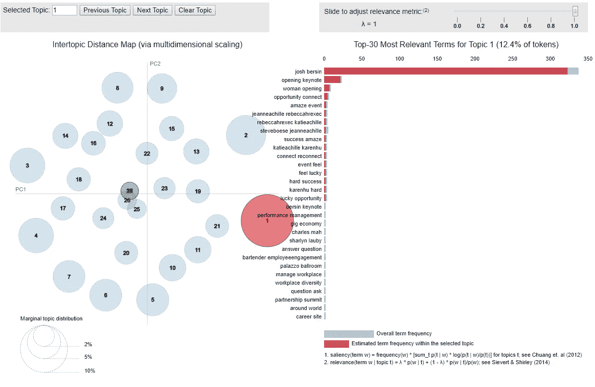

# 2019 人力资源技术大会 Twitter 主题建模

> 原文：<https://towardsdatascience.com/topic-modeling-of-2019-hr-tech-conference-twitter-d16cf75895b6?source=collection_archive---------18----------------------->

[人力资源技术大会暨博览会](https://www.hrtechnologyconference.com/)是全球领先、最大的人力资源和 IT 专业人士会议，于 2019 年 10 月 1 日至 4 日在拉斯维加斯举行。大会涵盖了大量的人力资源技术话题。不幸的是，不是每个人都能去，包括我自己。有没有可能不用身临其境就能说出流行语和话题是什么？答案是肯定的！我们在推特上寻找一些快速的见解。

我们使用#HRTechConf 抓取推文，并建立潜在狄利克雷分配(LDA)模型来自动检测和解释推文中的主题。以下是这项工作的流程:

1.  数据收集——Twitter 抓取
2.  文本预处理
3.  可视化词云中的关键词
4.  训练 LDA 模型
5.  可视化主题

我们使用 Python 3.6 和以下软件包:

*   [TwitterScraper](https://github.com/taspinar/twitterscraper) ，一个抓取推文的 Python 脚本
*   [NLTK](http://www.nltk.org/) (自然语言工具包)，一个用于文本处理的 NLP 包，例如停用词、标点符号、标记化、词条化等。
*   Gensim ，“生成相似”，一个流行的用于主题建模的 NLP 包
*   [潜在狄利克雷分配](https://en.wikipedia.org/wiki/Latent_Dirichlet_allocation) (LDA)，一种用于主题聚类/建模的生成式概率模型
*   pyLDAvis ，一个交互式 LDA 可视化包，用于帮助解释在文本数据语料库上训练的主题模型中的主题

# 数据采集

使用 Twitter 自己的 API 来抓取它总是具有挑战性。最大的一个缺点是，它只允许搜索过去 7 天内发布的推文。这是任何人寻找更老的过去数据来制作模型的一个主要瓶颈。幸运的是，有了 [TwitterScraper](https://github.com/taspinar/twitterscraper) 就没有这样的限制了。

```
from twitterscraper import query_tweets
# https://twitter.com/search-advanced
list_of_tweets = query_tweets('HRTechConf', 
         begindate=datetime.date(2019, 9, 26), 
         enddate=datetime.date(2019, 10, 6), 
         lang='en')
# Convert list of tweets to DataFrame
tweets_df = pd.DataFrame([vars(x) for x in list_of_tweets])
```

我们收集了 2019 年 9 月 26 日至 2019 年 10 月 6 日期间包含关键字“HRTechConf”的推文。在 10 天内，有 7，274 条推文，大多数推文是在 10 月 1 日至 3 日(会议的前 3 天)收费的。


*HRTechConf 2019 Number of Tweets*

我们来看看一些推文。

> @Workday @ #HRTechConf 的 Charles Mah 强调了变革管理在转变您的团队和技术堆栈中的重要作用。它经常被低估和资源不足，但作为一名助教领导者，它对你的成功至关重要。
> 
> @josh_bersin 谈论#talentacquisition 的大规模增长。@jobvite 认为空间拥挤，用点解决方案碎片化。查看我们的技术信息图。https://bit.ly/2nQdmVq# HRTechConf

# 文本预处理

在我们可以应用任何机器学习算法之前，Twitter 数据需要进行预处理，以便将推文转换为可分析的形式。以下是预处理步骤:

1.  将所有单词转换成小写
2.  删除非字母字符
3.  删除短单词(长度小于 3)
4.  标记化:将句子分解成单词
5.  词性标注:将单词按其语法类别分类的过程，目的是理解它们在句子中的作用，如动词、名词、形容词等。词性标注为词汇化提供了语法环境。
6.  词汇化:将一个单词转换成它的基本形式，例如*汽车*、*汽车*和*汽车的*到*汽车*
7.  去掉常见的英语单词，如 a，the，of 等。，并去掉对我们的分析增加很少价值的常用词，如 hrtechconf、much、hr、get 等。

```
from nltk.stem import WordNetLemmatizer
from nltk.corpus import stopwords, wordnet
import nltkdef get_wordnet_pos(word):
    """
    Map POS tag to first character lemmatize() accepts
    """
    tag = nltk.pos_tag([word])[0][1][0].upper()
    tag_dict = {"J": wordnet.ADJ,
                "N": wordnet.NOUN,
                "V": wordnet.VERB,
                "R": wordnet.ADV}
   return tag_dict.get(tag, wordnet.NOUN)text_clean = text.lower()
# Remove non-alphabet
text_clean = re.sub(r'[^a-zA-Z]|(\w+:\/\/\S+)',' ', text_clean).split()    
# Remove short words (length < 3)
text_clean = [w for w in text_clean if len(w)>2]
# Lemmatize text with the appropriate POS tag
lemmatizer = WordNetLemmatizer()
text_clean = [lemmatizer.lemmatize(w, get_wordnet_pos(w)) for w in text_clean]
# Filter out stop words in English 
stops = set(stopwords.words('english')).union(additional_stop_words)
text_clean = [w for w in text_clean if w not in stops]
```

在预处理之后，上述推文被转换成:

*['charles '，' mah '，' workday '，' highlight '，' essential '，' role '，' change '，' management '，' transform '，' stack '，'经常'，'低估'，'资源丰富'，'关键'，'成功'，'领导者']*

*['josh '，' bersin '，' massive '，' growth '，' talentacquisition '，' jobvite '，' space '，' crowd '，' fragment '，' point '，' solution '，' infograph ']*

# 单词计数和单词云

很难解释一个单词的意思。例如， *machine* 可能是机械机器、机枪或机器学习。相反，我们使用二元模型，即连续单词对进行单词计数。以下是在所有提取的推文中出现频率最高的 20 个短语。



*HR Tech Twitter Word Count — Bigrams*

从这个列表中我们能看出什么？

*   “*乔希·伯辛*”是发微博最多的——乔希·伯辛是主题发言人。
*   ADP 有很多 Twitter 报道*“ADP 平台”、“thrill adp”、“action adp”、“ADP occurs”*—ADP 是大会的金牌赞助商，其人力资本管理(HCM)平台在大会上赢得了一些顶级关注。
*   *【人工智能】*出现在很多推文中。
*   *“女性峰会”*被多次提及——本次会议也以人力资源技术领域的女性为主题。

这里有一句话云:



*HR Tech Twitter Wordcloud*

# 特征抽出

推文或任何文本都必须转换为数字向量——描述文本(或语料库)中单词出现的字典。我们使用的技术被称为单词袋，这是一种提取文本特征的简单方法。以下是步骤。

## 词汇袋(二元模型)

**统计二元模型**

二元模型是两个单词的序列，例如*机器学习，人才获取*。通常情况下，一袋二元模型比一袋单词(单个单词或一元模型)更强大，能产生更有意义的见解。

**建字典**

我们构建推文的字典(或词汇表),其中推文的所有独特二元模型都被赋予 id，并且它们的频率计数也被捕获。我们使用 Gensim 库来构建字典。

我们从字典中排除了出现在不到 10 条 tweets 中的所有标记，因此我们只处理最有代表性的单词。此外，在超过 50%的推文中出现的二元模型也被删除，例如*不久的将来，明年*。

```
from gensim import corpora
tweets_dict = corpora.Dictionary(token_tweets)
tweets_dict.filter_extremes(no_below=10, no_above=0.5)
```

**基于词典重建语料库**

现在，使用上面的字典，我们为每条 tweet 生成一个单词计数向量，它由该特定 tweet 的词汇表中所有单词的频率组成。它们中的大多数都是零，因为 tweet 没有字典中的所有单词。

```
bow_corpus = [tweets_dict.doc2bow(doc) for doc in token_tweets]
```

## TF-IDF

单词包基于文档由最频繁出现的单词表示的原理，即具有高“词频”(TF)的单词。这种方法的一个问题是，高频词开始在文档中占主导地位，但可能不像低频词那样代表模型。

解决这个问题的一种方法是测量一个词在所有文档(或推文)中的独特程度(或罕见程度)，这被称为“逆文档频率”或 IDF。通过引入 IDF，在所有文档中频繁出现的常用词的权重会降低。

在 TF-IDF 中，我们将`TF x IDF`计算为字典中每个单词的权重，代表该单词在 tweet 中的出现频率乘以该单词在所有 tweet 中的独特性。TF-IDF 权重突出了 tweet 中不同的词(相关信息)。

```
from gensim import models
tfidf = models.TfidfModel(bow_corpus)
tfidf_corpus = tfidf[bow_corpus]
```

# 基于 LDA 的主题建模

现在，我们准备训练我们的 LDA 模型，从推文中学习主题。

LDA 是一种无监督的机器学习算法，它是一种生成统计模型，以文档为输入，以发现主题为输出。每个文档被认为是许多主题的混合物，每个主题由单词的频率(或单词分布)决定。LDA 是一种流行的概率主题建模算法。下面是对潜在狄利克雷分配的介绍。

我们使用 Gensim 库来训练超过 7000 条推文的 LDA 模型。要调整的一些模型超参数:

*   **话题数量**:每个话题是一组关键词，每个关键词对话题有一定的权重(即重要性)。太少的主题会导致不连贯的主题，包含不同种类的词，很难区分。太多的主题没有提供任何主题的任何语义意义。鉴于这是一个大事件，推文覆盖了几天，所有推文的主题数量可能会很高。我们将主题数量设置为 30。我们也尝试了 10，20 和 50，没有一个比 30 更好的结果。
*   **Alpha(文档主题密度)**:Alpha 越低，一条推文就越有可能包含几个主题的混合。默认设置是`1.0/NUM_TOPICS`,我们使用`0.001`,因为每条推文都很短，很可能只有一个主题。
*   **Eta(单词-主题密度)**:Eta 越低，主题就越有可能包含少量单词的混合。默认是`1.0/NUM_TOPICS`我们用的默认。
*   **遍数**:所有 tweets 的训练遍数/迭代次数。我们把它设置为 50。我们尝试了更大的数字，它们并没有产生更好的结果。

```
from gensim import models
NUM_TOPICS = 30
NUM_PASSES = 50 
ALPHA = 0.001
ETA = 'auto'
# Train LDA model
lda_model = models.ldamodel.LdaModel(corpus=tfidf_corpus, 
                                         num_topics=NUM_TOPICS, 
                                         id2word=tweets_dict, 
                                         passes=NUM_PASSES, 
                                         alpha=ALPHA, 
                                         eta=ETA,
                                         random_state=49)
```

以下是一些示例主题。数字越高，它们对主题的权重(重要性)就越大。

```
Topic: 20
Words: 0.823*"josh bersin" + 0.055*"opening keynote" + 0.018*"woman opening" + 0.012*"opportunity connect" + 0.007*"amaze event" + 0.006*"rebeccahrexec katieachille" + 0.006*"jeanneachille rebeccahrexec" + 0.006*"steveboese jeanneachille" + 0.005*"event feel" + 0.005*"lucky opportunity"
```

这个主题似乎是关于“乔希·伯辛”的，涉及“开场主题”和“女性开场”。在查看了[人力资源技术会议网站](https://www.hrtechnologyconference.com/)后，我们可以确认 Josh Bersin 是主题演讲人，而人力资源技术会议开幕式也在同一地点举行。下面是一条推文示例:

> 今天从@Josh_Bersin 在#HRTechConf 的开幕主题演讲中签到！我们的团队喜欢听 Josh 分享他对技术如何为 HR . pic.twitter.com/ku27LKzmcb 塑造和创造新机会的见解

```
Topic: 3 
Words: 0.259*"kronos ceo" + 0.059*"rule follow" + 0.041*"kronos highly" + 0.041*"surprisingly simple" + 0.041*"simple rule" + 0.041*"reveals surprisingly" + 0.041*"replicate success" + 0.041*"workinspired kronos" + 0.041*"follow replicate" + 0.041*"culture reveals"
```

看来这个话题是关于克罗诺斯的 CEO 揭示了一些令人惊讶的简单规则(文化？为了成功？)下面是一条推文:

> #hrconfes RT KronosInc:在#WorkInspired 中，克罗诺斯首席执行官 Aron Ain 带你走进克罗诺斯备受推崇的文化，并揭示了你可以遵循的惊人简单的规则，以开始复制这种成功。#HRTechConf

```
Topic: 7 Words: 0.187*"marcus buckingham" + 0.177*"book signing" + 0.138*"free copy" + 0.124*"nine lie" + 0.079*"present lie" + 0.079*"buckingham present" + 0.001*"peopledoc inc" + 0.001*"drive engagement" + 0.001*"around world" + 0.001*"answer question"
```

好像这个话题是关于马库斯白金汉的签名售书和免费赠送(九个谎言？可能是书名)下面是一条推文:

> #hrtechconf 与 Marcus Buckingham 的图书签售# FreeThinkingCoalition # 9 lies about work[https://www . insta gram . com/p/b 3 khdhwlrgrifxreqnoixdaznthcdr-_ tj8ae 00/？IGS id = 19 rvtzygznze 1](https://www.instagram.com/p/B3KhdHWlRgRIFxreqnoIXDaZNthcdr-_TJ8aeo0/?igshid=19rvtzygznze1)…

# 主题可视化

为了让它更有趣，我们使用了一个交互式 LDA 可视化包 [pyLDAvis](https://github.com/bmabey/pyLDAvis) ，来绘制所有生成的主题及其关键字。pyLDAvis 计算 2D 平面上的主题和项目主题之间的语义距离。

```
import pyLDAvis.gensim
lda_data =  pyLDAvis.gensim.prepare(lda_model, corpus, dict, mds='mmds')
pyLDAvis.display(lda_data)
```

这里是到互动页面的[链接。](https://ai-journey.com/wp-content/uploads/2019/10/lda.html)

左边的每个气泡代表一个主题。气泡的大小代表主题的流行程度。气泡之间的距离反映了主题之间的相似性。两个圈越近，话题越相似。

好的主题模型应该有一些占主导地位的较大的气泡，较小的分散在平面上。如果一个图有许多重叠的小圆圈，通常是有太多主题的迹象。

在右边，它显示了该主题的前 30 个最重要的二元模型。当悬停在一个气泡上时，它会更新右边的单词列表。此外，如果您从列表中选择一个单词，它将突出显示所选单词出现的圆圈。



*HR Tech Conf 2019 Topics LDA*

# 结束语

我们搜集了 *#HRTechConf* 的推文，生成了一个词云来显示流行语，并建立了一个 LDA 模型来学习推文的主题。

LDA 很难训练，结果需要人工解释。然而，它非常强大而且直观。我们的实验表明，所学主题的单词并不完全相似或连贯，但肯定与主题相关。

改进 LDA 结果的未来工作:

*   使用网格搜索优化超参数
*   正式确定最佳建模性能的最佳主题数量

所有代码都可以在 [GitHub](https://github.com/wangpengcn/Auto-Generated-Insights-of-2019-HR-Tech-Conference-Twitter) 上找到。

机器学习快乐！