# 基于自然语言处理的新加坡子编辑评论主题建模

> 原文：<https://towardsdatascience.com/topic-modeling-singapores-subreddit-comments-with-natural-language-processing-336d15da3ff4?source=collection_archive---------21----------------------->


Marina Bay Sands, Singapore

## **新加坡网民在谈论什么？**

# 动机

你们中有些人可能不知道，我报名参加了 [Metis 的数据科学训练营的第一批学员](https://www.linkedin.com/posts/metis_congratulations-to-the-first-graduating-cohort-activity-6585633189430079488-pcP_)。作为一名外国人，我想更多地了解我所在的国家，还有什么比在 subreddit 论坛上进行主题建模更好的方式来了解外国呢？你可能会说，走出去，与当地人打成一片，你可能是对的——但这包括走出舒适的空调房(新加坡真的很热)；不，我只是还没准备好离开我的安全空间。

于是，我开始了我的探索之旅(提示戏剧探索音乐),穿越新加坡的数字景观，这是新加坡的子编辑区——富含一些未经过滤的对话数据，涉及新加坡人日常谈论的问题。完全不知道会发生什么，我做好了内心深处的准备。好吧，有点夸张了。继续前进。

# **数据采集**

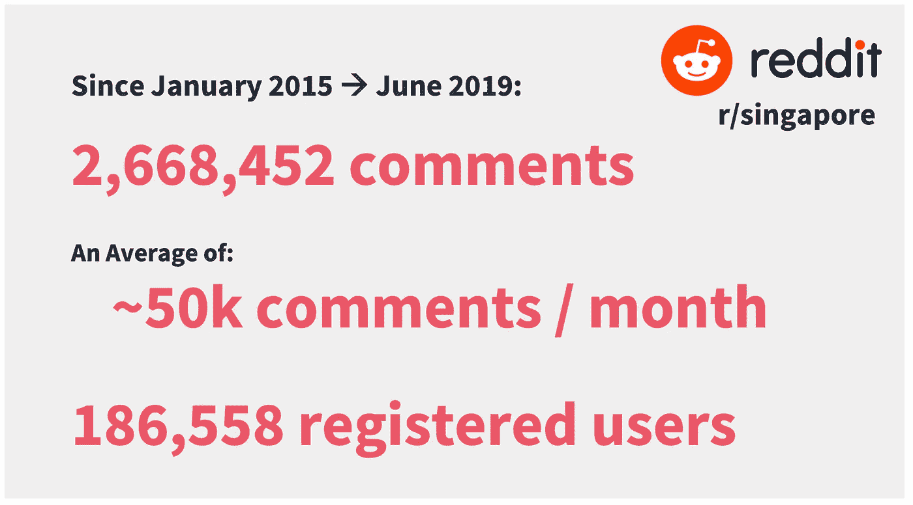

此处关注的时间范围为 2015 年 1 月至 2019 年 6 月。我选择了一个特别大的时间段来考虑季节性和抽样偏差。例如，如果我只看 2015 年的数据，话题可能会偏向政治，因为新加坡上一次大选就是在那一年举行的。

在工具方面，Python Reddit API 包装器(PRAW)被考虑并抛弃，转而支持 Pushshift API。对 PRAW 施加的限制意味着只能获得有限数量的评论；Pushshift 的情况并非如此。

虽然 Pushshift 确实将 API 调用限制为每次调用 1000 个条目，但是对可以进行的调用数量没有实际限制。编写了一个脚本来迭代这个过程，直到在指定的时间范围内检索到所有的评论。由于硬件和时间限制，随机抽取了 100 万条评论。

# **数据清洗&预处理**

不出所料，获得的数据极其肮脏。在进行 NLP 预处理之前，必须进行彻底的清理。是时候重新承担责任了。


How I look cleaning data in Python ([Source](https://verstaresearch.com/blog/whos-your-data-janitor/))

总之，这些是步骤:

*   删除自动生成的 bot 注释(例如，“[已删除]”、“[已删除]”、“您的提交已被删除，因为它没有任何内容……”等)
*   删除符号和标点符号，包括表情符号，如:)和奇怪的流行(͡ ͜ʖ ͡)，出现了几百次
*   删除汉字和新加坡式英语(新加坡式英语俚语)词汇，如‘lah’，‘lor’，‘shiok’，‘bojio’等(确实是非常丰富多彩的语言)
*   删除 URL 和图像链接
*   标记化和小写
*   过滤掉停用词和短词(少于 3 个字母)
*   生成二元模型和三元模型
*   通过词类(PoS)标记，仅识别和考虑名词和形容词
*   词汇化
*   生成唯一单词的字典
*   生成词袋语料库作为术语文档矩阵，在论坛线索内聚集评论，并将线索视为不同的文档

部分代码如下所示:

```
def preprocess(comment):

    **# Tokenize**
    def sent_to_words(sentences):
        for sentence in sentences:
            yield(gensim.utils.simple_preprocess(str(sentence), 
                  deacc=True))

    data_words = list(sent_to_words(comment)) 

    **# Remove Stop words & Short Words**
    from nltk.corpus import stopwords
    stop_words = stopwords.words('english')
    stop_words.extend(['congrats', 'lol', 'yup', 'thanks', 'nope', 
                       'http', 'www', 'com', 'https','amp', 'sg', 
                       'reddit', 'gt'])

    def remove_stopwords(texts):
        return [[word for word in simple_preprocess(str(doc)) if 
                 word not in stop_words and len(word) > 2] for doc 
                 in texts]

    data_words_nostops = remove_stopwords(data_words)

    **# Bigrams**
    bigram_config = gensim.models.Phrases(data_words_nostops,
                                          min_count=5,
                                          threshold=100) 
    bigram_mod = gensim.models.phrases.Phraser(bigram_config)

    def make_bigrams(texts):
        return [bigram_mod[doc] for doc in texts]

    bigrams_list = make_bigrams(data_words_nostops)

    **# Lemmatization**
    def lemmatization(texts):

        nlp = spacy.load('en', disable=['parser', 'ner'])
        allowed_postags = ['NOUN', 'ADJ']
        texts_out = []

        for sent in texts:
            doc = nlp(" ".join(sent)) 
            texts_out.append([token.lemma_ for token in doc if
                              token.pos_ in allowed_postags])

        return texts_out

    data_lemmatized = lemmatization(bigrams_list)

    **# Create Dictionary**
    id2word = corpora.Dictionary(data_lemmatized) **# Create Corpus**
    corpus = [id2word.doc2bow(text) for text in data_lemmatized]

    return corpus, id2word, data_lemmatized
```

# **建模&评估**

在对数据进行清理和预处理后，对几个模型进行了实验。潜在狄利克雷分配(LDA)和 Mallet LDA 似乎总是优于潜在语义分析(LSA)和非负矩阵分解(NMF)。

这些模型及其结果的简要回顾如下:

## **LSA**

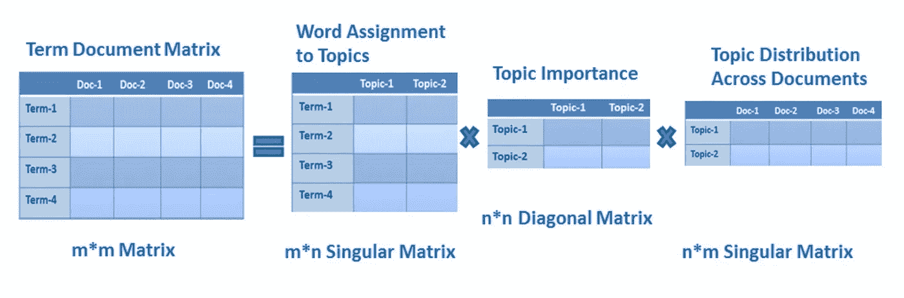

LSA Decomposition — [Source](https://www.datacamp.com/community/tutorials/discovering-hidden-topics-python)

LSA 是一种矩阵分解模型，它假设具有相似含义的单词将包含在相似的文本片段中。本质上，使用奇异值分解(SVD)将文档频率矩阵分解成上述 3 个矩阵，当相乘时，这些矩阵近似地重构原始的 **M** X **M** 矩阵。

左单数 **M** X **N** 矩阵以话题的方式表达文字。右单数 **N** X **M** 矩阵用主题表示文档。通过应用类似余弦相似度的方法，能够评估不同单词之间的相似度和不同文档之间的相似度。

要注意的是，通常，术语频率-逆文档频率(TF-IDF)矩阵将被用于归一化每个词在整个文档集合中的频率，以给予不太频繁的术语更多的权重。与使用原始词频计数相比，这通常会产生更好的结果。

## **NMF**

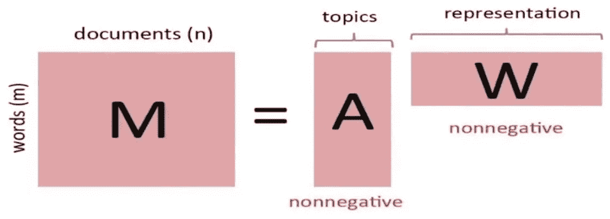

NMF Decomposition — [Source](https://singsoftnext.com/introduction-to-nonnegative-matrix-factorization/)

NMF 也是一个矩阵分解模型，非常类似于 LSA，但有一个额外的限制，即所有 3 个矩阵必须只包含非负值。这样做的效果是，NMF 不能撤销潜在特征的应用(由于没有负值),因此对于如何导出这些特征更加“小心”。这也意味着 NMF 模型在分解过程中会丢失更多的信息。

## **LSA vs NMF 结果**

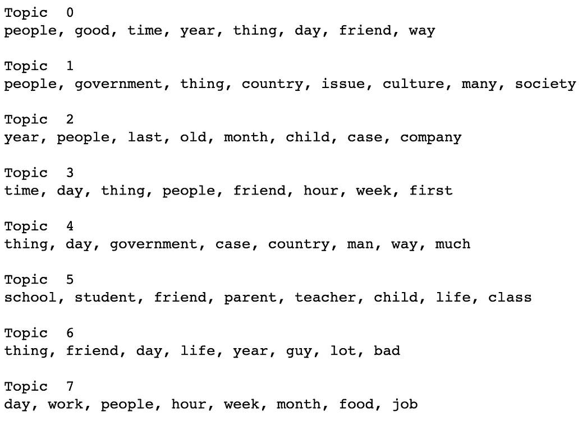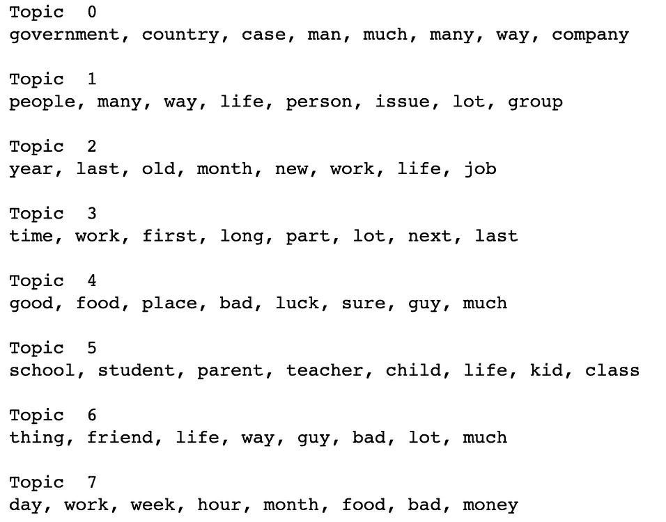

LSA Topics (left) vs NMF Topics (right)

可比。有些话题可以从两者中推断出来，但一般来说，还不够好。

## **LDA**

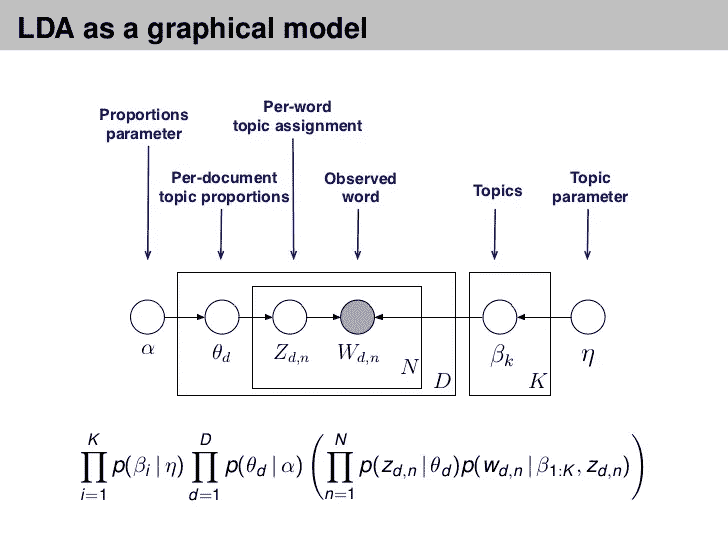

LDA — [Source](https://www.slideshare.net/hustwj/probabilistic-topic-models)

与上面的两个模型不同，LDA 是一个概率模型。在 LDA 中，每个文档由主题的概率分布来描述，每个主题由词的概率分布来描述。在第一遍中，该算法为每个文档中的每个单词分配一个随机主题。每次通过后:

*   (1)通过计算 P(主题 T |文档 D) =文档 D 中当前分配给主题 T 的单词的比例，检查主题在文档中出现的频率
*   (2)通过计算 P(单词 W |主题 T) =在包含单词 W 的所有文档中，主题 T 的分配比例，检查该单词在主题中出现的频率
*   (3)基于(1)和(2)更新每个单词的主题分配。
*   (4)当从一个单词移动到另一个单词时，它通过保持所有其他赋值为真和当前赋值为可疑来实现这一点。

传球越多，责任越大。什么？随着作业达到大致稳定的状态，主题群开始变得越来越清晰可辨。

## Gensim LDA 结果

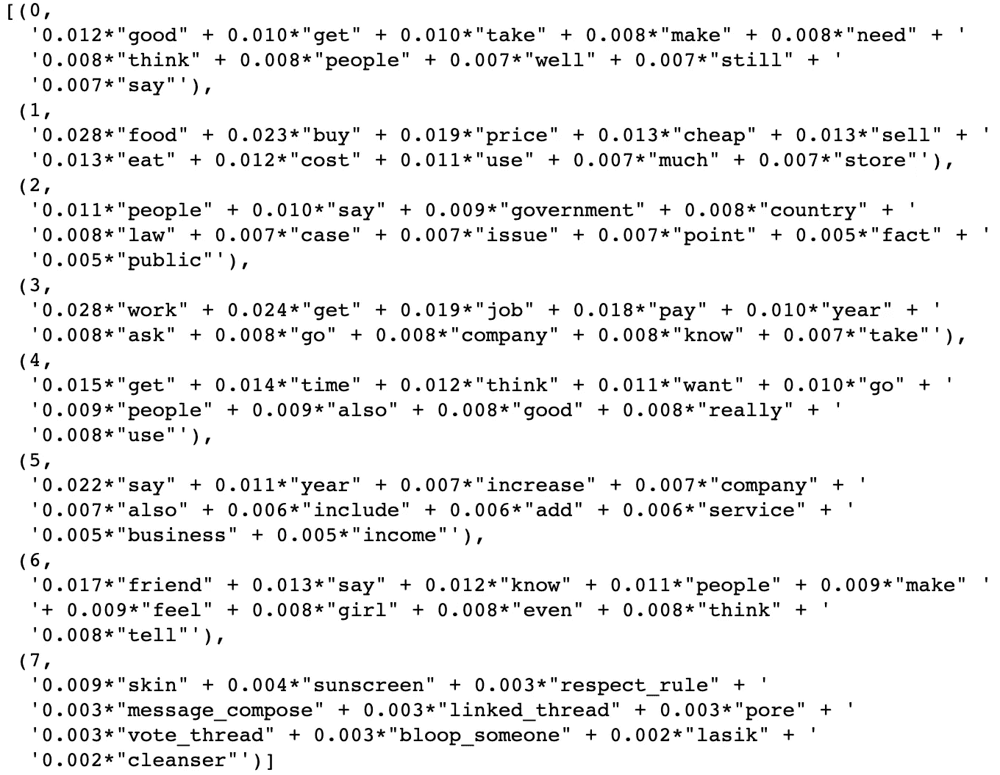

Gensim LDA Topics

你可以从生成的主题中看出，它们比 LSA & NMF 模型要好很多。有些主题已经可以确定，而其他一些像主题 7 仍然是…奇怪的。护肤？我需要找人聊天。我没说它很完美。

## 马利特有限公司

Mallet LDA 是上面使用的 Gensim LDA 的变体。不同之处在于，Gensim 使用变分贝叶斯采样方法，与 Mallet 的 Gibbs 采样方法相比，变分贝叶斯采样方法速度更快，但精度较低。

## **Mallet LDA 结果**

我用 Mallet 的 LDA 获得了最大的成功，产生了主题清晰可辨的单词簇(对我来说)。因此，我冒昧地将它们与我认为合适的标签一起封装在 word cloud glory 中。

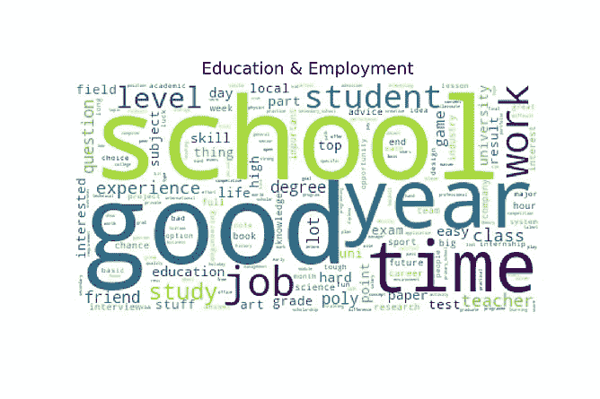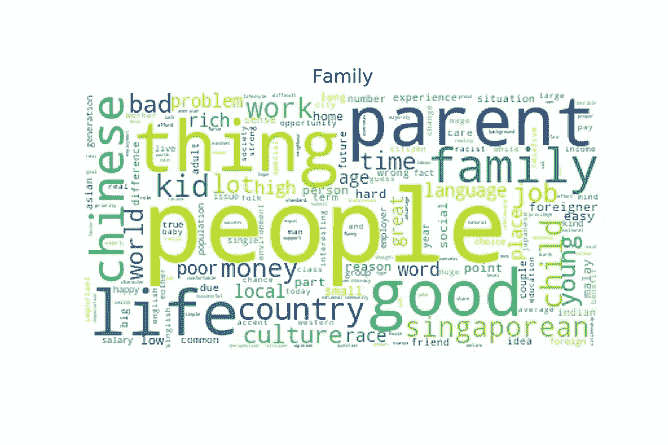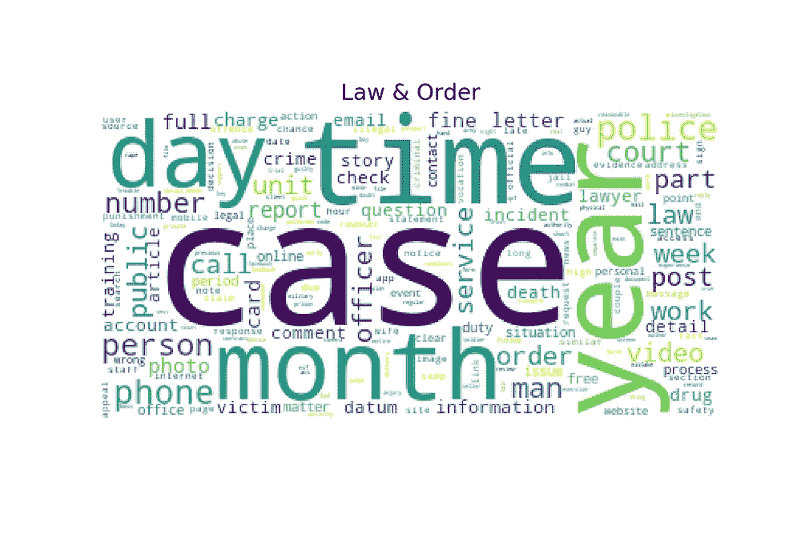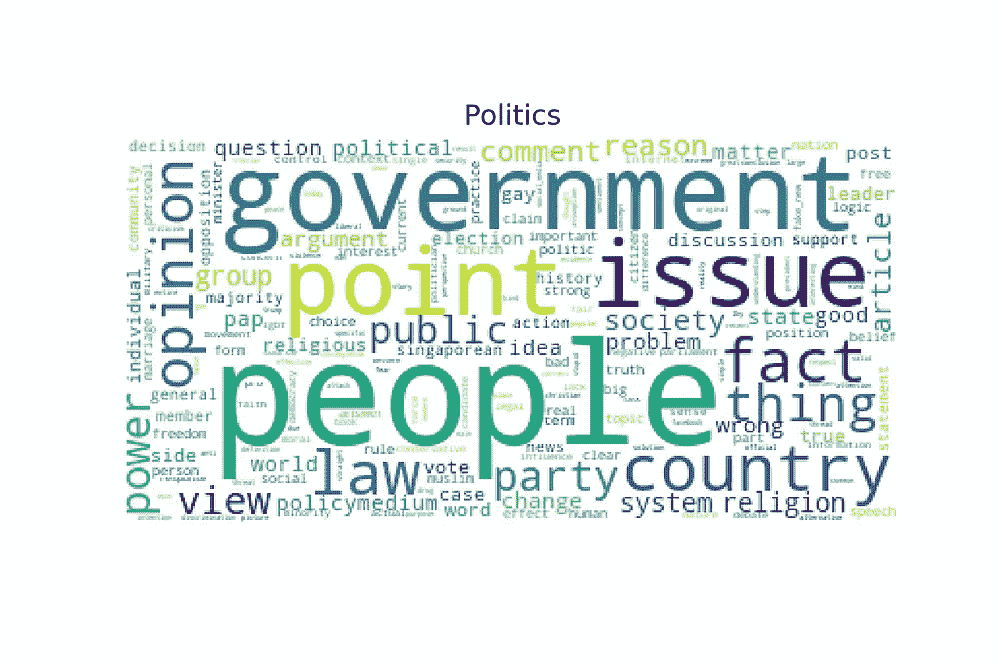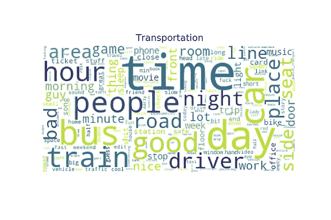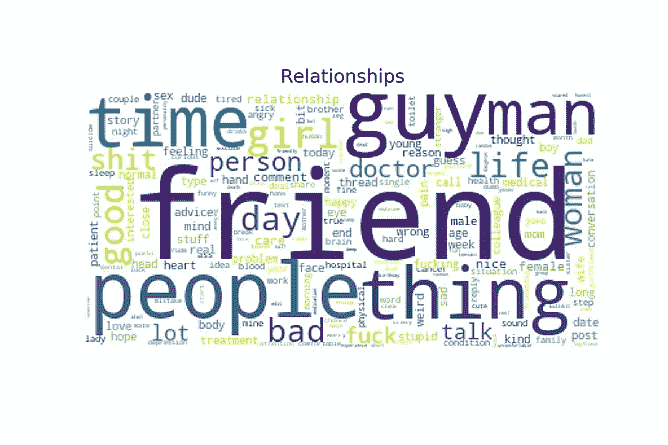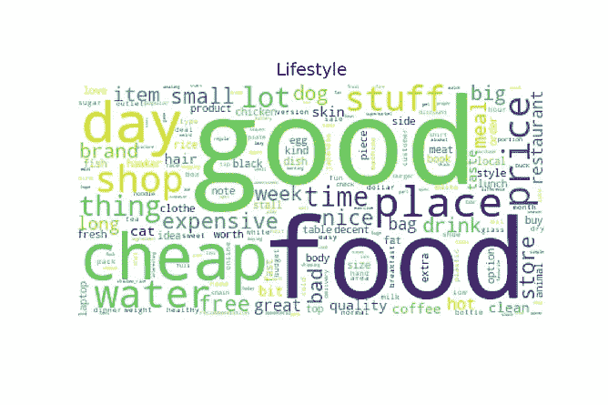

Mallet LDA Topics Word Cloud

## **设定 K**

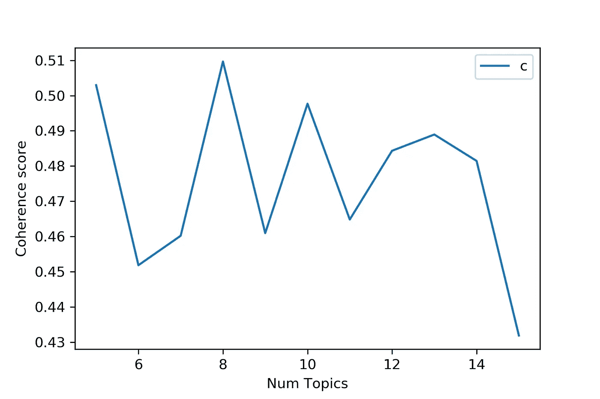

Coherence Score k=8 Peak

到目前为止，您可能已经注意到，上面描述的所有模型都使用 k=8 作为主题数。这是因为连贯性得分在 k=8 时达到峰值，并随着话题的增多或减少而下降。和往常一样，也有必要关注生成的主题簇，看看它们是否有意义。不过，在我的案例中，我很满意一致性分数和人工检查似乎彼此一致。

# 部署

## 皮尔戴维斯

正如你将从下面的交互式可视化中看到的，潜在空间中的主题有很好的分离。您可以试验一下相关性指标，看看还有哪些词属于每个主题。

Mallet LDA visualized using pyLDAvis

# **收尾**

对结果相当满意。领域知识在这方面很重要，可以用不同的 k 值进行实验，看看主题集群是否有意义。如果有更多的时间，我会喜欢用 lda2vec 进行实验，并结合一些时间序列分析，看看主题景观如何随时间变化。或许情感分析也是？有了数据，你可以做很多事情。但是现在，这是我的结论。

使用的工具:NLTK，SpaCy，Sk-learn，Gensim，Mallet，pyLDAvis