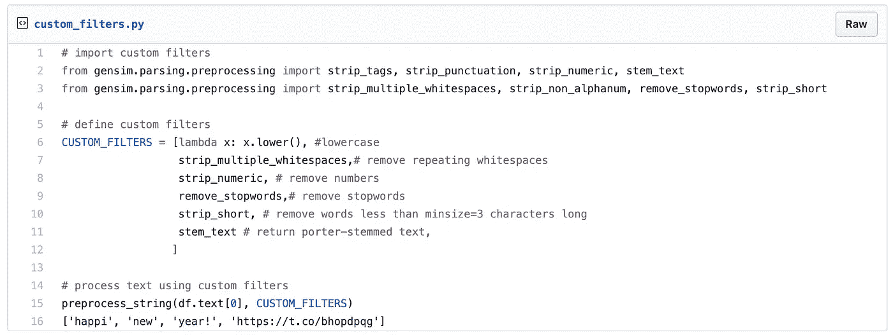
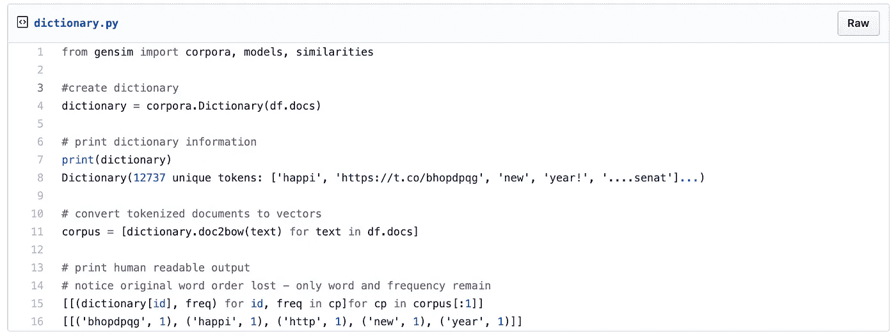
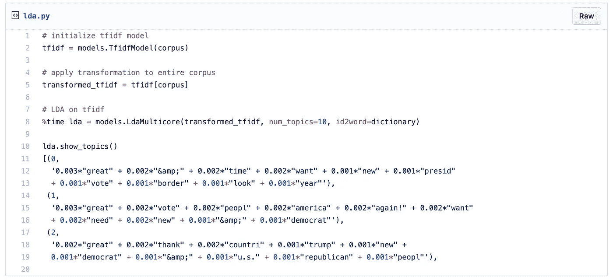
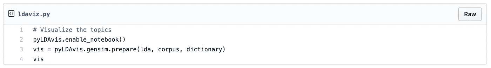
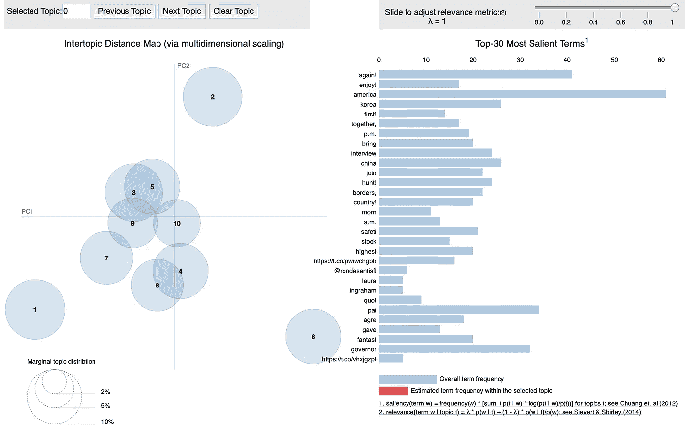

# 用 Gensim 进行主题建模

> 原文：<https://towardsdatascience.com/topic-modeling-with-gensim-a5609cefccc?source=collection_archive---------14----------------------->

## 使用 Python 的 Gensim 库预处理文本和主题建模的入门指南

Photo by [Jelleke Vanooteghem](https://unsplash.com/@ilumire?utm_source=unsplash&utm_medium=referral&utm_content=creditCopyText) on [Unsplash](https://unsplash.com/s/photos/words?utm_source=unsplash&utm_medium=referral&utm_content=creditCopyText)

[主题建模](https://en.wikipedia.org/wiki/Topic_model)是一种发现出现在文档集合中的主题的方法。它可以用于从聚类到降维的任务。

主题模型在许多场景中都很有用，包括文本分类和趋势检测。

然而，一个主要的挑战是提取高质量、有意义和清晰的主题。Gensim 是一个 Python 库，它将自己定义为“人类的主题建模”,这有助于使我们的任务变得简单一些。

在 [Gensim 的介绍](https://radimrehurek.com/gensim/intro.html)中，它被描述为“被设计成尽可能高效(对计算机而言)和无痛(对人类而言)地从文档中自动提取语义主题。”

对我来说，这使得使用它进行主题建模变得显而易见。

## 数据和目标

我们将继续使用我们的[唐纳德·特朗普推特数据集](/my-first-twitter-app-1115a327349e)。它相对较小，易于使用，并且涵盖了非常多样的主题。

鉴于推特的数据集，我们将尝试识别关键话题或主题。

## 文本预处理

Gensim 的网站称其“旨在处理原始的、非结构化的数字文本”,并为此配备了一个[预处理](https://radimrehurek.com/gensim/parsing/preprocessing.html)模块。

`preprocess_string`方法使得准备文本变得非常容易。默认情况下，它会去掉标点符号、HTML 标签、多个空格、非字母字符和停用词，甚至会对文本进行词干处理！它返回一个完全处理过的字符串列表:

Preprocess_string example

不幸的是，对于我们的 twitter 数据集，默认设置可能不是最好的选择:链接被分成两个标记，其中第二个标记似乎没有意义。

幸运的是，我们仍然可以使用`preprocess_string`并声明一个定制的过滤器变量来选择我们想要使用的过滤器:

这样更好看！我们已经对文本进行了预处理，保持了链接的完整性。

## 词典和语料库创建

Gensim 要求将令牌转换为字典。在这种情况下，字典是单词和它们的整数 id 之间的映射。

## 主题和转换

Gensim 支持几种不同的转换，但这里我们将只关注 TF-IDF 和 LDA。

TF-IDF 或术语频率逆文档频率类似于词袋，但它降低了频繁出现的标记的权重。

根据 Gensim 的文档，LDA 或潜在狄利克雷分配是“从词袋计数到低维度主题空间的转换”。。。LDA 的主题可以解释为单词的概率分布。

我们首先将 TF-IDF 应用于我们的语料库，然后是 LDA，试图获得最佳质量的主题。

## 形象化

我们可以使用 [PyLDAVis](https://pyldavis.readthedocs.io/en/latest/) 轻松地可视化和解释我们的 LDA 模型中的主题。

当解释我们的视觉化时，请记住，较大的主题表明它们更频繁，彼此更接近的主题更相似。

我们可以看到我们有 10 个主题。一些主题有明显的重叠。这可能表明我们的主题可能不理想。

有几种方法可以用来改善我们的主题分离。一些潜在的选择是提高我们预处理的质量，改变主题的数量，以及添加 n 元语法。

## 结论

在这里，我们探索了用 Gensim 进行主题建模和预处理，这只是该库所提供的一小部分。

在以后的文章中，我们将继续探索主题建模，包括提高主题质量的方法。