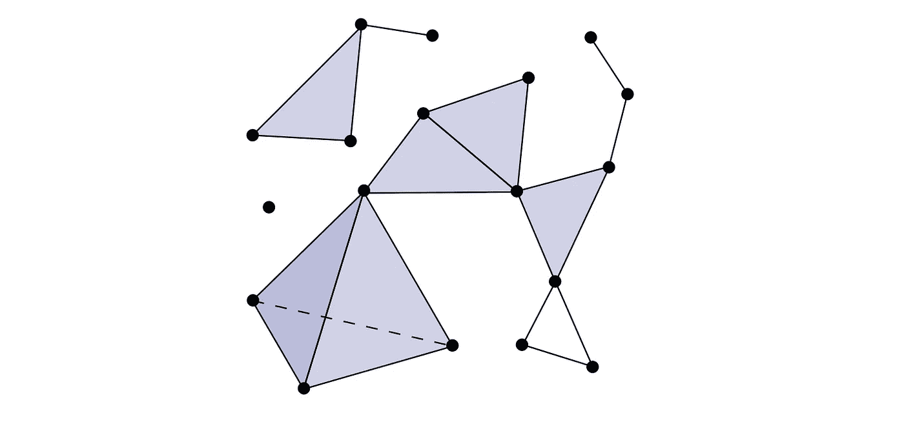
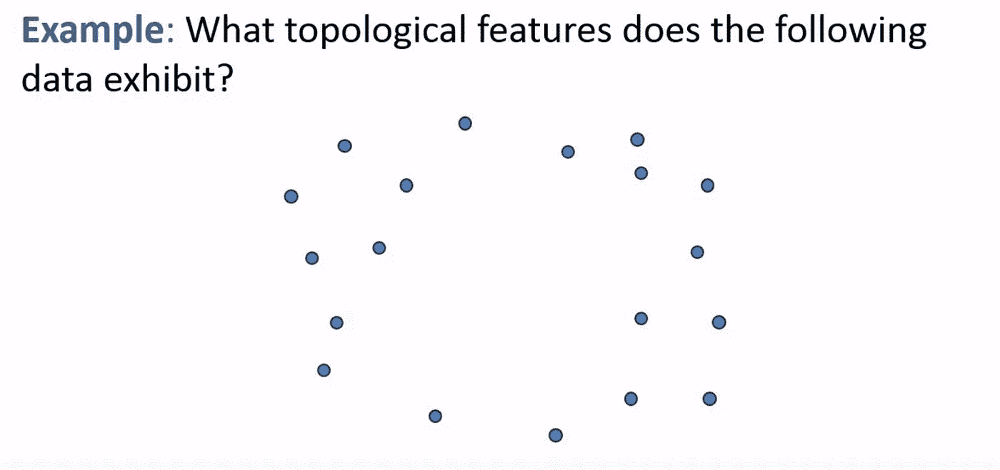
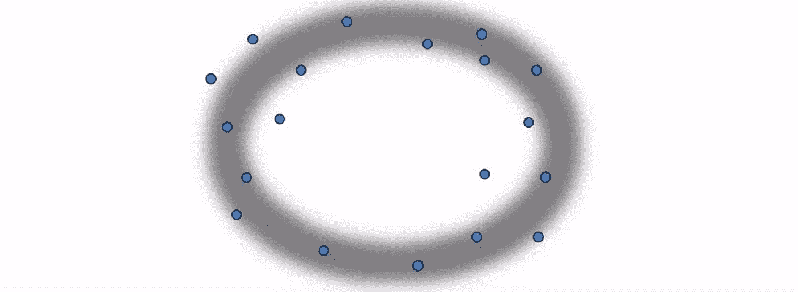
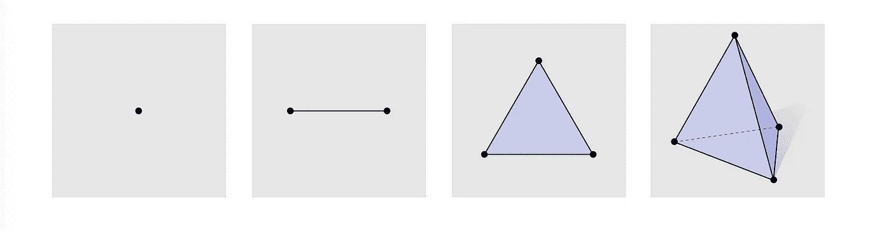
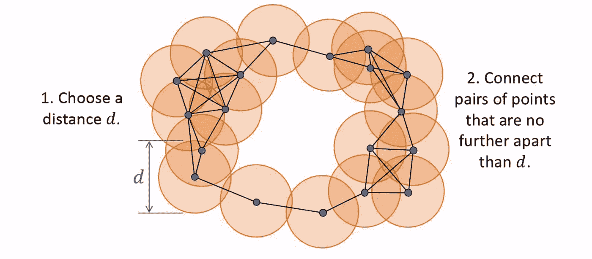

# 拓扑数据分析-解开行话

> 原文：<https://towardsdatascience.com/topological-data-analysis-unpacking-the-buzzword-2fab3bb63120?source=collection_archive---------8----------------------->

Turning points into shapes into insight.

听到“**拓扑数据分析**”这句话，几乎每个人的反应都不一样。数学家们对“拓扑学”和“分析”这两个词的结合感到兴奋，但原因是错误的。统计学家看到了一个以新的方式应用工具的机会。至于其他人，“分析”是简历中最常见的名词之一，所以我认为这个领域的其他部分都包括在内了。

好了，够了。**什么事？**

在本文中，我将具体分解什么是拓扑数据分析以及如何考虑它。我的目标是回答以下问题:

1.  什么是**拓扑数据分析**？
2.  **拓扑**和**拓扑**数据分析有什么关系？
3.  **数据分析**与拓扑**数据分析**有什么关系？

# 基础

拓扑数据分析的目的是应用**拓扑**的工具——一个处理定性几何特征如光滑度和连通性的数学领域——来**分析数据集**。

这些数据集通常很大而且是高维的，但是也可能有不完整的部分或者有噪声。希望在理解数据的几何结构时，可以获得一些看不见的洞察力。

Excellent example drawn from [here](https://www.youtube.com/watch?v=2PSqWBIrn90).

看看上面的数据集。这些点集有什么拓扑结构？

它似乎代表了一个有一定宽度的环，如下图所示。

A donut shape surrounding the points.

这只是我们的直觉。我们如何实际验证这是潜在的几何结构？

# 点→形状

当前的设置是我们在空间中有一个大的点集合。问题是:我们如何把**点**变成**形状**？

要做到这一点，我们需要定义什么是所谓的***k*-单形**。a*k*-单纯形是你取 *k* +1 个点，画出包围所有这些点的最小形状(称为**凸包**)得到的。一张照片总是做得最好:

A k-simplex for k = 0, 1, 2, 3\. Picture from this excellent [course](http://brickisland.net/DDGSpring2019/) on discrete differential geometry.

我们也可以把这些*k*-单形(复数；想顶点→顶点)形成**单纯复形**。

A simplicial complex.

# 接下来呢？

有单纯的情结听起来不错，但是这怎么适应呢？如果我们回到我们收集的点，让我们考虑如何连接它们。考虑这个过程:

1.  固定一个实值距离 *d* 。
2.  围绕每个点画一个半径为 *d* 的圆。
3.  如果两个圆相交，在圆心处的两点之间画一条线(单形)。
4.  如果三个圆相交，在圆心的三点之间画一个三角形(2-单纯形)。
5.  若 ***k* +1** 圆相交，则在圆心的 ***k* +1** 点之间画一条***k-单形*** 。

说了这么多，做了这么多，我们最终得到的是一个简单的复合体，它粗略地描述了物体的形状。

The result of the procedure above.

# 选择正确的距离

我们差点就成功了！我们有一个把点变成形状的机制，这是进一步分析之前最大的障碍。

最后一个组成部分是选择正确的距离 d，如果 d 太小怎么办？d 太大怎么办？对于不同的距离值，几何特征会发生变化。

这些方面在**持续同源**领域都是必不可少的，持续同源是拓扑数据分析受到启发的主要工具。支持持续同源性的数学是相当先进的，但是这个想法都在我们已经讨论过的文字和图片中！

# 资源

本文在很大程度上依赖于各种资源创建的思想和图表。我希望这篇文章能激发人们对拓扑数据分析的兴趣，所以我也将给出一些你接下来可能想去的地方的链接！

一如既往，我很高兴听到你的反馈和下面的问题。

[全文](https://www.youtube.com/watch?v=h0bnG1Wavag)关于拓扑数据分析&持久同调:

[幻灯片](http://brickisland.net/DDGSpring2019/wp-content/uploads/2019/01/DDG_458_SP19_Lecture02_CombinatorialSurfaces.pdf) & [课程笔记](https://www.cs.cmu.edu/~kmcrane/Projects/DDG/paper.pdf)解释了*k*-单形和单形复形，以及离散微分几何中的更多概念:

拓扑数据分析的技术介绍: