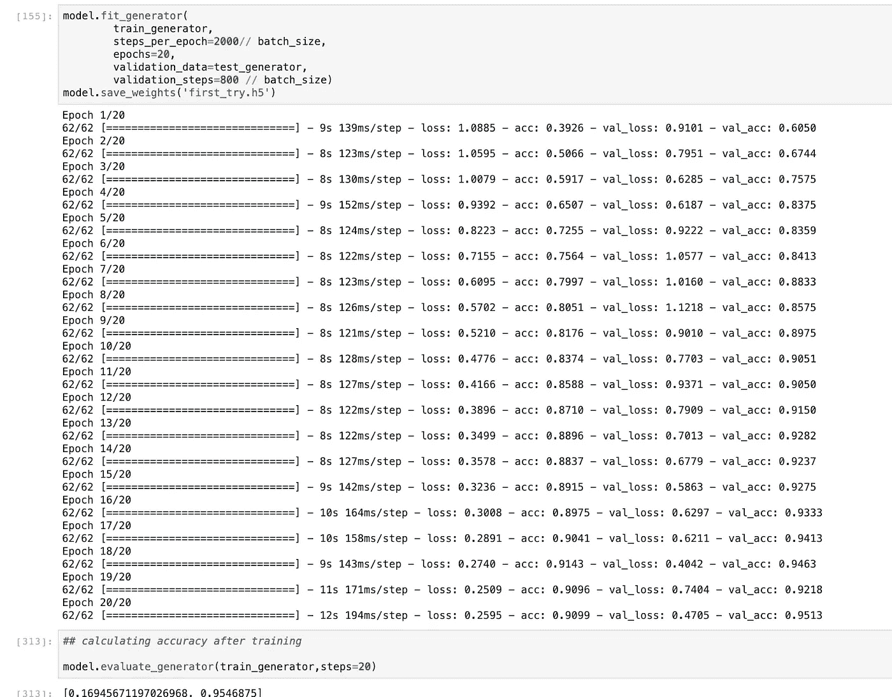

# Torch vs Keras 用于 CNN 图像分类:关于石头剪刀布数据集的思考

> 原文：<https://towardsdatascience.com/torch-vs-keras-for-cnn-image-classification-thoughts-on-the-rock-paper-scissor-dataset-5042f966efae?source=collection_archive---------26----------------------->

上周，我写了一篇关于使用 CNN 分类法对石头、纸或剪刀手势的图像进行分类的文章，该分类法是使用名为“torchvision”的软件包在 pyTorch 框架上构建的。

参见:

 [## 使用火炬视觉和 CNN 的石头剪子图像分类器

### 在过去的一年里，我一直在探索 Pytorch 框架的使用，并注意到许多答案…

medium.com](https://medium.com/swlh/rock-paper-scissor-image-classifier-using-torch-vision-and-a-cnn-f54d3ed0a65e) 

的文章，并且:

 [## 西江林/火炬 _ 和 _ 喀拉斯

### 在 GitHub 上创建一个帐户，为 xijianlim/torch_and_keras 的开发做出贡献。

github.com](https://github.com/xijianlim/torch_and_keras/blob/master/CNN_RPS_torch.ipynb) 

对应的代码。

我想在 Keras 中复制相同的分类器，以查看相对易用性和特性。简而言之:Keras 和它的包看起来比 Torch 好用得多。这里是在数据加载、网络架构和培训上使用深度学习框架所涉及的阶段的比较。

1.  **图像数据集加载:**

这两个软件包都完成了繁重的工作，只需提取存储文件夹中的所有图像，然后将它们添加到数据加载器中，然后输入到您的网络中。前提是你如何存储你的图像在单独的子文件夹(“石头”，“纸”或“剪刀”)在一个数据文件夹，和加载器包读取相应的图像和标签的基础上的子文件夹名称。

让我们看看不同之处

**喀拉斯**:

还有**火炬**:

如果你马上想到 Keras 的 ImageDataGenerator 看起来更加用户友好，呈现更加整洁，那你就对了。它用目标张量形状以直观的方式处理图像大小调整。另一方面，Torch 使用“中心裁剪”和“调整大小”等术语来分别表示高度和宽度。

**2。神经网络架构**

Keras 作为一个包装器在 Tensorflow 后端做了很多繁重的工作。它越来越受欢迎的一个原因是由于它的顺序功能，你可以在“阶段”添加你的输入，隐藏和输出层。

我使用大致相同的架构重建了相同的 CNN 模型(唯一的例外是辍学率)。

**Keras** 脚本:

vs **火炬**:

Torch 要求你建立一个实际的类，所有的层都有相应的输出到每个连接的层。这在迫使用户适应从整体上思考神经网络架构方面是很棒的，但如果手动争论和寻找答案，这确实需要一点时间。

一个明显的例子是在 Keras 和 Torch 之间后来的最终输出:

在 Keras 中，我们简单地使用一个 softmax 函数来获取模型为 3 个类生成的数值类:{'paper': 0，' rock': 1，'剪刀':2}。

另一方面，在 Torch 中，在将最终输出传递给具有张量大小和 3 个 out_channels 的线性函数之前，我们必须通过 out=out.view(out.size(0)，-1)将最终输出处理为 soft max“like”函数。迷茫？我也是！你可能会认为火炬会自动重塑 conv2 函数中的张量，但可惜事实并非如此。

**3。训练:**

**Keras** 使用标准的“*model . fit”*函数，熟悉很多机器学习模型:

如此简单，干净，优雅，最少的大惊小怪。

在**火炬**中:

实际上，你必须声明为网络供电所需的回路、清除梯度、计算损耗、训练步骤并测试精度。如果您喜欢灵活地分配自己的训练步骤和验证批次，并且非常擅长循环，Torch 绝对适合您。

**关于两种包装的想法**

老实说，我在 20 多分钟内就建立、训练并运行了这个 Keras 模型。相比之下，Torch 需要使用在线材料和课程来解决问题，特别是处理与读出的最终层的形状有关的输出张量。Torch 也有非常不直观的词汇来重塑图像大小，这需要在阅读文档后进行实验。

然而，Torch 确实迫使用户思考所有深度学习模型的根源:张量。人们必须始终考虑张量的形状、输入层、输出层的样子以及模型将产生的表达式。

如果 torch 有一种方法来执行张量形状的迷你输出，或者有一种方法来预览连接层之间的输出，我认为用户会更愿意尝试一下 Torch。

描述 torch 的最佳方式就像是玩一个类似 Darksouls 或 Sekiro 的软游戏:

…或者读尼采和德勒兹。

当你试图获得事物的机制时，这可能会令人沮丧，但是看到你的模型最终开始前馈和训练步骤的满足感是超越宣泄的。

我将推荐的是，首先使用在线课程尝试 Torch，以获得所有的基础知识，然后使用 Keras 制作生产版本。

到目前为止，我已经看到了无数不同的训练步骤，作为一名编码人员，从中学习和产生想法是很棒的。正如 Keras 在包装器中为您做的繁重工作一样，为您自己的表达式调整代码的灵活性可能不存在。

如果您想查看 CNN Keras 版本的代码，请访问:

 [## 西江林/火炬 _ 和 _ 喀拉斯

### 在 GitHub 上创建一个帐户，为 xijianlim/torch_and_keras 的开发做出贡献。

github.com](https://github.com/xijianlim/torch_and_keras/blob/master/CNN_RPS_torch.ipynb)