# 数据中燃烧的多伦多，第一部分

> 原文：<https://towardsdatascience.com/toronto-on-fire-in-data-part-1-484435eca880?source=collection_archive---------17----------------------->

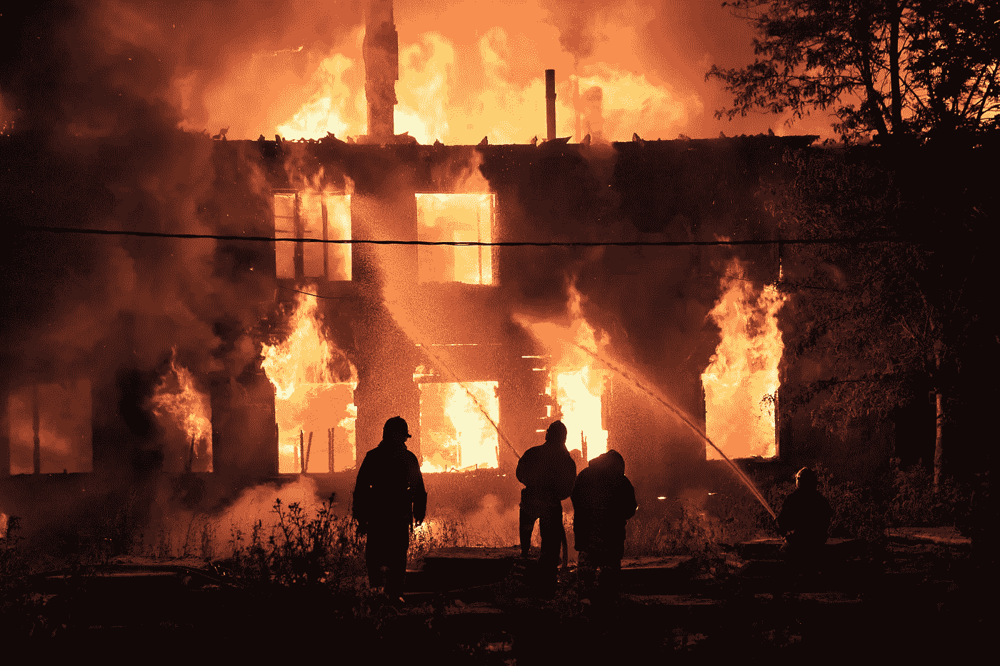

## 火灾事件的分段泊松分析在实践中的应用

每年，多伦多消防局(TFS)被派往这个有 270 万居民的城市处理 9，000 到 10，000 起火灾。严重程度从草地或垃圾的小火到仓库或高层住宅的大火不等。本研究是关于 2011 年至 2016 年多伦多火灾数据分析的两部分系列的第一部分[，我通过数据分割和汇总，分析了*事故频率*的特性，不考虑严重程度。](/toronto-on-fire-in-data-part-2-33e150b8e45d)

数据分析仅限于报告的实际火灾。这意味着 TFS 解决的额外需求，如医疗紧急情况、误报火警和从故障电梯中救援，被排除在目前的分析之外。此外，没有 TFS 参与处理的火灾也不在数据中。

多伦多市 85 个消防站的位置如下所示。

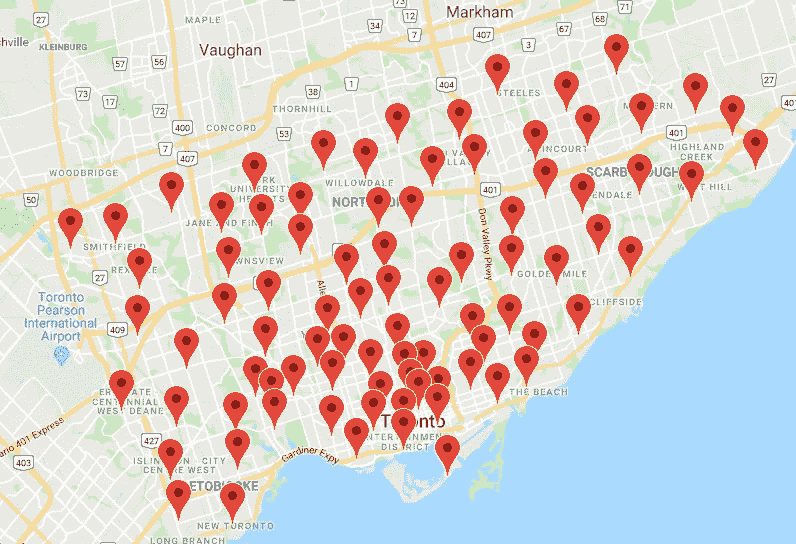

从数据中得出的第一个简单观察结果是，在所研究的六年中，一年中的火灾事件总数没有显示出有意义的趋势。就火灾事故而言，不断变化的法规、消防安全教育、经济等变化不够快。因此，所有分析都将这六年视为相同分布。

## 晚上和周末:点火时间

数据分析从数据探索开始，这意味着数据可视化。在下面的热图中，显示了作为一天中的小时和一周中的天的函数的火灾事件的数量。绿色越暗，相关时间段内的事件数量越多。

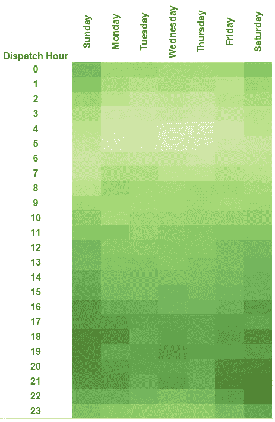

可视化显示，火灾事件在晚上发生的程度较高，在夜间和清晨发生的程度较低，并且周末与一周中的其他时间有细微但明显的不同。

事故数据进一步汇总，接下来显示了一天中给定时间、周末和周一至周五的火灾事故平均数。

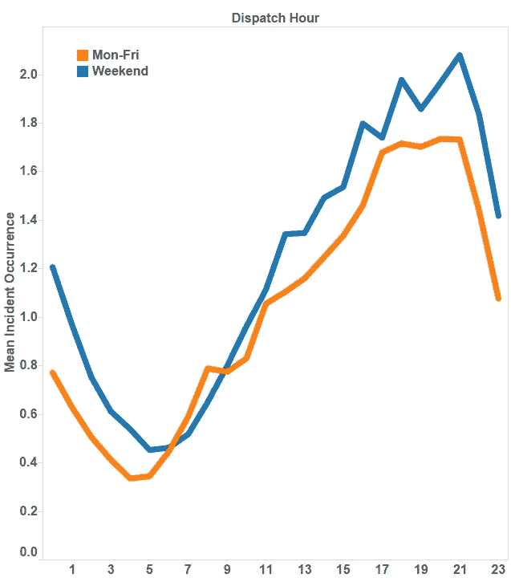

从线形图中可以看到一些简单的观察结果:在周末午夜和凌晨 1 点之间，多伦多平均有 1.2 次火灾调度；平均事故数最低，略高于 0.3，发生在工作日的凌晨 4 点至 5 点。

从更大的角度来看折线图，下面是两个额外的一般性观察结果:

*   周末几乎全天都有更多的火灾发生(周末曲线垂直向上移动)。
*   与工作日相比，火灾事件的相对频率在周末偏移了大约一个小时(周末曲线水平向右偏移)。

从数据探索的第一阶段来看，在多伦多的城市环境中，很大一部分火灾是由随时间变化的某些人类活动引起的，而不是随机的雷击或均匀分布的电气故障。这类活动在晚上也更常见。周末晚些时候的转移表明，这些活动，或者至少其中相当大的一部分，也是以这种方式转移的。

## 住宅与垃圾，与季节的互动

季节之间的变化呢？下图显示了火灾事故的频率如何取决于一天中的小时数以及一年中的季节和月份。

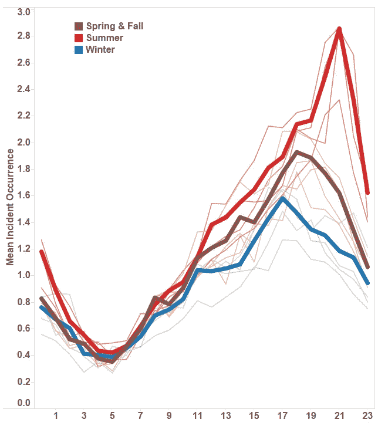

常见的晚间活动模式出现了。然而，与寒冷和黑暗的季节相比，温暖和明亮季节的曲线向上移动，其峰值向右移动。换句话说，更温暖和更明亮意味着多伦多更多和更晚的火灾事件。

TFS 大体上根据着火的是什么来对火灾进行分类:高层住宅、草地或垃圾、高速公路上的车辆等。出现次数最多的类别是“草地/垃圾”和所有类型住宅火灾的组合。通过进一步分割这一分类变量的数据，然后绘制季节和一天中的小时变化，得到以下曲线。

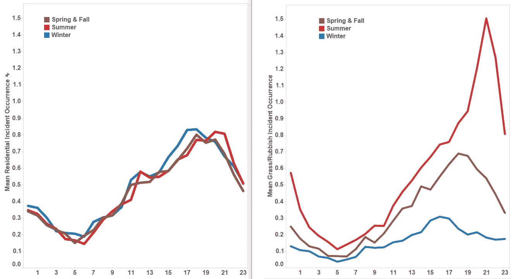

住宅火灾(左图)随一天中的不同时间而变化，峰值在下午 6-7 点左右，但没有随季节而变化(可观察到的差异不足以从统计噪声中区分出来)。另一方面，涉及草地或垃圾的火灾事件(右图)高度依赖于季节。多伦多寒冷的冬天提高了户外火灾的门槛，这是可以理解的。但是，是火的燃料的物理性质，还是引起火灾的人们的户外活动被改变得最多呢？

## 事故频率超出平均值

在我继续钻研数据之前，我会看看平均值以外的情况。到目前为止，所有数据可视化都与不同时间段的平均值以及最近两个时间段的火灾类型有关。然而，每个细分市场都包含多个数据点，在数据分析中描述这些分组中的*分布*通常是有启发性的，甚至是必要的。

两个说明性部分的事故数量直方图如下所示:第一个是冬季星期一到星期五上午 9 点到 10 点；第二个是夏季周末下午 6 点到 7 点。

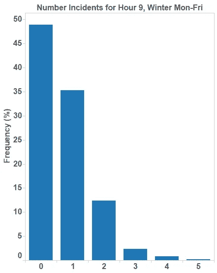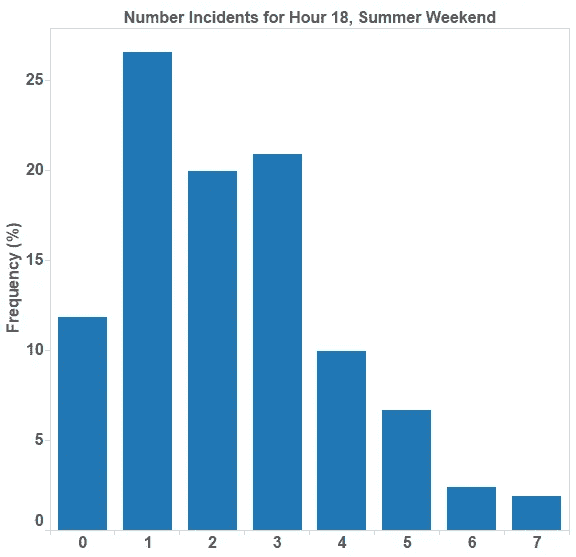

考虑两个直方图中的第一个。它将数据的事实可视化，例如

*   在冬季所有工作日的近一半时间里(约 49%)，在第 9 小时(上午 9 点到 10 点)，消防调度为零
*   每 10 天中有一天多一点(~12%)不是周末，在冬天的第 9 小时有两次火灾调度。

第一个直方图的平均事件频率为 0.7，反映了数据在分段中的分布向低值移动。

与平均值为 2.3 的第二个直方图形成对比。大部分数据向稍高的值移动，例如，具有 1、2 或 3 个事件的天数占该特定时间段中所有天数的三分之二。还有一个趋势是更高的值，例如 6 次和 7 次事故。

## 使用泊松分析直方图的意义

两个直方图都类似于*泊松分布*的概率密度。为什么这个*应该是*预期的形式，也有理论上的原因。

泊松分布有一个参数，通常表示为λ，称为*强度参数*。

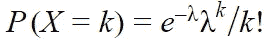

我不会深入这个等式的细节，它的特点[在别处](/the-poisson-distribution-and-poisson-process-explained-4e2cb17d459)有很好的描述。与火灾事件数据相关的定性解释最好理解为:在给定时间段内发生事件数量 *k* 的概率由以下等式给出，其中强度参数λ越大，事件的平均频率越高，这将相应的直方图向更高的值扩展，尽管总是存在一个值 *k* ，超过该值概率降低。

数据分析表明，火灾事件过程的强度参数是随时间变化的。换句话说，λ是时间的函数。

这相当于将火灾事故建模为*非均匀泊松过程*。λ与数据的拟合可以通过*最大似然估计*正式完成。然而，有一个方便且相当好的近似值可用:给定时间段的*平均事件数*等于λ。对于精确的泊松分布，平均值实际上等于λ。

换句话说，上述所有折线图都可以重新解释为作为时间段函数的泊松过程强度参数λ的曲线图。

## 泊松过程对数据的描述有多好？

事实证明相当不错。最差的拟合是下图所示的直方图。

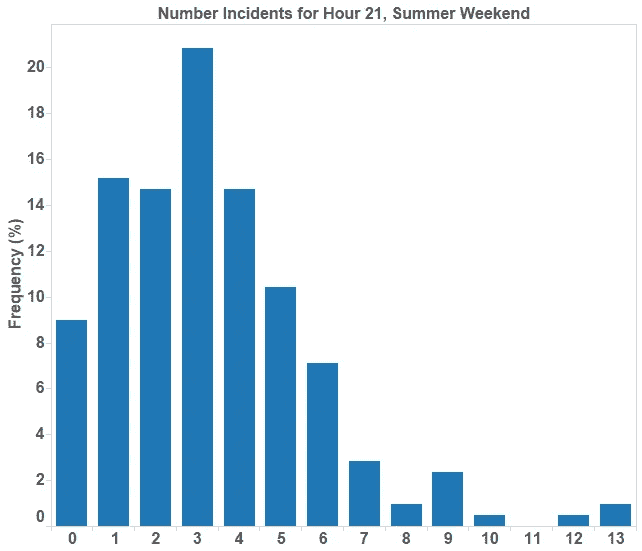

麻烦的部分是几天非常高的值。直方图的其余部分很好地符合λ=3.1 的泊松分布。然而，这个数值应该使 10、12 和 13 起事故非常罕见。这表明，至少在这个时间段，还存在一个较小但重要的附加过程。离群值可能具有启发性，并指出下一步要挖掘的地方。

## 异质空间片段

大多数火灾事件的数据条目包括最近的街道交叉口的记录。将此与独立公开数据集中的纬度和经度地理坐标进行交叉引用，可以很好地解析多伦多事故发生地*的图片。下图显示了数据集中的大多数火灾事件，其中蓝点表示住宅建筑中的火灾，琥珀色表示所有其他类型的火灾(未出现的事件将在注释中讨论)。*

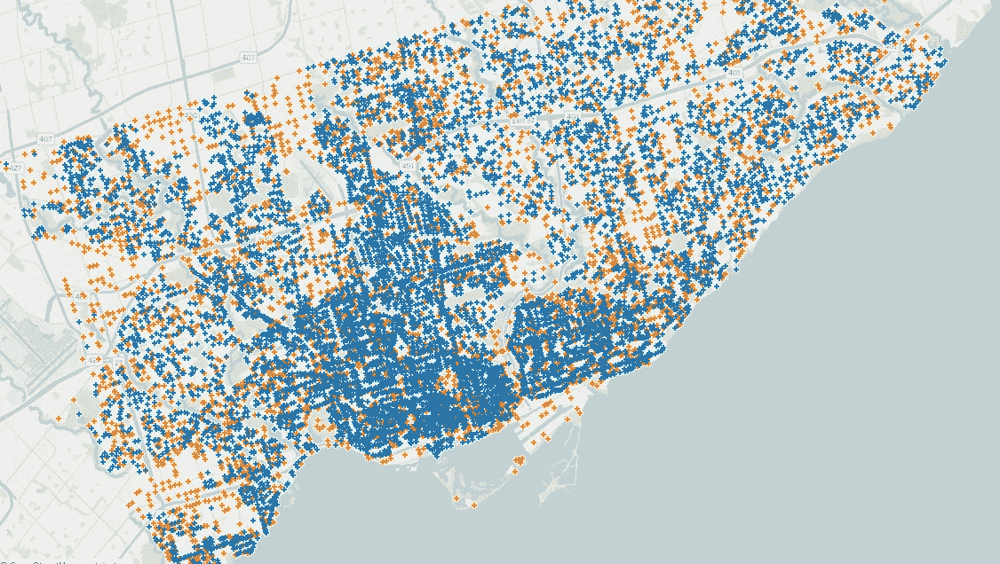

从这个高层次的角度来看，蓝色和琥珀色圆点之间的空间隔离讲述了一个简单的故事:多伦多的住宅区并不是均匀分散的，有些空间段没有住宅或高层建筑。不是惊天动地的实现。

原则上可以沿着不同的时间段重复先前的分析，这些时间段进一步划分为空间段。例如，是否多伦多的一些街区对时间有着明显的依赖性，反映了潜在的人口、经济或建筑特征？

然而，火灾事件的近 60，000 个数据点可以告诉我们，一旦它们被分割成精细的片段，如一天中的小时、一年中的季节、一周中的日子、*和*街区，数据就变得过于稀释了。没有一个指导性的假设，数据探索太容易迷失在对统计噪音的创造性解释中。交叉引用的额外数据以及量化模型的创建，可以帮助更全面地了解城市的细节，这些细节使得整个城市的火灾事件各不相同。解析时空模型并不遥远。

## 数据中引人注目的是:2013 年 12 月的冰风暴

当相对于月份和年份进行动态化时，事件数据的地图可视化使得一个主要偏差在视觉上非常清楚。下面的动画形象地展示了从 2013 年底到 2014 年初的几个月里多伦多草地/垃圾火灾事件的空间分布。

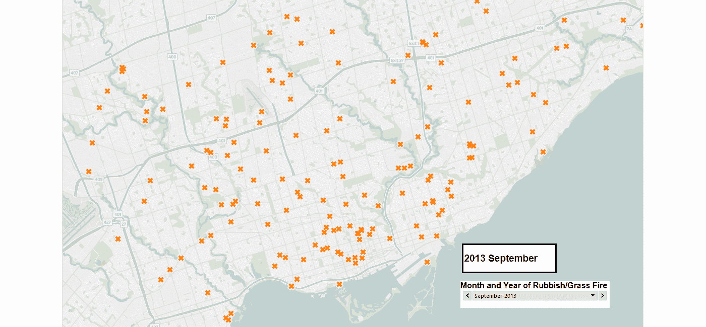

与春季和秋季相比，2013 年 12 月冬季的草地和垃圾火灾平稳减少。放大到邻近的北约克中心，加上日期作为标签，很明显在 12 月 21 日和 12 月 26 日之间，发生了一些不寻常的事情。

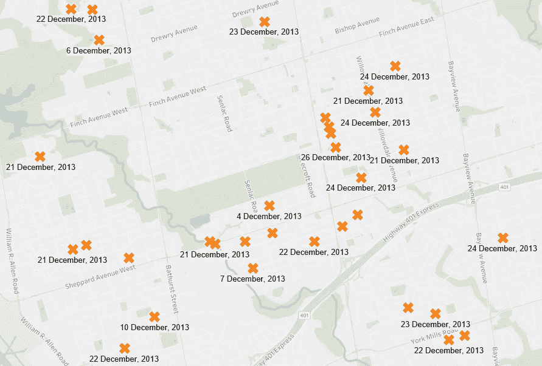

事实上，这是一场严重的暴风雪袭击多伦多的日子。电线在冰柱的重压下断裂，选择在室内生火取暖的人们也为火灾数量的增加尽了自己的一份力量。

2013 年 12 月的冰风暴很好地提醒了我们，拟合的非齐次泊松过程对于火灾事件频率的定量建模是有用的，也是最准确的，但λ的参数化可能会出现重大错误。当基础特征的变化超过临界阈值时，在这种情况下,(至少)电力基础设施抵御冰风暴的能力——多伦多冬季火灾事件的典型领域——不再具有代表性。跨越这种不连续性，以及典型领域内的内插和外插完全是在错误的现实领域中。困难的问题，有些人认为是不可能的问题，是在它们被跨越之前，知道这些临界阈值是什么。

## 细分市场、特征-解释和交叉引用

那么火灾发生的频率仅仅是一天中的时间、一周中的日子和季节的函数吗？这个紧凑的模型很好地再现了观测结果，所以这个简单的概念是有道理的。也许毕竟大多数火灾是由炉灶失误和舒适的晚间户外烧烤引起的，在这种情况下，解释主导关系的城市特征可能并不困难，可以通过与其他数据集的交叉引用来建立和验证预测模型。

然而，火灾事件的*后果*并不一致。罕见但巨大的火灾隐藏在微小的草地和垃圾事件的海洋中。许多小事件的变化和相关性的模型当然有用，但它通常会忽略重要的极端情况。这是[第二部分](/toronto-on-fire-in-data-part-2-33e150b8e45d)的主题。

> *掌声是货币。如果你觉得这值得一读，请按下按钮。*

## 笔记

*   [TFS 事件原始数据来自多伦多市公开数据网页](https://www.toronto.ca/city-government/data-research-maps/open-data/open-data-catalogue/#e3d443bb-2593-2615-4972-20e24c0ab876)。
*   [来自多伦多市开放数据网页](https://www.toronto.ca/city-government/data-research-maps/open-data/open-data-catalogue/locations-and-mapping/#8d8cb501-4b98-3ce6-d584-94b74bca20c8)的街道交叉口地理数据。
*   并非所有的火灾事故都与十字路口有关；缺失数据(尤其是路径)和不一致的标点符号也妨碍了某些事件的地理坐标匹配。85%的火灾事件与地理坐标相匹配。
*   可视化用 Tableau 完成，大多数定量分析用 Python 库 Pandas 和 Numpy 完成，地理空间数据解析用 Python 库 PyShp 完成。