# 触摸驱动的推荐引擎

> 原文：<https://towardsdatascience.com/touch-driven-recommender-engines-85b6c722a7d9?source=collection_archive---------37----------------------->

## 推荐系统

## 从流行推荐发展到个性化推荐

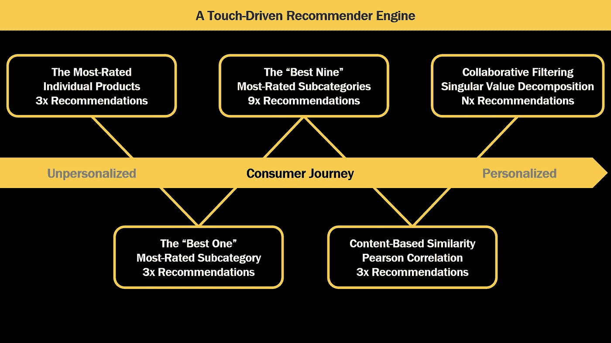

A recommendation schedule that follows the touch points of the consumer journey. Image: Author

在数字时代，互联网将全球数十亿人与无数产品联系在一起，为消费者提供了前所未有的更多选择。2016 年，仅在亚马逊市场，就有 185，000 名卖家出售了超过 3.53 亿件产品。虽然精明的选择者可能会找到他们想要的东西，但许多消费者可能会被决策过程弄得不知所措。

贾芳·塞西·艾扬格和马克·莱珀在 2001 年发表的《果酱实验》研究了选择如何影响消费者行为。24 种果酱吸引的顾客(60%)比 6 种果酱(40%)多。但是只有 3%的顾客从大的一套中购买，而 30%的顾客从小的一套中购买。当选择更少时，购物者有信心选择最好的果酱。

推荐系统帮助消费者搜索和发现新产品和服务，有选择地减少呈现给他们的选项集。⁴展示了他们的商业价值，网飞将其每年 10 亿美元的成本节约归功于其人工智能推荐系统。⁵这些系统通过涉及不同个性化水平的几种方法来过滤选项。

个性化推荐系统受到“冷启动”问题的困扰，在这种情况下，它们需要一些关于客户偏好的初始数据来进行有针对性的推荐。⁶为了解决这个问题，人口数据挖掘方法可以预先填充关于新消费者的假设，而集成技术可以聚合多个推荐系统。

但也许我们可以利用简单的非个性化推荐系统来跟踪消费者旅程中的触摸 points⁷。⁸:我们可以通过向新客户推荐受欢迎的产品，然后逐步转向更个性化的推荐，来解决冷启动问题。因此，让我们尝试为电子商务平台实现一个*触摸驱动的推荐引擎*。

## 消费者之旅

1.  意识
2.  熟悉
3.  考虑
4.  购买
5.  忠诚

# Farfetch 平台和市场

Farfetch 是一个在线奢侈品零售平台和市场，将 190 多个国家的消费者与 3000 多个品牌联系起来。由于每个品牌销售各种各样的产品，Farfetch 可以被视为一个漫长的 tail⁹市场。该平台的价值是由众多吸引不同消费者的差异化产品驱动的，而不是大众市场的热门产品。

像许多电子商务平台一样，Farfetch 发布客户对单个产品的购后评论⁰，以向潜在客户提供社交证明。我们可以使用这些数据(审核的*、*购买的*、*商品网址*、*评分*)来训练我们的推荐引擎。在最近的 100，000 条客户评论中，我们会找到 9，667 名客户对 13，518 种产品的 16，105 条库存评级。*

由于我们已经有了每件商品的*商品网址*，我们可以收集到大量的商品详细信息⁰ ( *原价*、*折扣*、*售价*、*设计师*、*类别*、*性别*、*款式*、*颜色*、*制造*等。)关于 13，518 款产品中的每一款。未来，我们甚至可以通过收集用于分类的图像和产品描述来执行自然语言处理分析，从而丰富我们的数据集。

# 推荐调度

推荐系统通常可以分为*非个性化*(基于数据集的描述性统计提供推荐)*基于内容的*(生成与客户积极评价的产品客观相似的推荐)和*协作式*(利用群体的智慧基于相似客户的偏好过滤选项)。

想象一下，第一次走进一家餐厅，让服务员推荐一道菜。我们可以简单地开始，“最受欢迎的菜是什么？“下一次，可能是，”“你能给我指出类似(或不同)的东西吗？“经过几次拜访，当我们的服务员对我们足够了解，可以根据我们的口味进行个性化服务时，我们可能会问，”“像我这样的顾客通常点什么？

在创建我们的*触摸驱动推荐引擎*时，我们可以遵循这个直观的例子，将多个系统集成到一个自适应引擎中，自然变得更加个性化。通过这样做，我们可以避免直接跳到*协作*建议中会遇到的冷启动问题。我们的推荐程序可能如下所示:

1.  评分最高的单个产品
2.  “最佳之一”收视率最高的子类别
3.  “最受欢迎的九个”子类别
4.  基于内容的皮尔逊相关产品相似度
5.  基于奇异值分解的用户间协同过滤

为了在最小可行的产品中实现我们以客户为中心的推荐之旅，我们应该专注于有限的一组要实现的功能。我们需要记录向每位客户推荐的历史记录，检查我们推荐的产品是否有库存，确保推荐不会重复，并在每次客户接触后更新我们的数据库:

## 触摸驱动的推荐引擎

记录每个客户的接触点及其对适应性建议的响应的系统。

## 库存缺货的实时检查点

检查每个推荐产品是否有货，查询产品网页或数据库的状态。

## 非重复滚动建议

根据推荐历史检查推荐给客户的每个产品是否新颖。

## 与 NoSQL 数据库同步

在发布下一条建议之前，数据库反馈客户对每条建议的回应。

# 预热客户的建议

当新客户来到市场时，我们可以立即提供*非个性化的*推荐，不需要该客户的任何信息。基于*评分最高的单个产品*的推荐只需查询我们的数据库，即可找到拥有最多客户评价的产品。然后，我们可以根据受欢迎程度提供三个建议。

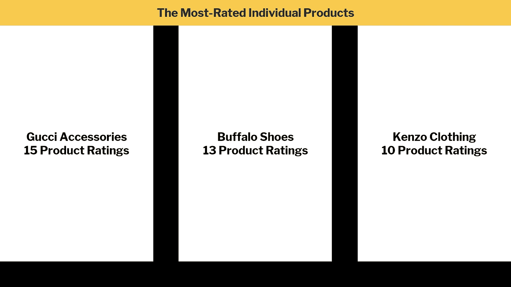

The three most-rated individual products. Image: Author

通过检查最受欢迎商品的产品评级总数，我们可以看到市场中长尾的完整范围。在我们数据库中的 16，105 个产品评级中，最受欢迎的产品只获得了 15 个评论，占所有评论的不到 0.1%。我们现在可以通过跟踪我们的*用户评分*历史来预热我们的客户数据。

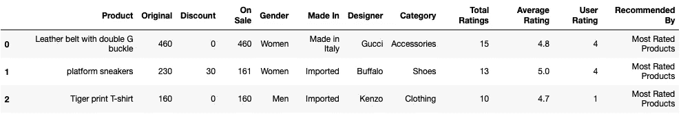

Recommender engine history of the three most-rated individual products. Image: Author

由于很少一部分客户可能会购买任何给定的产品，我们可以通过子类别提供建议，以获得更广泛的吸引力。通过对 1184 个*设计师*和 29 个*类别*进行分组，我们可以找到*“最佳一个”评分最高的子类别*。下面给大家推荐三款最受欢迎的*阿迪达斯鞋*，这三款鞋共占 375 个评分或所有购后评论的 2.3%。

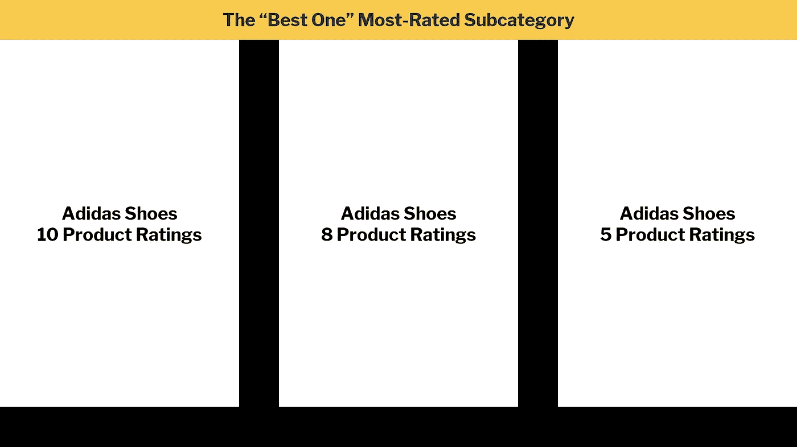

The “Best One” most-rated subcategory. Image: Author

当我们测试我们的推荐引擎时，我们跟踪每个推荐的模拟用户评分。虽然这些评级对于生成*非个性化*推荐来说并不是必需的，但是当我们过渡到*基于内容的*和*协作*推荐系统时，它们将会被利用。让我们注意一下，我们的模拟器给第二双*阿迪达斯鞋*打了五颗星。

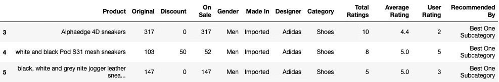

Recommender engine history of the “Best One” most-rated subcategory. Image: Author

受 Instagram 的最佳九个帖子⁴的启发，我们可以通过对*“最佳九个”最受欢迎的子类别*中的每一个进行抽样，来探索客户对广泛流行产品的兴趣。最顶级的*设计师*是*阿迪达斯*、*杜嘉班纳&加巴纳*和*古驰*，而最顶级的*类别*是*鞋子*、*服装*和*包包包*。请注意每个*设计师*如何定位自己，领导不同的*类别*，以红色突出显示。

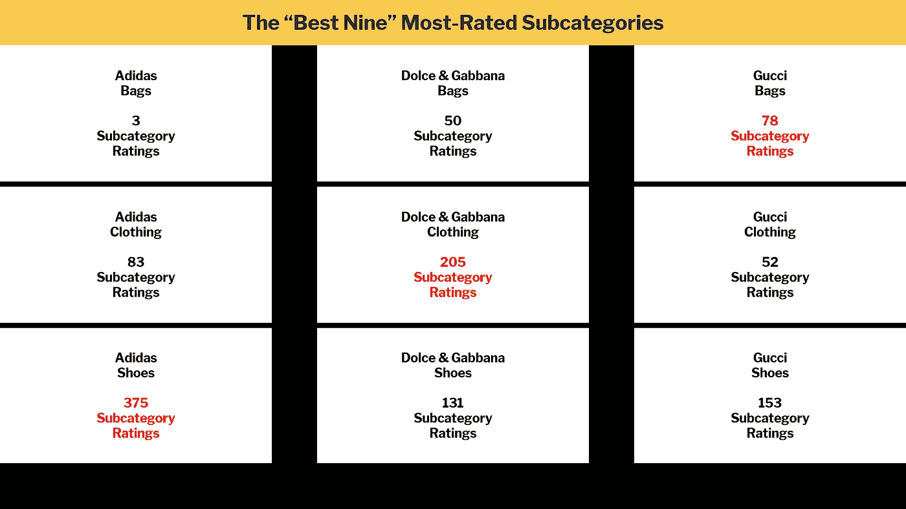

The “Best Nine” most-rated subcategories. Image: Author

我们推荐了*、*“最受欢迎的九个”子类别中的一个，但与我们所有的推荐者一样，客户一次只能看到一个产品并对其进行评级。我们的测试模拟器简单地多次调用*“Best Nine”*推荐器来演示它的行为。我们没有看到*阿迪达斯鞋*，因为我们以前展示过它们，我们的推荐器平衡了子类别视图。

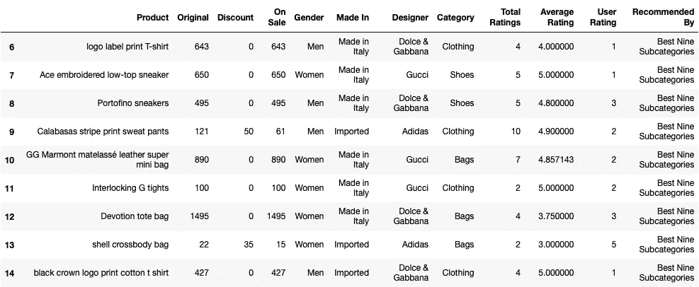

Recommender engine history of the “Best Nine” most-rated subcategories. Image: Author

# 可比产品推荐

现在，我们已经有了客户对各种产品的兴趣历史，让我们展示一下与评分高的产品相似的产品。回想一下，我们的客户给*阿迪达斯鞋*打了五颗星。*基于内容的商品相似度通过皮尔逊相关度*可以通过比较*原价*、*折扣*、*性别*、*国产*、*品类*推荐相似商品。

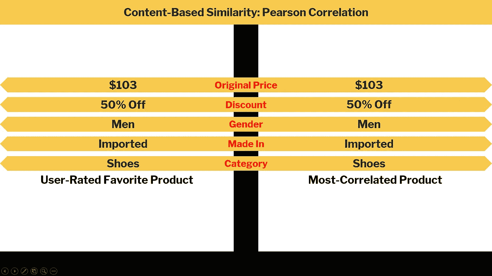

Content-based product similarity via Pearson correlation. Image: Author

由于我们在一个拥有 13，518 种差异化产品的长尾市场中运营，*基于内容的*推荐器可以有效地找到与我们感兴趣的特征非常匹配的商品。请注意*建议 15* 和 *16* 与*建议 4* 的匹配程度，我们的客户将其评为五星。同样，*推荐 17* 为*阿迪达斯包*匹配*推荐 13* 。

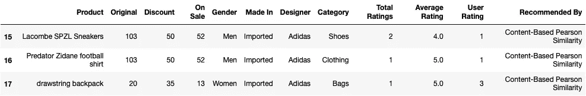

Recommender engine history of content-based product similarity via Pearson correlation. Image: Author

我们的*基于内容的*推荐器通过将每个产品的特征与所有其他产品的特征相关联来运行。连续特征如*原价*和*折扣*可以保持不变，以强调消费者价格敏感度，而分类变量如*性别*、*制造*和*类别*可以通过虚拟编码转换成数值。

Calculating content-based product similarity via Pearson correlation. Source: Author¹⁵

# 来自群众智慧的建议

最后，我们可以使用⁶的惊喜库无限期地提供用户对用户的协作推荐，该库使用奇异值分解，这是一种由西蒙·芬克在 2006 年网飞奖期间推广的矩阵分解方法。⁷该方法创建一个所有客户产品组合的矩阵，并使用现有的评级来预测客户对未评级配对的反应。

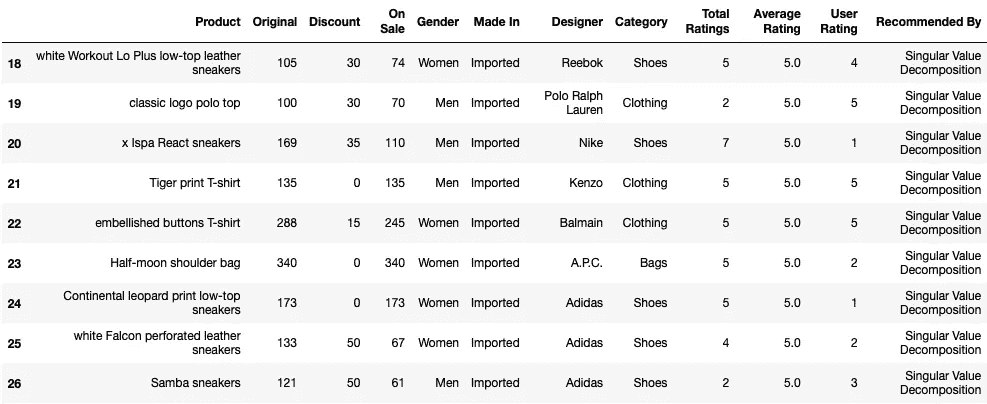

Recommender engine history of user-to-user collaborative filtering via Singular Value Decomposition. Image: Author

我们的数据库中有 13，518 种产品和 9，667 个客户，因此在我们的*客户-产品效用矩阵*中有 130，678，506 种可能的组合！由于我们只有 16，105 条客户评论(用蓝色突出显示)，我们的矩阵是 99.988%稀疏的(用空白表示)。这给使用*协作过滤*带来了一些挑战，但是在后面的讨论中会有更多关于这个主题的内容。

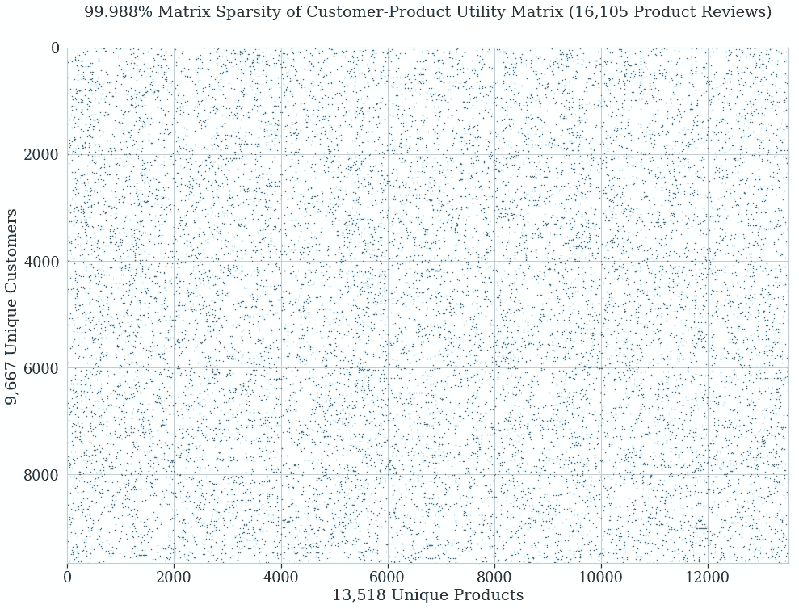

Matrix sparsity of the Customer-Product Utility Matrix in Singular Value Decomposition. Image: Author

为该分析编写的源代码可以在⁸的 GitHub 上获得，其中包括一个*触摸驱动推荐引擎*的实现和本文中给出的示例。我们已经看到了如何将多个推荐系统集成到一个全面的引擎中，以跟踪消费者旅程的接触点，同时解决冷启动问题。

# 参考

1.  “亚马逊有多少产品？，“零售接触点网络，[https://retailtouchpoints . com/resources/how-many-products-does-Amazon-carry](https://retailtouchpoints.com/resources/how-many-products-does-amazon-carry)，2019。
2.  A.图根德，“太多的选择:一个可以瘫痪的问题”，*《纽约时报》*，2010 年 2 月 26 日。
3.  南 S. Iyengar 和 M. Lepper，“当选择使人失去动力时:一个人会对一件好事期望过高吗？，“*《人格与社会心理学杂志*》，第 79 卷，第 6 期，第 995–1006 页，2001 年。
4.  C.安德伍德，“商业中推荐系统的用例——当前应用和方法”，Emerj 人工智能研究，2020 年 3 月 4 日更新。
5.  C.A. Gomez-Uribe 和 N. Hunt，“网飞推荐系统:算法、商业价值和创新”， *ACM 管理信息系统汇刊*，第 6 卷，第 4 期，2015 年。
6.  B.Lika，K. Kolomvatsos 和 S. Hadjiefthymiades，“面对推荐系统中的冷启动问题”，*专家系统与应用*，第 41 卷，第 4 期，第 2065–2073 页，2014 年。
7.  “在所有客户接触点，公司都面临着新的关联要求，”Salesforce，[https://www.salesforce.com/research/customer-touch-points](https://www.salesforce.com/research/customer-touch-points)，2019 年。
8.  D.Court，D. Elzinga，S. Mulder 和 O. J. Vetvik，“消费者决策之旅”，*麦肯锡季刊*，2009 年 6 月 1 日。
9.  C.安德森，“长尾理论”，连线，2004 年 10 月 1 日。
10.  法菲奇，[https://www.farfetch.com](https://www.farfetch.com)，2019。
11.  米（meter 的缩写））申克，“如何使用恰尔迪尼的 6 项说服原则来促进转化”， *CLX* ，2019 年 6 月 29 日。
12.  B.DeWees 和 J. A. Minson，“使用群体智慧的正确方法”，*《哈佛商业评论》*，2018 年 12 月 20 日。
13.  《方法论》，精益创业，[http://theleanstartup.com/principles](http://theleanstartup.com/principles)，2019。
14.  J.兰斯，“2020 年 Instagram 前 9 名:如何获得你最好的帖子”，*魅力*，2020 年 12 月 2 日更新。
15.  A.C. Dick，《为推荐系统创建基于内容的产品相似度矩阵》，载于 GitHub，[https://gist . GitHub . com/AC Dick/FB 76 dcde 98 CD 622 f 7756 e 9 af 9d 54d 464](https://gist.github.com/acdick/fb76dcde98cd622f7756e9af9d54d464)，2019。
16.  名词（noun 的缩写）拥抱，惊喜:用于推荐系统的 Python scikit。，[http://surpriselib.com](http://surpriselib.com)，2019。
17.  南芬克，“网飞更新:在家里试试这个”，*《控制论的进化:期刊*，2006 年 12 月 11 日。
18.  A.C. Dick，“触摸驱动的推荐引擎”，载于 GitHub，[https://github.com/acdick/touch_driven_recommender_engines](https://github.com/acdick/touch_driven_recommender_engines)，2019。