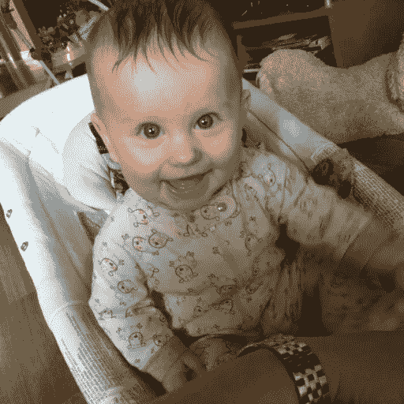
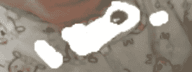
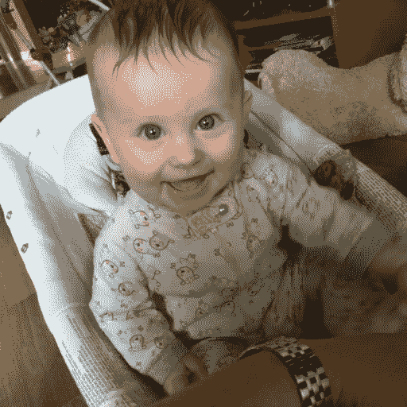

# 用深度学习润色宝宝照片

> 原文：<https://towardsdatascience.com/touching-up-baby-photos-with-deep-learning-5bc3a01f0aa9?source=collection_archive---------20----------------------->

像数字时代任何自豪的新父母一样，我给我的宝宝拍了许多照片。用手指轻敲几下，我就把照片上传到网上相册，在那里，照片会受到家人和朋友崇拜的观众的 *oohs* 和 *aahs* 。

尽管技术在通讯速度和文件存储容量方面取得了令人印象深刻的进步，但在更复杂的生物学领域却没有取得同样大的进步。婴儿的发育仍然和他们几代人一样缓慢。学习精细的运动技能、基本的语言能力和独立行走仍然需要多年的努力。婴儿面临着漫长而曲折的发展道路，这一事实在视觉上没有比给他们喂固体食物更明显的了。他们的饭菜不知怎么弄得到处都是。虽然这是喂养婴儿的现实，但这种混乱并不一定会玷污互联网上传播的婴儿照片。

NVIDIA 有一个[简洁的交互演示](https://www.nvidia.com/research/inpainting/)，它使用深度学习模型来重建图像中缺失或被掩盖的部分，这被称为“图像修复”在他们的[论文](https://arxiv.org/pdf/1804.07723.pdf)中，研究人员解释了他们如何通过使用*部分*卷积来改进现有模型，这些卷积以图像的原始像素值为条件，并且对替换到缺失区域的占位符值不可知。它们在自动更新步骤中逐渐缩小图像的蒙版部分。这使得输出图像摆脱了困扰其他方法的视觉伪像。

我在我宝宝的照片上运行了 NVIDIA 的演示。以下是原文:

我的意图是去除下巴下褐色的食物污渍。玩了几个不同的蒙版区域后，我选定了这些区域…

…提供最佳重建效果。

在输出图像中，污点被移除。一个精于 Photoshop 的艺术家可以做得更好，因为一些棕色仍然存在于修饰过的区域，而绵羊图案是模糊的。但是考虑到重建是免费的并且在几秒钟内完成，我对最终的结果很满意。