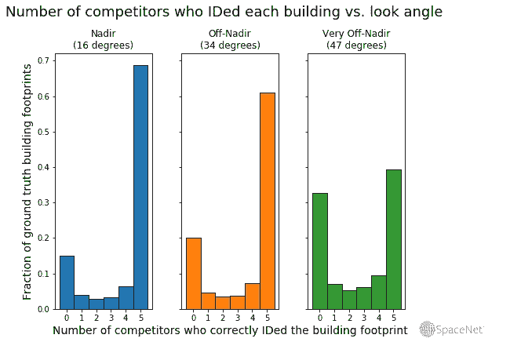

# 通过自动分析空中影像加速灾难响应

> 原文：<https://towardsdatascience.com/towards-accelerating-disaster-response-with-automated-analysis-of-overhead-imagery-18c65731eaaf?source=collection_archive---------8----------------------->

## 对 SpaceNet 挑战的评论:离底建筑物足迹提取

SpaceNet 的使命是加速地理空间机器学习，并得到 SpaceNet 成员组织的支持。了解更多请访问[*https://spacenet . ai*](https://spacenet.ai)*。*

A series of images taken by DigitalGlobe’s WorldView-2 satellite, from the SpaceNet Multi-View Overhead Imagery (MVOI) dataset described below, illustrating how look angle changes image appearance.

在本帖中，我们将描述与从航拍影像自动制图相关的挑战。关键要点:尽管算法非常擅长从直接从头顶拍摄的“理想”图像绘制地图，但紧急收集环境中存在的图像类型——如自然灾害后——对最先进的计算机视觉算法来说是一个目前尚未解决的问题。

# 当前的事态

随着计算机视觉方法的改进和高空图像变得更加容易获得，科学家们正在探索将这些领域结合起来用于许多应用的方法:其中有[监测去造林](https://www.sciencedirect.com/science/article/pii/S0378437110008733)和[跟踪难民情况下的人口动态](https://www.researchgate.net/deref/http%3A%2F%2Fdx.doi.org%2F10.1080%2F01431161.2014.971469)。自动图像分析有助于快速救灾:灾后新地图往往必不可少，因为协调救灾工作所需的基础设施(*如*道路)可能会被破坏。目前，这是由政府、私营部门的团队或志愿组织(如人道主义开放街道地图(HOT-OSM)团队)人工完成的，该团队应美国联邦紧急事务管理局(FEMA)的要求，创建了飓风 Maria 后波多黎各的底图(道路和建筑物)。但是手动标注既费时又费力:即使有 5300 名制图人员参与该项目，[波多黎各的第一张底图直到飓风袭击一个多月后才交付，该项目又过了一个月才正式结束。](https://wiki.openstreetmap.org/wiki/2017_Hurricanes_Irma_and_Maria)这绝不是对热 OSM 团队或他们奇妙的标签社区的批评——他们有 950，000 座建筑和 30，000 公里的道路要贴标签！即使是初步的自动标注步骤，然后手动纠正，也可以缩短地图交付时间。

随着深度学习模型从在 [TensorFlow](https://www.tensorflow.org/) 存在之前实施的 [AlexNet](https://papers.nips.cc/paper/4824-imagenet-classification-with-deep-convolutional-neural-networks.pdf) 的不成熟发展到今天的高级模型架构，包括[挤压和激励网络](https://arxiv.org/abs/1709.01507)、[双路径网络](https://arxiv.org/abs/1707.01629)，以及在像 [Keras](https://keras.io/) 这样易于使用的软件包中实施的高级模型训练方法，基于计算机视觉的高空图像地图创建已经取得了很大进展。除了这些发展，自动制图挑战的性能也在稳步提高，正如 [SpaceNet](http://www.spacenet.ai) 竞赛系列所证明的那样:从 2016 年的第一次挑战到 2018 年底的最近一次挑战(在此讨论),直接从头顶拍摄的图像的建筑物提取分数提高了*近三倍*。

# 为什么自然灾害后不自动地图？

在灾害应对场景中，自动分析空中影像仍然存在一个主要障碍:视角。

Schematic representation of look angle.

卫星的位置——也就是卫星图像可以显示的区域——受到卫星轨道的限制。在紧急收集情况下，没有时间让卫星直接从头顶飞过，这意味着要以一个角度拍摄图像——有时是一个很大的角度。根据 DigitalGlobe 的 Discover 平台的数据，飓风玛丽亚过后两天，在波多黎各圣胡安上空拍摄的第一张无云的公开照片是在 52 度的天底角。作为比较，这个故事顶部的动画中最偏离角度的图像是在 54 度拍摄的。

所谓的“偏离最低点”影像的许多特征对自动化分析提出了挑战:

## 位移和变形

在离底影像中，高物体(树、建筑物等)的顶部。)被从它们的地面足迹中移走。这使得细分具有挑战性！

Buildings are perfectly outlined in the nadir looks, but the footprint is offset in distorted off-nadir looks. Competitors’ solutions needed to account for this. Imagery courtesy of DigitalGlobe.

## 阴影和各种照明

在高射影像中，根据阴影的不同，一个区域的视图在外观上可能会有很大的不同。参见下面的例子，当太阳光反射回卫星时，建筑物很明显，但当图像从建筑物的阴影侧收集时，建筑物就不那么明显了。

Two looks at the same buildings at nearly the same look angle, but from different sides of the city. It’s visually much harder to see buildings in the South-facing imagery due to shadows. Imagery courtesy of DigitalGlobe.

## 物体的遮挡

如果你在图像中看不到一个物体，你就很难识别它！在非最低点看起来，高物体阻挡了其他结构:

Occlusion can make it impossible to see some objects in off-nadir imagery. A building whose roof is visible (though cloaked in shadow) in nadir imagery (left, red arrow) is obscured by the skyscraper in off-nadir imagery (right).

## 解决

在更大角度拍摄的图像覆盖了更多的地面，但仍然包含相同数量的像素，降低了地面分辨率。在下文描述的 SpaceNet 多视图高架图像(MVOI)数据集中,“在天底”拍摄的图像分辨率为 0.51 米/像素，而远离天底的分辨率降至 1.67 米/像素。这在这个故事顶部的动画中显而易见——随着图像越来越偏离最低点，分辨率越来越差。为了找出这些因素对模型性能的影响程度，我们需要一个标记良好的数据集来控制除视角之外的所有变量。

# SpaceNet 多视图高架图像(MVOI)数据集

为了探索视角在多大程度上影响模型性能，我们发布了 SpaceNet MVOI 数据集，这是开源的，可以在 AWS S3 免费获得——您所需要的只是一个 AWS 帐户！下载说明和其他元数据可从[这里](https://spacenet.ai/off-nadir-building-detection/)获得。

## 意象

该数据集来自 DigitalGlobe WorldView-2 卫星在美国佐治亚州亚特兰大上空单次通过时收集的一系列独特数据。这颗卫星拍摄了 27 张图像，范围从偏离天底 7 度到 54 度，包括朝北和朝南的两种外观:

Location where each collect was taken from to generate the SpaceNet 4 Off-Nadir dataset. This not-to-scale representation is simplified: in reality, the satellite did not pass directly over Atlanta, but nearby. See [this paper](https://ieeexplore.ieee.org/document/6032741) and the [dataset metadata](https://spacenetchallenge.github.io/AOI_Lists/AOI_6_Atlanta.html) for additional details.

这些收集的每一个都覆盖了亚特兰大及其周围同样 665 平方公里的土地。因为它们都是在 5 分钟之内获得的，所以对照明、土地使用和其他时间因素的改变被最小化。真的，不同系列之间唯一不同的是视角。

Sample images from the SpaceNet Multi-View Overhead Imagery (MVOI) dataset (described below). The look angle is shown on the left, along with a bin ID: Nadir, ≤25 degrees off-nadir; Off-nadir, >25 and <40 degrees; very off-nadir, ≥40 degrees off-nadir. Negative numbers correspond to South-facing looks, positive numbers to North-facing looks. Imagery courtesy of DigitalGlobe.

根据观察方向和角度的不同，完全相同的地理看起来非常不同。理解这对算法性能的影响不仅在遥感分析中有应用，而且在一般的计算机视觉领域中也有应用。

## 标签

SpaceNet 的合作伙伴 Radiant Solutions 开展了一项严格的标注活动，在数据集中的 126，747 座建筑物周围绘制多边形足迹。我们使用覆盖区而不是边界框，因为边界框通常不足以进行基础制图，例如，如果建筑物覆盖区与道路重叠，重要的是要知道这实际上是真实的，而不是标注的伪像。我们进行了仔细的质量控制，以确保所有的建筑物都被标记，因为高质量的标签对于训练计算机视觉模型(*即*)来说至关重要，如果数据集中只有一半的建筑物被标记为这样，那么算法如何才能学会找到它们呢？)建筑物覆盖区的大小从 20 平方米到 2，000 多平方米不等，并且密度在数据集中的不同地理区域有很大差异:

A histogram showing the number of buildings in each unique geography in the dataset. X axis: the number of buildings apparent in the image, which ranges from 0 (mostly forested areas) to 297 (a very dense suburb). Y axis is the number of images from unique geographies that have that number of buildings — multiply that number by 27 for the total number of images.

这种可变性本身就提出了一个挑战，因为该算法无法学习到每张图像中应该存在大致相同数量的对象。这对于对象检测(包围盒预测)算法来说尤其困难，因为这种算法通常需要估计每幅图像的对象数量作为超参数。

标注完成后，我们对图像进行了重新采样，以便它们每个像素都覆盖相同的地面面积，然后将图像和标签分成 900 x 900 像素的小块，以便更容易地创建模型输入。处理完成后，我们将其分成三部分:一个大的训练集和两个小的测试集，一个用于公共测试，一个用于最终的比赛验证。我们发布了训练集的图像和标签，只发布了公共测试集的图像，并保留了最终测试集的所有内容。

# 太空网 4:非最低点建筑足迹提取挑战

## 竞赛总结

一旦数据集完成，我们就通过 TopCoder 主办的公共 SpaceNet Off-Nadir 建筑足迹提取挑战赛来测试算法。在那里，参赛者训练算法来识别不同视角图像中的建筑足迹，争夺 5 万美元的奖金。

## 得分

分割任务的常见评估工具是逐像素评分，但我们要求竞争对手提供更多信息:建筑物的实际多边形足迹。这些在部署环境中更有用，在部署环境中，人们经常需要知道各个建筑物的位置。为了给他们的多边形预测打分，我们使用了一个[交集/并集(IoU)度量](https://medium.com/the-downlinq/the-spacenet-metric-612183cc2ddb):

We scored algorithms by an instance IoU metric. Algorithms generated building proposals for each image, and predictions where the intersection between a ground truth and prediction footprint was greater than 50% of the union of those footprints were scored successes. All other predictions were scored as failures (false positives).

我们为阳性预测设置了 0.5 的 IoU 阈值，并在评分后，计算了每个视角组(最低点/偏离最低点/非常偏离最低点)中的真阳性、假阳性和假阴性的数量。我们计算了每一个的 [F1 分数](https://en.wikipedia.org/wiki/F1_score)，因为这个指标会惩罚假阳性和假阴性预测。然后，我们将这三个 F1 分数进行平均，得到最终的比赛分数。

近 250 名参赛者报名参赛，产生了 500 多份独特的参赛作品。成绩在下面！

# 获胜的算法

## 分数摘要

首先，让我们来看看前五名竞争者的得分:

Competitors’ scores in the SpaceNet 4: Off-Nadir Building Detection Challenge compared to the [baseline model](https://medium.com/the-downlinq/a-baseline-model-for-the-spacenet-4-off-nadir-building-detection-challenge-6b7983312b4b). Each score represents the [SpaceNet Metric](https://medium.com/the-downlinq/the-spacenet-metric-612183cc2ddb) for the entire image set (Overall) or subsets of the imagery with specific look angles: Nadir, 7–25 degrees; Off-nadir, 26–40 degrees; Very off-nadir, >40 degrees.

从这些结果中可以得出一些值得强调的要点:

1.  自从两年前的第一届 SpaceNet 建筑物识别比赛以来，建筑物足迹提取分数已经显著提高，当时获胜的算法实现了约 0.3 的 IoU-F1。地理空间计算机视觉算法走了很长的路，而且很快！
2.  从非天底点(25-40 度视角)提取建筑物覆盖区的效果几乎与天底点影像一样好。这种类型的知识可以通知图像采集决策，因为我们现在知道，完美的外观不是这项任务所必需的。也就是说，
3.  建筑物足迹提取仍然具有挑战性，非常偏离最低点(> 40 度视角)。这些图像的性能大约低 25%。我们将回到为什么这可能很快。

## 获奖算法总结

顶级竞争对手提供了他们算法的摘要版本，包括完整的解决方案代码和书面摘要，这些都是开源的[这里](https://github.com/SpaceNetChallenge/SpaceNet_Off_Nadir_Solutions)。除了这些总结，我们还研究了每个竞争对手使用的算法，并发现了一些有趣的细节。

A summary of the models used by the top 5 competitors in the SpaceNet Off-Nadir Building Footprint Extraction Challenge. See the end of this post for numbered reference links.

让我们在这里分解几个关键细节:

## **各种深度学习模型(但没有经典的机器学习):**

我们惊讶于使用了多少不同的深度学习模型架构，以及它们之间的分数有多么相似。一些竞争对手使用大量的集成——超过 20 个独立训练的模型——来生成哪些像素对应于建筑物的预测，然后对这些预测进行平均，以获得最终结果。另一个竞争者(编号 13)为每个单独的系列训练了一套不同的权重，然后使用相应 look 的模型权重为每个图像生成预测。

我们并不十分惊讶每个获胜的算法都使用了深度学习。这与计算机视觉的一般趋势是一致的:几乎所有的高性能分割算法都利用了深度学习。唯一使用的“经典”机器学习算法是梯度提升树，前两个竞争对手 cannab 和 selim_sef 用于从神经网络中过滤出“糟糕的”建筑足迹预测。

## 针对地理空间特定(及相关)问题的模型裁剪

这些算法教会了我们很多关于裁剪模型以适应空中影像的知识。建筑物像素仅占整个训练数据集的 9.5%。分割算法被训练来将单个像素分类为属于对象(这里是建筑物)或背景。在这种情况下，一种算法可以通过预测所有事物的“非建筑物”来实现高像素精度！这导致用“标准”损失函数(如二进制交叉熵)训练的算法崩溃到到处预测零(背景)。竞争对手通过两种方法克服了这一点:1 .使用相对较新的[焦损失](https://arxiv.org/abs/1708.02002)，这是一个交叉熵变量，它对低置信度的预测造成了极大的惩罚；2 .将该损失函数与基于 IoU 的损失相结合，例如 [Jaccard 指数](https://en.wikipedia.org/wiki/Jaccard_index)或[骰子系数](https://en.wikipedia.org/wiki/S%C3%B8rensen%E2%80%93Dice_coefficient)。这些损失函数通过强烈惩罚预测不足来防止“全零谷”。

使用高射影像的另一个挑战(以及小而密集的物体的实例分割等相关问题)是物体合并。上面描述的语义分割方法不做任何事情来分离单个对象(一项称为“实例分割”的任务，这是竞争对手在这次挑战中被要求做的)。通常通过将相邻的对象标记为单个实例来从语义掩码中提取实例；但是，语义分割可能会在附近的对象错误地相互连接的地方产生像素遮罩(参见下面的示例)。这可能会导致问题:

Building instance segmentation from attached (left) vs. separated (right) semantic segmentation output masks. Red arrows, poor prediction results in connection of very closely apposed buildings.

如果用例需要了解一幅图像中存在多少对象，或者它们的精确边界在哪里，这将是一个问题。一些竞争对手通过创建多渠道学习目标模板来应对这一挑战，如下所示:

A sample pixel mask taken from [cannab’s solution description](https://github.com/SpaceNetChallenge/SpaceNet_Off_Nadir_Solutions/tree/master/cannab). Black is background, blue is the first channel (building footprints), pink is the second channel (building boundaries), and green is the third channel (points very close to two different or more buildings). Cannab’s algorithm learned to predict outputs in this shape, and in post-processing he subtracted the boundaries and contact points from the predicted footprints to separate instances more effectively.

该算法现在有效地预测三件事情，而不仅仅是预测每个像素的建筑物/无建筑物:1 .建筑/无建筑，2。建筑物的边缘/无边缘，3。建筑物之间的接触点/无接触点。减去边缘和接触点的后处理可以“清理”并置的对象，从而改进实例分割。

## **培训和测试时间不同**

比赛规则要求参赛者的算法可以在 4 个 Titan Xp GPUs 上训练 7 天，并在不超过 1 天的时间内完成推理。上表列出了培训和测试时间。值得注意的是，在需要持续、及时更新的产品环境中，许多解决方案的部署速度可能太慢。有趣的是，来自大型集合的单个模型或许可以在不显著降低性能的情况下独立使用(并且速度大幅提高)——例如，cannab 在[他的解决方案描述](https://github.com/SpaceNetChallenge/SpaceNet_Off_Nadir_Solutions/tree/master/cannab)中指出，他的最佳单个模型的得分几乎与获奖的集合一样高。

# 离底影像分析算法的优缺点

我们问了几个关于 SpaceNet Off-Nadir 挑战赛获胜算法的问题:

1.  获胜的算法识别了每栋建筑的哪一部分？*即*，脚印有多精确？
2.  每种算法在不同视角下的表现如何？
3.  不同算法的预测有多相似？
4.  建筑物的大小会影响建筑物被识别的可能性吗？

这些问题在 [CosmiQ Works 博客 DownlinQ](http://www.medium.com/the-downlinq) 上有更详细的探讨。有趣的观点总结如下。

## 脚印有多精确？

当我们运行 SpaceNet Off-Nadir Challenge 时，我们为建筑物检测设置了 0.5 的 IoU 阈值，这意味着在地面真实足迹和预测之间存在的所有像素中，> 50%必须重叠才能算作成功。根据使用情况，该阈值可能高于或低于实际需要的值。低 IoU 阈值意味着你不关心一栋建筑有多少被正确标记，只关心它的某个部分被识别。这适用于计数对象，但如果您需要精确的轮廓(例如，在灾难后定位损坏)，则不适用。当评估用于产品部署的计算机视觉算法时，考虑这个阈值是很重要的:对于用例，对象必须被精确地标记吗？

我们问，如果我们改变这个阈值，算法的建筑回忆(它们识别的地面真实建筑的比例)会发生什么变化。结果是惊人的:

Recall, or the fraction of actual buildings identified by algorithms, depends on the IoU threshold. Some algorithms identified part of many buildings, but not enough to be counted as a successful identification at our threshold of 0.5\. The inset shows the range of IoU thresholds where XD_XD (orange)’s algorithm went from being one of the best in the top five to one of the worst out of the prize-winners.

如果阈值设定在 0.3 以下，竞争对手的表现几乎没有变化——在竞争对手找到的建筑中，大多数都达到了这个分数，如果不是更好的话。然而，性能在这一点上开始下降，一旦阈值达到~0.75，分数就下降了 50%。这种明显的下降凸显了计算机算法可以改进的另一个领域:小对象的实例级分割精度。

## 视角性能

接下来，让我们检查每个竞争对手的算法在每个不同视角下的表现。我们将考察三个性能指标:召回率(识别出的实际建筑的比例)、精确度(与实际建筑相对应的预测建筑的比例，而不是误报)，以及 [F1 得分](https://en.wikipedia.org/wiki/F1_score)，这是结合了这两个特征的竞争指标:

F1 score, recall, and precision for the top five competitors stratified by look angle. Though F1 scores and recall are relatively tightly packed except in the most off-nadir look angles, precision varied dramatically among competitors.

不出所料，竞争对手在这些图表中的表现非常相似，这与他们在排行榜上的排名一致。最值得注意的是这种分离产生的地方:竞争对手在“最低点”范围(0-25 度)内*非常*密集。事实上，顶部两个(cannab 和 selim_sef)之间仅有的显著分离的视角是那些 45 度的>。cannab 似乎已经赢得了他的算法在非常低的图像上的性能！

这些图的最后一点:在中间视角范围内有一些奇怪的尖峰图案。得分较低的角度对应于朝南拍摄的图像，其中阴影掩盖了许多特征，而朝北的图像具有建筑物反射的更明亮的阳光(下图复制自之前作为提醒):

Two looks at the same buildings at nearly the same look angle, but from different sides of the city. It’s visually much harder to see buildings in the South-facing imagery, and apparently the same is true for neural nets! Imagery courtesy of DigitalGlobe.

[这种模式在我们的基线模型](https://medium.com/the-downlinq/a-baseline-model-for-the-spacenet-4-off-nadir-building-detection-challenge-6b7983312b4b)中更加明显。视角并不重要，方向也很重要！

## 获胜算法之间的相似性

我们检查了图像中的每一栋建筑，并询问有多少竞争者成功地识别了它。结果是惊人的:

Histograms showing how many competitors identified each building in the dataset, stratified by look angle subset. The vast majority of buildings were identified by all or none of the top five algorithms — very few were identified by only some of the top five.

超过 80%的建筑物被零个或全部五个竞争者在最低点和非最低点箱中识别出来！这意味着算法的不同之处仅在于它们识别大约 20%的建筑物的能力。考虑到神经网络架构的巨大差异(以及从不同算法训练和生成预测所需的计算时间)，我们发现这一点值得注意。

## 性能与建筑规模

该数据集中建筑物覆盖区的大小变化很大。我们根据竞争对手识别大于 20 平方米范围内所有东西的能力给他们打分，但是竞争对手在整个范围内的表现都一样好吗？下图回答了这个问题。

Building recall (y axis) stratified by building footprint size of varying size (x axis). The blue, orange, and green lines represent the fraction of building footprints of a given size. The red line denotes the number of building footprints of that size in the dataset (right y axis).

即使是最好的算法在小型建筑上的表现也相对较差。cannab 仅识别出约 20%小于 40 平方米的建筑，即使在视角偏离最低点 25 度以下的图像中也是如此。该算法在范围超过 105 平方米的建筑物上实现了其峰值性能，但这仅对应于数据集中大约一半的对象。不过，值得注意的是，这种算法正确识别了天底影像中占地面积大于 105 平方米的建筑物的大约 90%。

## 结论

前五名竞争对手很好地解决了这一挑战，实现了出色的召回和相对较低的误报预测。尽管他们的神经网络架构各不相同，但他们的解决方案产生了惊人相似的预测，强调神经网络架构的进步对构建足迹提取和类似任务的回报越来越少——开发更好的损失函数、预处理和后处理技术以及针对特定挑战优化解决方案可能会提供更多价值。对象大小可能是高射影像分割的一个重要限制，视角和方向会显著改变性能。最后，通过查看 GitHub 上的[获胜竞争者的代码以及他们对解决方案的描述，我们可以了解更多，我们鼓励您更多地探索他们的解决方案！](https://github.com/SpaceNetChallenge/SpaceNet_Off_Nadir_Solutions)

## 下一步是什么？

我们希望您喜欢从这个挑战中学习非最低点建筑物足迹提取，我们希望您将亲自探索数据集！不久将会有更多的 SpaceNet 挑战——请关注我们的更新，感谢您的阅读。

***型号参考:***

1.  [https://arxiv.org/abs/1505.04597](https://arxiv.org/abs/1505.04597)
2.  [https://arxiv.org/abs/1709.01507](https://arxiv.org/abs/1709.01507)
3.  [https://arxiv.org/abs/1707.01629](https://arxiv.org/abs/1707.01629)
4.  [https://arxiv.org/abs/1409.0575](https://arxiv.org/abs/1409.0575)
5.  [https://arxiv.org/abs/1512.03385](https://arxiv.org/abs/1512.03385)
6.  [https://arxiv.org/abs/1608.06993](https://arxiv.org/abs/1608.06993)
7.  [https://arxiv.org/abs/1602.07261](https://arxiv.org/abs/1602.07261)
8.  [https://arxiv.org/abs/1612.03144](https://arxiv.org/abs/1612.03144)
9.  [https://arxiv.org/abs/1703.06870](https://arxiv.org/abs/1703.06870)
10.  [https://arxiv.org/abs/1405.0312](https://arxiv.org/abs/1405.0312)
11.  [https://www.crowdai.org/challenges/mapping-challenge](https://www.crowdai.org/challenges/mapping-challenge)
12.  [https://arxiv.org/abs/1409.1556](https://arxiv.org/abs/1409.1556)
13.  [https://arxiv.org/abs/1801.05746](https://arxiv.org/abs/1801.05746)