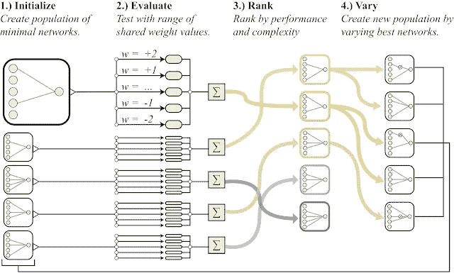
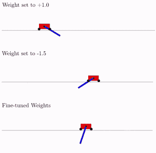

# 用本能创造人工智能

> 原文：<https://towardsdatascience.com/towards-creating-ai-with-instincts-a8d9ac83cd30?source=collection_archive---------19----------------------->

## 具有预训练知识的神经网络

2019 年 8 月下旬，谷歌的研究人员发布了一篇题为“重量不可知神经网络”的论文，让我们看到了我们在寻求创造尽可能接近自然大脑的人工智能(AI)过程中缺失的一块拼图:本能。本文涵盖了迄今为止寻找人工神经网络(ANN)架构的方法，指出了本能在大脑中的重要性，并为渴望细节的人描述了本能如何融入人工智能。

# 迄今为止的神经网络架构

简而言之，人工神经网络的结构是指其中神经元的数量、排列和连接。当构建一个人工神经网络来解决一个问题时，在所有约束条件下可能的最佳架构是所期望的。毕竟，拥有一个次优的解决方案是不划算的。寻找最佳人工神经网络架构的方法在不断发展。在他们旅程的开始，人工智能爱好者手动选择他们的架构，例如选择两个隐藏层，每个层有 4 个节点，如下图所示。明智的做法是，他们可以通过反复试验来尝试不同的架构，比较性能并选择最佳架构。

A basic, manually-chosen ANN architecture, sourced from [Arden Dertat’s article](/applied-deep-learning-part-1-artificial-neural-networks-d7834f67a4f6)

有了一些经验，他们可能会尝试使用遗传算法，最终得到一个比他们手动选择的架构更好的架构。如果更雄心勃勃，他们可能会去强化学习为基础的架构搜索，一个例子是 AutoML。

到目前为止，所有架构的一个共同点是，无论架构多么优化，所有的权重(神经元之间的连接)在开始时都是随机值。这是有道理的，因为对于复杂的问题，我们可能不知道从什么值开始，所以最好的办法是用随机权重创建一个空的大脑，让它通过训练从数据中学习，在这个过程中调整权重。学习是从零开始的。(关于深度学习如何从空大脑的想法中发展起来的有趣阅读，请阅读本文。)

> 对于复杂的问题，我们可能不知道从什么权重值开始，所以最好的办法是用随机权重创建一个空大脑，让它通过训练从数据中学习，在这个过程中调整权重。

但是让我们后退一步，把目光放在最终目标上，那就是复制大脑的工作方式。我们有办法创造一个完全随机的“婴儿大脑”，并允许它学习成为专家。没错，这就是大脑的功能。它会学习。然而，如果我们想让人工神经网络尽可能接近自然神经网络，还缺少一些东西:本能，天生就对自己的任务有一些了解。

## 先天与后天二分法

先天与后天二分法是由优生学和行为遗传学的创始人弗朗西斯·高尔顿受他的同父异母表兄查尔斯·达尔文著作的影响而流行起来的。

这里的自然是指一个有机体的预布线。本能，出生时的知识。狗追逐松鼠是因为它们的狩猎本能，甚至不知道一旦抓到它们该怎么办。一些鸟类在没有父母明确教导的情况下筑巢。你，作为一个人，倾向于沉溺于甜食，因为我们的祖先，狩猎采集者，发现在捕食者出现之前尽可能多的吃水果对他们最有利。这种与生俱来的倾向已经传了几千代给我们，即使我们现在是阿尔法物种，不用害怕任何捕食者。

The predator hunting instinct, sourced from: [https://i.pinimg.com/originals/8a/32/fd/8a32fd409c364771fac7562ae687221d.jpg](https://i.pinimg.com/originals/8a/32/fd/8a32fd409c364771fac7562ae687221d.jpg)

另一方面，后天培养被视为外部因素对大脑的影响。它需要本能，并把它变成一种行为。这可以在国家地理纪录片中看到，当母猎豹削弱或固定她的猎物，以便幼崽可以练习攻击它。虎鲸也表现出类似的行为，它们在海豹周围翻滚。这是学习发生的地方。

> 自然是生物体的预布线(本能)。后天是外界因素(学习)的影响。

可见，学习在动物界发生得非常快，因为动物天生就有本能。因此，如果人工智能的目标是创建尽可能接近真实的神经网络，那么本能就必须被纳入其中，否则人工智能将是 100%的后天培养，而不是天生的。但是如何创建一个已经知道在训练前做什么的神经网络呢？进入重量不可知的神经网络。

## 重量不可知神经网络

WANN 是一种神经网络架构，其中 ANN 已经知道它应该显示的行为的一般趋势。用机器学习的术语来说，它有很强的归纳偏见。WANNs 具有共享的权重，即同一模型中的所有权重具有相同的值，因此不进行微调。

那么，如果传统的架构搜索方法找不到这样的架构，该如何找到呢？这是在一种被称为[神经进化的技术的帮助下，通过扩充拓扑结构(NEAT)](http://nn.cs.utexas.edu/downloads/papers/stanley.ec02.pdf) 以递归的方式完成的。听起来很恐怖？不用担心，这是容易理解的:*神经进化*意味着神经网络的人工进化(通过遗传算法),而*增加拓扑结构*意味着架构变得更加复杂。

寻找崇拜者的过程相对简单:

1.  创建一组(群体)具有不同简单架构的神经网络。
2.  使用不同的共享权重值来衡量各自的性能。这意味着，对于每个神经网络，使用一系列值对其进行评估，其中，对于每个值，所有权重都是相等的。简单地说，尝试所有权重的值都是 *a.* ，然后是值 *b* ，然后是 *c* ，以此类推。
3.  根据性能和复杂性对不同的体系结构进行排序。
4.  只选择性能最好的架构，使用 NEAT 改变它们以重新创建新的群体，然后从步骤 2 开始重复，直到获得满意的架构。

下图总结了这一过程。

The process of finding a WANN, sourced from the [WANN white paper](https://arxiv.org/pdf/1906.04358.pdf)

**万纳戒要统治他们所有人？**

那么这是否意味着训练神经网络现在将变得过时？不完全是。因为一张图胜过千言万语，所以下面的 GIF 是 WANN 和微调模型在 Cartpole Swing-up 任务上的表现对比。

Performance of WANN with shared weights=1.0 (top), WANN with shared weights=-1.5 (middle, sub-optimal) and neural net with weights fine-tuned through training (bottom)

顶部的 WANN 并没有胜过微调的模型，但它已经完成了它的目的:它抓住了本能！这是一个神经网络，它甚至没有经过训练(它的所有权重都等于 1.0)，但已经大致知道它要做什么。现在，可以采用并训练这种结构，期望训练将显示出比具有随机初始化权重的 ANN 更快的收敛。

**结论**

权重不可知的神经网络是一种寻找解决问题的神经网络结构的新方法。虽然它们不能从一开始就击败训练好的模型，但它们确实捕捉到了必要的偏差，作为未来训练更好模型的垫脚石。这样做，可以创造出具有本能的人工智能。

*Hans A. Gunnoo 是一名数据科学家，他的职业生涯始于电子工程，后来专攻机器学习。他还在业余时间为开源人工智能项目和关于数据科学领域最新趋势的博客做出贡献。*