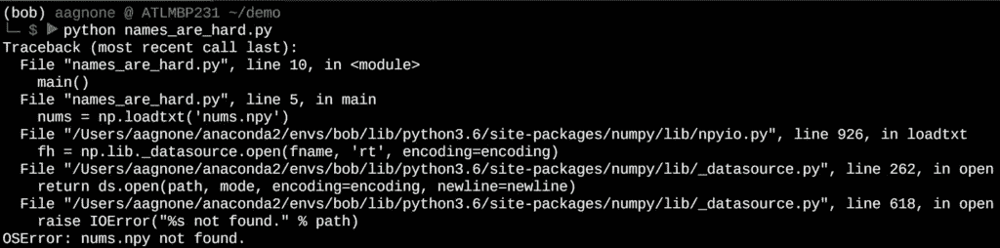
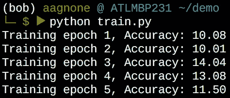
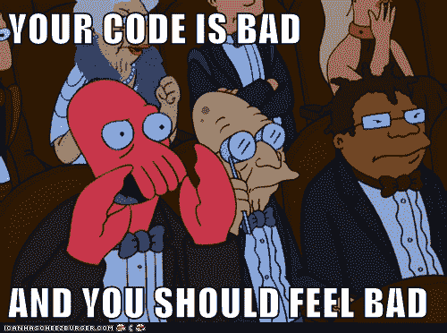
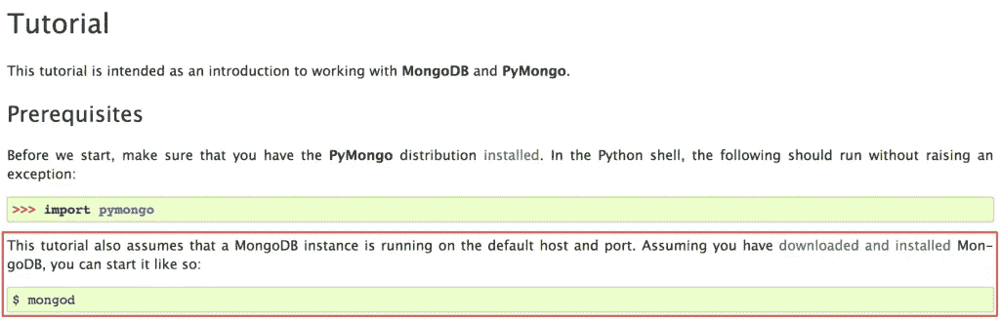
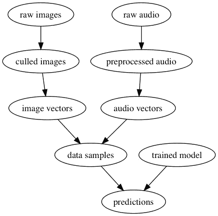
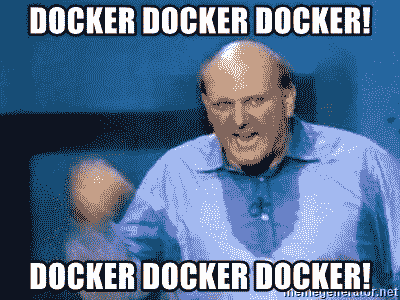

# 可再现的数据处理:Make + Docker

> 原文：<https://towardsdatascience.com/towards-efficient-and-reproducible-ml-workflows-part-1-analysis-a98c945d7616?source=collection_archive---------19----------------------->

A real-life DAG :)

## 避免依赖管理和容器化带来的再现性问题

# 动机

在数据科学和机器学习中进行实验时，最初进展的两个主要障碍是构建/使用“基础代码”的延迟和缺乏可重复性。感谢一些伟大的开源工具，你不必是一个软件大师来绕过这些障碍，并在一个更顺畅的过程中从你的数据中获得意义。

“嘿，我在运行你的代码时遇到了这个错误……你能帮我吗？?"

…这是值得在 facepalm 上使用的东西。你在这里，试图与朋友或同事一起找到一个有趣的想法，而你现在正在调试一个文件未找到的错误。欢迎回到编程入门课程！

我敢肯定，代码的所有者也最喜欢花大量时间帮助别人以蜗牛的速度解决这些问题。你们两个刚刚对最近的实验结果的承诺所分享的纯粹的喜悦现在已经变成了无言的尴尬和沮丧，因为演示在显示出任何价值之前就失败了。

但是没关系。挺好的！你的朋友知道在哪里能找到丢失的文件。你被告知几分钟之内就能拿到，然后你就可以上路了！

“好吧，下载那个文件——我已经用电子邮件发给你了。然后运行`train.py`，你应该在 20 个历元内得到 98%的准确率。”

啊哈！就是这个！是时候加入受人尊敬的数据魔术师的行列了，铸造一个又一个键盘咒语，看着你的数据宝宝的大脑越来越先进，因为它在召唤一个新的终结者电影中的角色！让我们看看我们得到了什么！

…是的，我们都经历过。

会是什么呢？嗯，也许是显而易见的事。我了解 python，我知道你的代码应该做什么。我会打开你的`train.py`四处看看…不。

不要担心，这不会是一篇关于如何总是写一个软件杰作并嘲笑任何你认为不服从的东西的挥舞着小手指的文章。总的来说，这是一个棘手的问题，因为它带有主观性和竞争性标准。这些例子旨在强调，有无数的方式，我们不喜欢新的实验开始。

我们感兴趣的是*以一种*方便*的方式重现*和*在结果上提高*，而不是跌跌撞撞地重现过去的成就。记住这一点，让我们来看看一些流行的工具，它们可以用来简化任何新的 ML 软件项目的开始: [Docker](https://www.docker.com/) 和 [Make](https://www.gnu.org/software/make/) 。

# 码头工人

python 生态系统在处理依赖性方面有一些很棒的特性，比如 [pip](https://realpython.com/what-is-pip/) 和 [virtualenv](https://docs.python-guide.org/dev/virtualenvs/) 。这些工具允许用户根据需要安装的一些规范轻松地启动和运行，以继续运行一些代码。

例如，假设您刚刚遇到了 [scikit-learn](https://scikit-learn.org) 库(当然是一见钟情)。您对其中一个演示示例特别感兴趣，但希望用保存在 [pandas](https://pandas.pydata.org/) 数据框架中的数据重新制作它。此外，您正在进行的另一个项目需要一个旧版本的 pandas，但是您想使用仅在新版本中可用的特性。有了 pip 和 virtualenv，你就没有什么可害怕的了(……除了害怕本身)。

当你第一次学习这个流程时，你会感觉从依赖管理这种地狱般的存在中解脱出来。您胜利地宣布，您将永远不会再被丢失的软件包或臃肿的整体系统环境所征服。然而，不幸的是，这并不总是足够的…

> *当依赖不是在语言层面，而是在系统层面时，Python 环境工具就有所欠缺。*

例如，假设您想用一个 [MongoDB](https://www.mongodb.com/) 数据库后端来设置您的机器学习项目。没问题！然后我们就自由了！没那么快...

嗯……事情没有像预期的那样发展。现在，除了设置我的库依赖项，我们还需要管理 python 之外的库？啊！进一步拖延！是时候谷歌一下 mongoDB 的包名了…

如果我连同事用的是什么操作系统都不知道怎么办？如果他在 CentOS 上，我不能给他一些`sudo apt-get install`片段。更重要的是，没有简单的方法来为未来的项目自动化这个步骤。让我做一次，我会做的。让我再做一次...zzzz。

因此，我们面临着为新的数据相关工作建立软件库和其他系统依赖的标准化和自动化的愿望，遗憾的是，我们常用的 python 工具已经不够用了。输入 Docker:一个在操作系统上运行服务的[引擎](https://docs.docker.com/engine/docker-overview/)，作为轻量级虚拟化包，称为*容器*。Docker 容器是 Docker *图像*定义的实现，它由一个名为`Dockerfile`的文件指定。

可以把 order 文件想象成一个(详细的)设置步骤的处方，我们需要这样做，以便让系统处于我们想要的实验状态。例子包括建立数据库、安装库和初始化目录结构。如果您曾经编写过一个很好的 shell 脚本来完成类似的设置，那么您就离典型的 Docker 工作流不远了。相对于 shell 脚本，Docker 在这方面有很多优势，最显著的是*容器化*:使用 Docker 容器，我们可以从运行容器的主机系统中抽象出来。运行容器的虚拟系统是在它自己的进程中定义的。因此，我们可以让多个容器在同一台主机上运行完全不同的设置。这对于抵御系统依赖地狱来说如何？

此外，我们还进一步避免了文件丢失和系统状态差异等问题。我们确切地知道系统运行时的状态。我们知道这一点，因为我们通过 Dockerfile 文件中的明确说明做到了这一点。

为了实际构建映像，我们使用如下命令:

至此，我们已经建立了图像。有了这个图像，我们可以根据需要重复实例化它，例如执行多个实验。

瞧啊。

如果我们从这一点出发，向 N 个方向跑去做各种不同的实验，这些命令可能会变得很麻烦…

不要担心，如果你的眼睛在这一点上蒙混过关。关键是要不停地打字。不过没关系，我们使用 shell 脚本是有原因的。有了 shell 脚本，我们可以将制作一个非常具体的命令序列的微小细节封装到像`bash doit.sh`这样无需动脑的东西中。然而，还要考虑一个场景，其中 Dockerfile 定义依赖于其他文件(即 requirements.txt 文件或要使用的环境变量文件)。在这种情况下，我们还希望根据上游*依赖关系*，自动知道*何时需要重新创建 Docker 映像。*

那么是什么有四个字母，让你不用输入冗长费力的命令，并且自动化了依赖管理呢？

# 制造

GNU Make 是一个非常棒的工具，是软件运动赋予我们的，正是这个软件运动成就了今天的数字世界。我将为您保存一个更精彩的介绍，并跳转到它的核心抽象:一个基于 [DAG](https://en.wikipedia.org/wiki/Directed_acyclic_graph) 的方法来智能地管理流程中动作的依赖关系，以便*高效地*实现期望的结果。

好的，这也是编译 C 代码的一种便捷方式。但是要专注于第一个定义，要想得更大！多年来，重用基于 DAG 的一般依赖管理思想已经产生了一些伟大的工具，如[德雷克](https://github.com/Factual/drake)(不是说唱歌手)[路易吉](https://github.com/spotify/luigi)(不是马里奥的兄弟)，也许最著名的是[气流](https://airflow.apache.org/) (AirBnB 的婴儿，但现在是 Apache 基金会的一部分)。

考虑下面这个人为的例子。我们想用训练好的模型对视听数据进行预测。当新的原始图像出现时，我们是否需要重新训练模型以创建预测？抛开在线学习等应用，我们不会。类似地，假设我们刚刚更新了我们的训练模型的一些参数。我们是否需要重新挑选原始图像，以便重新创建*相同的数据样本*？没有。

这就是品牌发挥作用的地方。通过指定一个带有“目标”的 [Makefile](http://www.cs.colby.edu/maxwell/courses/tutorials/maketutor/) ，该“目标”对应于 DAG 中的(一个或多个)期望输出，调用该目标将自动为您提供该结果，同时只重新调用必要的依赖过程。

Make 可以用于几乎所有涉及动作及其依赖关系的事情。它并不总是合适的工具(参见[气流](https://airflow.apache.org/)关于分布式应用程序的这个过程)，但是它可以让你走得很远。我甚至用它生成了上面的图像！下面是 Makefile 的样子。

# 将两者结合

因此，我们努力克服可复制工作的困难，并引入了优秀的工具来管理环境封装(Docker)和依赖管理(Make)。这是两只很酷的猫，我们应该把它们介绍给彼此！

假设我们刚刚发现了 [Magenta](https://magenta.tensorflow.org/) 项目，并且想要建立一个环境来一致地运行演示和实验，而不用进一步考虑某人的计算机上运行的是什么版本的`this_or_that.py`。毕竟，在某种程度上，我们并不关心你的机器上运行的是什么版本的`this_or_that.py`。我们关心的是，您能够以最小的努力体验发送者体验过的相同演示/结果。

所以，让我们建立一个基本的`Dockerfile`定义来完成这个任务。令人欣慰的是，Magenta 的人已经尽职尽责地自己创造了一个基础码头工人形象，使其成为 T21 琐碎的基础:

在将基础映像指定为 Magenta 的之后，我们在一个`/opt`卷上设置一个工作目录，安装一些系统级和 python 级的依赖项，并创建一个简单的`bash`入口点，直到我们有一个工作的应用程序。典型的`requirements.txt`文件可能如下所示:

太棒了。所以现在我们有了我们想要的环境的规格。我们现在可以制作一个`Makefile`来处理一些依赖关系:

此`Makefile`指定了`run`、`image`和`$(DOCKERFILE)`的目标。`$(DOCKERFILE)`目标将`requirements.txt`列为依赖项，因此当文件改变时，将触发 Docker 映像的重建。`image`目标是`$(DOCKERFILE)`目标的简单别名。最后，`run`目标允许一个简洁的调用来执行 Docker 容器中所需的程序，而不是每次都键入费力的命令。

# 一个码头工人统治所有人？

在这一点上，你可能会有动力去定义一个`Dockerfile`中的每一个可能的依赖项，以便不再为确保下一个项目的合适环境而烦恼。比如 Floydhub 有一个[一体机 Docker 镜像](https://github.com/floydhub/dl-docker)用于深度学习项目。这个图像规范包括*众多*深度学习框架和支持 python 库。

不要那样做！

为了便于讨论，让我们把它发挥到极限。在你接下来的 100 个项目中，你的 Docker 形象会是什么样的？而接下来的 1000 个项目之后呢？随着时间的推移，它会变得臃肿，就好像你在每个项目中逐渐改变了你的主操作系统一样。这违背了 Docker 的集装箱哲学——你的集装箱应该是轻量级的，同时保持充足。

此外，由于所有这些膨胀，您失去了维持需要不同依赖版本的项目的多个方向的能力。如果您的一个项目需要运行最新版本的 Tensorflow，但您不想更新之前的 99 个项目(并处理更新带来的所有失败)，该怎么办？

# 结论

到目前为止，我们已经为使实验和应用成为相对无痛的过程奠定了基础。我们通过 Docker 使用容器化来确保实验和应用程序是**可复制的**并且易于执行。然后我们通过 Make 使用了一些自动依赖管理来保持实验管道**高效**和简单运行。

值得注意的是，对于这两个问题，有许多可供选择的解决方案；然而，它们遵循相同的一般*模式*:容器化给你可复制性，自动依赖管理给你效率。由此，其他解决方案中的附加值通常归结为一些华而不实的东西，比如云集成、可伸缩性或总体易用性。每个人都有自己选择的工具。

*原载于 2019 年 7 月 10 日*[*https://anthonyagnone.com*](https://anthonyagnone.com/2019/05/24/towards-efficient-and-reproducible-ml-workflows-part-1-analysis/)*。*