# 面向医疗保健的可解释人工智能:预测和可视化胸片中的年龄

> 原文：<https://towardsdatascience.com/towards-explainable-ai-for-healthcare-predicting-and-visualizing-age-in-chest-radiographs-2e461c31c037?source=collection_archive---------38----------------------->

我最近在 2019 年 SPIE 发表了一篇论文，该论文与一个使用胸部 x 光(CXR)和深度学习来估计一个人年龄的系统有关。这种系统可以在缺少患者年龄信息的情况下使用。法医是一个可以受益的领域的例子。

然而更有趣的是，通过使用深层网络激活图，我们可以可视化年龄对 cxr 的哪个解剖区域影响最大；提供关于网络“*所见”*的洞察，以估计年龄。

现在判断 CXRs 上的年龄估计和可视化如何具有临床意义还为时过早。然而，网络预测和真实患者年龄之间的年龄差异对于患者健康状况的预防性咨询是有用的。

本文提供了论文节选以及新的实验。

# 介绍

使用医学图像来估计一个人的年龄或一个器官的年龄并不是什么新鲜事，而且经常可以用于临床和法医目的。自 1937 年以来，一直有工作使用手 X 射线来估计一个人的骨龄，以评估儿科人群的内分泌生长障碍[1]。其他类似的例子包括 DEXA 扫描的骨密度 T 值(随年龄而降低)和计算机断层扫描(CT)中冠状动脉的钙值(随年龄而增加)。放射科医生也可能会报告患者的脑部 CT 有“慢性缺血性微血管改变和与患者年龄不成比例的萎缩”。换句话说，各种医学成像模式通常包含关于人的内部解剖结构或器官的视觉特征。这些特征对于人眼来说是明显的，并且通常与预期的生物年龄具有一些相关模式。

> 这种观察到的成像视觉特征和人的年龄之间的相关性使得这个问题有可能解决，并引起计算机视觉研究人员的兴趣。我们设想，随着计算机视觉研究转向分析多种成像模式(例如 X 射线、CT、MR 等)。)不断提高的图像质量，一个潜在的有用输出将是计算机在个人水平上对患者年龄的估计，并且可能是对所有不同器官的单独估计。

# 资料组

在写这篇论文的时候，最大的公开可用的 CXR 数据集是 NIH ChestX-ray8。它包含了来自大约 30，000 个不同个体的超过 110，000 幅正面 CXR 图像。它还带有元数据，包含每个图像的以下信息:1)图像索引，2)查找标签，3)随访号，4)患者 ID，5)患者年龄，6)患者性别，7)视图位置，8)原始图像宽度和高度，9)原始图像像素间距。

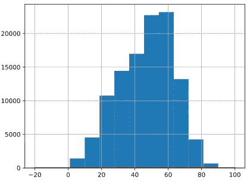

Figure 1\. Age distribution for NIH ChestX-ray8 dataset (x axis: age in years, y: frequency of images)

图 1 显示了仅移除 19 个 90 岁以上的异常值后，整个数据集的患者年龄分布(即 1 岁至 90 岁)。

# 实验

我们首先根据*患者 ID* 将数据集分成 80%的训练、10%的验证和 10%的测试，以避免训练/验证/测试之间的重叠。

> 回归

我们使用 DenseNet 169(非预训练)网络来训练回归网络，其中原始 CXR 图像作为输入，归一化年龄值(0，1)作为输出。该输出节点的激活设置为【this 形。

*   **第一轮实验**:我们使用均方差作为这一轮的损失。

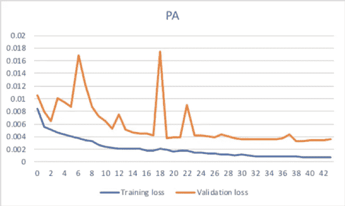

**Training and validation loss for PA view using MSE loss. Minimum validation loss: 0.003**

*   **第二轮实验**:我们还使用了决定系数 R *2* 作为损失，因为在处理回归问题时，我们想要识别训练网络的拟合优度。

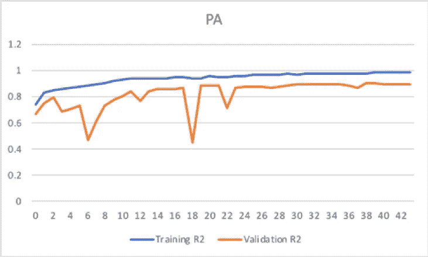

**Training and validation loss for PA view using R2 loss. Minimum validation loss: 0.90**

> 分类

作为另一种方法，我们将年龄值分为 9 个年龄组:(0，10)，(10，20)，(20，30)，(30，40)，(40，50)，(50，60)，(60，70)，(70，80)，(80，90)。我们使用 DenseNet 201(非预训练的)作为分类器，目标是这些年龄组，并且我们使用原始 CXR 图像作为输入进行训练。网络输出的激活设置为 *softmax* 。分类器的性能通过下面的 ROC 曲线展示。

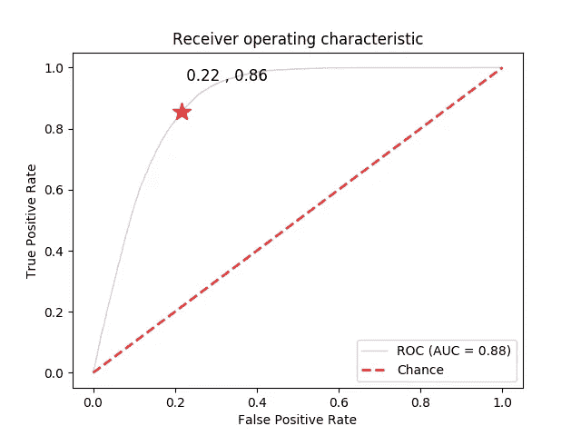

DenseNet 201 ROC for 9 age groups: (0, 10], (10, 20], (20, 30], (30,40], (40,50], (50,60], (60,70], (70,80], (80,90]

我们还尝试了预训练的 DenseNet 201，但性能非常相似。

# 告诉我你看到了什么

总的来说，分类器网络的性能是令人满意的，这促使我们研究显著图，并更好地理解网络在分类期间“*看到了什么*”。为此，我们使用了标准深度网络可视化方法自带的 [Keras-Viz](https://github.com/raghakot/keras-vis) 库。下图显示了来自上面我们训练的 DenseNet 分类器的不同年龄组的显著性图。

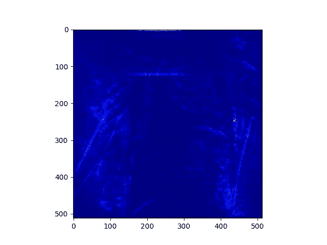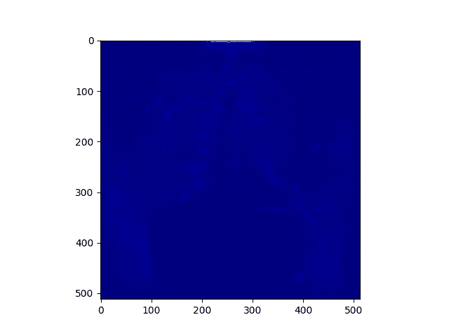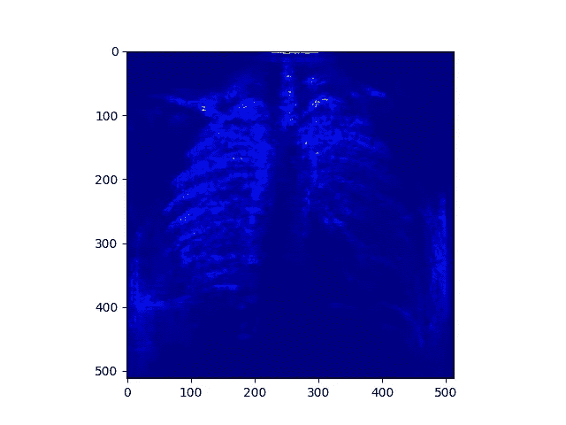

Average saliency map per age group on the testing set. Left: (0,10], Middle: (10,20], Right: (20,30]

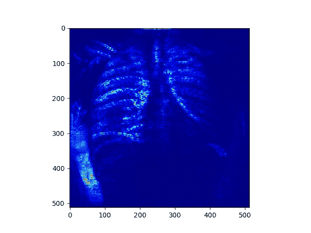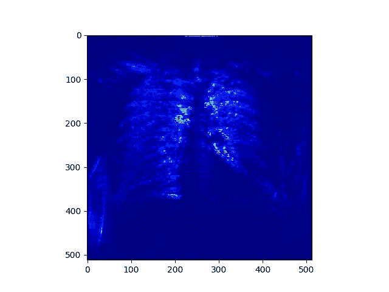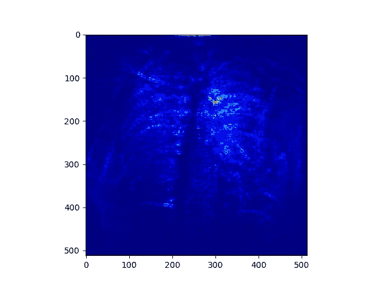

Average saliency map per age group on the testing set. Left: (30,40], Middle: (40,50], Right: (50,60]

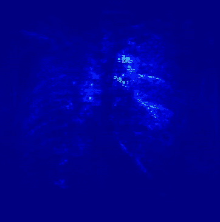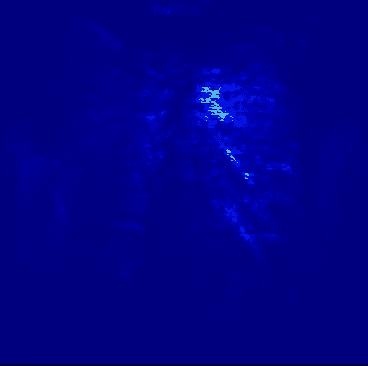

Average saliency map per age group on the testing set. Left: (60,70], Right: (70,80]

有趣的是，也许在临床上并不令人惊讶的是，随着患者年龄的增长，显著区域从多种多样的解剖区域转移到主动脉弓和纵隔壁周围更受限制的区域。就这些结果咨询了我们的临床医生后，我们认为这与随着患者年龄的增长主动脉弓和纵隔的增大和钙化有关。

# 结论

这项工作为我们下一步的研究方向奠定了基础。更具体地说，虽然激活图可以帮助可视化 cxr 中预测年龄的区域，但真正的临床价值是探索我们如何在疾病分类器中利用这些图，以便我们可以识别异常区域有多少是由于自然年龄增长，有多少是由于病理/疾病。我们相信这些额外的信息可以帮助建立更好的疾病分类器，例如对一幅图像“就年龄而言”是正常还是异常进行分类。该信息还可以帮助量化患者中存在的生理和病理过程的程度。后者的例子可以包括但不限于骨关节炎或肌肉骨骼系统的退化性椎间盘疾病、肺的衰老或肺气肿变化、以及主动脉和脉管系统的钙化性动脉粥样硬化。事实上，随着算法的改进，以前未知但更可靠的衰老或病理标识符将被识别出来。在临床环境中，医生可以在各种器官系统的预测年龄或总体预测年龄中找到建议患者改善健康习惯的机会。