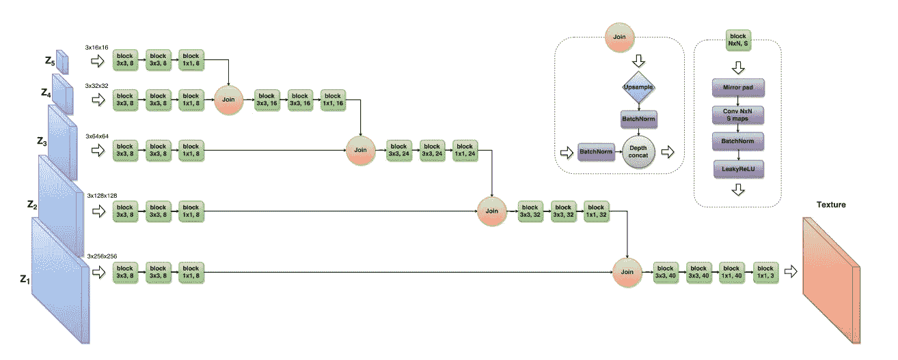
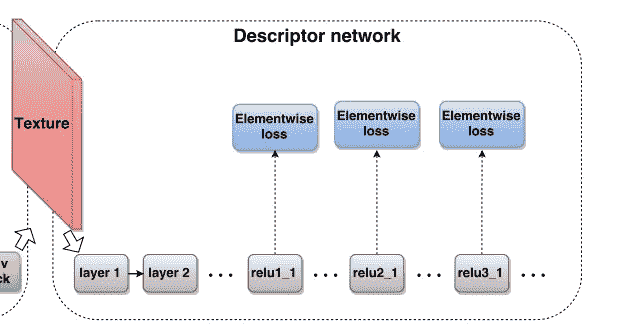
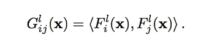
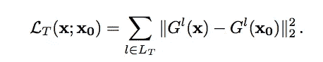
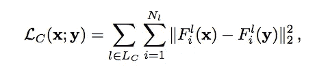
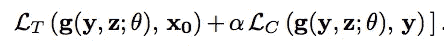
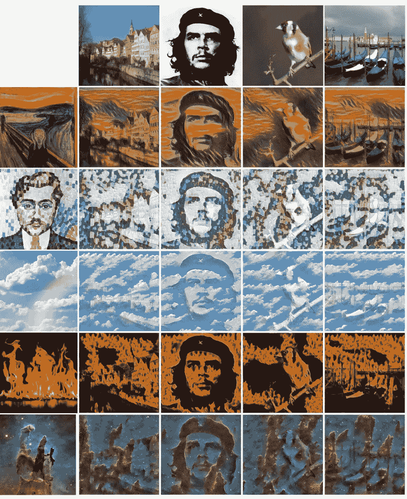

# 朝向快速神经类型转移

> 原文：<https://towardsdatascience.com/towards-fast-neural-style-transfer-191012b86284?source=collection_archive---------15----------------------->

Gatys 等人[1]提出的神经类型转移的开创性论文展示了深度卷积神经网络的显著特征。从参数卷积层学习到的顺序表示可以分为“内容”和“样式”。风格转移背后的基本思想是，在图像网络分类等任务上预先训练的 DCNNs 可以用作描述符网络。图像通过预先训练的 DCNN，如 VGG [2]，中间特征激活可用于融合一个图像的“风格”与另一个图像的“内容”。从预训练网络的特征激活中导出损失函数是神经类型转移背后的基本思想。

尽管有惊人的结果，根据[1]实现神经类型转移需要一个缓慢的迭代优化过程。首先，使用生成器网络生成图像。这个输出的图像通过预先训练的 VGG。通过计算 Gram 矩阵，来自层 1、2、3、4 和 5 的 ReLU 激活是非局部化的，这形成了样式输出。层 4 中 ReLU 激活的内积形成内容输出。然后通过反向传播优化图像，使得样式和内容输出与目标样式和目标内容图像相匹配。

Results from Ulyanov et al. [3] ‘s Faster Style Transfer with Feed-Forward Networks

本文将介绍 Ulyanov 等人[3]的一篇论文，该论文通过训练前馈网络来加速这种神经风格转移的过程，使得只需要一次正向传递来风格化图像。以下是本文的链接:

 [## 纹理网络:纹理和风格化图像的前馈合成

### Gatys 等人最近证明了深度网络可以从一个单一的…

arxiv.org](https://arxiv.org/abs/1603.03417) 

# 报纸上有趣的快速统计

*   该网络在 NVIDIA Tesla K40 GPU 上训练了 2 个小时
*   风格转换 20 毫秒
*   170 MB 以生成 256 x 256 的样本
*   作者发现用 16 张内容图片训练时效果最好

# 网络体系结构

我认为理解一篇新的深度学习论文的最有用的方法之一是查看所使用的架构，因此这就是本文将如何开始探索这项技术。

Multi-Scale Generator Architecture for Feed-Forward Style Transfer [3]

这个架构有很多部分。首先，它是一种多尺度架构，类似于 LAP-GAN 或渐进增长 GAN 中使用的架构。每个 z 代表不同空间分辨率的随机噪声输入。每个训练历元对包含 K 个张量的噪声向量 z 进行采样，在上图中，K = 5。每个噪声向量被卷积 3 次，然后通过放大和连接操作与下面的层结合。上图仅用于合成纹理。不幸的是，作者没有提供风格是如何合成的额外图片，但它是一个可以阅读和理解的快速增强。与上面的图像相反，当他们进行风格转换时，他们对内容图像 y 进行下采样，以匹配 z 中的每个噪声张量，并将它们连接在一起。例如，4x4xc 噪声张量 0 与下采样的 4×4×3 内容图像 8x8xc + 8x8x3 连接，..，等等。

另一个有趣的细节是在网络末端使用 1x1 卷积。这样做是为了保持空间分辨率，但是减少特征图的深度，使得输出从 HxWxC 张量收敛到 HxWx3 RGB 图像，(H =高度，W =宽度，C =通道)。

然而，也许比建筑更有趣的是这项任务中使用的损失函数的推导。这个损失函数由两部分组成，一个是风格损失，另一个是内容损失，这两部分都是从预先训练好的深度卷积神经网络(在这种情况下是 VGG-19)的中间激活中得到的。

通过 Gram 矩阵的计算，风格损失是非局部的:

Gram Matrix Equation

这取每个深度的特征图的内积。例如，如果卷积的输出是具有 64 个特征映射的 50×50×64，则特征映射 1 的点积与特征映射 2 相乘，依此类推，直到特征映射 64。从而形成损失函数，

相反，内容损失计算如下:

该等式计算每个要素地图上空间位置之间的差异。因此，损失函数为每个任务捕捉了非常不同种类的信息。这两个损失被组合用于风格转移，并用参数α加权。

这个损失函数与 Gatys 等人[1]提出的损失函数没有太大的不同，但是，想到它被用来训练一个前馈网络是很有趣的。

非常有趣的是，可以看到如何通过深度神经网络的单次正向传递来实现神经类型的转移。未来的工作强调，这种方法仅限于预先训练的风格，结果的质量并不总是像 Gatys 等人[1]那样高。看看神经风格转移算法如何进一步发展会很有趣，感谢阅读！

More Results from This Paper [3]

# 参考

[1]莱昂·a·加蒂斯，亚历山大·s·埃克，马蒂亚斯·贝赫。艺术风格的神经算法。2015.

[2]卡伦·西蒙扬，安德鲁·齐泽曼。用于大规模图像识别的非常深的卷积网络。2014.

[3] Dmitry Ulyanov、Vadim Lebedev、Andrea Vedaldi、Victor Lempitsky。纹理网络:纹理和风格化图像的前馈合成。2016.