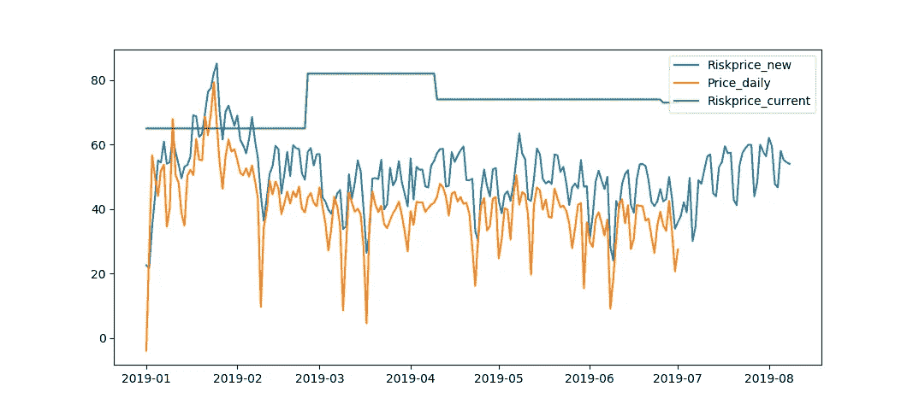

# 走向智能

> 原文：<https://towardsdatascience.com/towards-intelligence-50aebf5a2d52?source=collection_archive---------35----------------------->

在这一系列中，我将提供真实世界的例子，在这些例子中，数学被用来做出更明智的决定

Illustration by Garry Killian

处理不确定性

我们生活在一个动态的世界里，各种事件相互影响。大多数现实世界的变量都是随机的，变量的结果也存在不确定性。如果这个变量会严重影响你的业务，你会想知道任何可能的负债。我工作的公司为欧洲的电力贸易提供市场。大部分交易都是在金融结算前一天达成的当日合约。由于我们每天都要清算大量的交易，我们需要从会员处获得抵押品，以防会员违约，无法履行其义务。电价是不稳定的，我们需要在前一天收集抵押品，以获得第二天我们期望从会员那里获得的任何价格和数量。

处理这种风险的当前流程是将 3 年的历史价格拟合到最佳拟合分布中，并计算价格的置信度。在这篇文章中，我将展示为什么这是一个过于简化的方法，这对业务有什么影响，以及新思维如何能够完全改变业务的健康和稳定。那么这种模式如何改进呢？如何才能做出更智能的方法来理解和预测电价？数据中存在增加信息价值的结构，拟合算法和机器学习工具可以用来做出更明智的决策。例如，我们知道价格是有时间顺序的。这是可用于改进模型的第一个信息值。这将允许预测模型考虑时间维度。这一特性极大地增强了算法感知价格的方式，以及算法捕获具有预测能力的数据模式的能力。对于算法来说，这完全是关于它所能看到的使其在预测方面表现良好或不太好的东西。也有外力可以增加信息价值。例如，线性回归可以用来寻找风级能够给出的关于价格的信息。本系列的一个主题是提供一些强大的数学工具，并展示如何使用这些工具以及内在理论的价值。在接下来的几节中，我将带您了解如何创建一种更智能的方法来解决企业面临的问题，以及采用更智能的方法所获得的收益。

数学发展了很久。有一些强有力的思想已经被构思和推理出来，并且数学给出的一些知识是具有挑衅性的。我想谈的第一个重要观点是独立事件的概念。独立事件之所以强大，是因为它们的总和近似于正态分布。对于有界分布，有可能找到平均值的法线的收敛。如果您有许多独立的观察结果，您甚至可以使用卡方检验来推断数据是否来自特定的分布，从而得出更有力的结果。

电价不是独立事件。我们可以围绕价格进行构建，这样我们只剩下独立的事件，我们可以将它们视为来自相同的分布。为了形成价格的这种转换，我们利用我们对价格性质的了解，建立了一个捕捉这些特征的模型。价格显示时间序列结构。指数平滑和自回归模型都可以模拟两个或多个时间步长之间的线性相关性。我们知道在价格之间有一个整合的模式，早期阶段的价格影响当前阶段的价格。指数模型用于捕捉价格的这种依赖性。在我们包含的模型中，我们还有一个价格的周相关性或周期。这两个依赖关系应该抓住了价格的大部分依赖性。为了给模型更大的解释力，从该模型得到的独立观测值与风级一起回归。在丹麦电力市场中，风力水平可以解释 15.47%的价格水平。下表显示了指数平滑模型在有风回归和没有风回归的情况下能够解释多少价格变化。在 2019 年初至 2019 年 9 月的样本内和样本外期间，该模型能够解释多达 65-70%的价格变化。

下图显示了残差的自相关图，得到的序列是不相关的随机变化。

残差是不相关的，观测值的平均值，即 OLS 估计量，将给出真实的平均值，模型将是无偏的。皮尔逊卡方检验拒绝这些独立事件来自正态分布。我们利用经验累积分布函数，围绕价格画出一个 95%的置信区间。下图显示了测试期内价格的点位预测。

该模型是对电价的描述，它使用多个概念来寻找描述价格的公式。它解释了差异，解释了产生这个价格的机制。使用 95%置信区间的新风险价格与原始方法的风险价格一起绘制。

由于当前风险价格不被视为时间序列，因此风险价格不考虑一年中温度变化导致的任何季节性变化。当前风险价格每月更新一次，在第一次发布风险价格和第二次发布风险价格之间发生的时间事件会丢失，不会引起任何注意。从上图可以看出，在很长一段时间内，该公司面临着巨大的风险，没有足够的抵押品来对冲。此外，我们在风险低得多的夏季收取过高的费用。这个例子显示了正确建模的重要性，以及数学对业务和公司健康发展的影响。这种新模式将转移公司目前面临的风险，同时提高盈利能力。在此期间，我们对会员要求的平均差额总共减少了 49.06 亿欧元。这就是数学的力量，也就是智慧决策的力量。