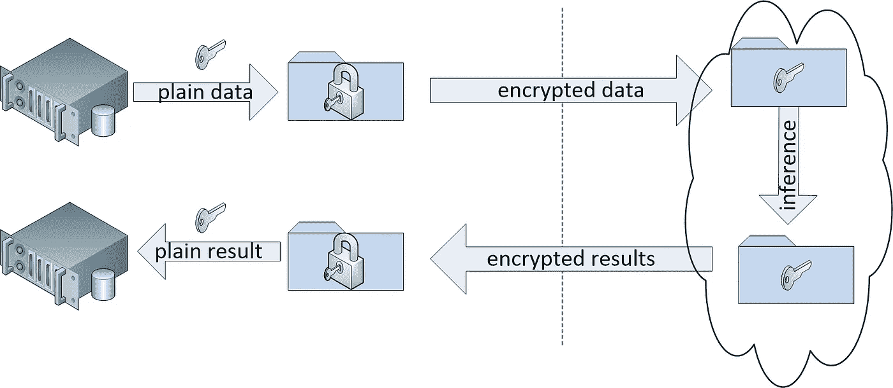

# 走向精确安全

> 原文：<https://towardsdatascience.com/towards-precision-security-137d0ba1c7bd?source=collection_archive---------40----------------------->

## 利用同态加密实现量身定制的安全性

Image by [Yücel Ünlü](https://pixabay.com/users/yclnl-6523093/?utm_source=link-attribution&utm_medium=referral&utm_campaign=image&utm_content=2778734) from [Pixabay](https://pixabay.com/?utm_source=link-attribution&utm_medium=referral&utm_campaign=image&utm_content=2778734)

> "但就她自己而言，她比你们其他成百上千朵玫瑰更重要……因为她是我的玫瑰"。
> 
> 安东尼·德·圣埃克苏佩里的《小王子》

我们都想要最好的。作为一个行业，我们渴望为我们的客户提供最好的安全性。但是什么是最好的安全呢？显然，答案因客户而异。他希望保护自己免受**的威胁，而不仅仅是任何威胁，他希望保护* ***他的*** *数据，而不仅仅是任何数据—他希望获得量身定制的安全性。**

*个性化的客户体验绝对不是一个新概念。一个与安全行业有许多共同之处的行业正在朝着这个方向经历一场大革命。*(**PM**)精准医疗是一个描述针对个人的医疗保健实践定制化的术语。这种方法有多种好处，主要是提高患者护理质量，实现成本效益，并降低再入院率和死亡率。*机器学习* ( **ML** )在这个新兴领域有很大的作用。它用于大量数据的分析、生活方式影响分析和基因组测序。ML 在网络安全领域也被大量使用——尽管有些人会说还不够多。**

**看起来就像在医学中一样，下一个“低挂的果实”是以最大化个人客户安全体验的方式利用 ML。通过使用他的数据，他的生活方式(组织政策)和他的基因组(特定的软件，上下文)。**

**下一步，在我看来是意料之中的——*精密安全* ( **PS** )。**

**让我们为我们的客户提供最适合他们的安全体验，并基于他们的个人数据。我们有动力，也有技术，只有数据这个小问题——这是隐私。根据定义，如果你想使用我的数据来个性化我的安全，你会暴露于我的所有个人 IP，而且你可能会希望它在世界各地传播，被你基于云的 ML 管道处理。这令人不安，对客户来说可能是一个很大的“不”字，尤其是在保守的行业。他们是对的。这是他们的数据，也是他们最重要的资产。这种担心是有道理的。**

**这个问题也有一个很好的解决方案——[(全)同态加密](https://en.wikipedia.org/wiki/Homomorphic_encryption)。 **FHE** 是一种新的加密技术，它可以对加密数据进行数学计算，而不需要解密。这些计算的加密结果(一旦解密)将与它们是在普通数据上进行的一样——令人惊讶。在实践中，这意味着数据可以在客户端加密，发送到远程服务器，处理和操作，然后发送回客户进行解密。客户数据在整个链条中被加密，风险极小。**

****

**data is encrypted and decrypted on client side, all computation is done on encrypted data**

**生产级实现已经上市。这个领域有几个创业公司，像[恩维尔](https://www.enveil.com/)、[二元](https://duality.cloud/)和[福塔尼克斯](https://fortanix.com/)。 [PALISADE](https://palisade-crypto.org/) 和微软 [Seal](https://www.microsoft.com/en-us/research/project/microsoft-seal/) 作为同态加密的开源框架值得一提。使用这些工具，我们可以打破数据壁垒，为我们的客户提供真正的个人安全体验。市场将我们推向精密安全，现在是我们接受挑战的时候了。**

**请分享您的想法，并在 [Medium](https://medium.com/@lavian.alon) 或 [Twitter](https://twitter.com/alonlavian) 上关注我的博客帖子更新！**

**[1]:另一个有趣的解决方案是联合学习( **FL** )。FL 是一种在边缘设备(移动设备、网关等)上训练算法的 ML 技术。)而不共享他们的数据样本。这个模型可以上传到云中，改进协作模型，或者只在本地使用。一个很好的用例是 [Google Gboard](https://ai.googleblog.com/2017/04/federated-learning-collaborative.html) 。**

*****注来自《走向数据科学》的编辑:*** *虽然我们允许独立作者根据我们的* [*规则和指导方针*](/questions-96667b06af5) *发表文章，但我们不认可每个作者的贡献。你不应该在没有寻求专业建议的情况下依赖一个作者的作品。详见我们的* [*读者术语*](/readers-terms-b5d780a700a4) *。***