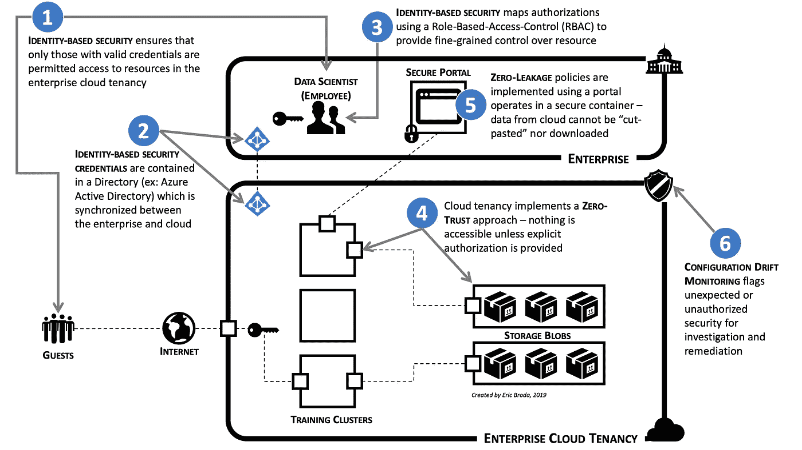

# 走向安全的人工智能/机器学习

> 原文：<https://towardsdatascience.com/towards-secure-ai-machine-learning-a77ece497241?source=collection_archive---------30----------------------->

## 企业正在将 AI/ML 工作负载迁移到云，但遇到了重大的安全问题。以下是问题和解决方法。

Photo by [William Bout](https://unsplash.com/@williambout?utm_source=unsplash&utm_medium=referral&utm_content=creditCopyText) on [Unsplash](https://unsplash.com/s/photos/danger?utm_source=unsplash&utm_medium=referral&utm_content=creditCopyText)

# AI/ML 向云的迁移已经开始

今天，AI/ML 对高级计算和数据存储的需求推动企业将 AI/ML 工作负载从舒适的数据中心迁移到云中。但是最近引人注目的数据泄露事件的头条新闻表明，存在着有效、真实和严重的网络安全问题需要解决。

这对 AI/ML 来说是一个特别尖锐的问题。毕竟，AI/ML 从业者依赖于大量的数据来训练他们的模型，这些数据大多是敏感的和/或专有的。让事情变得更加复杂的是，数据科学家使用的数据必须在很大程度上保持未混淆(或“明文”)，这可能会扩大数据泄露的机会，或许还会扩大其影响。

因此，企业带着一定程度的恐惧和谨慎看待 AI/ML 向云的迁移可能并不奇怪。事实上，国际咨询公司德勤最近在 T2 进行的一项调查显示，所有行业的高级技术和安全主管和专业人士都认为“网络安全漏洞会减缓甚至阻止人工智能的发展。”

今天，解决网络安全问题似乎已经成为许多企业将 AI/ML 工作负载迁移到云的先决条件。

*本文将讨论企业将人工智能/人工智能工作负载迁移到云时面临的主要安全问题，然后确定几种方法来保护企业的云租用，以支持人工智能/人工智能活动。*

Photo by [Markus Spiske](https://unsplash.com/@markusspiske?utm_source=unsplash&utm_medium=referral&utm_content=creditCopyText) on [Unsplash](https://unsplash.com/s/photos/moving?utm_source=unsplash&utm_medium=referral&utm_content=creditCopyText)

# AI/ML 云迁移引入了有效的安全问题

过去，企业安全主要基于保护企业数据中心周围的网络边界，前提是边界内的所有系统、数据和资源都是安全的、可信的。当时，这是有意义的，因为大多数有用的应用程序和资产都存在于网络边界内的数据中心。

今天，几乎每个企业都使用互联网与客户进行互动，与业务合作伙伴进行交易，并与企业保护伞下的远程组织进行通信。随着企业利用灵活、可扩展且廉价的云计算资源，云的使用也在飞速增长。

但是使用云处理人工智能/人工智能工作负载的本质引入并加剧了网络安全问题。有两个值得强调的独特特征:(a) AI/ML 要求访问大量敏感数据，以及(b) AI/ML 要求这些数据不被屏蔽(“明文”)，以便于数据科学家进行模型探索、培训和验证活动。

因此，很明显，企业通信模式以及云消费模式已经发生了巨大的变化。同样清楚的是，由于 AI/ML，数据可见性和可访问性的需求也发生了变化。

不幸的是，过去的企业安全实践并没有跟上时代的步伐。至少，最近[关于 Capital One 数据泄露的头条](https://www.nytimes.com/2019/07/29/business/capital-one-data-breach-hacked.html)暗示了这一点。

但是为什么企业安全实践没有跟上呢？有几个原因:首先，云的本质产生了一个安全问题，因为默认情况下，许多资源在创建时就可以通过互联网访问。这一点的含义相当深远:建立网络安全边界**不足以像保护数据中心一样保护云上的资产。**

第二，现在的敌人更加聪明，并且获得了更好的工具，导致网络边界看起来变得更加漏洞百出。优步最近的[云数据泄露](https://www.washingtonpost.com/news/innovations/wp/2017/11/21/uber-waits-a-year-to-reveal-massive-hack-of-customer-data/)无疑证明了这一点。

第三，随着 AI/ML 所需的大量敏感数据可供员工使用，企业需要引入控制措施以避免故意泄露。环球邮报[报道](https://www.theglobeandmail.com/business/article-desjardins-group-suffers-massive-data-breach-of-29-million-members-by/)影响 290 万客户的 Desjardins 集团数据泄露事件是由一名违规员工引起的，该员工涉嫌窃取和暴露敏感数据，包括个人信息，如姓名、出生日期、社会保险号(类似于美国社会保险号)以及电子邮件、电话和家庭地址。

最后，安全配置不可避免地会随着时间的推移而变化:它们由多个小组执行，并且可能带有某种程度上分散的治理机制。随着时间的推移，一个更改会与先前的更改发生冲突，或者无意中与另一个更改的执行目的相反，最终，这将导致先前安全的环境漂移，最终产生安全漏洞。也许 Capital One 最近在云上的经历是这种情况下最深刻的例子。

Photo by [Ozzie Stern](https://unsplash.com/@ozziestern?utm_source=unsplash&utm_medium=referral&utm_content=creditCopyText) on [Unsplash](https://unsplash.com/s/photos/fireman?utm_source=unsplash&utm_medium=referral&utm_content=creditCopyText)

# 解决 AI/ML 引入的网络安全问题

有几种现代技术(见图 1)可以解决上述安全威胁，并且是安全企业云租用的基础。

Figure 1

首先，**[**基于身份的**](/why-identity-management-is-a-prerequisite-for-enterprise-ai-ml-on-the-cloud-408919055596) 安全方法规定，只有有效的身份凭证才能提供身份验证和授权，以允许访问企业云租户内的资源。**

**基于身份的安全性(图 1 中的“1”)方法确保敏感数据只能由具有验证证书的数据科学家访问。由此得出的推论是:恶意或未经授权的代理没有访问敏感数据所需的必要凭证。**

**基于身份的安全方法的实施应至少考虑以下几点:**

*   **本地和云目录(例如:微软的 Active Directory 或 LDAP)应该同步(图 1 中的“2”)。这使得无论身份在哪里创建或使用，都可以一致地管理身份和关联的凭据**
*   **本地实例是为身份提供单一权威来源的主实例，这将降低由于人为错误和配置复杂性而带来的安全风险。从最终用户的角度来看，这为访问云和内部资源提供了单点登录(SSO)体验，解决了管理多个 id 和密码的常见问题**
*   **在企业身份管理系统中维护的基于角色的访问控制( [RBAC](https://www.csoonline.com/article/3060780/5-steps-to-simple-role-based-access-control.html) )机制(图 1 中的“3”)是一种授权系统，它将对资源的访问限制在授权用户。它是这样工作的(尽管这是一种简化):角色通常被创建来代表工作职能；权限被分配给角色以执行各种操作；然后，用户/员工通常被分配到组，这些组又被分配到角色。这创建了一个有帮助的间接层:用户没有被分配权限，而是通过成为角色的成员来获得权限。现在，用户权限的管理得到了简化，因为它只需要为用户/员工的帐户分配适当的角色。**

**第二，一种**[**零信任**](/how-zero-trust-and-zero-leakage-strategies-enable-ai-machine-learning-31dbaf597247)**安全方法(图 1 中的“4”)规定创建的资源没有访问权限，除非提供明确的身份验证和授权，否则在企业的云租用中无法访问任何资源。零信任体系结构使用身份凭据和设备声明/信息(例如，IP 地址)来对用户进行身份验证，并验证访问企业云租户中的数据和应用程序所需的授权。这样，基于身份的安全性提供了实现零信任策略所需的基本功能。******

******第三， **"** [**零泄漏**](/how-zero-trust-and-zero-leakage-strategies-enable-ai-machine-learning-31dbaf597247) **"** 政策规定数据不能以任何方式在企业云租用之外传输。该策略将阻止有权访问敏感数据的员工或有权访问敏感数据的恶意代理让数据离开企业云租户或从企业云租户中泄漏。根据我的经验，可以使用“安全门户”(图 1 中的“5”)来实现零泄漏，该门户充当数据科学家用来访问云租户的视口。门户允许对云进行相对完整的访问，但禁用了允许数据移动的特定功能(通常是“剪切-粘贴”和下载的功能)。Citrix 有许多产品支持这一点，Microsoft(远程桌面)和 VMWare (Horizon View)也是如此。******

****最后，为连续的 **"** [**配置漂移监控**](https://medium.com/@ericbroda/why-cloud-config-mgmt-is-mandatory-for-ai-machine-learning-8d376b2b7459) **"** (图 1 中的“6”)建立策略是至关重要的。管理众多云组件非常复杂，管理它们的安全性更是难上加难。而且，不管你喜不喜欢，熵最终会以意想不到的方式改变你的云配置。监控企业的云租赁并标记您的团队或云供应商所做的任何意外配置更改，可确保任何网络安全漏洞在造成重大损害之前被发现并纠正。****

********

****Photo by [Donald Giannatti](https://unsplash.com/@wizwow?utm_source=unsplash&utm_medium=referral&utm_content=creditCopyText) on [Unsplash](https://unsplash.com/s/photos/lighthouse?utm_source=unsplash&utm_medium=referral&utm_content=creditCopyText)****

# ****走向安全的人工智能/机器学习****

****回到我最初的主张:AI/ML 工作负载向云的企业迁移是必然的。但是必须承认，这带来了新的严重的安全问题，使得企业对这种迁移持谨慎态度。****

****但是企业并不是一成不变的。他们的回应是:****

*   ****迁移到基于**身份的**安全方法，该方法使用身份和相关的认证和授权来确定访问权限****
*   ****向**“零信任”**策略发展，该策略规定，除非提供明确的身份验证和授权，否则在企业的云租赁中不能访问任何内容****
*   ****实施工具和控制以建立**“零泄漏”**策略，这样，除非明确批准，否则任何信息都不能泄漏企业云租赁****
*   ****监控**配置漂移**从而降低意外安全漏洞的风险****

*****AI/ML 似乎已经成为改变企业传统上谨慎的安全姿态的先决条件。有趣的是，虽然解决这些安全问题将加速 AI/ML 工作负载向云的迁移，但还有许多其他非 AI/ML 云项目受到相同安全限制的阻碍，现在将被解除这些限制。*****

*******来自《走向数据科学》编辑的提示:*** *虽然我们允许独立作者根据我们的* [*规则和指导方针*](/questions-96667b06af5) *发表文章，但我们并不认可每个作者的贡献。你不应该在没有寻求专业建议的情况下依赖一个作者的作品。详见我们的* [*读者术语*](/readers-terms-b5d780a700a4) *。*****