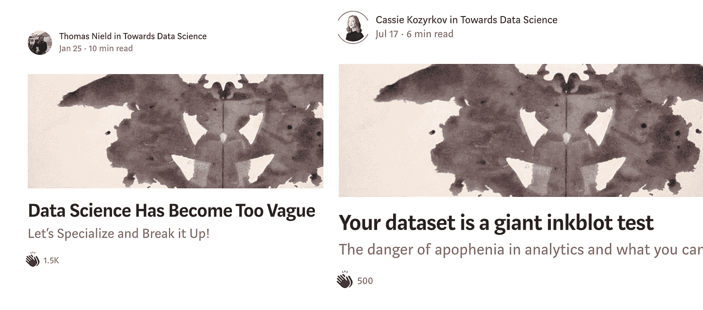
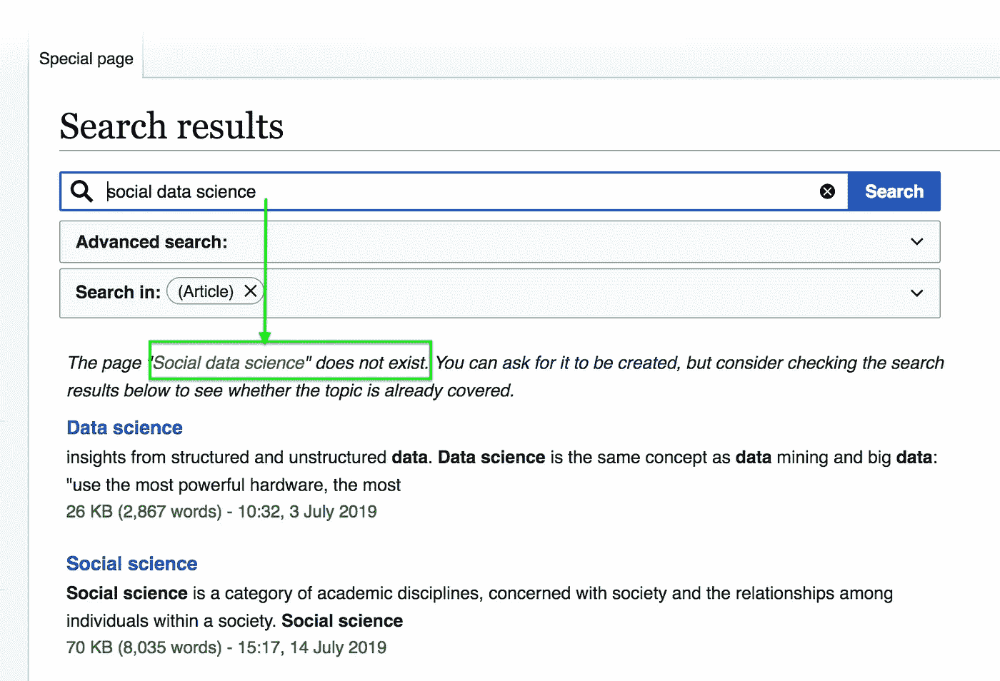
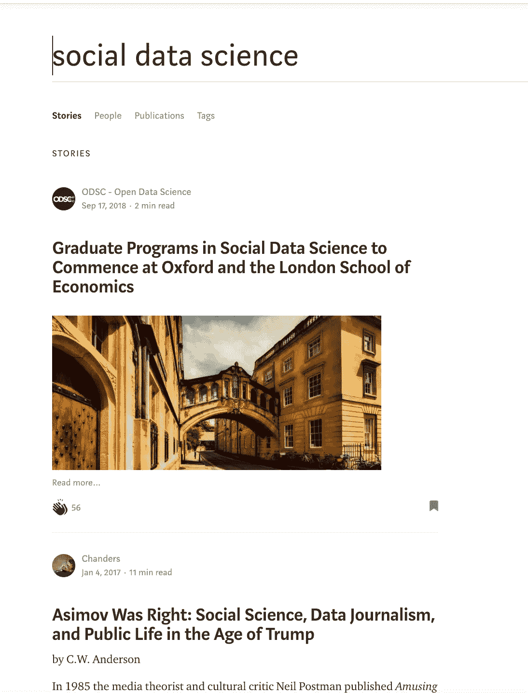

# 走向社会数据科学

> 原文：<https://towardsdatascience.com/towards-social-data-science-f90c5c020855?source=collection_archive---------9----------------------->

[@sebastiandumitru](https://unsplash.com/@sebastiandumitru) [unsplash](https://unsplash.com)

## 数量越多，责任越大

将社会科学和数据科学结合起来并不是一种新的方法，然而在经历了几次曝光之后*(以及巨额罚款)*大型科技公司开始意识到自己的处境。似乎研究机构，尤其是欧洲的研究机构，很乐意促进这种转变。本文是(1)数据科学的广义定义；(2)快速浏览社会数据科学；(3)从表面上看，相对而言，社会数据科学学科目前有多新。

## 1.广义定义的数据科学

让我们首先考虑什么是*数据科学*，然后继续解释为什么添加了*社交*的这个新术语是有用的。作为一个简短的免责声明，我并不是说数据科学对社会问题一无所知，不是社会性的或有重要的见解。相反，它是一个特殊的研究领域，可以与其他学科互补或混合。

***数据科学*** *是运用科学的方法、流程、算法和系统，从结构化和非结构化数据中提取知识和见解的多学科领域。*

It [可以更具体地定义为](https://hackernoon.com/top-10-roles-for-your-data-science-team-e7f05d90d961)拥有三种互补角色的强大技能组合的人:

*   专家分析师
*   机器学习工程师
*   统计员

然而，研究工程和数据科学家都可以使用。艾伦·图灵研究所似乎跨越了这两种模式。

今年早些时候，一些作者在*的《走向数据科学》中提出了一个关于数据科学中模糊性和解释的关键问题。托马斯·尼尔德认为它需要被分解成专门的学科。Cassie Kozyrkov 认为数据分析中存在心理陷阱，导致了解释问题。我很感兴趣地看到两篇文章使用了相同的罗夏测试图像——墨迹测试感知。*

**

*Two of my favourite authors writing about ambiguity in data science*

*凯西的观点尤其引人注目:“你确定你最近的数据顿悟不是伪装的 apop hany(T1)吗？” ***Apophenia*** *暗指人类普遍倾向于在随机信息中寻找模式。她认为大脑处理墨迹就像处理数据一样，一旦你获得了“洞察力”,你将很难不去发现它。**

*出于某种原因，罗夏测试经常被质疑为伪科学和不科学。事后看来，拍一张整洁的照片，带给不同的人，并用它来诊断问题似乎是一个相当严重的错误。多年来，这种方法被用于从法庭到精神健康机构的各种场合，有时会产生广泛的负面后果。我们喜欢整洁的图片，然而它们并不总是给人以正确的印象。*

## *2.社会数据科学*

*让我来陈述一个显而易见的事实:数据科学与社会科学有着不同的关注点。有一个巨大的研究领域是大多数计算机科学家不会学习或关注的。培养计算机工程师或程序员的技能需要时间和大量的努力，这个领域有各种子领域，但是它有传统[可能不同](https://research.library.mun.ca/13499/1/Breslin_SamanthaDawn_doctoral.pdf)。*

***社会科学**是一个学科门类，关注社会和社会中个人之间的关系。社会科学作为一个整体有许多分支。这些社会科学包括但不限于:人类学、考古学、传播学、经济学、历史学、音乐学、人文地理学、法学、语言学、政治学、心理学、公共卫生和社会学。*

*在 7 月 26 日发表的另一篇名为《人工智能和数据科学的十大角色》的文章中，她再次引用了凯莉的话，将社会科学家列为第八位:*

> *“我们没有意识到社会科学家有多么有价值。他们通常比数据科学家更有能力将决策者的直觉和意图转化为具体的指标。”*
> 
> *谷歌首席决策情报工程师凯西·科济尔科夫*

**然而，她的观点似乎是基于对编程一无所知或知之甚少的社会科学家*，意在作为一种扩充工程团队的方式。然而，这让我们想到了社会科学和计算机科学的结合。*

***艾伦图灵研究所(ATI)** 是英国国家数据科学和人工智能研究所，成立于 2015 年。它是以艾伦·图灵的名字命名的，艾伦·图灵是英国数学家和计算机先驱，通常被认为是计算机科学的创始人之一。*计算机科学是研究与数据交互的过程，可以用程序的形式表示为数据。**

*ATI 的一个研究领域是社会数据科学。他们试图通过两个主题来解决与大量数据相关的挑战:(1)在不同的社会和时间尺度上发展人类行为的基础理论；(2)确定方法上的挑战和解决方案，使社会数据科学能够在关键应用领域提供稳健可信的结果。*

*其目标是:*

*   *培养足够数量的社会科学家、数据科学家和社会数据科学家*
*   *通过学术、商业、非政府组织和政府利益相关者的定期会议，与数据基础设施和培训投资及政策制定者建立关系。*

*据我所知，目前有三所大学开设了理学硕士课程。一个是[牛津大学](http://www.ox.ac.uk/admissions/graduate/courses/msc-social-data-science)，[伦敦政治经济学院](http://www.lse.ac.uk/study-at-lse/Graduate/Degree-programmes-2019/MSc-Applied-Social-Data-Science)，[哥本哈根大学](https://socialsciences.ku.dk/social-data-science/)。哥本哈根大学网站上对社会数据科学的描述如下:*

> ***社会数据科学**是一门结合了社会科学和计算机科学的新学科，其中大数据的分析与社会科学理论和分析相关联。*
> 
> *与社会数据科学相关的研究领域很多。它们可以基于从例如社交媒体收集的数字数据、注册数据、客户数据或者基于人们留下的其他类型的数字痕迹，例如通过他们个人使用互联网、他们使用智能电话和其他数字服务。这些庞大的数据集也可以与通过人类学实地工作等收集的定性数据相结合。
> *–*[*哥本哈根大学社会科学教员检索到 7 月 19 日*](https://socialsciences.ku.dk/social-data-science/)*

## *3.社会数据科学的学科有多新？*

*截至 2019 年 7 月 19 日，维基百科上没有关于该主题的页面。*

**

*在我写作的时候，只有一篇关于媒体的文章提到了社会数据科学，我可以通过搜索找到。这篇文章是去年写的，现在关于这个话题的文章可能比我想象的要多得多。*

**

*Picture taken the 19th of July 2019*

*将数据科学与社会科学的理论相结合的想法并不一定是一种新的方法。然而，计算机科学和社会科学以这种方式的结合也许可以说代表了一种有趣的新形式——值得探索。*

# *这是第 500 天的第 47 天*

> **什么是#500daysofAI？
> 我在挑战自己，写下并思考未来 500 天的人工智能话题。一起学习是最大的快乐，所以如果你觉得一篇文章引起了你的共鸣，请给我反馈。感谢您的阅读！**