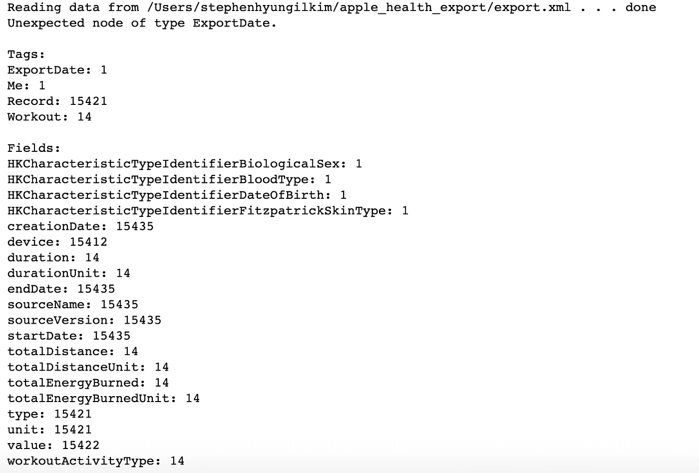
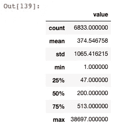
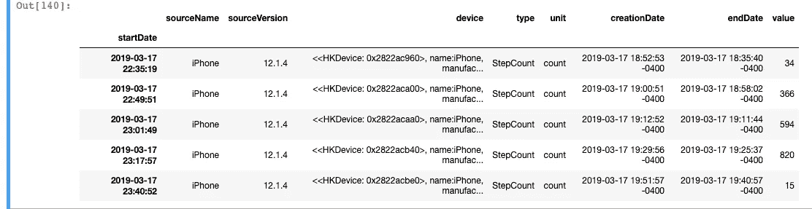
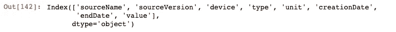
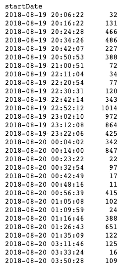
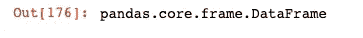
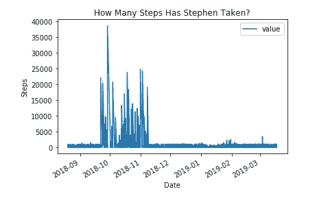

# 走向幸福，数据科学(第 1 部分)

> 原文：<https://towardsdatascience.com/towards-well-being-with-data-science-part-1-7f8035f73aa?source=collection_archive---------10----------------------->


Credit: EUFIC

我用我的苹果健康数据来衡量我目前的状态，并设定未来的健身目标。

在过去的几周里，我一直好奇如何在自己的生活中使用数据。在我的日常工作中，我使用数据来帮助在企业环境中做出更好的决策，所以我想，为什么不使用我当前可用的数据来设定更健康生活的指标和目标呢？

在这些系列中，我将经历 **A .介绍，b .探索数据 c .分析&绘图，d .测试，e .结论。**

# A.介绍

## 苹果健康

这是什么？这是苹果提供的描述:

> 健康应用程序可以轻松了解您的健康状况，并开始实现您的目标。它整合了来自 iPhone、Apple Watch 和您已经使用的第三方应用程序的健康数据，因此您可以在一个方便的地方查看您的所有进展。它还推荐了其他有用的应用程序来完善你的收集——让你的健康变得前所未有的简单。

[](https://www.apple.com/ios/health/) [## iOS -健康

### 健康应用程序可以更容易地跟踪你的健康和健康数据，集中在四个方面:活动，睡眠…

www.apple.com](https://www.apple.com/ios/health/) 

## 动机

我目前有一部 iPhone X，附带苹果健康应用。它还有健康记录 API，您可以连接到它并从中提取更多有趣的数据，但是出于各种目的，我们将在本文中使用一个更简单的方法。

据我所知，苹果健康也包含在以前的 iPhone 型号中，所以如果你有一个旧版本的手机，你不会被排除在外。此外，如果你有一个苹果手表，你就有了额外的指标，如:心率监测、心电图、跌倒检测、生命体征、血压等。

苹果健康应用程序有交互式可视化功能，可以查看你的数据，所以我这么做主要是为了自娱自乐。我必须说，它缺乏工具来拥有一个聚合视图，所以我想我可以使用一些 python 库来可视化我当前的表单。

## 下载数据

在转换数据之前，您需要从 Apple Health 文件中导出数据文件。虽然有几种方法可以做到这一点，但我用电子邮件给自己发送了数据导出。为此，只需在手机中导航:**苹果健康>健康数据>个人资料图标>导出健康数据**

为了转换数据，我使用了 **markwk** 的“苹果健康提取器和数据分析”工具。更多信息见链接:

[https://github . com/markwk/QS _ ledger/tree/master/apple _ health](https://github.com/markwk/qs_ledger/tree/master/apple_health)

**markwk** 代码的第一个脚本允许您将 XML 文件转换为 CSV，我将它加载到 Jupyter Notebook 中:

```
# %run -i ‘apple-health-data-parser’ ‘export.xml’ 
%run -i ‘/Users/stephenhyungilkim/qs_ledger-master/apple_health/apple-health-data-parser.py’ ‘/Users/stephenhyungilkim/apple_health_export/export.xml’
```



该脚本将代码分成几个部分，包括:

**身高、体重、步数、步行距离、跑步、燃烧的积极能量、飞行攀爬、锻炼数据。**

# B.探索数据

任何数据分析项目的第一步，我们必须寻求理解数据的不同维度以及文件包含的内容！先说其中一个特点，**步骤**:

```
steps = pd.read_csv("/Users/stephenhyungilkim/apple_health_export/StepCount.csv", parse_dates=["startDate"], index_col="startDate")
```

```
steps.describe()
```



figure 1

这给了我们一些关于数据的一般统计。例如，我们可以看到有 6833 个“步”的实例，平均值是 374 步…但是推荐的平均值不是每天 10，000 步吗？:O

```
steps.tail()
```



figure 2

在图 2 中，我们可以看到我在导出之前的最新数据。我们可以得出的一些信息是，数据源来自我的 iPhone 设备’，我们也有值。不过，我开始为自己辩护，因为数据似乎表明我非常懒惰。一天只走 34 步可能吗？

然后，我意识到 34 步并不是一天的总数，因为“开始日期”在同一天内有多次。我回到我的手机上查看我那天的总步数，令我欣慰的是，它超过了 34 步。

```
len(steps)
```

这再次证实我们有 6833 项记录。

```
steps.columns
```



figure 3

在图 3 中，我们可以看出有 8 个特性，但是对于我们的时间序列用例，我们可以保留'**值**和'**开始日期**,并删除所有其他的特性(我将在更深入的研究后马上这么做)。

```
steps.value.sum()
```


figure 4

图 4 显示了我们在给定范围内采取的所有步骤的总和。10，000 步大约相当于 5 英里，所以你们可以算一下。这可能看起来很多，但是请记住，对于健康来说，每天的数字比总和更重要。每天都要踩这些台阶，对吧？

```
steps.value
```



figure 5

图 5 开始看起来有点像时间序列，其中我们有一个数据和值。这是有希望的，似乎是可以策划的。我确实意识到，如果我想要一个每日视图，我将需要每天进行聚合，而不是使用 startDate 特性。正如我们之前提到的，我们仍然需要去掉其他特性。

```
steps_new = steps.drop(['sourceName','sourceVersion','device','type','unit','creationDate','endDate'], axis=1)
```

上面的代码从数据帧中删除了不必要的特性。

```
type(steps_new)
```



figure 5

为了让我们处理时间序列，我们需要相应地修改数据。上面的代码向我们展示了我们正在处理什么类型的数据。请注意，当我使用' read_csv '时，我确保' startDate '是日期时间(不是字符串或任何其他值)，并且' startDate '是索引列。

## 其他维度

因为还有 6 个维度，所以我迭代相同的代码来理解数据。考虑到我的身高保持不变，像“身高”这样的一些特征看起来并不令人兴奋。为了保持连续性，我将继续探索这个步骤的维度。

# C.分析和绘图

虽然有几个有趣的列，但我们应该主要关注“值”和“开始日期”。这些将是我们的线图的轴，所以请查看我的“健康”的时间序列表示。

```
steps_new.plot()
plt.title('How Many Steps Has Stephen Taken?')
plt.ylabel('Steps')
plt.xlabel('Date')
```



figure 6

这是一个有趣的第一个图…我们可以看到从 10 月到 11 月中旬的巨大活动。我立刻有了一些初步的想法。那段时间比较暖和，当我导出数据时，我确实注意到它正在从三四个来源检索数据。我的 iPhone，我的高尔夫 GPS 应用程序，我的 nike run 应用程序，我的 Fitbit，直到它坏掉。我最初的想法是，在那几个月里，我更多地使用了所有这些设备，因此我看到了峰值。

## 我的第一部分结论是:

第 1 部分到此结束。在第 2 部分中，我将更深入地研究这个情节，讨论时间序列的考虑因素，并在我们的数据中使用一个叫做 ARIMA/博克斯詹金斯方法的模型。我还会谈到时间序列因素，如趋势、季节性、均值和方差。

对我的朋友 WH 大声喊出来，是他启发了我去做这件事！虽然我确实想公开他的名字以保护他的隐私，但他之前的数据探索，包括使用 python 绘制他在纽约最常去的地方的地图，以及使用苹果公司的“屏幕时间”应用程序监控他的数字福祉，都激励我将数据很好地用于我自己的个人生活。

***来自《走向数据科学》编辑的提示:*** *虽然我们允许独立作者根据我们的* [*规则和指导方针*](/questions-96667b06af5) *发表文章，但我们不认可每个作者的贡献。你不应该在没有寻求专业建议的情况下依赖一个作者的作品。详见我们的* [*读者术语*](/readers-terms-b5d780a700a4) *。*